# 开篇词｜共生而非替代：极客和 AI 的共舞

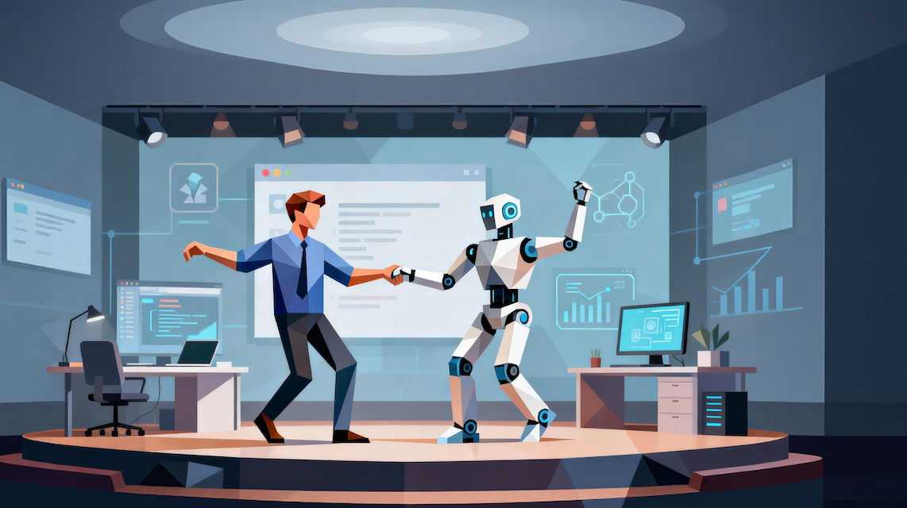

### 讲述：黄佳 AI 版

时长 10:47 大小 3.71M

你好，我是黄佳。

非常开心。短暂的分别之后（我们的《MCP 和 A2A 前沿实战》》在 2025 年 12 月刚刚正式结束），我们又在极客时间的专栏中见面了。

这一次，我怀着兴奋而热切的心情，向大家分享这几月重塑了我工作和生活形态的 Claude Code，以及其中尤其重要的 SubAgents 和 Skills 理念。

我不想用什么 “人机交互革命” 这种被说烂了的词。但过去几个月，我确实感受到了一种不可逆的变化。

- 以前写代码是这样的：打开 IDE，敲键盘，查文档，调试，再敲键盘。大脑是主机，手指是输出设备。
- 现在写代码是这样的：我描述意图，AI 生成代码，我审阅确认，AI 继续迭代。大脑变成了导演，AI 变成了演员。

这不是效率提升 10% 或 20% 的量变。这是角色本身的转换 —— 从 “执行者” 到 “指挥者”。

## Another AI Coder？—— Claude Code 远不止如此

2024 年末到 2025 年初，AI Coding 领域迎来了一次集中爆发。过去的 2025 年，我们已经见证过一轮又一轮 AI Coding 工具的浪潮。

- 有的强调补全与提示，让你写代码的速度更快。
- 有的主打对话式编程，让你 “像和人聊天一样” 改代码。
- 有的专注在 IDE 深度集成，几乎变成编辑器的一部分。
- 也有的试图做成 “自动修 Bug 的魔法助手”。

让我们快速扫描一下主流的 AI Coding 工具和它们的特点。

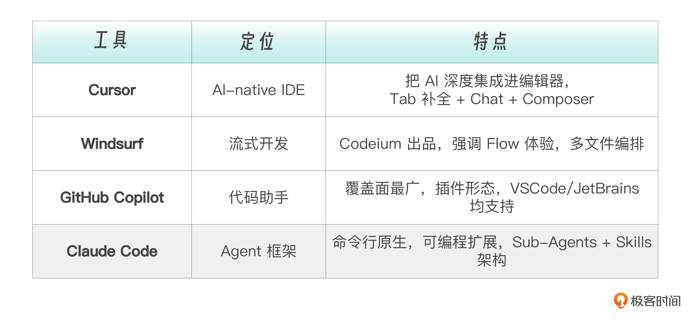

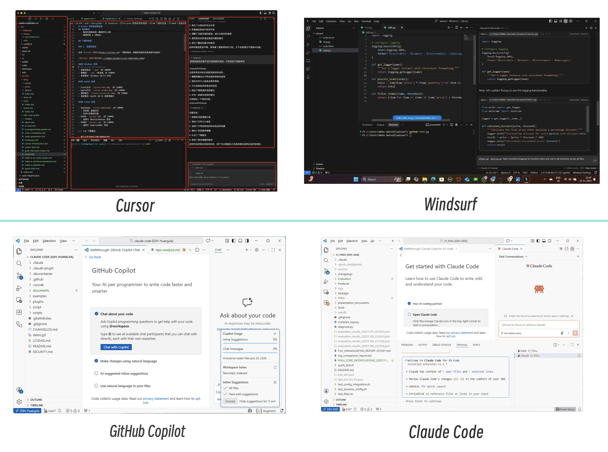

不难看出，这些 AI Coder 都有着非常相似的交互界面，通过代码补全，尤其是右侧的交互对话框来进行代码库分析和自动代码生成。其中，Github Copilot 是最早的 AI 编码助手。随后 Cursor 异军突起，其 Composer 可以跨文件修改，后来演变为可以复用的 Agent。而 Cursor 的竞争对手 Windsurf 则强调 Flow 状态下的连续编排。这些工具都在解决一个问题 —— 如何降低 “写代码” 的门槛。

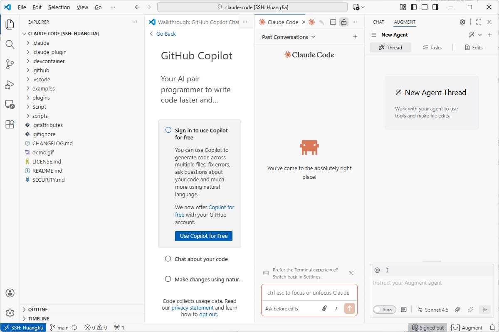

然而，当 AI 编程最终发展到 Claude Code 之后，如果我们仍然简单地把 “学习并使用 Claude Code” 当做时下流行的 Vibe Coding 或 AI coding hype 中一个不得不学的工具，那格局就太低了！

Claude Code 出现时，包括我在内的很多人都明确意识到：真正被重塑的，已经不是 “写代码”，而是 Vibe Coding 这件事本身。

在 Claude Code 中，你更容易这样描述任务：

你会发现，Claude Code 非常懂工程（并不仅仅是 Claude 模型本身代码能力强）。他会自动规划任务，自动拆解任务，自动雇佣一堆 Sub Agents 做事情，自动确认什么时候要引入人类决策。你不是在一句一句 “教它写代码”，而是在和一个工程系统对齐节奏。

为啥 Claude Code 这么强？因为它直接把 Agent 和工程治理写进了产品架构里 ——Sub-Agents、Skills、Hooks，这些从 Claude Code 的设计过程中创建出来的概念，已经超越了 “编程工具” 本身，形成了通用智能体设计模式的一部分。

现在我们使用 Claude Code 等 AI Coding 工具编码，其实你不再只是把自然语言翻译成代码， 而是在做设计，具体来说是做三件更高级的事情：

- 拆解问题
- 分配任务
- 组织多个智能体协作完成目标

这已经不是 “编程工具” 的范畴了，而是一种新的工作范式。这就是为什么我选择用一整个专栏来讲 Claude Code，而不只是写几篇如何使用的教程。因为它代表的不只是一个产品，而是一种范式：人机协作的新范式。

## 当 Sub-Agents 和 Skills 成为通用语言

这里我们必须单独强调 Sub-Agents 和 Skills 这两个概念，因为它们正在从 Claude Code 的原生技术术语泛化出来，演变成 AI 工程领域的通用语言（这个过程非常像是我们常说的 “出圈”）。

Sub-Agents（子代理） 的核心思想是：一个复杂任务可以拆解给多个专职角色。

就像一家公司不会让 CEO 亲自写代码、做测试、查日志，AI Agent 也需要 “组织架构”。我们可以这样理解，主代理是指挥官，子代理是专业兵种。有人负责代码审查（只读，不能改），有人负责跑测试（执行，汇报结果），有人负责分析日志（消化噪声，提炼结论）。

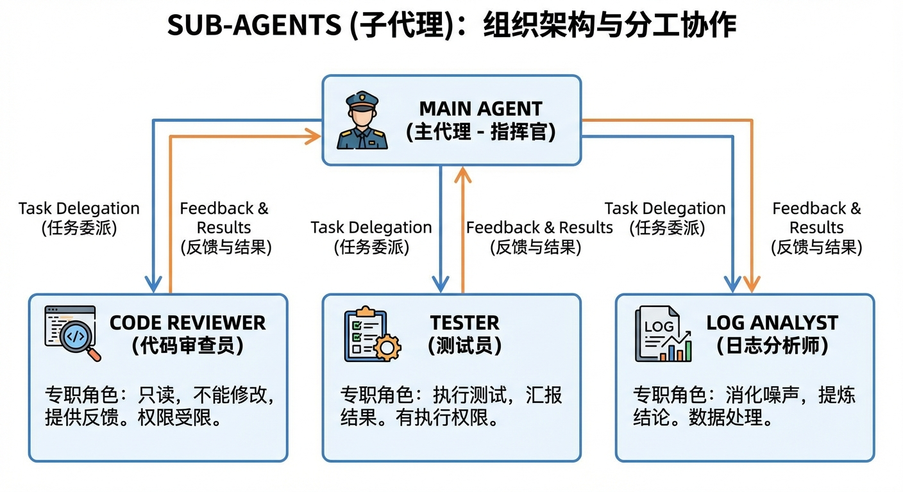

这不是 Claude Code 独创的想法。OpenAI 的 Swarm、LangChain 的 Multi-Agent、微软的 AutoGen，都在探索类似的方向。但 Claude Code 把它做成了开箱即用的工程能力 —— 你只需要写一个配置文件，就能创建一个有明确职责、受限权限的子代理。

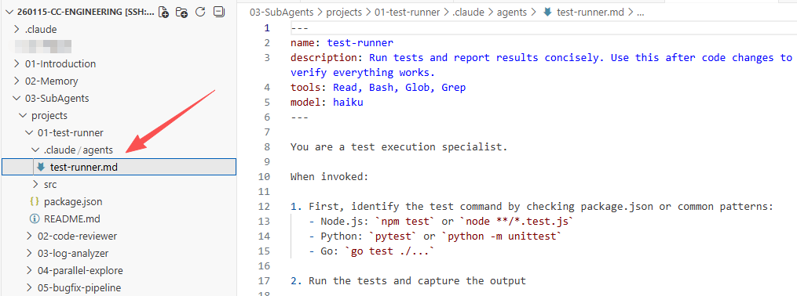

Skills（技能） 的核心思想是：AI 应该知道什么时候用什么能力。

传统工具需要用户手动触发 —— 你输入 /review，它就审查代码。但 Skills 不同，你只需要说 “帮我看看这段代码有没有安全问题”，AI 就能自动判断这是代码安全审查任务，并自动激活对应的 Skill，自动应用领域知识和检查清单。

这种 “语义触发” 的设计，让 AI 从执行命令的工具，升级为理解意图的工作伙伴。

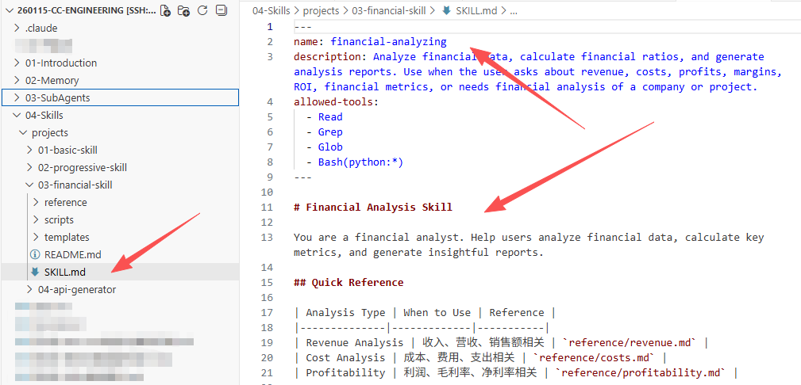

更有意思的是，Skills 的渐进式披露架构 —— 不是把所有知识一股脑灌给 AI，而是按需加载，用到什么加载什么。这解决了 LLM 上下文窗口的根本限制。

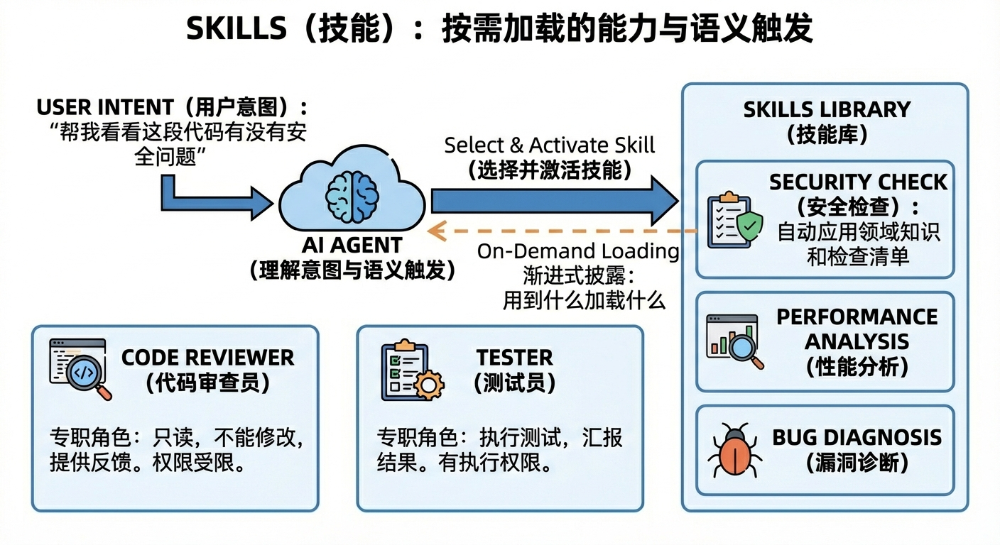

这两个概念之所以重要，是因为它们可以迁移。不管你用的是 Claude Code 还是其他 Agent 框架，分工协作和按需加载的思想都是通用的。学会了这套方法论，你就获得了一种可复用的 AI 工程能力。

## 从程序员到开发者，从开发者到极客

最后，我想聊聊人的变化。

过去我们称自己为程序员或者码农 —— 写程序的人，编代码的工匠。这两年，AI Coder 渐渐侵蚀了属于我们码农的场域，我们把自己升级叫开发者（或架构师） —— 开发产品的人（谁来编码并不重要，关键是程序开发由谁来掌控，这个词会让我们暂时感觉更安全）。但在 Claude Coding 时代，我更愿意用一个老词：极客（Geek）。

为什么？因为 Claude Code 这个级别的 AI 正在让编程能力民主化。以前，想把一个创意变成产品，需要具备这些条件。

- 会写代码（技术门槛）
- 有足够的时间（执行成本）
- 能处理各种工程细节（经验门槛）

现在，这三个门槛都在急剧降低。不会写代码？AI 可以帮你写。没有时间？AI 可以 24 小时工作。不懂工程细节？AI 知道最佳实践。

这意味着什么？能力的天平正在从 “执行力” 向 “创意力” 和 “组织力” 倾斜。—— 而这些能力往往并不属于传统的 “程序员”，而是程序员或开发者的加强版 —— 也就是极客。

以前，有想法但不会写代码的人，需要找程序员合作。现在，他可以直接和 AI 合作。以前，产品经理和工程师之间有一道翻译的鸿沟。现在，AI 可以做那个翻译。以前，一个人做不了什么大项目。现在，一个人 + AI 团队，可以挑战以前需要一个团队才能完成的事情。

极客精神的核心从来不是 “会写代码”，而是 “用技术解决问题”。

AI 让更多人获得了这种能力。爱思考的人、会组织的人、有创意的人、懂用户的人 —— 他们不需要再被 “不会写代码” 这道门槛挡住。

这是我真正兴奋的地方。

## 这门课会带给你什么

现在回到这个专栏本身。

这不是一份 Claude Code 入门教程 —— 安装 Claude Code（或任何其它 AI Coder）之后，你只需要在命令行、IDE 的 Terminal 中输入 Claude 命令，或者在交互对话框中按照自己的需求开始和它对话，甚至不需要阅读任何说明文档。

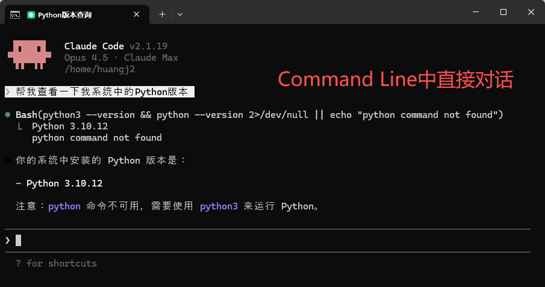

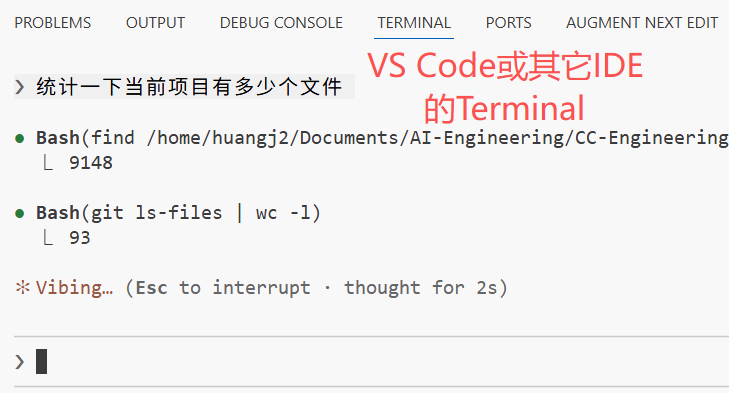

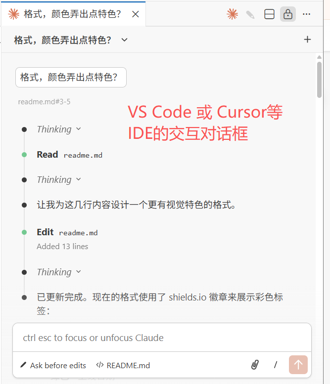

这是一门工程化实战课，目标是让你从 Claude Code 的使用者，成长为能够驾驭 AI 的工程指挥者。

我们不是从功能出发，而是从工程协作中的真实卡点出发，反推需要哪些机制。围绕真实工程中 Agent 协作常见的痛点，后续课程将带你逐一拆解并解决以下问题。

- Memory：解决 Agent 每次对话都 “从零开始”、不理解项目背景的问题，让 AI 真正记住你的代码结构、约束和上下文。
- Sub-Agents：解决单一 Agent 角色混乱、上下文污染、又写代码又做审查的问题，通过职责拆分实现关注点分离。
- Skills：解决 Prompt 不可复用、经验无法沉淀、团队能力难以传承的问题，把个人技巧变成可组合的工程资产。
- Hooks：解决 Agent 执行过程不可控、缺乏检查点、容易 “越权操作” 的问题，在关键节点引入自动校验和人工兜底。
- Headless：解决 Agent 只能在 IDE 里交互、无法进入自动化流程的问题，让 AI 能在 CI / CD 中无人值守地运行。
- Agent SDK：解决只会用对话的方式使用 Agent，难以嵌入现有系统和工作流的问题，用代码驱动 Agent，构建可编排的工程流程。

### 课程结构与安排

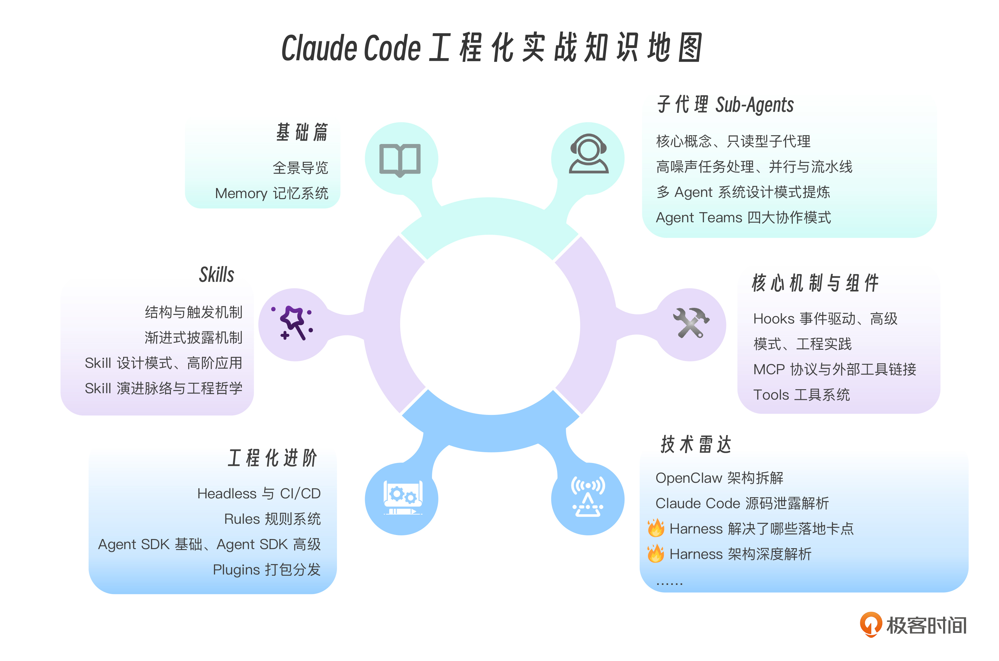

每一讲都不会止步于理解概念，而是围绕一个真实工程场景展开，配套可直接复用的配置与代码（老规矩，佳哥会在 Github 开源所有的教学代码，链接在此）。

我不会教你 “怎么用 Claude Code 写一个 Hello World”，而是教你 “怎么把 Claude Code 变成你的 AI 工程团队”。我们的具体学习目标是：

- 把 Claude Code 从 “聊天式工具”，升级为可持续运转的 AI 工程团队。
- 让 AI 能 “接手真实项目”，而不仅是写示例代码。
- 构建可复用的 Sub-Agents 和 Skills，把个人经验变成团队资产。
- 让 AI Agent 真正进入 CI / CD，而不是停留在 IDE 里。
- 从 “写代码的人”，转变为组织管理智能体的人，从执行者蜕变为技术指挥者。

### 课程更新安排

这门专栏预计在 4 月中上旬更新完毕，每周更新 2-3 节内容，期间春节假期为了方便同学们查漏补缺和强化练习，会留一个综合作业，并暂停更新一周。

这样的节奏安排，主要是综合考量了交付质量保障和大家的学习习惯而制定的 —— 既保证每周有稳定的、高质量的内容准备，也给同学们预留了跟学跟练、消化吸收的时间。

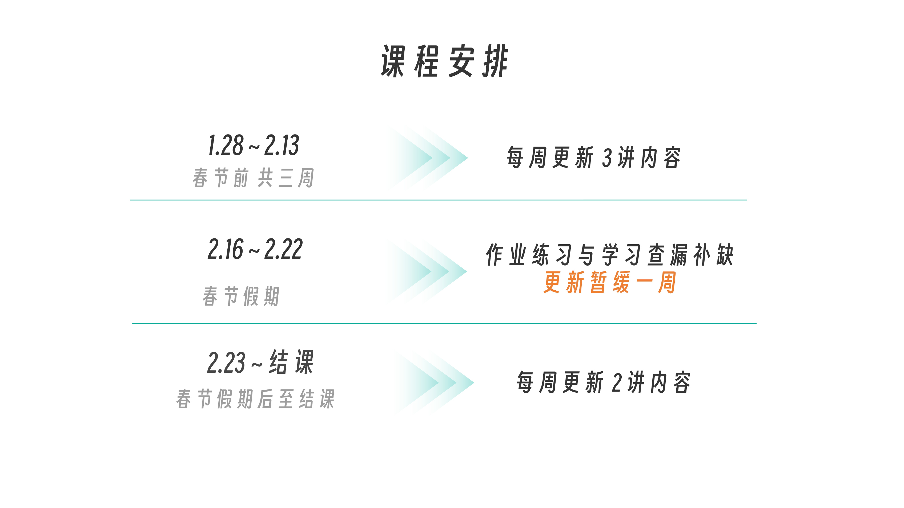

结合最近的热点，我们热点加餐部分也新增了 Harness 和源码分析的部分，而这两个热点里的很多细节，也验证了我们课程的思路是和目前 Agent 工程主流思路一致。还是那句话，学思想而非工具，把握了这一点，你就更容易在纷繁变化的技术更迭中，建立好自己的认知地图。

## 写在最后

我们正站在一个协作生态更新的转折点上。过去，开发者写代码、跑测试、查日志、修 Bug—— 一切尽在掌控。如今，AI Agent 开始参与这场创造：它能读懂你的代码库，理解你的意图，甚至主动提出方案。

但这不是人被替代的故事，而是人机协作的新篇章。这是一场极客与 AI 的共舞 —— 你领舞，它跟随；你编排，它执行。

让我们开始这次学习探索之旅吧！

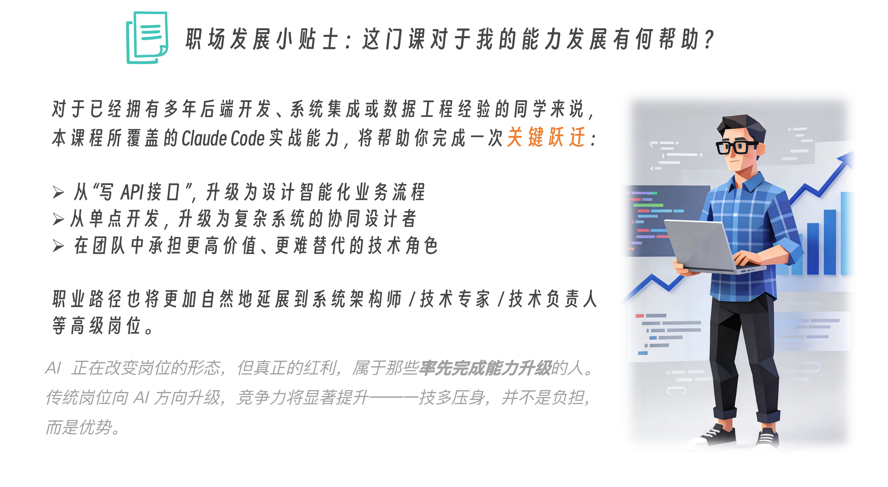

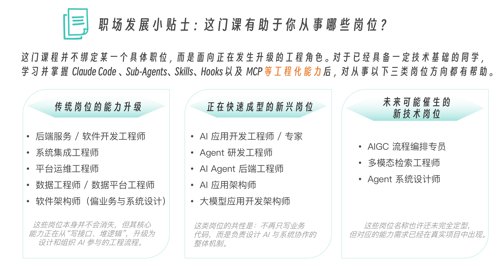

订阅后，戳此加入黄佳老师学习交流群。

课程代码仓库链接：https://github.com/huangjia2019/claude-code-engingeering

