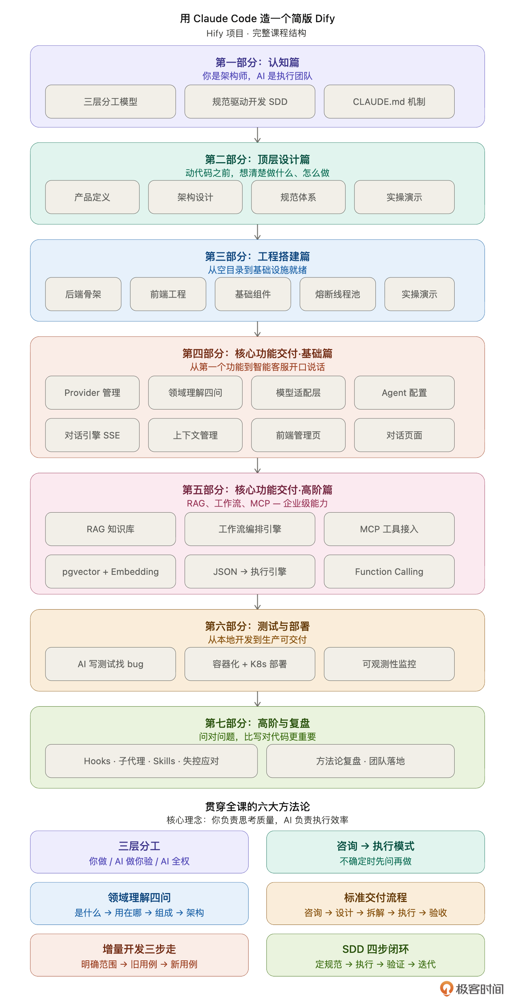

# 开篇词｜一个人用 Claude Code 造一个简版 Dify，需要多久？

你好，我是 Robert。

先回答标题的问题：大概一周左右。

一个人，用 Claude Code，从零开始，搭建一个支持多模型管理、Agent 配置、对话交互、MCP 工具接入的 AI Agent 开发平台，我们叫它 Hify。基于 Spring Boot + Vue 技术栈，采用模块化单体架构，前后端完整，本地可运行。

你可能会想，Dify 是一个几十人团队做了两年多的产品，即便是 “简版”，要覆盖核心功能链路，保守估算怎么也得一两个月、三五个人。一周一个人，听起来像是吹牛。

十分理解，如果半年前有人跟我说同样的话，我也这么想。但这门课不是来说服你相信的，而是把过程摊开给你看 —— 怎么做到的，哪些地方 AI 真的帮了大忙，哪些地方它帮倒忙，最后由你自己判断。

## 角色转变：从 “写代码” 到 “做决策”

我的本职工作是在一线大厂做基础设施，行业经验 10 年 +。过去几年，我一直在做一个开源的分布式系统项目。所以对于 “一个人长期推进一个复杂系统” 这件事，我并不陌生。以前纯靠手写，即便每天下班后写两三个小时，推进速度也很慢。

Claude Code 出来之后，我最初的用法和大多数人一样 —— 把它当一个更聪明的代码补全工具。问它函数怎么写，让它帮我重构一段逻辑，或者生成一些样板代码。确实有提效，但说实话，提的有限。因为核心瓶颈不在写代码的速度上。

真正的转变发生在我开始尝试用它做一个完整项目的时候。

我想做一个简版 Dify，一方面是因为我需要一个可以本地部署的 Agent 平台来对接工作中的场景，另一方面也是想验证一件事：Claude Code 到底能不能扛住一个有真实复杂度的系统工程？

第一天，我就踩了一个大坑。

我直接告诉 Claude Code：“帮我设计一个 AI Agent 开发平台的后端架构，支持多模型、多 Agent、工具调用。” 它很快给了我一个方案：微服务划分清晰，技术选型合理，甚至画了架构图。看起来很专业。

但我越看越觉得不对：它给的方案太重了，上来就引入了服务注册中心、分布式配置、链路追踪，好像在做一个要服务百万用户的生产系统。而我只需要一个团队内部几十人用的平台，模块化单体就够了。

问题不在 Claude Code 身上，问题在我没有想清楚就让它开始干活。

- 我没有定义清楚产品边界：什么做、什么不做；
- 没有明确架构约束：这是一个一周要交付的单人项目，不是一个要演进三年的团队项目；
- 没有给它任何规范：命名怎么定、接口怎么设计、错误怎么处理。

它不是不能做好，是我没告诉它 “好” 的标准是什么。

那一天我几乎没写一行代码。我花了整个晚上做三件事：定义产品边界（一页纸写清楚做什么和不做什么）、设计核心数据模型（五六张表的 ER 图）、写 CLAUDE.md（告诉 Claude Code 这个项目的全部上下文和规范）。

第二天，一切都不一样了。

我给 Claude Code 下达的不再是模糊的大需求，而是清晰的小任务：“按照 CLAUDE.md 中的接口规范，实现模型提供商的 CRUD 接口，包含连通性测试功能，异常按错误码区分三种情况。” 它的输出质量发生了质的飞跃，不是因为它变聪明了，而是因为我给它的输入变清晰了。

到这里我才真正体会到：用 Claude Code 做项目，瓶颈从来不在 AI 的能力上，而在你的思考质量上。你想得越清楚，它做得越准确；你越模糊，它越跑偏。

这不就是架构师和工程团队的关系吗？Claude Code 就是你的工程团队，而你必须成为那个架构师 —— 决定做什么、不做什么、用什么方式做、达到什么标准。

## 方法论：不只是写代码，而是拆解问题

成为架构师之后，你每天做的最多的事不是写代码，而是拆解问题：这个系统的边界在哪、这个需求分几步、每步交给 Claude Code 的输入是什么。拆得好，它一次做对；拆得差，你反复返工。

这门课教的就是怎么拆，怎么和 Claude Code 一起探讨、一起拆，然后得到一个好的功能结果，而不是代码结果。

如果你期待的是一门 Claude Code 功能介绍课 —— 教你怎么用 Hooks、怎么配 Skills、怎么写 Prompt—— 那这门课可能不是十分匹配你的需求。那些内容我们会讲，但不是重点。这门课教的是一套方法论 ——当你拿到一个复杂系统的需求，如何把它拆解成 Claude Code 能准确执行的任务链，一个人从零交付出来。我管它叫 “Claude Code 全链路开发框架”。

这套框架包含两种协作模式：

- 执行模式是你拆清楚了让它做，你验收；
- 咨询模式是你还没拆清楚，先让它帮你梳理 “这一步应该考虑什么”，你判断取舍后再让它执行。

框架还包含一系列支撑拆解过程的具体方法论：

- 规范驱动开发（SDD）让 AI 永远在你定义的轨道上，不自由发挥；
- 三问裁剪法帮你拆解产品边界 —— 做什么、不做什么、做到什么程度；
- 三步检查法帮你高效审查 AI 输出 —— 先查意图、再查质量、最后查边界。

这些方法论不只适用于 Hify，换成任何项目都能用。

我会带你经历 Hify 从无到有的全过程。但在每个环节，我关注的不是 “这个功能怎么实现”，而是问题是怎么被拆解的：

- 在动手之前，我是怎么让 Claude Code 帮我梳理 Dify 的功能全景、怎么用三问裁剪法确定 Hify 的边界、怎么让它给架构方案然后我来拍板的？
- 在核心开发阶段，我是怎么把一个大需求拆成 Claude Code 能准确执行的小任务的？拆的粒度怎么定？它跑偏了我怎么拉回来？
- 在基础设施阶段，我怎么用咨询模式让 Claude Code 帮我发现遗漏的组件？
- 在联调和测试阶段，当问题出在模块之间的交互而不是单个模块内部时，我怎么给它足够的上下文让它定位问题？

每节课以图文为主体，讲清楚方法论和思考过程。每个大章节结束后，配一个完整的演示视频，展示真实操作过程。图文让你理解方法，视频让你看到现场。

## AI 是放大器，不是发动机

最后，在课程正式开始之前，我想告诉你一件事。

构建 Hify 的过程中，Claude Code 确实帮我做了大量的事。但也有不少地方它帮不上忙，甚至帮倒忙，比如架构选型给过明显过度设计的方案，跨模块的状态一致性问题反复改了几轮都没改对……

我自己的实践经历让我确认了一件事：AI 是放大器，不是发动机。你有方向它放大十倍，你没方向它放大的是零。

能一周交付 Hify，不是因为 Claude Code 厉害，是因为动手之前就知道这个系统应该长什么样。哪些模块必须有，哪些功能可以砍，数据模型怎么设计 —— 这些判断来自自身的经验积累，Claude Code 可以帮我们把判断高效地变成代码，但判断本身是我们自己的。

所以进一步来看，你能收获的，不仅是怎么用好 Claude Code，更重要的是，怎么做好那个下判断的人。有了这个能力，你不会绑定任何一个工具，未来换了更好的 AI 编程工具，经验依然可复用。

VibeCoding 时代，浪潮奔涌向前，工具迭代飞快。希望这门课程能助你夯实核心竞争力，享受 AI 带来的乐趣！

## 理性看待 Claude Code 源码泄漏事件

课程上线前一天，Claude Code 出了个不大不小的新闻：v2.1.88 版本发布时，npm 包里意外带上了一个 60MB 的 source map 文件，把大约 51 万行 TypeScript 源码、1900 多个文件直接暴露了出来。GitHub 上的镜像仓库几小时内被 fork 数万次，各路媒体、安全研究者、吃瓜群众纷纷下场，热度拉满。

原因很简单：Bun 打包器默认生成 source map，发布时没在 .npmignore 里把它排除掉。一行配置的问题。Anthropic 官方确认是 “人为错误导致的打包问题，不是安全漏洞，没有用户数据或密钥泄露”。

作为一个正在做 Claude Code 课程的人，我觉得有必要聊几句真话，免得有人被热点带偏了节奏。

泄漏的是客户端，不是大脑。

这次暴露的是什么？是 Agent 的客户端工程实现 —— 工具调用逻辑、权限系统、上下文拼接策略、多 Agent 协作架构。社区也挖出了一些藏在 feature flag 后面的未发布特性，比如后台常驻的 KAIROS、远程规划的 ULTRAPLAN 等等。

有意思吗？有意思。但这些东西改变了什么吗？什么都没改变。

Claude Code 之所以强，是因为背后的 Claude 模型在代码理解和生成上的能力。这个能力来自模型训练、海量数据和算力投入，来自 Anthropic 在 AI 安全与对齐上的深层积累。这些东西不在源码里。竞争对手看到了客户端架构，能学到 Agent 编排的工程思路，但学不到 “为什么 Claude 比其他模型更擅长写代码”。工程可以复制，模型能力不能。

至于那些未发布特性，本来就在产品路线图上，早晚会公开。提前知道了，也就是看了个预告片。而且以 Claude Code 几乎日更的迭代速度，这份源码一周后可能就跟最新版对不上了。

这恰恰印证了我们课程的核心判断。

这件事很好地说明了一个道理：工具层面的东西，无论是客户端架构还是具体的功能实现，都是会变的、可替代的。51 万行源码摊开在所有人面前，Claude Code 的竞争力一点没少。因为真正的壁垒不在工具怎么实现，而在模型能力，以及使用工具的人怎么思考。

这也是我做这门课的出发点。我们不是在教一个工具的使用方法。如果是，那源码泄漏确实会让课程贬值，大家自己看源码就行了。但我们教的是方法论：怎么拆解问题、怎么定义边界、怎么用规范驱动 AI 在你定义的轨道上跑，怎么做那个下判断的人。

这些能力不会因为某个工具的源码泄漏了就贬值，也不会因为工具出了新版本就过时。恰恰相反，工具迭代得越快，掌握底层方法的人越值钱，因为只有他们能在工具更替中始终保持生产力。

所以，热闹归热闹。看完之后，我们来聊点真正重要的事：怎么在 Vibe Coding 时代，成为那个不被工具绑定的人。

现在课程正式开始。

