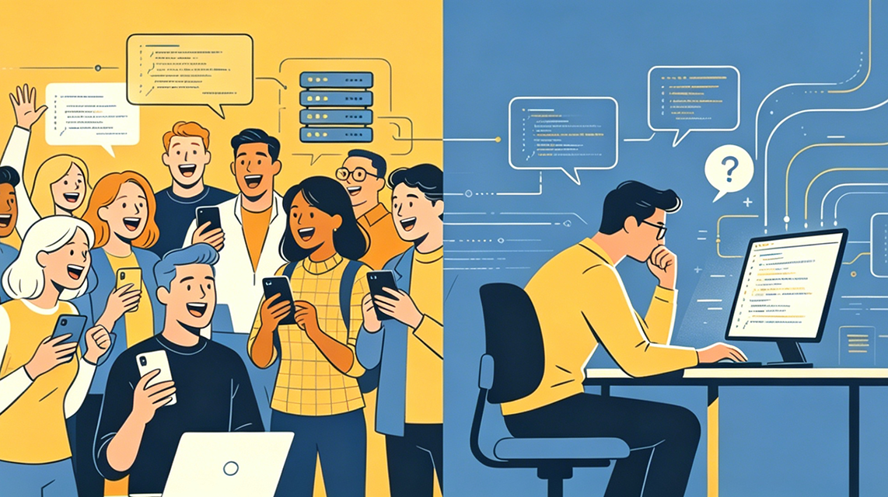

# 热点速递｜Claude Code 源码泄漏：热闹看完，我们聊点真问题

你好，我是 Robert。相信大家都听说 Claude Code 源码泄漏的事件了，今天我们就来聊聊这件事。

昨天（3 月 31 日），Claude Code v2.1.88 发布时，npm 包里意外包含了一个 60MB 的 source map 文件，导致约 51.2 万行 TypeScript 源码、1900 多个文件直接暴露。GitHub 上的镜像仓库几小时内就被 fork 了数万次，各路技术媒体、安全研究者、吃瓜群众纷纷下场，热闹程度堪比过年。

作为一个做了十多年基础设施、正在写 Claude Code 课程的人，我想借这个事儿聊几句真话。

## 发生了什么

Source Map 是调试用的映射文件，能把压缩混淆后的代码还原成可读源码。这次泄漏的原因非常简单：Bun 打包器默认生成 source map，发布时没有在 .npmignore 里把它排除掉。一行配置的问题。

Anthropic 官方确认这是 “人为错误导致的打包问题，不是安全漏洞，没有用户数据或 API 密钥泄露”。

值得一提的是，2025 年 2 月就出现过一次几乎一模一样的泄漏，当时 Anthropic 下架了旧版本并删除了 source map，但同样的问题在 13 个月后又出现了。加上几天前 Anthropic 还因为 CMS 配置问题泄漏了 3000 多个内部文件（包括未发布模型 Mythos 的草稿博客），一周内连续两次失误 —— 这不是偶然，是发布流程的系统性问题。

对一家要做 “最安全 AI 公司” 的公司来说，公关上的伤害远大于技术上的伤害。

## 我的判断：没什么实质影响

网上的讨论看起来很热闹，但如果你冷静想一想，这件事对 Claude Code 的竞争力几乎没有影响。理由很简单。

第一，Claude Code 强的是模型，不是客户端。

泄漏的是什么？是 Agent 的客户端工程实现 —— 工具调用逻辑、权限系统、上下文拼接策略、多 Agent 协作架构。这些东西重不重要？重要。但它们是 Claude Code 的核心竞争力吗？不是。

Claude Code 之所以强，是因为背后的 Claude 模型在代码理解和生成上的能力。这个能力来自模型训练，来自海量数据和算力投入，来自 Anthropic 在 AI 安全与对齐上的深层积累。这些东西不在源码里，竞争对手看到了客户端架构，也复刻不了模型能力。Cursor 拿到这份源码，能学到 Agent 编排的工程思路，但学不到 “为什么 Claude 比 GPT-4o 更擅长写代码”。

第二，客户端架构不是什么秘密武器。

源码揭示了 React + Ink 终端 UI、ReAct 循环、流式执行、并行工具调用、自动上下文压缩…… 这些设计确实精巧，工程质量也很高。但说实话，这些架构模式对于有经验的工程师来说并不陌生。各家 Coding Agent 在客户端层面的实现大同小异，真正拉开差距的从来不是客户端怎么写，而是背后的模型能力和产品打磨。

第三，泄漏的 “未来特性” 迟早会发布。

大家挖出了 KAIROS（后台常驻 Agent）、ULTRAPLAN（远程规划）、Dream System（空闲时记忆整合）等一堆未发布的 feature flag。有意思吗？有意思。但这些东西本来就在 Anthropic 的产品路线图上，早晚会公开发布。提前知道了，也就是提前看了个预告片而已。

第四，以 Claude Code 的迭代速度，这份源码很快就会过时。

Claude Code 几乎是日更的节奏。一个礼拜之后，代码结构可能就已经大变样了。你今天花时间研究这份泄漏的源码，下周它可能就跟最新版对不上了。源码是一个快照，不是一份永久的蓝图。

第五，影响估值？不可能。

Anthropic 的估值建立在模型能力、安全研究、企业客户基础和 API 收入之上。一个客户端工具的源码泄漏，不会动摇任何一项核心资产。截至 2026 年 3 月，Anthropic 的年化收入已经达到 190 亿美元。这个数字靠的是模型，不是一个 CLI 工具的客户端代码。

## 真正值得关注的是什么

热闹看完，我更想聊聊这件事背后的一个本质问题：在 Vibe Coding 时代，什么才是真正的竞争力？

很多人看到源码泄漏，第一反应是 “太好了，可以复刻一个本地版”。这种想法恰恰暴露了一个误区：把工具本身当成了目标。

Claude Code 也好，Cursor 也好，Windsurf 也好，它们都只是工具。工具会迭代，会被替代，今天的最优解明天可能就不是了。如果你的能力绑定在某一个具体工具上，那你的能力保质期和这个工具的版本号一样短。

真正持久的竞争力，是方法论。

我在课程里反复强调的一个核心理念是：工具是放大器，方法才是根基。具体来说：

- 你需要理解大模型的能力边界 —— 它擅长什么、不擅长什么、什么时候该信任它、什么时候该介入；
- 你需要掌握与 AI 协作的方法论 —— 怎么用 Specification-Driven Development 把需求变成 AI 能精准执行的规范，怎么用 consult-then-execute 模式在关键决策点保持人的判断力；
- 你需要有架构能力和领域知识 ——AI 能帮你写代码，但它不能替你做架构决策，不能替你判断技术选型的长期影响。

这些东西不会因为某个工具的源码泄漏了就贬值，也不会因为某个工具出了新版本就过时。恰恰相反，工具迭代得越快，方法论的价值就越高 —— 因为只有掌握了底层方法的人，才能在工具更替中始终保持生产力。

## 最后说一句

Claude Code 源码泄漏，本质上是一次打包配置的低级失误。对 Anthropic 来说是一次公关教训，对技术社区来说是一次有趣的围观。但对我们这些用 AI 工具做开发的人来说，它什么都没改变。

模型在进化，工具在迭代，方法论才是你的护城河。

与其花时间翻别人的源码，不如把精力放在真正能让你持续成长的事情上。这也是我做这门课程的初衷 —— 不是教你用某一个工具，而是教你在 AI 时代怎么做工程。

工具会变，方法不会。

