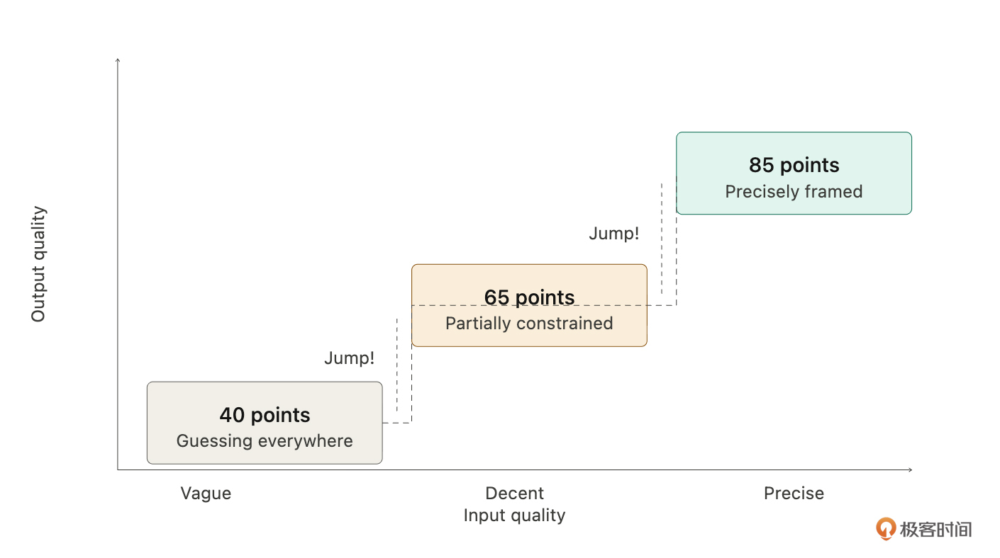
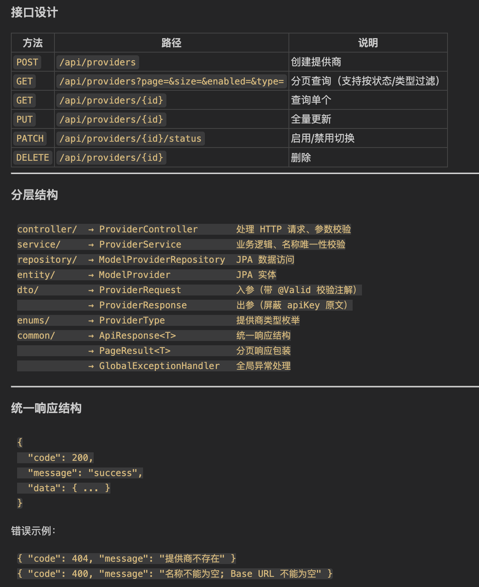
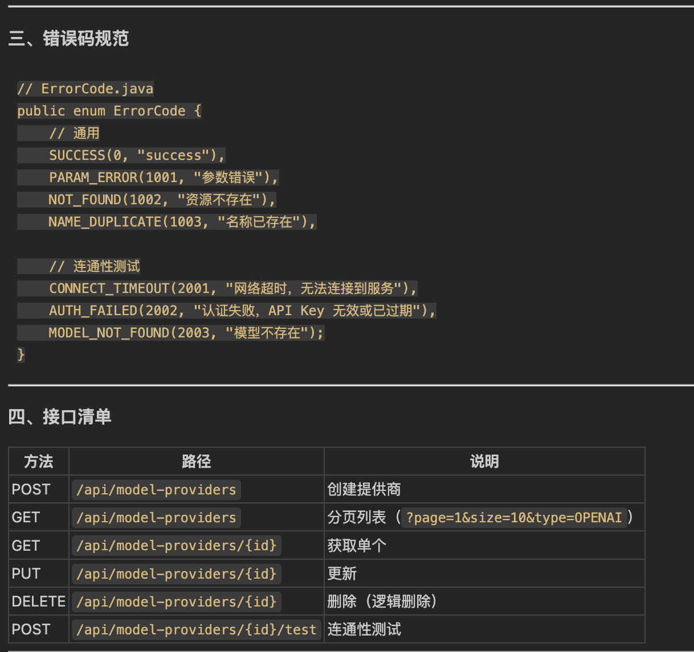
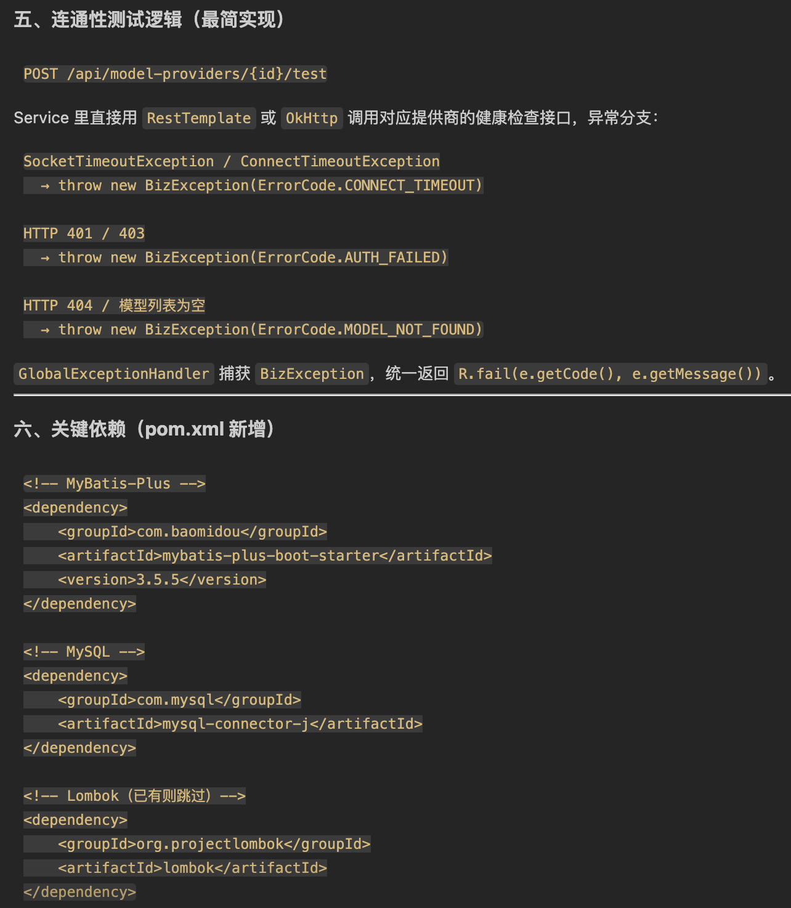
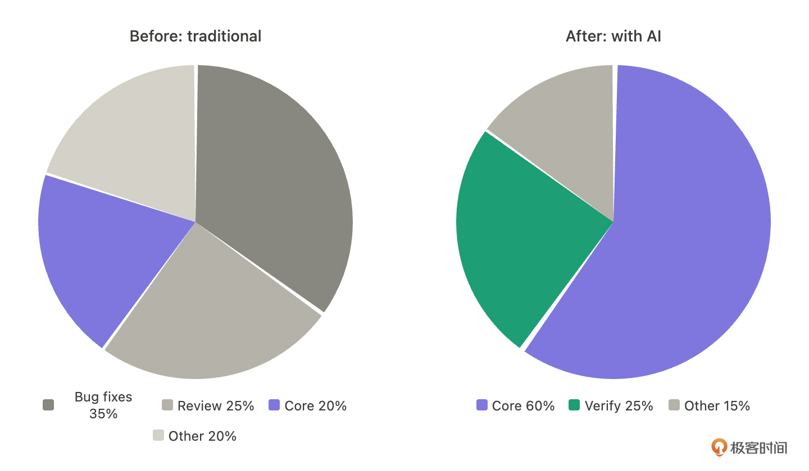
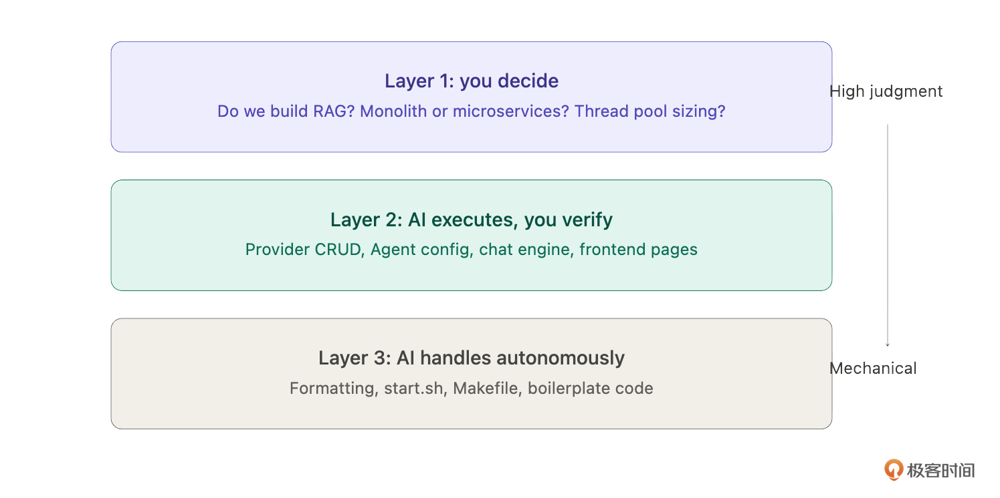
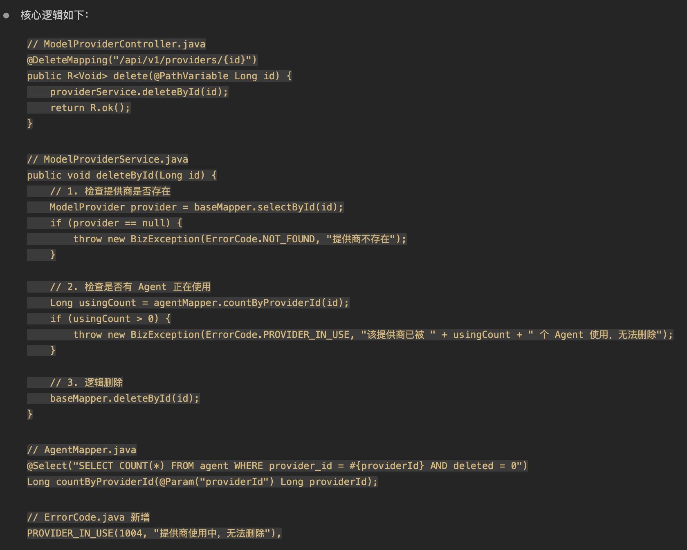
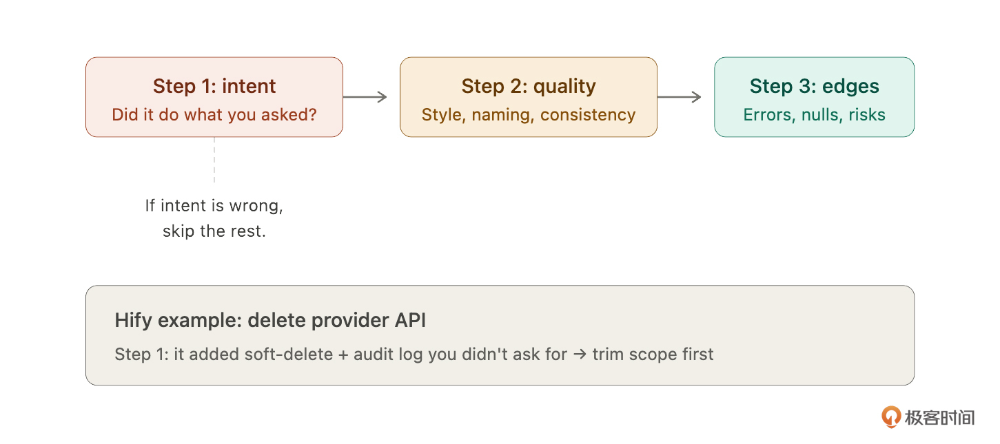

# 01｜你是架构师，Claude Code 是你的工程团队

你好，我是 Robert。

从这一讲开始，我们正式进入课程的认知篇。在动手写任何代码之前，我想先和你聊清楚一件事：你和 Claude Code 到底应该是什么关系？

这门课我们会围绕用 Claude Code 从零构建一个叫 Hify 的 AI Agent 开发平台来展开。但在动手之前，有一个比 “怎么做” 更重要的问题要先想清楚 —— 产品需求、架构设计、测试回归、部署运维，这些事情谁来做？

以往这些可能已经由你的产品经理、架构师、测试团队、运维团队完成了。但当你只有 Claude Code 的时候，你就是所有事情的负责人。你需要想清楚这些事情，然后让 Claude Code 协助你完成。具体执行可能是 Claude Code 完成 90%，你完成 10%。

所以这一讲主要想讲清楚一个认知框架：你要先转变角色，才能用好工具。不要把 Claude Code 当作只会写代码的工具。它可以是架构师、产品经理、测试专家、运维专家 —— 关键是看你怎么激活它。这也是这门课在教的事情：怎么激活。

用 Claude Code 做项目，瓶颈不在 AI，在你。

我会从三个方面展开：为什么同样的工具不同人用效果差那么多，你和 Claude Code 各自该干什么，以及拿到它的输出之后怎么判断能不能用。

## 为什么同样的工具，你用和别人用差这么多

开篇词里我讲过第一天踩坑的经历 —— 直接让 Claude Code 设计架构，拿到一个过度设计的微服务方案。问题不在 AI，在于我没给它足够的约束和上下文。后来我花一个晚上想清楚产品边界、架构约束、技术规范，写成 CLAUDE.md 喂给它，第二天输出质量完全不同。

这里我想展开讲一个更本质的发现：输入质量和输出质量之间不是线性关系，是阶梯式的。

你给 AI 的输入从 60 分提升到 80 分，输出不是从 60 涨到 80，而是可能从 40 直接跳到 85。因为当你的描述模糊时，AI 需要 “猜”—— 猜你要什么架构、猜你的设计意图、猜你的质量标准。每猜一个就可能猜错，错误还会叠加。但当你给的上下文足够清晰时，它不用猜了，输出质量会有质的变化。

所以第一个要建立的认知是：你想得越清楚，它做得越准确；你越模糊，它越跑偏。瓶颈不在 AI 的能力上，在你的思考质量上。

那接下来的问题自然就是：我该想清楚哪些事情？我和 Claude Code 之间怎么分工？

## 你做决策，它做执行

我现在和 Claude Code 的协作方式，总结下来就一句话：我是架构师，它是我的工程团队。

这不是比喻。想想一个架构师每天干什么：

- 他不写具体的业务代码，但他决定了系统长什么样。
- 他定方向：做什么、不做什么。
- 他做取舍：遇到矛盾选 A 还是选 B。
- 他立标准：代码怎么写、接口怎么定、出了错怎么处理。
- 他验收成果：团队交付的东西是不是他要的。

工程团队在干什么？在按标准高效执行。

你给 Claude Code 下达的每一条指令，本质上就是架构师在给团队派任务。我拿 Hify 里的一个真实场景举例，下面是两种方式：

### 第一种方式

问题是：“帮我用 Spring Boot 实现一个模型提供商管理的 CRUD 接口。”

Claude Code 的输出是：

### 第二种方式

问题是：“按照 CLAUDE.md 中的接口规范，实现模型提供商的 CRUD 接口，使用 MyBatis-Plus，错误码按规范定义，连通性测试的异常区分网络超时（2001）、认证失败（2002）、模型不存在（2003）三种情况。不需要工厂模式，用最简单的方式实现。”

Claude Code 的输出是：

同一个 AI，这两种指令拿到的输出质量完全是两回事。第二种方式的输出结构完整，有错误码、有依赖管理、有连通性测试，是一个成熟项目该有的样子。

建立这个框架之后，你的核心工作不再是 “写代码”，而是 “做决策”—— 决定做什么不做什么，决定用什么方式做，决定做到什么标准，验收 Claude Code 做出来的结果。

你可能会问：那我是不是不用懂技术了？恰恰相反。你必须有足够的技术判断力来验证它的输出。看不懂它写的代码，就没法判断对不对；不了解技术细节，就没法给出精确的任务描述。技术能力是你当好 “架构师” 的前提。

我想多说一点，关于这个框架真正改变的是什么。

很多人讨论 AI 提效，关注的都是 “写代码快了多少”。但我体会最深的不是速度变化，而是精力分配的变化。做一个系统，大量时间其实不是花在写新功能上 —— 修低级 bug、反复 review、写测试、写文档，这些又多又碎的活消耗了大部分精力。AI 把这些接过去之后，我可以把大部分精力集中在架构设计和核心决策上。这个改变是复利的。

所以 “你是架构师，它是工程团队” 的深层含义是：AI 让你终于有条件把全部精力放在最该做的事上。

那具体怎么分工？我把它分成三层，你可以直接拿来用。

第一层，必须你做的。产品边界、架构决策、技术取舍、跨模块一致性。拿 Hify 来说：做不做 RAG 知识库？用微服务还是模块化单体？线程池参数设多少？这些决策只有你能做。Claude Code 可以给你方案对比（后面第 04 讲你会看到这个过程），但拍板的必须是你。

第二层，AI 做你验收的。业务代码、接口开发、前端页面、测试用例、文档。这是工作量的大头。有一个硬标准：任何一行代码你都要能说清楚它在干什么。说不清楚，就不能用。

第三层，AI 全权处理的。格式化、样板代码、简单重构、启动脚本、Makefile。扫一眼没问题就行。

这三层的边界不是死的。做 Hify 这种应用层项目，第二层比例大，AI 可以写更多代码。做基础设施项目（分布式系统、存储引擎），第一层比例大，核心代码最好自己写。关键是你始终清楚哪些东西不能放手。

还有一点要提前说：有时候你还没完全想清楚要做什么，比如 “业务开发前需要准备哪些基础组件” 这种问题。这时候不是只有 “想清楚再让它做” 这一条路，你也可以先让 Claude Code 帮你梳理思路，它帮你想，你来判断取舍。这个协作模式我们在后面会专门讲。

## 怎么检查它给你的东西

分工定了，验收怎么做？我用三步，按优先级来。

我拿 Hify 里一个具体场景来说明。假设你让 Claude Code 实现 “删除模型提供商” 的接口，你的指令是：“实现删除模型提供商的接口，路径 DELETE /api/v1/providers/{id}，删除前检查是否有 Agent 正在使用该提供商，如果有则拒绝删除。”

Claude Code 的主要输出是：

Claude Code 很快给了代码。核心思路就三步：查存在 → 查引用 → 删除，BizException 由 GlobalExceptionHandler 统一拦截返回对应错误码。现在我们用三步检查法来看。

第一步，查意图：它做的是不是你让它做的？

你打开代码，发现它确实实现了删除接口和关联检查。但它额外做了两件事：加了一个软删除机制（不是真删，标记 deleted = true），还加了一个操作日志记录。

软删除合不合理？也许合理。操作日志要不要？可能要。但问题是你没要求。它自作主张扩大了范围。这次看着还行，下次它可能就 “顺手” 加一些不合适的东西。

所以第一步的判断：功能多了，需要砍掉或确认后再保留。

第二步，查质量：风格、规范、一致性。

你看命名，发现检查关联的方法叫 checkProviderUsage，但项目里其他类似方法都叫 validateXxxBeforeDelete。返回格式上，其他接口返回 Result<Void>，它这里直接返回 ResponseEntity。这些不是 bug，功能没问题，但放在整个项目里风格不统一，时间一长，每个模块一种风格，维护起来很痛苦。

第三步，查边界：错误处理、异常、潜在风险。

你发现一个问题：它检查了 “有 Agent 在使用则拒绝删除”，但没有处理并发场景 —— 检查通过后、删除前，刚好有新 Agent 绑定了这个提供商怎么办？另外，传入的 ID 不存在时，它抛了 500 而不是 404。

这些边界问题，你可以让 Claude Code 自己再检查一遍 —— 它做细节排查很稳定，不会因为疲劳漏掉。

顺序很重要：先查意图，再查质量，最后查边界。如果意图就错了，后面两步白查。

最后提醒一个坑：Claude Code 连续几次输出都没问题时，你会不自觉放松警惕。这是人的认知规律，不是意志力能对抗的。怎么办？靠机制 —— 关键模块强制跑测试再接收，别光靠肉眼。这个后面测试那一讲会详细说。

## 总结

这节课我们建立了一个认知框架和两个实操工具。

认知框架：你是架构师，Claude Code 是你的工程团队。你的工作重心从写代码变成做决策。

实操工具一，三层分工：哪些必须你做、哪些 AI 做你验收、哪些 AI 全权处理。从下一讲开始，你每次给 Claude Code 派任务前，先想一秒这个任务在哪一层。

实操工具二，三步检查法：拿到 AI 输出后，先查意图、再查质量、最后查边界。意图错了后面白查，这个顺序不能反。

下一讲我们解决一个具体问题：怎么让 Claude Code 永远在你的轨道上跑，不自由发挥。这就是贯穿整门课的核心方法论 —— 规范驱动开发。

## 思考题

回想一下你现在用 AI 编码工具的方式。在今天说的三层分工里，有没有哪些本该你拍板的事情，不知不觉交给了 AI ？比如某个技术选型、某个架构决策，你是自己想清楚了再让 AI 执行，还是直接问 AI “你觉得该怎么做” 然后就照着做了？

欢迎你在留言区与我交流！如果今天的课程让你有所收获，也欢迎转发给有需要的朋友，邀请他来一起学习，我们下节课再见！

