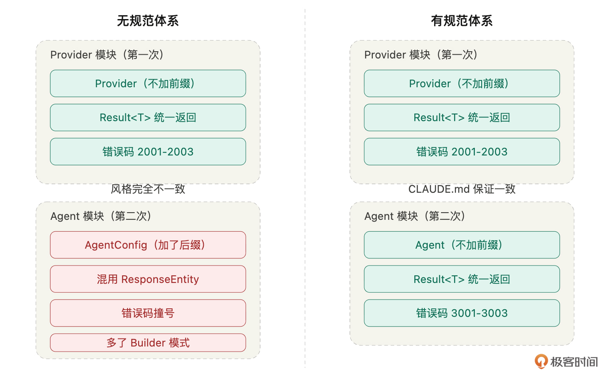
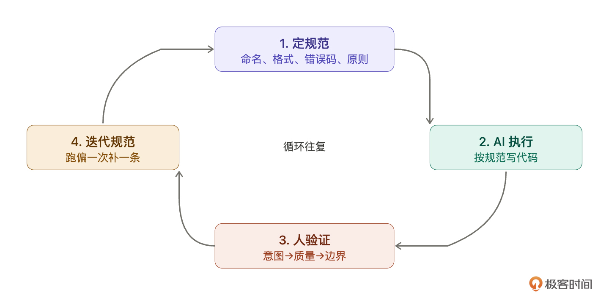
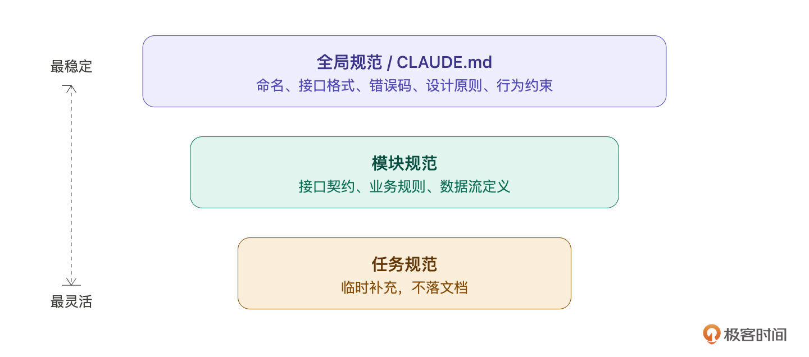

# 02｜规范驱动开发（SDD）：让 AI 永远在轨道上

你好，我是 Robert。

上一讲我们明确了一个核心认知：你是架构师，Claude Code 是你的工程团队。你负责做决策，它负责执行。

但这里有一个问题：你怎么把你的决策传达给它？

你想想，如果你带过团队或者和外包合作过，你一定有体会，脑子里想得再清楚，如果没有落成文字，对方做出来的东西大概率和你想的不一样。口头说 “帮我做个用户系统”，交回来你可能哪哪都不满意。但如果你给了接口文档、数据模型、命名规范、错误码定义，交付质量会好一个档次。

Claude Code 也是一样。它很强，但它不会读心。你不告诉它规矩，它就自己编一套。每次编的还不一样。

这一讲要介绍的就是贯穿整门课的核心方法论：规范驱动开发（Specification-Driven Development，SDD）。一句话概括：先定规范，再让 AI 按规范执行，而不是直接让它写代码。

这是一节理论课，可能会有点枯燥，但是这节课是这门课的根基，AI 既需要上下文，也需要规范。而规范的好坏决定了这个项目的质量。

我会从三个方面展开：先用一个真实场景让你直观感受规范体系的价值，然后讲 SDD 的完整工作流，最后聊规范的质量标准，什么样的规范才能真正约束住 AI。

## 规范不是一次性的指令，是一套体系

第 01 讲我们看到了一个现象：给 Claude Code 的指令越清晰，输出质量越高。但这里有一个容易被忽略的问题：你给的清晰指令，只在那一次对话里有效。

我拿 Hify 的真实经历来说明:

做 Provider 模块（模型提供商管理）时，我在指令里写得很细：实体叫 Provider 不加前缀、返回格式用 Result<T>、错误码按模块分段、不要设计模式。Claude Code 的输出很干净，命名统一、格式规范、结构简洁。

两天后做 Agent 模块，我写指令时没有重复那些规范（觉得它应该 “记住” 了），只说了 “实现 Agent 的 CRUD 接口”。

伪代码如下：

拿到代码一看我皱眉了。

实体类叫 AgentConfig—— 加了个 Config 后缀，Provider 模块不加后缀，两个模块风格不一致。返回格式有的走 Result<T>，有的直接返回 ResponseEntity。错误码没有按模块分段，和 Provider 的错误码撞号了。更离谱的是它给 Agent 加了一个 Builder 模式 ——Provider 模块用的是直接 new，两个模块的创建方式都不一样。

每一条单独看都不是 bug，功能完全正常。但放在一个项目里，两个模块两种风格，前端对接的时候要适配两套格式，后面维护的时候每个模块都要先搞清楚 “这个模块的规矩是什么”。

问题出在哪？Claude Code 没有长期记忆。你上一轮对话给的规范，这一轮它完全不知道。它不是 “忘了”，它根本没看到。每次新对话，对它来说都是从零开始。

所以单次指令的清晰度只能解决单次输出的质量。要保证整个项目几十次、几百次 AI 输出的一致性，你需要的不是一条好指令，是一套规范体系。写下来，每次自动加载，让 Claude Code 不管在哪个模块、哪个阶段，都在同一套规矩下工作。

这就是 SDD 和 “写好 Prompt” 的本质区别。写好 Prompt 是一次性的技巧，SDD 是贯穿整个项目生命周期的方法论。

那具体怎么做？

## SDD 的完整工作流

SDD 不是写个规范然后照着做，它是一个持续运转的闭环。四步，循环往复。

### 第一步：定规范

在写任何业务代码之前，先把基础规范定下来。

你可能会想：这得写到多细？会不会花太多时间？

第一版粗一点没关系，但一定要有。关键是覆盖 Claude Code 最容易跑偏的地方。根据我做 Hify 的经验，它最容易跑偏的地方有四个：

- 命名风格。不约束它，每个模块的命名都不一样。实体类加不加前缀、字段用驼峰还是下划线、接口路径用单数还是复数…… 这些它每次都要 “猜”，猜的结果每次都不同。

- 返回格式。不约束它，有的接口返回 {"code": 200, "data": {...}}，有的返回 {"error": "not found"}，有的直接返回 ResponseEntity。前端适配的时候会崩溃。

- 错误码体系。不约束它，错误码满天飞。有用 HTTP 状态码的，有用自定义字符串的，有用随机数字的。更糟的是不同模块的错误码撞号，你分不清 2001 到底是 Provider 的 “网络超时” 还是 Agent 的 “模型不存在”。

- 设计原则。这是最关键的一条。Claude Code 训练数据里有大量 “最佳实践” 代码，它天然倾向于过度设计 —— 工厂模式、策略模式、三层抽象、接口隔离。对一个几十人用的内部平台来说，大部分设计模式是负担不是资产。

四块加在一起，一页纸。但有和没有之间的差距，就是完成和完美之间的差距。

那这个规范从哪来？你可能已经有经验能写出大部分，但难免有遗漏。这里有个技巧：你也可以先让 Claude Code 帮你梳理 “这个项目需要定哪些规范”，它帮你想，你来判断取舍。这种 “先问再做” 的协作模式，第 09 讲会专门展开。

规范写好了放哪里？放在项目根目录的一个叫 CLAUDE.md 的文件里。Claude Code 每次启动新对话时自动读取这个文件，你不需要每次手动喂。第 05 讲会手把手带你写完整版，这一讲你先理解它的作用。

### 第二步：AI 按规范执行

下达任务时，明确引用规范。不是 “帮我做个 Agent CRUD”，而是 “按照 CLAUDE.md 中的规范，实现 Agent 的 CRUD 接口”。

这句话的重点不在 “按照规范” 这四个字，CLAUDE.md 已经在上下文里了，Claude Code 看得到。重点在于它提醒 Claude Code 去关注那份规范，而不是按自己的 “经验” 来。

有了 CLAUDE.md 之后，你回到做 Agent 模块那个场景：实体类就叫 Agent 不叫 AgentConfig（因为规范写了 “不加前缀后缀”），返回格式走 Result<T>（因为规范写了 “统一返回”），错误码从 3000 开始（因为规范写了 “按模块分段”），没有 Builder 模式（因为规范写了 “不引入不必要的设计模式”）。

同一个 AI，有规范体系和没有规范体系，输出的一致性完全不同。

### 第三步：人验证输出

用第 01 讲的三步检查法，意图、质量、边界，检查 Claude Code 的输出是否符合规范。

有了规范之后，review 的效率会大幅提升。因为你不再是漫无目的地看代码，而是 “对着清单打勾”—— 命名是不是按规范来的？返回格式统一不统一？有没有引入我明确说了 “不要用” 的设计模式？错误码是不是在这个模块的分段范围内？

规范把 review 从主观判断变成了客观核查。这个转变对效率的提升是巨大的，你不需要每次都重新思考 “这里应该怎么写”，因为标准已经定好了。

### 第四步：迭代规范

这一步最关键，也最容易被忽略。

你在验证输出时，一定会发现规范没覆盖到的地方。这太正常了，你不可能第一次就想到所有情况。关键是每次发现缺口，都要补上。

我拿 Hify 开发过程中的真实案例来说明这个迭代过程。

第一周发现的缺口。Claude Code 在处理空列表时返回了 null。前端拿到 null，页面直接白屏 —— 它期望的是一个空数组 []。这说明规范里没定义 “空值怎么处理”。补上：

第二周发现的缺口。 做 Agent 模块时，让 Claude Code 改了一个 Provider 的接口签名。前端调 Provider 的代码全部报错。它 “觉得” 新签名更好，就顺手改了。这说明规范里缺少 “改代码时的行为约束”。补上：

第三周发现的缺口。做对话引擎时，Claude Code 把业务逻辑写在了 Controller 里 —— 事务管理、数据校验、外部调用全塞在一个方法。能跑，但完全不符合分层原则。这说明规范里缺少 “代码放哪里” 的约束。补上：

做前端时发现的缺口。Claude Code 引入了一个没在技术栈里的 UI 库。能跑，但多了一个依赖要维护。这说明规范里缺少 “技术栈边界” 的约束。补上：

你看到规律了吗？每次 AI 跑偏，不要只改代码 —— 停下来问自己：它为什么跑偏？是不是规范没覆盖到？然后补上那条规范。

这条规范一旦写进 CLAUDE.md，后面所有对话都会受到约束。你不需要再遇到同样的问题。它跑偏一次，你补一条，以后它在这个点上就不会再跑偏。

坚持几周，你的规范会从最初的一页纸，长成一份覆盖命名规则、接口规范、错误码、异常处理、项目结构、分层原则、行为约束、前端组件规范的完整体系。Hify 的规范就是这样长出来的，没有一条是 “提前想出来的”，全部是在开发过程中一条一条补上去的。

四步闭环用一句话概括：规范越磨越锋利，AI 越用越顺手。

## 什么样的规范才有用

不是所有规范都能约束住 AI。我在 Hify 的开发中踩过一些弯路，总结出三条判断标准。

### 具体，不模糊

没用的规范：“代码要简洁。” Claude Code 对 “简洁” 的理解和你不一样。它可能觉得一个工厂模式 + 策略接口就是简洁的抽象。

有用的规范：“不引入不必要的设计模式（工厂、策略、观察者等），除非明确要求。每个功能用最简单直接的方式实现。” 没有歧义，它知道工厂模式不能用。

没用的规范：“接口要规范。”

有用的规范：“所有接口统一返回 Result<T>，格式为 { code, message, data }。错误码四位数字，按模块分段。”

判断标准很简单：Claude Code 看到这条规范后，是否还需要 “猜” 你的意思？如果还需要猜，就不够具体。

### 有优先级，不贪多

规范不是越多越好。太多了 Claude Code 也处理不过来，因为上下文窗口是有限的，塞了太多规范反而会稀释重要的那几条。

我的原则是：AI 反复跑偏的地方写细，不跑偏的地方不写。

- “文件编码用 UTF-8”，Claude Code 基本不会搞错，不值得占篇幅。
- “Controller 不写业务逻辑”，它经常犯这个错，必须写。你的注意力应该放在它真正容易犯错的地方。

Hify 的 CLAUDE.md 最终大概两三页。不长，但每一条都是因为 Claude Code 在那个点上跑偏过才补上去的。没跑偏过的地方，一条都没有。

### 带原因，不只是规则

这一条是我在做 Agent 模块时学到的。

第 15 讲做 Agent 工具列表更新时，我在指令里写了 “不要全量删除再全量插入”。Claude Code 第一版还是用了全量删除再插入 —— 它不理解为什么不能这样做。

我补了一句解释：“全量删除再插入会导致并发场景下 Agent 瞬间失去所有工具关联，如果此时有对话正在读取工具列表，会拿到空列表。”

第二版它就用了差异比对的方式。

这说明一个问题：对于涉及工程权衡的规范，不能只告诉 Claude Code “不要这样做”，还要告诉它为什么。它需要理解约束的原因，才能在类似场景中举一反三。此时它会跟你讨论，可能你想的不对。

不过，也不是每条规范都需要解释 ——“实体类不加前缀” 不需要解释原因，照做就行。但 “不破坏已有接口契约”、“不全量删除再插入” 这类涉及工程判断的规范，加上原因会让 Claude Code 的遵循度明显更高。

## 规范的分层

最后说一下规范的组织方式。随着项目推进，规范会越来越多，需要分层管理。

我把 Hify 的规范分成三层：

全局规范。写在 CLAUDE.md 里，整个项目通用。命名规则、接口格式、错误码体系、设计原则、行为约束。项目初期定好，后面很少改动。这是地基。

模块规范。某个模块开发前单独定义。比如 Provider 模块有自己的接口契约（第 05 讲会详细展示），对话模块有自己的数据流定义，工作流模块有自己的节点类型规范。写在模块目录下或者开发前的指令里。

任务规范。每次给 Claude Code 下达具体任务时的补充说明。比如，“这次不需要分页”、“异常要区分这三种情况”、“用差异比对不要全量替换”。临时性的，不落成文档。

三层怎么配合？全局规范是地基，模块规范是补充，任务规范是临场微调。Claude Code 每次干活时看到的，是三层叠加的完整约束。优先级从上到下 —— 任务规范可以覆盖模块规范（这次不需要分页），但不能违反全局规范（所有接口统一返回 Result<T>）。

第 05 讲会手把手带你写完整的 CLAUDE.md，到时候你会看到全局规范的完整形态。这一讲我们先建立分层的认知。

## 总结

这一讲的核心就是 SDD 的四步闭环：定规范→ AI 执行→人验证→迭代规范。

规范不是额外负担，是节省时间的捷径。没有规范的 AI 是一匹没有缰绳的马 —— 跑得快，方向不可控。有了规范，你就把它框在轨道上了，又快又稳。

而且规范的价值会随时间复利累积。第一周你可能觉得 “写规范好麻烦，直接让它干不就行了”。但到第三周，你会发现 Claude Code 几乎不跑偏了 —— 不是它变聪明了，是你的规范把所有容易踩的坑都堵上了。后面每做一个新模块，规范帮你省下的 review 时间和返工时间，远超当初写规范的投入。

从实操角度，记住三件事：

第一，规范不需要一次写完。第一版覆盖最容易跑偏的四个地方（命名、返回格式、错误码、设计原则）就够了，后面在开发中迭代补全。

第二，每次 AI 跑偏了，不要只改代码，还要想想规范是不是该补一条。跑偏一次补一条，同样的问题不会再出现第二次。

第三，规范要具体到 AI 不需要猜你的意思。如果它看到规范后还需要 “猜”，那就不够具体。

下一讲我们开始动手 —— 定义 Hify 的产品边界，想清楚做什么和不做什么。这是 “架构师” 要做的第一件事，也是 CLAUDE.md 里最先要写的内容。

## 思考题

试着做一个小练习：想一个你最近用 AI 写代码时反复遇到的问题，比如它总是命名不对，或者错误处理不统一，或者总是过度设计。然后为这个问题写一条具体的规范，要求满足这一讲说的三个标准：具体不模糊、有优先级、带原因（如果需要的话）。把你写的规范发在留言区，我们一起看看写得够不够精确。

期待你的分享。如果今天的课程让你有所收获，也欢迎转发给有需要的朋友，邀请他来一起学习，我们下节课再见！

