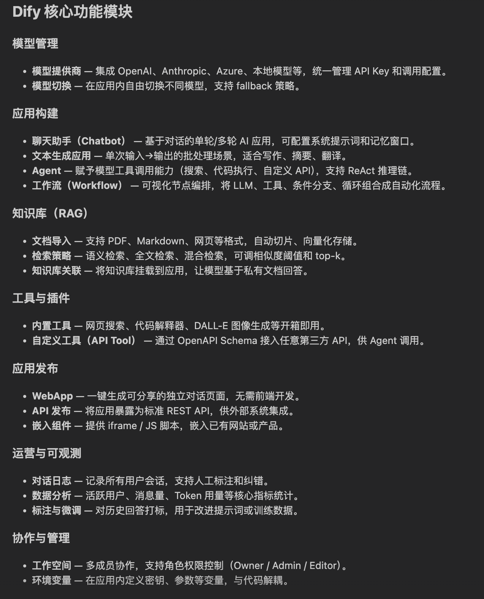
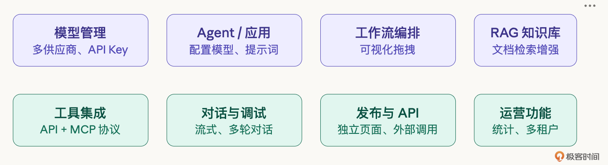
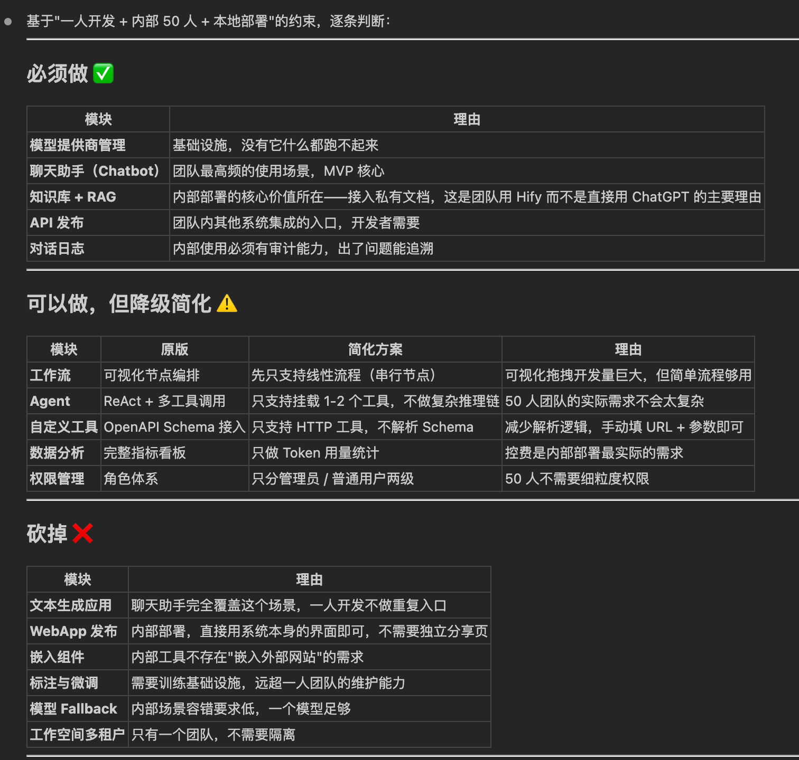
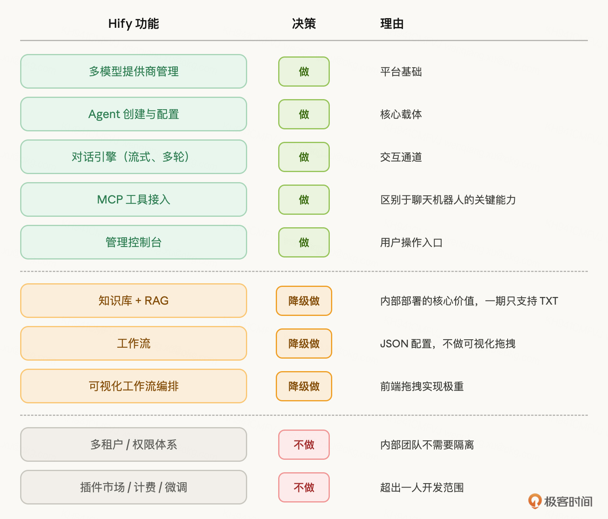
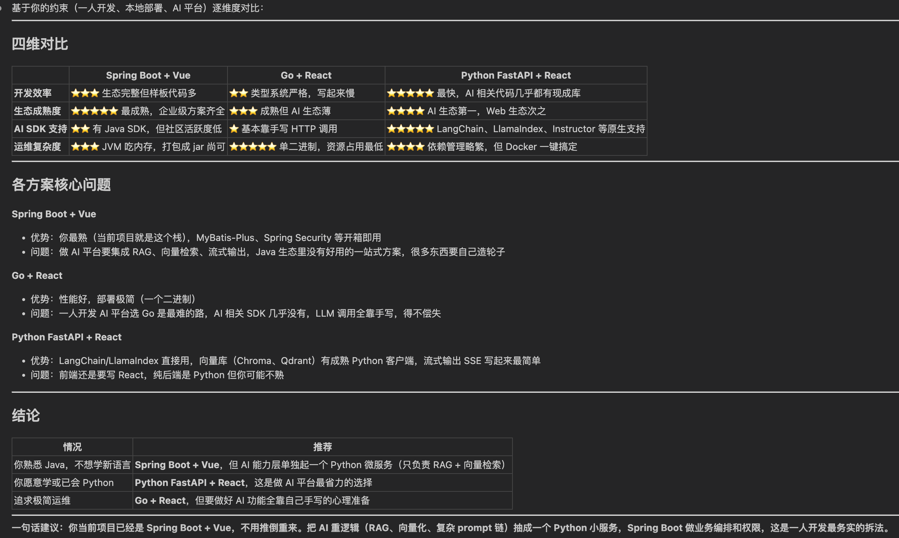

# 03｜产品定义：动第一行代码之前你该想清楚什么

你好，我是 Robert。

前两讲我们建立了认知框架和方法论。从这一讲开始，正式动手做项目。但 “动手” 不是 “写代码”。动手做的第一件事，是想清楚要做什么。

你可能觉得这不是已经定了吗？做一个简版 Dify，叫 Hify。但 “做一个简版 Dify” 这句话其实非常模糊。Dify 有几十个功能模块，你做哪些？不做哪些？目标用户是谁？部署在哪里？要扛多大的量？

这些问题不想清楚就开始写代码，会发生两件事：要么做着做着范围膨胀收不住，要么做到一半发现方向不对推倒重来。用 Claude Code 更危险，你说 “帮我做个 Agent 管理”，它可能顺手把权限体系、版本控制、审计日志全给你加上，因为 Dify 有这些。你没定边界，它就替你定了。

所以我们这节课要做的事情就是：在动第一行代码之前，把产品边界、技术选型、运维预期全部想清楚，写进 CLAUDE.md。

注意，产品定义这一阶段就可以用 AI，不是只有写代码时才用。每一步我都会展示怎么让 Claude Code 协助完成。

## 先搞清楚业界标杆在做什么

做任何项目之前，第一步不是想 “我要做什么”，而是看 “业界最好的在做什么”。不是要抄，而是要理解这个领域的全貌。你连全貌都没有，怎么知道哪些功能是核心、哪些是边缘？

我们的标杆是 Dify，但 Dify 的功能很多，自己一个个去翻文档和产品页面，效率很低。这一步我直接让 Claude Code 帮忙：

Claude Code 很快给出了一份结构化的功能清单。

可以看到，这个答案看起来很完整。如果是了解 Dify 的人，那么其实就会知道这份是比较完整的。但是，如果我们不了解 DIfy 呢？此时原则是：AI 给的信息不能直接信，你要验证。比如，我就拿着这个清单和 Dify 的官方文档、GitHub README 对了一遍，修正了几个过时的描述，补上了它遗漏的 MCP 协议支持。

最终梳理出的 Dify 功能全景：

- 模型管理：接入多个 LLM 提供商（OpenAI、Claude、Gemini、本地模型等），统一管理 API Key、模型参数、调用配额。
- 应用创建：用户可以创建不同类型的 AI 应用 —— 聊天助手、Agent、文本生成、工作流。每个应用可以配置模型、提示词、工具。
- 工作流编排：可视化拖拽界面，把多个节点（LLM 调用、条件判断、代码执行、HTTP 请求）串成一个工作流。这是 Dify 的招牌功能。
- RAG / 知识库：上传文档，自动切片、向量化、存储。对话时自动检索相关内容作为上下文。
- 工具集成：内置和自定义工具，Agent 可以在对话中调用。支持 API 工具和 MCP 协议。
- 对话与调试：完整的对话界面，支持流式响应、多轮对话。有调试模式可以看到推理过程。
- 发布与 API：每个应用可以发布为独立页面或 API，供外部系统调用。
- 运营功能：用量统计、日志追踪、成员管理、API Key 管理、多租户隔离。

看完这个清单，你就理解为什么 “做一个简版 Dify” 这句话很模糊了 —— 随便拎出一块都能做几周。

## 从 Dify 到 Hify：功能取舍

功能全景有了，接下来是最关键的一步：做哪些、不做哪些。

我先让 Claude Code 做一轮初步分析：

Claude Code 给了一份很有结构的分析：

你会发现 Claude Code 输出，不是简单的 “做 / 不做” 二分法，而是分成了三档：必须做、降级简化、砍掉。这个分档方式本身就有价值，我自己一开始想的是二分法。

它的分析里有一个判断让我重新思考了：

知识库 + RAG。我原本打算砍掉，整条链路太长，一个人做周期太长。但 Claude Code 指出：“接入私有文档，这是团队用 Hify 而不是直接用 ChatGPT 的主要理由。” 它说得对，如果只能通用对话，团队直接用 ChatGPT 就行了。私有知识的接入才是内部部署的核心价值。采纳，但降级：一期只支持 TXT 文档，分块用最简单的固定长度。

工作流也是类似的思路，不做可视化拖拽，只支持 JSON 配置的线性流程 + 条件分支，覆盖 “问题分类→走不同路径” 这种最常见场景。

当然也有我不同意的。它建议做两级权限（管理员 / 普通用户），但 50 人内部团队大家互相认识，在系统外约定就行，不值得为此每个功能都多一层权限逻辑。否决。

Claude Code 的分析帮我拓宽了思路，但最终取舍还是我基于自己的约束来做。这里我总结了一个方法论，叫做“三问裁剪法”。

第一问：没有它产品还成立吗？区分核心和边缘。模型管理、Agent 配置、对话引擎、工具集成、管理控制台，这五个砍掉任何一个产品都不成立。知识库和工作流砍掉产品能用但价值大打折扣，降级做。可视化拖拽、多租户、插件市场、计费，砍掉不影响核心链路。

第二问：做到什么程度够用？核心功能不做满。模型管理只做 CRUD + 连通性测试。Agent 配置只做选模型、绑工具、设提示词。对话引擎只做流式 + 多轮。知识库只支持 TXT + 固定分块。工作流只支持 JSON 配置。管理控制台能用就行不追求精美。

第三问：能不能一句话说清楚？Hify：一个可本地部署的 AI Agent 开发平台，支持多模型管理、Agent 配置、知识库 RAG、简版工作流、对话交互和 MCP 工具接入，面向团队内部小规模使用。

然后我就整理出了最终功能清单：

## 技术选型：匹配定位，不追新

功能范围定了，接下来选技术栈。我同样让 Claude Code 参与：

Claude Code 给了一份四维度对比:

你会发现结论很明确：Python FastAPI 在 AI 生态上碾压其他两个 ——LangChain、LlamaIndex，向量库客户端都是 Python 原生的，Java 和 Go 在这方面差距很大。它推荐 FastAPI，还给了一个折中方案：Spring Boot 做业务编排，AI 重逻辑（RAG、向量化）抽成一个 Python 小服务。

这个折中方案思路不错，但我不同意。一个人维护两套技术栈（Java + Python），两个服务之间还要做通信、部署、调试，复杂度翻倍。一个人开发最忌讳的就是技术栈分裂。

我追问了一句：

它的分析很诚实：FastAPI 在这些方面需要自己搭建更多基础设施，Spring 的生态已经把这些都解决了。

我的判断：选 Spring Boot + Vue，不拆 Python 服务。理由有三个。

- 我最熟这个栈，一个人开发效率第一。
- AI SDK 用 Java 版本够用，OpenAI、Claude 都有 Java SDK，RAG 的向量化调 API 就行，不依赖 LangChain。
- 一个人一套技术栈，不分裂。

AI 生态的劣势确实存在，但工程化能力和技术栈统一性的优势更大。技术选型不是选最好的技术，是选最匹配当前约束的技术。

最终技术栈：

- 后端：Spring Boot 3.x + MyBatis-Plus + MySQL 8.x + Redis 7.x。工程化成熟，一个人能快速交付完整系统。
- 前端：Vue 3 + TypeScript + Element Plus。管理后台场景成熟度最高。
- 容器化：Docker + Docker Compose。最稳、最简。

## 提前想清楚怎么跑

很多人做项目只想功能，不想运维。功能做完了往服务器上一扔，等出问题了才发现很多事没有提前想。

这一步我先自己想一遍，然后让 Claude Code 帮我查漏补缺：

Claude Code 给的分析很实在。几个关键结论：

- QPS 极低，瓶颈不是并发。50 人在线，活跃率 60%，每人每分钟 2 条消息，峰值也就 1 QPS，加上 RAG 检索等内部调用放大 3 倍，也就 3-5QPS。Spring Boot 单实例轻松应对。真正的瓶颈是 LLM 响应延迟（3-30 秒 / 次）占用连接 —— 这不是 QPS 问题，是长连接管理问题。
- SSE 长连接是唯一需要认真对待的压力点。50 个并发 SSE 连接，每个持续 10-30 秒，意味着 50 个线程被长期占用。Spring Boot 默认 200 线程够用，但要注意：用 SseEmitter 不要用普通 ResponseBody 阻塞线程，设 60 秒超时防止僵尸连接，Nginx 反向代理缓冲（proxy_buffering off）否则流式数据会被攒批再发。这几个坑我自己没全想到，尤其是 Nginx 缓冲那个 —— 不关的话用户看不到打字机效果，要等 LLM 全部输出完才一次性吐出来。
- 缓存策略简单直接。模型提供商配置和 Agent 配置变更频率极低，用 Redis 缓存。LLM 响应不要缓存 —— 同一问题不同时间答案可能不同。对话历史直接读数据库，50 人规模数据量小，缓存收益不大。
- 数据持久化是硬性要求。MySQL 数据目录、向量数据库数据目录、上传的文档文件 —— 必须挂载 volume，容器内不存储任何数据。这条看起来是常识，但真有人忘了挂载，容器一重启数据全没了。

这里有一个环节很重要，你得看得懂上面四个建议。如果你看不懂，那么其实整个项目就会失控。比如因为短期 QPS 不高，我放弃了做缓存，因为缓存会增加开发的复杂度。

最终的运维预期：

- 部署方式：Docker Compose 一键启动。JVM 内存设上限（-Xmx512m），防止容器被 OOM Kill。
- 用户量：20-50 人同时在线，单机部署够用。
- QPS：峰值 3-5QPS，瓶颈在 LLM 长连接不在并发。
- 监控：起步用 Spring Boot Actuator + 日志，后期接 Prometheus + Grafana。
- 扩容：一期单机。架构上不堵死扩容的路 —— 第 04 讲会做模块化设计，为后续拆分留口子。

这些判断不需要很精确，但它们会反向影响技术选型和架构决策。比如 “瓶颈在长连接不在并发” 这个判断，直接决定了第 04 讲 LLM 调用要用独立线程池做隔离。“一期单机” 这个判断，决定了不需要微服务。所以，运维预期不是项目最后才想的事，它从一开始就在影响你的每一个设计决策。

## 写进 CLAUDE.md

前面想清楚的所有东西，产品定义、功能范围、技术选型、运维预期，都要落成文字，写进 CLAUDE.md。

这一步也让 Claude Code 帮忙：

它生成了一版初稿，我检查修改后定稿：

CLAUDE.md 不是一次性写好就不动了。随着项目推进，你对产品的理解会加深，可能会调整功能范围、改变技术决策。每次有变化，回来更新。这和第 02 讲的 SDD 闭环是一样的道理，规范是活的。

## 总结

这节课我们做了一件事：在动第一行代码之前，把产品的边界想清楚了。

你会发现，这其实是一个问对问题、鉴别问题的过程。其实最难的是这一步，怎么问对问题，怎么鉴别问题。这都是需要积累的。这一点，这门课不能帮到你太多，只能尽量告诉你我是怎么想的。而在举一反三的过程，需要你不断的学习、积累和反思。

整个过程五步：调研标杆（让 Claude Code 梳理 Dify 功能全景）→ 功能取舍（三问裁剪法，Claude Code 做初筛你拍板）→ 技术选型（Claude Code 做方案对比，你基于约束选择）→ 运维预期（Claude Code 帮你查漏补缺）→ 落成文字（写进 CLAUDE.md）。

几个小时就能完成，但能帮你在后面几周的开发里避开大量弯路。而且你注意到了，整个过程中 Claude Code 都在协助你，但没有一步是它替你做决策的。它梳理了 Dify 的功能清单，你来验证修正。它建议保留 RAG，你否决了。它推荐 FastAPI，你选了 Spring Boot。每一步的最终判断都是你做的。

你做任何项目，都可以按这五步走一遍。Hify 的具体定义是我们这个项目的，你照搬没用，但这五步的拆解思路是通用的。

下一讲，我们进入架构设计 —— 模块怎么分、数据怎么流转、外部调用怎么处理。

## 思考题

如果你要做的不是 Agent 平台，而是你自己工作中真正需要的一个系统，试着用今天的五步走一遍。特别是第二步的三问裁剪法，花 10 分钟列出 “做什么” 和 “不做什么” 的清单。你会发现很多你以为 “肯定要做” 的功能，用第一个问题一过滤就可以砍掉。如果你在某一步用了 Claude Code 辅助，把你的指令和它的输出也分享出来，我们一起看看它给的建议靠不靠谱。

期待你的分享。如果今天的课程让你有所收获，也欢迎转发给有需要的朋友，邀请他来一起学习，我们下节课再见！

