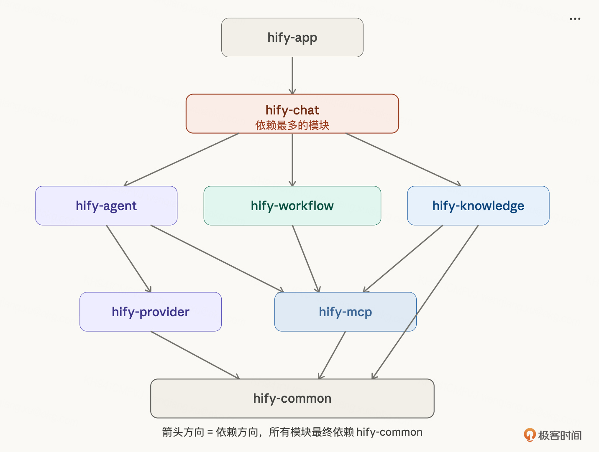
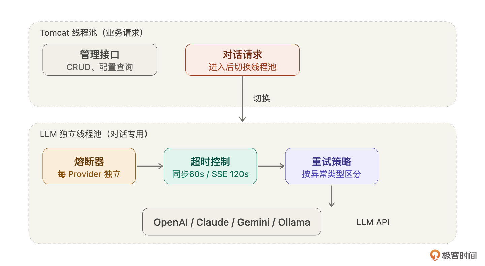

# 04｜架构设计（上）：应用架构与代码组织

你好，我是 Robert。

上一讲我们定义了 Hify 的产品边界和技术栈。这一讲回答一个更具体的问题：代码怎么组织、外部调用怎么处理？

很多工程师拿到需求直接开始写代码，写到一半发现模块之间耦合得死死的、线程池被 LLM 调用占满了管理页面打不开、不同模块的代码风格完全不一样。这些问题不是写代码的问题，是动手之前没想清楚应用架构。

这一讲和下一讲合起来是 Hify 的完整架构设计。这一讲（上篇）聚焦代码层面 —— 模块怎么分、Spring 代码怎么组织、外部调用怎么处理。下一讲（下篇）聚焦系统层面 —— 怎么部署、瓶颈在哪、未来怎么扩展、数据怎么存。

## 应用架构：模块化单体

第一个问题：一个 Spring Boot 应用，内部怎么组织？

第 03 讲已经确定了一期 50 人单机部署。但单机不等于所有代码堆在一个 package 里。我让 Claude Code 给方案：

Claude Code 给了三个方案：

- 方案 A：按 package 分层。所有功能放在一个模块里，按 controller/service/mapper 分 package。最简单，但所有功能混在一起，后面代码量大了找文件费劲，想拆分也拆不动。
- 方案 B：Maven 多模块，按功能拆。一个 Spring Boot 应用，内部按 Maven 多模块组织，每个功能一个模块。模块之间通过接口调用，代码层面严格隔离。后续想拆分成微服务，只需要把接口调用改成远程调用，模块内部不用动。
- 方案 C：微服务。每个功能一个独立服务，通过网关路由，服务间 Feign 调用。

它推荐了方案 C，理由是方便独立扩展。

我追问：

它承认了，说一人开发建议方案 B。我的判断：选方案 B，模块化单体。一个人维护一个应用比维护六七个微服务轻松太多。但代码上做好模块隔离，后续需要拆分时成本可控。

最终的模块划分：

模块之间的依赖关系需要想清楚。我让 Claude Code 分析：

它给的分析：hify-chat 是依赖最多的模块 —— 对话时要读 Agent 配置（依赖 hify-agent）、调模型（依赖 hify-provider）、可能走工作流（依赖 hify-workflow）、可能做 RAG 检索（依赖 hify-knowledge）、可能调工具（依赖 hify-mcp）。hify-agent 依赖 hify-mcp（Agent 要绑工具）和 hify-knowledge（Agent 要绑知识库）。所有模块依赖 hify-common。

关键原则：依赖是单向的，不能循环。 hify-chat 可以依赖 hify-agent，但 hify-agent 不能反过来依赖 hify-chat。如果出现循环依赖，说明模块边界划错了，需要把共用的部分下沉到 hify-common。

## Spring 代码组织规范

这一节很多人觉得没必要讲，Controller、Service、Mapper 三层架构，谁不知道？

人写代码确实不需要讲。你凭经验和习惯，自然知道业务逻辑放 Service 里、Controller 只做参数校验。但 AI 不知道。你不告诉它规矩，它可能把事务管理写在 Controller 里、把数据库查询写在 DTO 里、直接引用另一个模块的 Mapper 把两个模块焊死。

这些规范不是写给人看的，是写给 Claude Code 看的。后面每一行代码都是它生成的，这些规矩定不好，生成出来的代码越多越乱。

我让 Claude Code 帮我梳理：

它给了一版，我调整后定稿（这里为了省篇幅，在一些较简单的场景就不贴 Claude 的输出了，后面在实操课统一演示），每个业务模块内部统一结构：

每一层的职责边界：

- Controller 只做两件事：参数校验和调用 Service。不写业务逻辑、不做数据查询、不处理事务。为什么要这么严格？因为 Claude Code 特别喜欢在 Controller 里 “顺手” 加逻辑，它觉得方便，但你后面测试、重构、拆分全部受影响。
- Service 处理所有业务逻辑，包括事务管理、数据校验、业务规则。Service 之间可以互相调用，但只能调接口（interface），不能直接 new 实现类。
- Mapper 只做数据库操作。不要在 Mapper 的 XML 里写业务逻辑（比如复杂的条件判断），那是 Service 的事。
- Entity 和数据库表一一对应。DTO 是给接口用的请求 / 响应对象。Entity 和 DTO 之间要做转换，不要把 Entity 直接返回给前端 ——Entity 里可能有敏感字段（API Key），DTO 可以控制暴露哪些字段。

跨模块调用规则：这条是模块化单体最关键的规范。模块之间只能通过 Service 接口调用，不能直接引用另一个模块的 Mapper、Entity 或内部类。

为什么？因为我们选模块化单体的一个重要理由是 “后续能拆分”。如果 hify-chat 直接引用了 hify-agent 的 Mapper，两个模块就焊死了 —— 拆分时你要把所有这种引用找出来改成远程调用。但如果只通过 Service 接口调用，拆分时只需要把本地调用改成 HTTP / RPC 调用，接口签名都不用变。

我追问 Claude Code：

它分析了一下：Service 接口不变，实现类里的本地调用改成 Feign 调用，加上网络异常处理。每个跨模块调用点改两三行代码。改动量可控。

这就验证了这套规范的合理性。这里我标注下，能考虑到未来的拆分主要靠的是自己的项目经验，我希望你可以记下这个，就当积累一个经验。

## 外部调用设计

Hify 最大的技术挑战不在 CRUD，在外部 LLM 调用。第 03 讲运维预期已经指出：瓶颈不在并发，在 LLM 长连接占用线程。这一节把这个问题的解决方案定下来。

LLM API 调用有三个特点：慢（一次对话 3-30 秒）、不稳定（随时可能超时、限流、报错）、多供应商（每家行为不一样）。不提前设计好，上线就炸。

我让 Claude Code 系统性地分析：

它给的方案很全面，我逐个判断：

- 线程池隔离 —— 同意。LLM 调用必须用独立线程池，不能和 Tomcat 的业务线程池共用。第 03 讲分析过：50 个并发 SSE 连接，每个持续 10-30 秒，如果共用线程池，管理页面的请求排在队列里等，用户看到的就是页面一直转圈。独立线程池解决这个问题 —— 对话请求用自己的池子，管理请求用 Tomcat 默认的池子，互不影响。
- 熔断机制 —— 同意。某个 LLM 提供商连续失败时，快速熔断，后续请求直接返回错误，不浪费时间等超时。Claude Code 建议 Resilience4j，每个提供商独立熔断器 ——OpenAI 挂了不影响 Claude。合理。
- 超时控制 —— 同意，但我追问了细节。它建议对话接口 60 秒超时，连通性测试 10 秒。我追问：流式响应场景下，一个 SSE 连接可能持续一两分钟，60 秒会不会把正常对话切断？它调整了：SSE 连接超时设 120 秒，普通同步调用 60 秒。合理。
- 重试策略 —— 同意，细节有价值。不是所有失败都值得重试。网络抖动重试有意义，认证失败重试没用（重试一百次还是认证失败），限流需要退避重试（等一等再试）。按异常类型区分重试策略，这个细节 Claude Code 给得很好。

我又追问了一个它没主动提到的问题：

它建议 WebFlux 做异步非阻塞。我不同意 —— 第 03 讲已经确定不引入额外技术栈。SSE 场景用 Spring MVC 的 SseEmitter 就够，配合独立线程池和 120 秒超时，50 人完全能扛。不为了 “技术上更优雅” 引入一套新的编程模型。

## 写进 CLAUDE.md

这一讲的所有决策写进 CLAUDE.md：

到这里，CLAUDE.md 包含了项目概述（第 03 讲）和应用架构（本讲）。Claude Code 对代码怎么写、放在哪、外部调用怎么处理已经有了完整的约束。

## 总结

这一讲做了三件事：确定了模块化单体的应用架构，定义了 Spring 代码组织规范，设计了外部调用处理方案。

回顾整个过程，最有价值的不是最终方案，而是和 Claude Code 的追问环节。它推荐微服务，被我用 “一个人维护太重” 否决了。它建议 WebFlux，被我用 “不增加技术栈复杂度” 否决了。它给的超时时间对 SSE 不够用，被我追问后调整了。

每一次追问的背后，都是你在用项目的真实约束来修正 AI 的通用建议。AI 给的是技术上最优的方案，你要基于约束选对你最优的方案。这两者经常不一样。

还有一点值得强调：代码组织规范看起来是常识，但对 AI 写代码来说是刚需。人凭习惯知道 Controller 不写业务逻辑，AI 不知道。你不告诉它，它就按自己的理解来，而且每次理解都不一样。这些规范现在花半小时定好，后面几百次代码生成都受益。

到这里，你可能会说我没有架构知识，不知道要问什么问题。那我想说，你以前没有，当看完这节课不就有了吗？你或者可以把这节课当作一个实践的架构课。记下来我们怎么思考的，以后就有经验了，知道怎么问问题了。

所以你在学这节课的时候得去思考我为什么这么问。而作为你自己，你会想到这么问吗？如果你不会这么问，那么就记住，以后这么问。这就是我说的方法论。

下一讲继续架构设计下篇 —— 部署架构、性能瓶颈预判、扩展方案、数据模型。从代码层面进入系统层面。

## 思考题

看看你手头正在做的项目，问自己两个问题：

- 你的模块之间是通过接口调用还是直接引用内部类？如果要把某个模块拆成独立服务，改动量大概多大？
- 你的外部调用（数据库、第三方 API、消息队列）有没有做线程池隔离？如果某个外部服务卡了 30 秒，你的系统会怎样？

结合这两个问题让 Claude Code 帮你分析一下你当前项目的情况。

期待你的分享。如果今天的课程让你有所收获，也欢迎转发给有需要的朋友，邀请他来一起学习，我们下节课再见！

