# 05｜架构设计（下）：部署架构、性能预判与数据设计

你好，我是 Robert。

上一讲我们定了代码层面的架构，包括模块怎么分、代码怎么组织、外部调用怎么处理。这一讲进入系统层面：当前怎么部署、瓶颈在哪、未来怎么扩展、数据怎么存。

很多工程师觉得部署是上线前的事。但部署架构从第一天就在影响你的设计决策 —— 缓存放哪、数据库怎么连、服务之间怎么通信，全都取决于你的部署形态。提前想清楚，后面不返工。

## 当前部署架构：50 人规模

先把当前的部署全貌画出来。我让 Claude Code 帮我梳理：

Claude Code 给的架构总结很清晰:

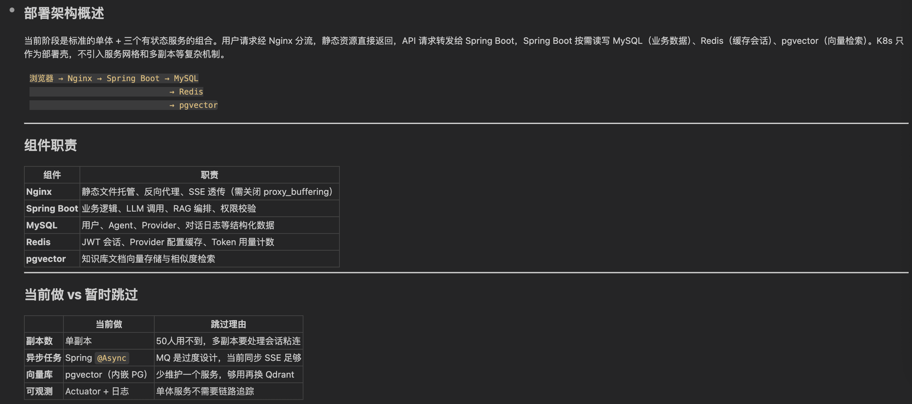

Claude Code 回答是标准的单体 + 三个有状态服务的组合。用户请求经 Nginx 分流，静态资源直接返回，API 请求转发给 Spring Boot，Spring Boot 按需读写 MySQL（业务数据）、Redis（缓存会话）、pgvector（向量检索）。K8s 只作为部署壳，不引入服务网格和多副本等复杂机制。

请求流转链路：

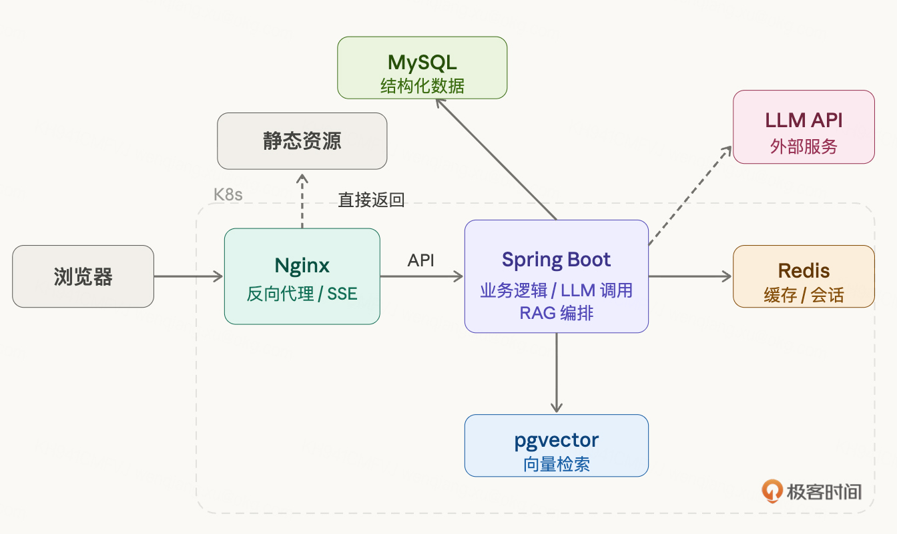

各组件职责：

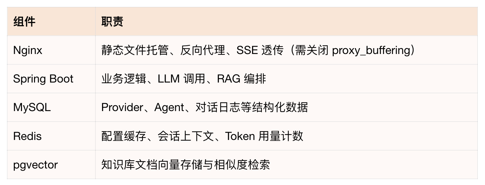

Claude Code 还给了一个很有价值的对比 —— 当前阶段该做什么、暂时跳过什么：

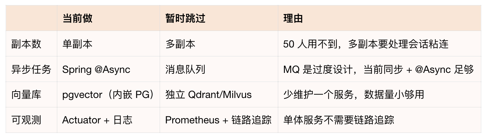

第二张表是我觉得 Claude Code 这次分析最有价值的部分 —— 它不只告诉你 “现在长什么样”，还帮你划了一条 “现在做” 和 “以后做” 的线。每个 “暂时跳过” 都有明确理由，不是偷懒，是一期确实不需要。等触发条件到了（用户量上来、数据量变大），再逐步加。

在这一步，Claude Code 给了一个挺不错的架构，没什么大问题，基本就是我们要的。

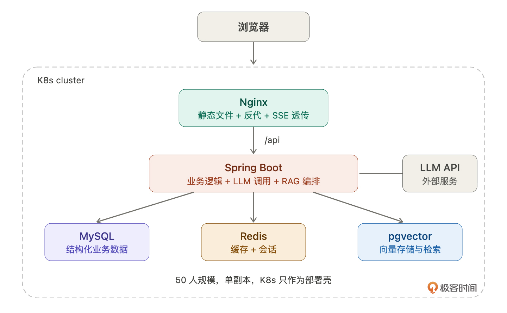

但是其实还是需要你的积累和判断，因为这个部署架构较为简单，如果是更复杂的架构，就需要我们去调整，也就是需要积累。无脑让 AI 完全实现一个应用，我认为当前阶段还是达不到的。

这里扩展一个点：我觉得以后程序员的价值在于思考、拆解、边界判断等架构层面的能力。说实话，这个要求比之前高多了。也就呼应了第 01 讲，我们需要是一个架构师，不应该是一个写代码的程序员。

## 性能瓶颈预判

大部分工程师不会提前想性能瓶颈，等出了问题再救。但你作为架构师，应该在设计阶段就知道瓶颈可能在哪。即使一期不处理，也要做到心里有数。

这一步特别适合让 Claude Code 帮你分析：

Claude Code 的输出如下：

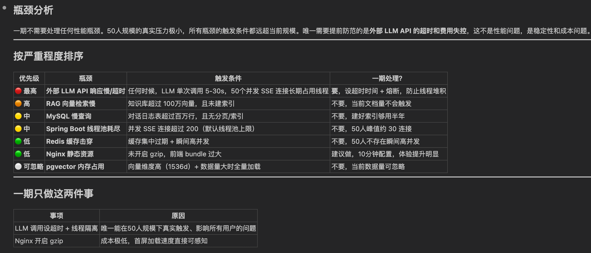

Claude Code 的结论很直接：一期不需要处理任何性能瓶颈。50 人规模的真实压力极小，所有瓶颈的触发条件都远超当前规模。唯一需要提前防范的是外部 LLM API 的超时和费用失控 —— 这不是性能问题，是稳定性和成本问题。

它按严重程度排了序：

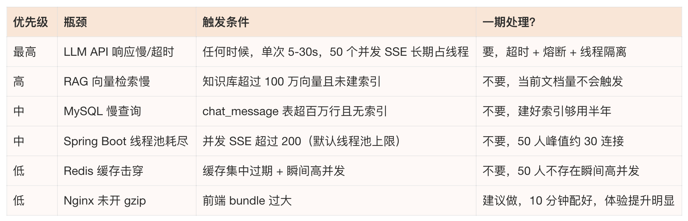

看这张表你会发现，真正在 50 人规模下能触发的只有第一行 ——LLM 调用慢且占线程。其他瓶颈的触发条件都是百万级数据或几百人并发，离我们很远。

所以一期只做两件事：

- LLM 调用设超时 + 线程隔离 + 熔断。这是唯一能在 50 人规模下真实触发、影响所有用户的问题。第 04 讲已经设计好了方案（独立线程池、Resilience4j、超时控制），后面实现时落地就行。
- Nginx 开启 gzip。成本极低（一行配置），首屏加载速度直接可感知。

其他瓶颈全部标记 “已知但暂不处理”。不是忽略，是时机未到。等触发条件到了（数据量上来、用户量上来），你第一时间知道该动哪里 —— 因为这张表就是你的地图。

这一节的价值不在于解决了什么问题，在于你脑子里有了一张系统 “软肋” 地图。后面出了性能问题，你不用猜，查表就行。而这张表不需要你自己从零分析，给 Claude Code 你的架构图，它几分钟就能帮你画出来。

## 扩展架构：几千人规模

一期 50 人，但如果 Hify 做得好，可能要推广到更大范围。架构上不能堵死这条路。但也不能提前演进，过早优化比性能瓶颈本身的破坏力更大。

我让 Claude Code 设计演进路径：

Claude Code 给了三个阶段：

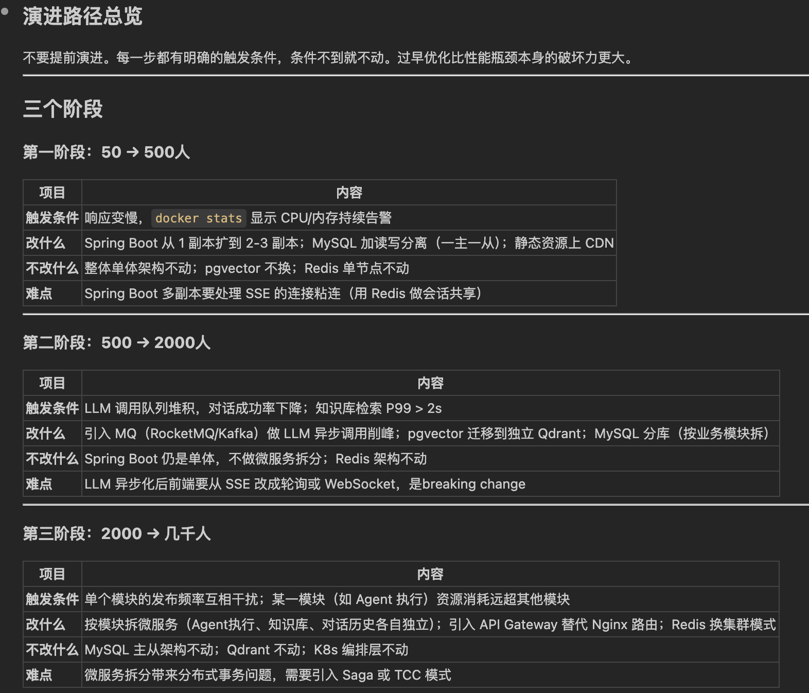

如上图所示：每个阶段有明确的触发条件，条件不到就不动。我们来总结下：

- 第一阶段：50 → 500 人

触发条件：响应变慢，docker stats 显示 CPU / 内存持续告警。

改什么：Spring Boot 从 1 副本扩到 2-3 副本；MySQL 加读写分离（一主一从）；静态资源上 CDN。

不改什么：整体单体架构不动，pgvector 不换，Redis 单节点不动。

难点：Spring Boot 多副本要处理 SSE 的连接粘连 —— 用户的流式对话不能被负载均衡随机分发到不同实例。解决方案是用 Redis 做会话共享。

- 第二阶段：500 → 2000 人

触发条件：LLM 调用队列堆积，对话成功率下降；知识库检索 P99 > 2s。

改什么：引入消息队列（RocketMQ / Kafka）做 LLM 异步调用削峰；pgvector 迁移到独立 Qdrant；MySQL 按业务模块分库。

不改什么：Spring Boot 仍是单体不做微服务拆分，Redis 架构不动。

难点：LLM 异步化后，前端要从 SSE 改成轮询或 WebSocket，是 breaking change。这个改动成本不低，所以不到触发条件不做。

- 第三阶段：2000 → 几千人

触发条件：单个模块的发布频率互相干扰；某一模块（如 Agent 执行）资源消耗远超其他模块。

改什么：按模块拆微服务（Agent 执行、知识库、对话历史各自独立）；引入 API Gateway 替代 Nginx 路由；Redis 换集群模式。

不改什么：MySQL 主从架构不动，Qdrant 不动，K8s 编排层不动。

难点：微服务拆分带来分布式事务问题，需要引入 Saga 或 TCC 模式。第 04 讲定的 “跨模块走 Service 接口” 在这里发挥作用 —— 拆分时只改调用方式，接口签名不变。

三个阶段的对比总览：

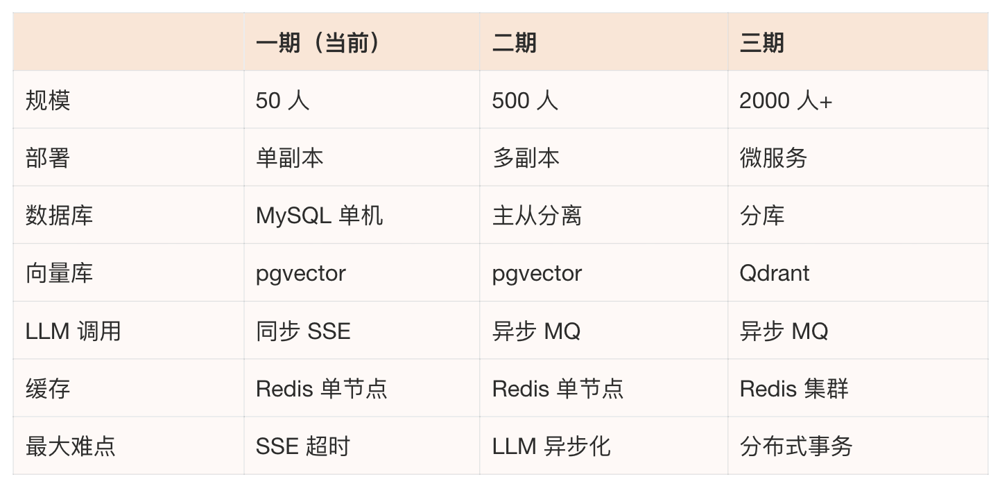

我们用一张图来总结下：

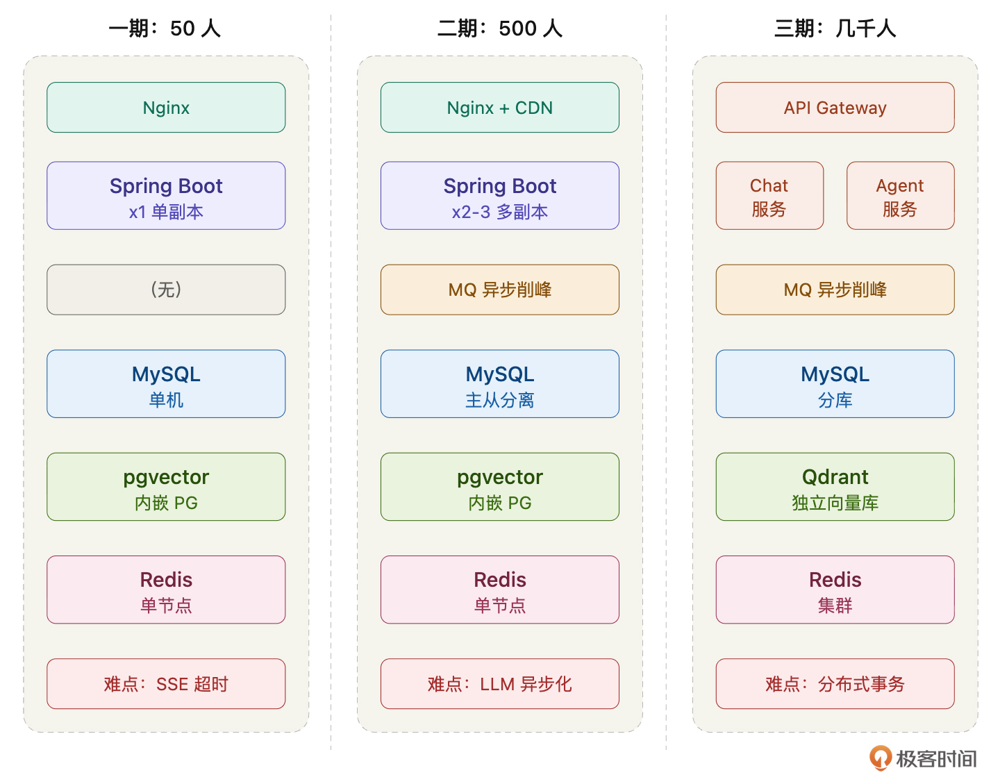

这张表就是你的扩展路线图。现在不做任何一步，但每一步的触发条件、改什么、难点在哪，全部清楚。而且你应该注意到了，第 04 讲的每个设计决策都在为这条路径留口子：模块化单体让第三阶段的微服务拆分成本可控，接口隔离让调用方式可以平滑切换，会话存 Redis 让第一阶段的多副本不需要改代码。

架构设计的功力不在于现在做多复杂，在于现在做的每个决策都不堵未来的路。

## 数据模型概览

核心表有哪些、关系怎么样，先列出来。具体字段设计等后面每个模块开发时再定，现在定太细了后面一定会改。

Claude Code 给了一份完整的梳理，我确认后定稿。按功能域分组：

- 模型管理：model_provider（提供商）→ model（具体模型），一对多。一个 OpenAI 下有 GPT-4o、GPT-3.5 多个模型。
- 知识库：knowledge_base → document → document_chunk，一对多链。document_chunk 是向量化的最小单位，存在 pgvector 里。
- 工具：tool，独立表，存 MCP 工具定义。
- Agent：agent 是关联最多的表，agent → model（多对一，选一个模型），agent ↔ knowledge_base（多对多，通过 agent_knowledge_base），agent ↔ tool（多对多，通过 agent_tool）。
- 工作流：workflow → workflow_node，一对多。workflow_node 里的 LLM 节点也关联 model。
- 对话：conversation → message，一对多。conversation 关联 agent 或 workflow（对话绑定的执行对象）。message → document_chunk 多对多（通过 message_reference，做 RAG 溯源 —— 回答引用了哪些知识库片段）。
- 用户：user 和 api_key。user 发起 conversation，api_key 用于 API 发布调用。

关系汇总：

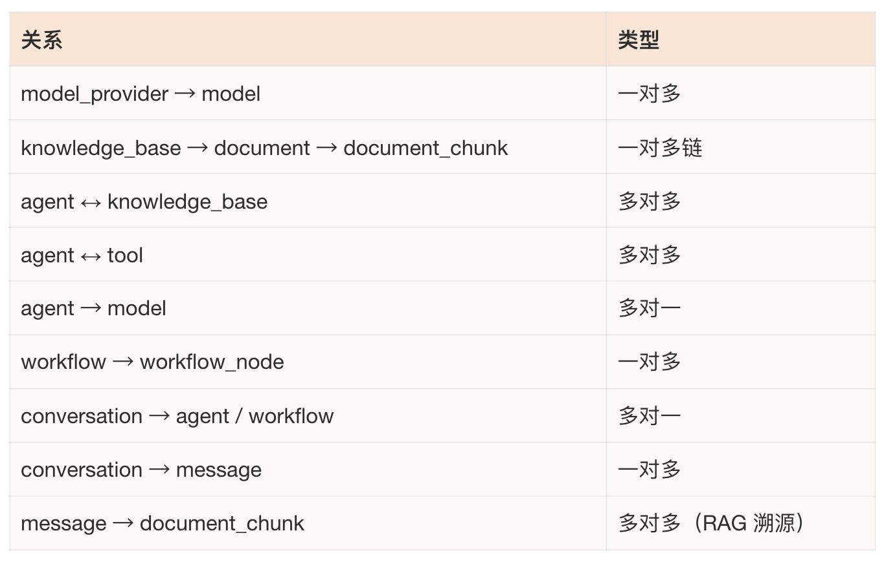

总共约 16 张表。看着多，但按功能域分组后每组就两三张，结构清晰。

说实话，Claude Code 设计的这个表结构比我想的完整得多，比我设计的好，设计的快。AI 很适合这种模板化的任务。

这里想说，你要学会的一个点是：你要清晰地知道 AI 能干什么，干什么干的好，而你要做什么。我们跟 AI 不是敌人，不是竞争者，而是合作伙伴。我们要学会的是和它一起协作，释放我们自己最大的效率，从而给我们自己带来更大的现实收益。

有一个设计决策值得说明：message_reference 这张表，它记录的是 “这条 AI 回复引用了知识库的哪些片段”。很多人做 RAG 不存这个关系，回复完就丢掉了检索结果。但存下来有两个好处：一是用户可以看到 “AI 的回答依据是什么”，增加可信度；二是后续优化 RAG 效果时，可以回溯分析检索质量。一张中间表，成本很低，价值不小。

## 数据库性能规范

表结构后面再定，但数据库层面的规范现在就要定，后面 Claude Code 每次建表、写查询都要遵守。

Claude Code 给了一份非常详细的规范，包含了具体的建表示例。我逐块确认后定稿。

### 通用字段约定

所有表必须包含四个公共字段：

几条硬规矩：主键用自增 BIGINT，禁止 UUID（索引性能差）。禁止用 NULL，业务空值用空字符串或 0 代替。金额和 Token 用量用 BIGINT 存最小精度，不用 DECIMAL。枚举字段用 VARCHAR (32)，不用 MySQL ENUM 类型（ENUM 加值要改表结构）。你看，这是不是就是我们进入团队要学习的团队规范。

### 索引设计原则

Claude Code 给了五条具体规则，每条带示例。

第一，逻辑删除字段必须加进索引。几乎所有查询都带 deleted = 0，不加进索引等于索引白建。

第二，组合索引等值列在前，范围列在后。这是 MySQL 索引的基本原则，但不提醒 Claude Code，它自己写查询时经常不遵守。

第三，多对多关联表两个方向都要索引。agent_tool 表按 agent_id 查和按 tool_id 查都是高频操作，只建一个方向的索引，另一个方向就全表扫描。

第四，唯一约束用 UNIQUE INDEX，不要只在代码层校验。并发场景下代码校验有竞态问题，数据库约束才是最后防线。

第五，禁止在大文本字段建索引。content、prompt 这类 TEXT 字段不能建索引，需要全文搜索的场景后续引入 ES。

### 大表预判

Hify 中增长最快的两张表：

message 表：每次对话产生 2 - N 条记录，50 人每天几百到上千条。

应对：建好时间范围索引（conversation_id + created_at），预留按时间归档的能力。一期建好索引够用半年。

document_chunk 表：知识库分块数据，100 篇文档可能产生 5000+ 行。

应对：向量数据存 pgvector，MySQL 只存元数据和 vector_id（指向 pgvector 的记录），不在 MySQL 里存向量本身。

其他表（provider、agent、workflow）都是配置数据，增长慢，不需要特别关注。

### 分页查询规范

一期数据量小，OFFSET 够用。但规范先定好，Claude Code 知道用游标分页，后面数据量上来了不用改代码。管理后台必须用 OFFSET 的场景，限制最大页数（超过 10000 条直接提示缩小查询范围）。

还有一条：COUNT 查询单独处理，列表页只在第一页返回 total，翻页不重复查。这个细节 Claude Code 不说你很容易忽略，但它对大表的查询性能影响很大。

### pgvector 规范

向量数据单独存 PostgreSQL，和 MySQL 业务数据分离：

两条硬规矩：必须建 HNSW 索引（一期数据量小感知不到差异，但数据量上来后，没索引检索会从毫秒级变成秒级）。检索时必须加 LIMIT，禁止不加 LIMIT 的向量查询（全量排序会拖垮数据库）。

这些规范看起来是数据库基础知识，但你不写进 CLAUDE.md，Claude Code 建表时就不会自动加 deleted 进索引、不会考虑分页性能、不会预判大表问题、不会给 pgvector 建 HNSW 索引。写了，后面每一次建表、每一次写查询都自动遵守。

如果有心，你可以从上面的这个问题以及它的答案中，知道设计数据库表应该注意什么。我觉得这就是我们这节课的价值。问了问题，辨别答案，学习答案 —— 这才是把 AI 融入工作的核心思路。

## 写进 CLAUDE.md

这一讲的所有决策写进 CLAUDE.md：

到这里，CLAUDE.md 包含了项目概述（第 03 讲）、应用架构与代码组织（第 04 讲）、部署架构与数据库规范（本讲）。Claude Code 对 Hify 从代码怎么写到系统怎么跑都有了完整的认知。

## 总结

这一讲做了四件事：设计了当前部署架构，预判了性能瓶颈，规划了扩展路径，定义了数据模型和数据库规范。

最有价值的是性能瓶颈预判。大部分工程师不会提前想这个，觉得一期先跑起来再说。但你作为架构师，脑子里要有一张地图：瓶颈在哪、什么时候会触发、到时候改什么。有了这张地图，你对系统的掌控力完全不一样。而且这张地图不需要你自己从零画，让 Claude Code 基于你的架构分析，你判断它说得对不对就行。

另一个值得强调的点是数据库规范。这些内容（索引原则、分页注意事项、大表预判）对有经验的工程师来说是常识，但对 Claude Code 来说不是。你不写，它不会自动遵守。这些规范现在花 10 分钟定好，后面每一次建表、每一次写查询都受益。

上一讲解决了代码怎么组织，这一讲解决了系统怎么跑。两讲合起来就是 Hify 的完整架构设计 —— 从模块划分到部署形态到扩展路径到数据规范，一条线拉通。下一讲我们将进入规范体系搭建，手把手带你写完整的 CLAUDE.md，把前面所有决策结构化地沉淀下来。

## 思考题

让 Claude Code 帮你分析你当前项目的性能瓶颈。把你的部署架构描述给它，用了什么数据库、什么缓存、多大用户量、主要压力在哪，然后问 “这个架构的性能瓶颈可能在哪”，看看它指出的问题里有没有你之前没想到的。最后记得把它的分析和你的判断写在留言区。

期待你的分享。如果今天的课程让你有所收获，也欢迎转发给有需要的朋友，邀请他来一起学习，我们下节课再见！

