# 08｜工程初始化（上）：后端骨架与公共基础设施

你好，我是 Robert。

从这节课开始，我们正式进入工程部分。先来展示下 Hify 的本地工作界面吧，让你知道我们即将完成的软件系统是什么样子的。

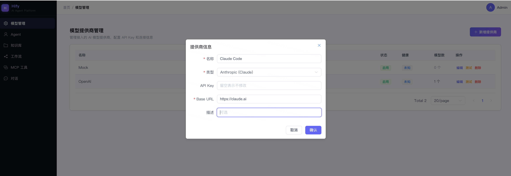

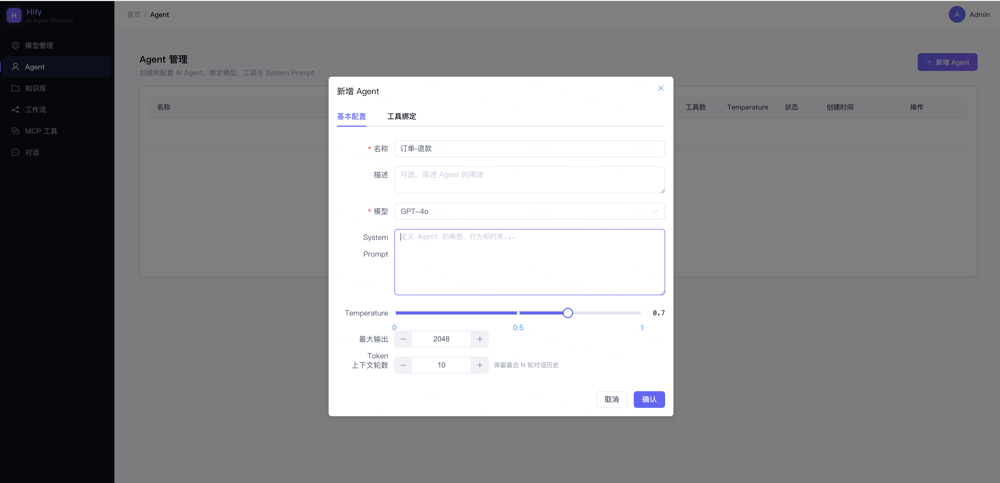

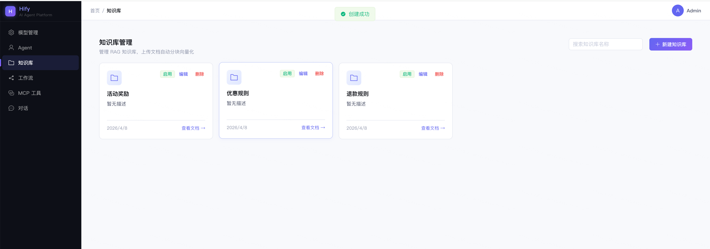

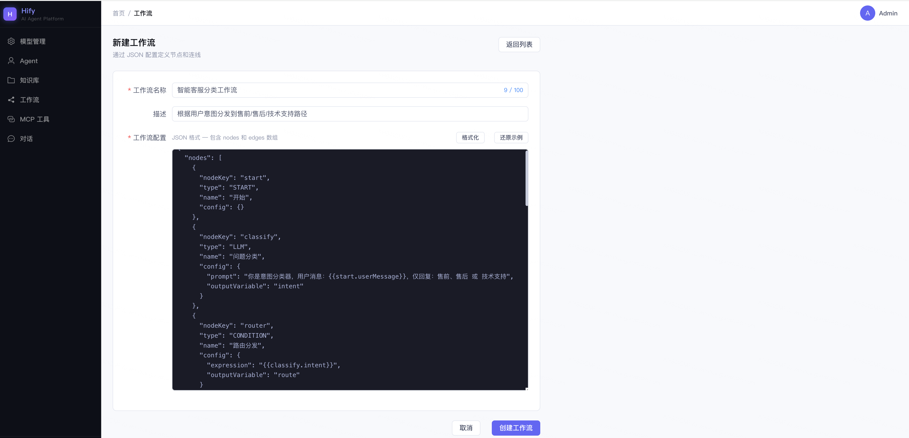

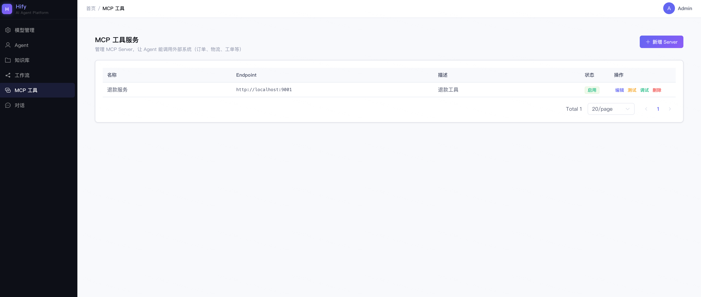

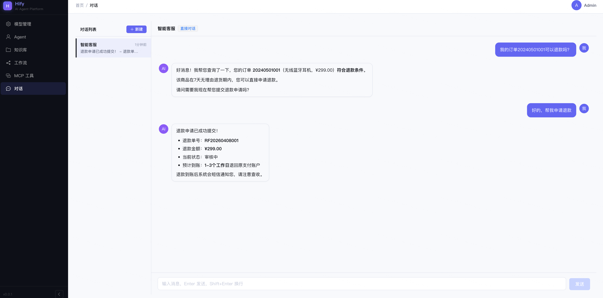

好，看完了效果，我们开始今天的课程内容。先回顾一下，04 讲我们定了模块化单体、Maven 9 个模块的应用架构，05 讲定了单机部署、线程池隔离、熔断策略的运行架构，06 讲把这一切写进了 CLAUDE.md。蓝图画完了，现在按图施工。

这一讲要做的事：让 Claude Code 搭建 Hify 后端的工程骨架。Maven 多模块结构、公共基础设施（统一响应、全局异常处理、MyBatis-Plus 配置、Redis 配置）、业务模块的空壳，全部就位。搭完之后，java -jar 能跑起来，访问健康检查接口返回 200。

前端工程和启动脚本放到下一讲。这一讲先把后端的地基打扎实。

## 先想清楚怎么拆

你可能会想：工程初始化不就是模板性工作吗？把 CLAUDE.md 喂给 Claude Code，说一句 “帮我初始化 Hify 后端项目” 不就完了？

我试过，效果不好。

Claude Code 一次性生成了几十个文件，看起来很完整。但仔细一看：父 pom 里的模块声明和实际目录不一致，hify-common 的依赖被写进了 hify-chat 的 pom 里，MyBatis-Plus 的版本和 Spring Boot 的版本有冲突，全局异常处理器和 Result 类用了两种不同的错误码格式。

问题不在 Claude Code 能力不够，是一次性生成的东西太多了，它没法保证所有细节都自洽。几十个文件之间有大量的依赖和关联，一个地方错了会连锁影响其他地方。而且生成量太大，你 review 起来也吃力，容易漏掉问题。

当然随着模型能力越来越强，这个问题也会慢慢解决甚至不存在。但是即使有那一天，我也是希望你能把后面的内容看完。因为我们要做的是一个可持续迭代的系统，而不是挑战 Claude Code 的能力。我希望你学到是 “道” 而不只是 “术”。

所以第一个方法论在这里出场：面对体量大的任务，要拆。

怎么判断该不该拆？两个标准：

- 标准一：生成的代码量是否超出你一次能 review 的范围。十几行代码，肉眼扫一遍就行，不用拆。几十个文件、几百行配置，一次看不过来，必须拆。
- 标准二：步骤之间是否有依赖关系。如果第二步依赖第一步的结果（比如业务模块的 pom 依赖公共模块的 pom），那就应该先完成第一步、验证正确，再做第二步。否则第一步错了，第二步会错得更离谱。

工程初始化两个条件都满足。所以我把它拆成四步：

- Maven 多模块骨架（父 pom + 子模块 pom + 目录结构）
- hify-common 公共基础设施（Result、BizException、全局异常处理、配置类）
- 业务模块空壳（每个模块的 package 结构和启动验证）
- 验收，启动项目，确认一切正常

为什么是这个顺序？依赖关系决定了顺序。Maven 骨架是所有东西的容器，必须先有。hify-common 被所有业务模块依赖，排第二。业务模块依赖 common，排第三。最后验收确认整体能跑。

先地基，后框架，最后验收。这个顺序不只适用于工程初始化，后面做任何模块都是这个思路。

## 分步搭建

### 第一步：Maven 多模块骨架

目标很明确：创建父 pom 和所有子模块的 pom，把目录结构搭出来，依赖关系配对。

给 Claude Code 的指令思路：

注意最后一句，“只创建 pom 和目录结构，不需要写 Java 代码”。这是控制范围的关键。不说这句，Claude Code 会顺手给你生成 Application 类、配置文件、甚至示例代码，和后面步骤冲突。

拿到输出后，重点检查三件事：

- 模块声明和目录结构是否一致。父 pom 里声明的 <modules> 列表和实际创建的目录要完全对应，一个不多一个不少。
- 依赖关系是否正确。hify-chat 的 pom 里应该有对 hify-agent 和 hify-provider 的依赖，hify-agent 的 pom 里应该有对 hify-mcp 的依赖。交叉检查，不要有多余的依赖，也不要有遗漏。
- 版本管理是否统一。Spring Boot、MyBatis-Plus、Redis 的版本号应该只出现在父 pom 的 <dependencyManagement> 里，子模块不重复声明版本。

这些都没问题，第一步完成。有问题让 Claude Code 改，不要手动改，让它按规范输出。

### 第二步：hify-common 公共基础设施

这一步是重中之重。hify-common 里的东西会被所有业务模块依赖 ——Result 类、异常处理、MyBatis-Plus 配置。这里出了问题，后面每个模块都会跟着错。

我把这一步进一步拆成五个小任务。前三个有依赖链（异常处理器依赖 Result 和 BizException），后两个相对独立。顺序还是按依赖关系排。

任务一：统一响应 Result 和分页 PageResult

Cluade 的指令是：

输出是：

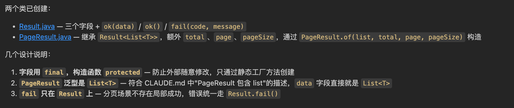

这个任务简单、边界清晰，Claude Code 基本不会出错。

任务二：错误码枚举和业务异常

Cluade 的指令是：

输出是：

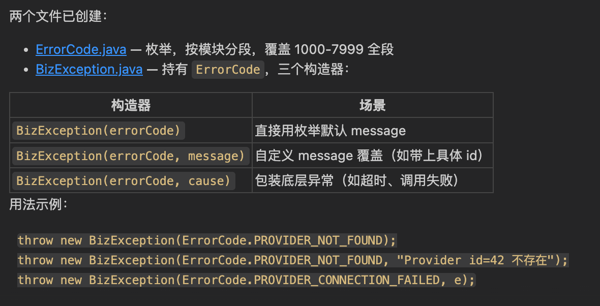

任务三：全局异常处理器

Cluade 的指令是：

输出是：

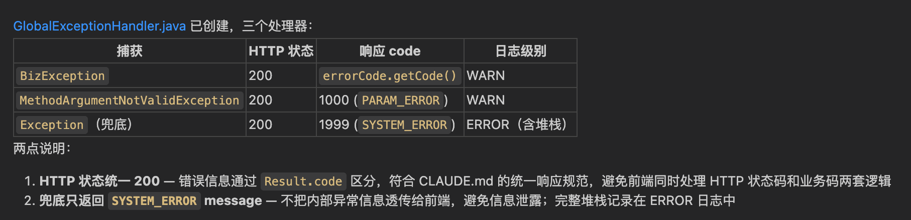

这个任务值得多说一点。我第一次让 Claude Code 生成这个处理器的时候，它在兜底的 Exception 处理里硬编码了 code: 500, message: "系统繁忙"，没有用 ErrorCode 枚举。功能上没问题，但违反了 CLAUDE.md 里定义的规范 —— 所有错误响应必须走 ErrorCode。

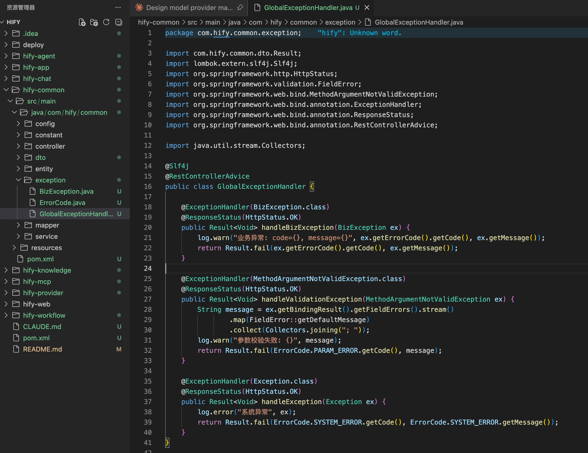

这就是 SDD 闭环在起作用的时刻。我让它改成 Result.fail(ErrorCode.INTERNAL_ERROR)，然后在 CLAUDE.md 的行为指令里补了一条：“异常处理必须使用 ErrorCode 枚举，禁止硬编码错误码和错误信息。” 下次再让它写类似代码，这个问题就不会重复出现。

每次 AI 跑偏，不只是改掉当前的错，更要把规范补上，堵住同类问题的口子。这就是 SDD 闭环的日常运转 —— 定规范、AI 执行、发现偏差、迭代规范。不是什么宏大的流程，就是写代码过程中随手做的事。

任务四：MyBatis-Plus 配置

Cluade 的指令是：

输出是：

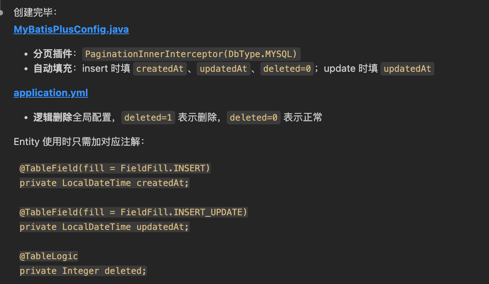

这里只做配置层面的基础搭建。具体的业务封装 ——BaseEntity 基类、分页查询工具类 —— 在基础组件篇展开。这里想说一下，Claude 生成这种模板代码非常快，基本不会出错，因为这些代码是非常标准的。

任务五：Redis 配置

Cluade 的指令是：

输出是：

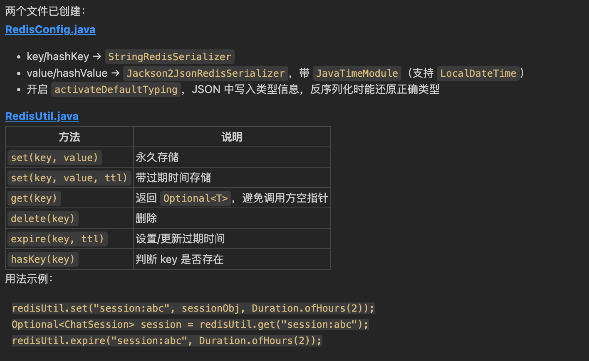

同样，这里只做配置。Cache-Aside 模式的业务封装在基础组件篇再做。

你可能注意到了，我把 hify-common 拆成了五个小任务，而不是一条指令 “帮我把 hify-common 全部搭好”。原因和前面讲的一样：拆开做，每个任务的上下文更小、更聚焦，Claude Code 的输出质量更高。而且出了问题容易定位，混在一起生成，一个地方有问题可能要在几百行代码里找。

### 第三步：业务模块空壳

前两步搞定后，后端的地基就打好了。现在给每个业务模块创建基础的 package 结构。

这一步生成的东西很简单，review 也快 —— 检查 package 路径对不对、各模块结构是否一致就行。

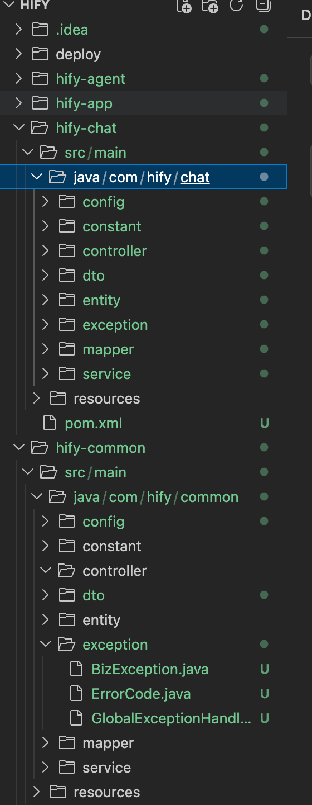

然后在 hify-app 模块里创建 Spring Boot 启动类和 application.yml：

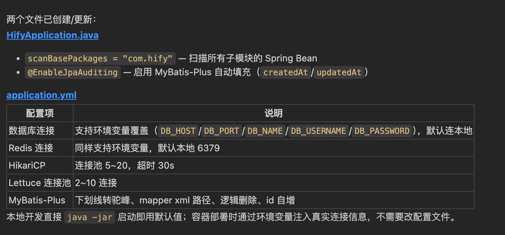

### 第四步：验收

后端骨架应该搭好了。启动验证一下。

先确保 MySQL 和 Redis 在本地跑着（如果本地没有，用 Docker 临时起一个，这不是项目的 Docker 化，只是本地开发环境）。

然后，我 mvn clean install 就报错了：

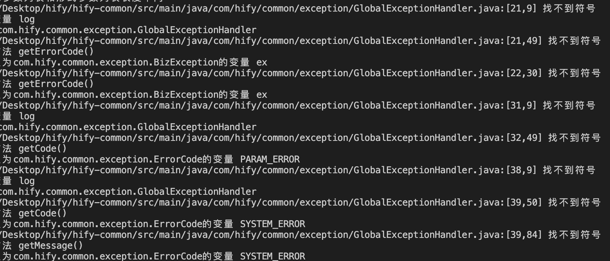

然后我继续输入：

输出是：

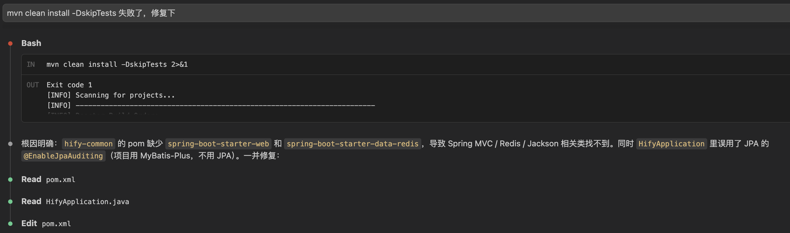

然后修复这个问题又失败了。

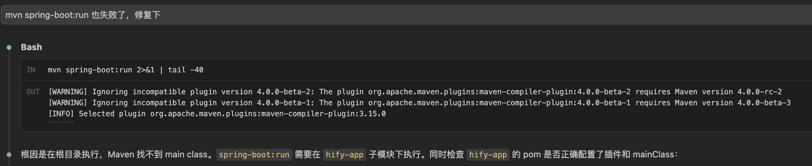

那就继续让 Claude Code 继续修复。这个过程重复，就可以得到一个可以启动的应用了。

这里一直起不来，后来 Claude Code 发现前面给的启动命令错了（哈哈），应该是下面这个命令：

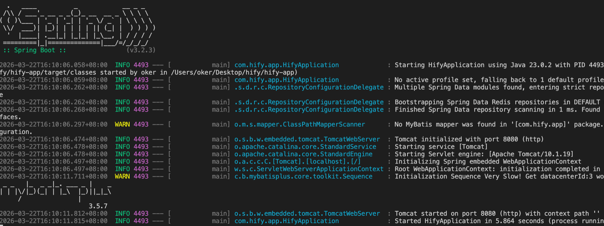

Spring Boot 启动日志的最后一行应该显示 Started HifyApplication in X seconds。

为了有一个可验证的端点，让 Claude Code 加一个健康检查接口：

在 hify-app 中创建 HealthController，路径 GET /api/v1/health，返回 Result.ok(“Hify is running”)。

启动后访问 http://localhost:8080/api/v1/health，应该可以看到：

看到这个返回，说明后端骨架搭建成功。Maven 多模块结构正常、依赖关系正确、公共模块的 Result 和全局异常处理在工作、Spring Boot 配置没问题。

但是输出却是：

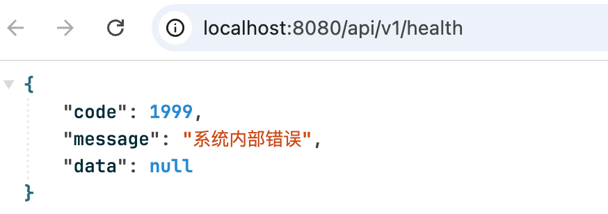

接下来就交给你了。

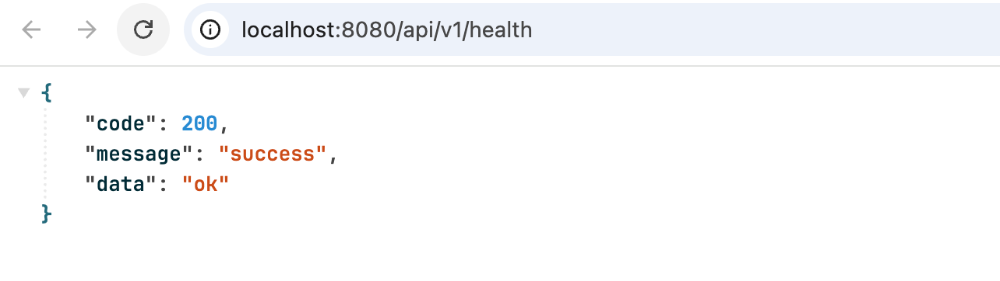

## 大批量代码怎么 review

这一讲 Claude Code 生成了不少代码，几十个文件、几百行配置和基础代码。逐行看不现实，也没必要。关键是按优先级看。

- 第一优先级：结构性问题。模块依赖关系对不对？pom 里的依赖声明和 CLAUDE.md 里定义的架构一致吗？package 路径对不对？这些如果错了，后面所有东西都建在错误的地基上。
- 第二优先级：公共模块的核心代码。Result 类的字段和方法对不对？全局异常处理器的捕获优先级对不对？MyBatis-Plus 的自动填充逻辑对不对？这些代码所有业务模块都会依赖，错了影响范围最大。
- 第三优先级：配置文件。application.yml 里的配置项对不对？有没有遗漏？有没有硬编码不该硬编码的东西？影响范围相对小，后面随时可以调整。
- 最后才看：业务模块空壳。只是 package 结构和占位类，几乎没什么可出错的，扫一眼确认结构一致就行。

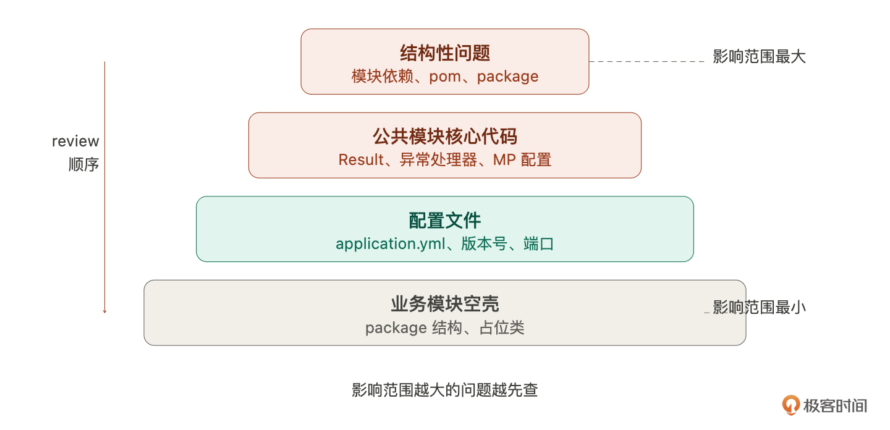

这个优先级背后的逻辑很简单：影响范围越大的问题越先查。结构错了全盘皆输，公共模块错了所有业务模块跟着错，配置错了这个服务有问题，空壳错了只影响一个文件。把 review 时间花在影响范围最大的地方。

这个思路不只适用于工程初始化。后面每一讲 Claude Code 生成大量代码时，都可以用同样的方式。先找影响范围最大的问题，再逐步往下。

## 总结

这一讲做了两件事：用 Claude Code 搭建了 Hify 的后端骨架，以及总结了 3 个后面会反复使用的方法论。

任务拆解标准。生成量是否超出一次 review 的范围？步骤之间是否有依赖关系？满足其一就拆。拆的顺序按依赖关系来，先地基后框架。

影响范围 review。大批量代码不需要逐行看。按影响范围排优先级 —— 结构 > 公共模块 > 配置 > 空壳，时间花在影响范围最大的地方。

每步验收。不是搭完全部才验收，而是每一步做完就验证。Maven 骨架搭好了 mvn install 能通过吗？公共模块写好了编译没问题吗？全部搭完 spring-boot:run 能启动吗？每一步的验收给你信心：“到这里为止是对的。” 不验证就往前冲，错误会累积，到最后都不知道问题出在哪一步。

到了这里我们依然 0 代码，就完成了一个 Web Service 的初始化。中间基本没遇到问题，很顺。一方面有模型厉害的原因，一方面是我们前面基础搭建的好，一方面是我们把一个大任务拆解为多个小任务了。在后面的课程，你会越来越感受到这个模式的优势。

你可以思考下，如果我们自己来做这些事情，是不是至少要一天。而有了 AI 辅助后，可以又快又好的实现。节省下来的时间，就可以用来做其他事情，这就是生产力的提升。

后端能跑了。下一讲补前端 Vue 工程、写启动脚本，让 Hify 的前后端一键跑起来。

## 思考题

回想一下你之前做项目时的工程初始化过程。你是手动一个个文件创建，用脚手架工具，还是从别的项目复制？如果现在让你用 Claude Code 来做，你会怎么拆解？试着列出你的步骤和每步的验收标准。

期待你与我分享自己的使用体验。如果今天的课程让你有所收获，也欢迎转发给有需要的朋友，邀请他来一起学习，我们下节课再见！

