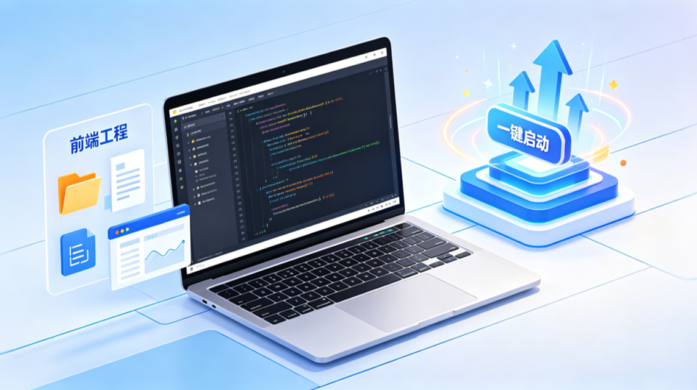
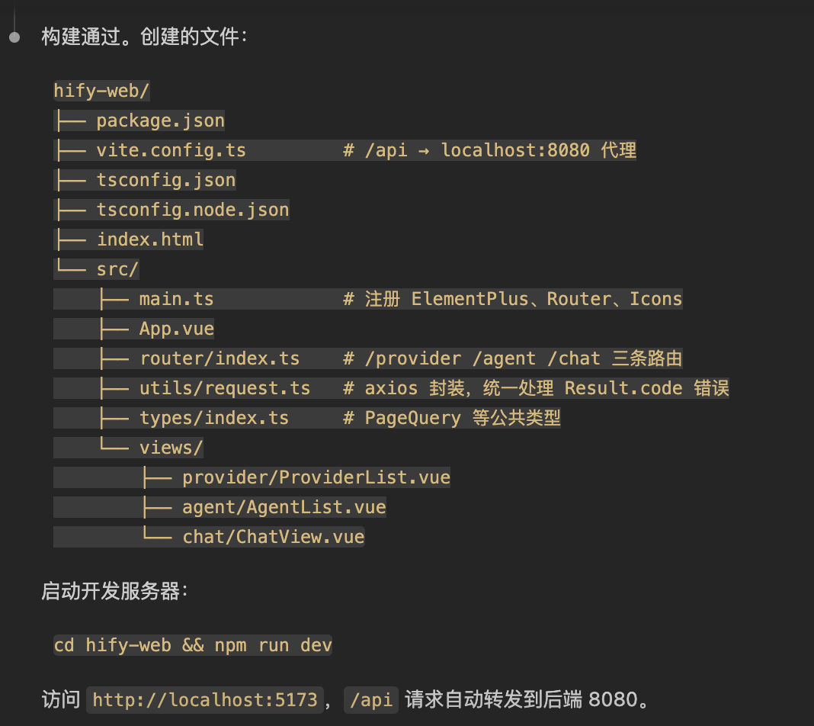
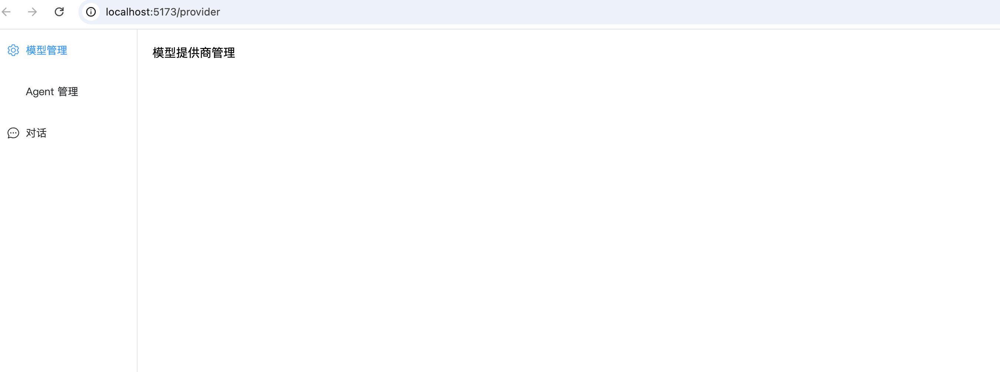
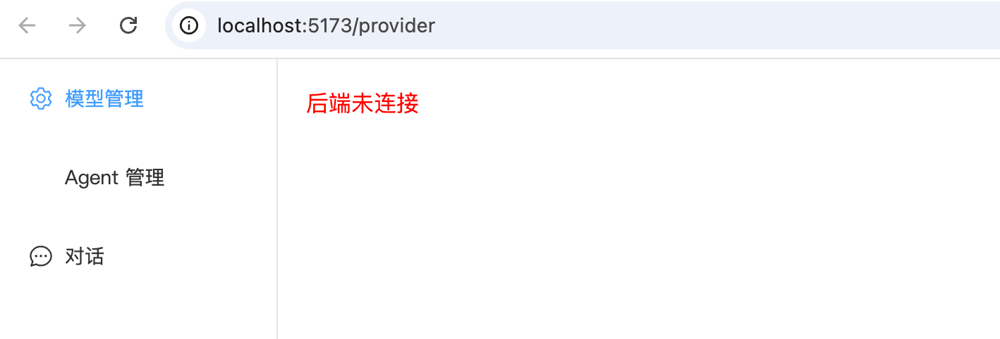
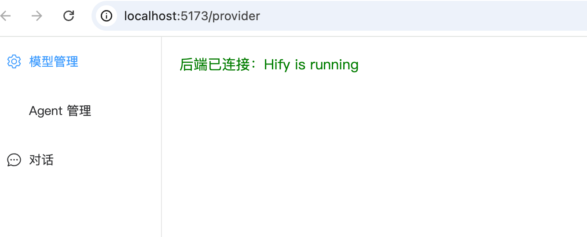
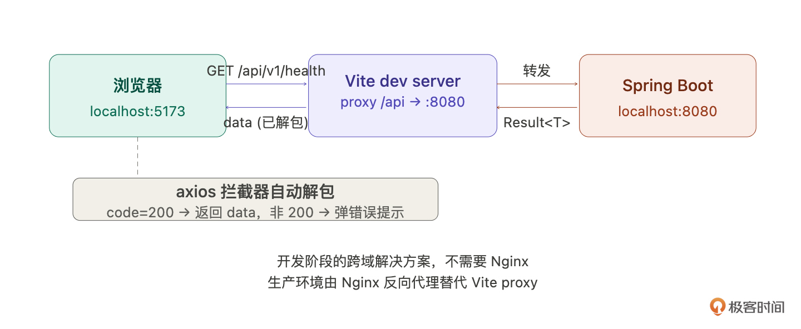
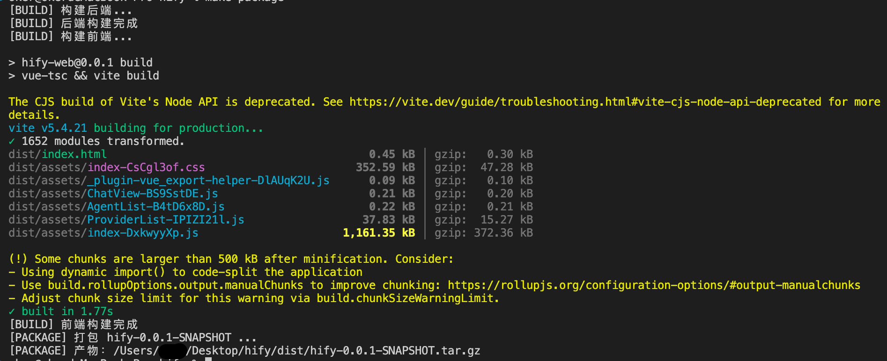

# 09｜工程初始化（下）：前端工程与一键启动

你好，我是 Robert。

上一讲我们搭好了后端骨架 ——Maven 多模块结构、公共基础设施、健康检查接口，java -jar 能跑，访问 /api/v1/health 返回 200。

这一讲把剩下的补齐：前端 Vue 工程、前后端联通、启动脚本。做完之后，你执行一个 ./start.sh，后端前端同时起来，浏览器打开就能看到 Hify 的页面。

从零到能跑的完整闭环，这一讲交付完成。

## 前端 Vue 工程搭建

和上一讲后端一样，前端初始化也要分步做。我分成三步：项目骨架、axios 统一请求层、路由和页面空壳。上一讲建立的任务拆解方法论直接复用，不再解释为什么要拆 —— 按依赖关系排序，每步验证后进入下一步。

### 第一步：项目骨架

给 Claude Code 的指令思路：

输出是：

这一步比较标准化，Claude Code 一般不会出大问题。拿到输出后检查两件事：目录结构和 CLAUDE.md 里定义的是否一致；Vite 代理配置是否正确，开发阶段前端跑在 5173 端口，通过 Vite 代理转发 /api 请求到后端 8080 端口，解决跨域问题。

是不是很快。说实话，我一点不懂前端。但是通过上面的指令就有一个前端服务了。这里需要注意的是：提示词要完整且清晰。你可以参考一下上面的提示词。

### 第二步：axios 统一请求层

这一步值得多讲一下，因为它是前端和后端规范体系的接合点。

后端定了统一响应格式 Result<T>，每个接口都返回 { code: 200, message: "success", data: {...} }。前端的 axios 封装要和这套格式对接，让业务代码不需要每次都手动处理 code 判断和 data 解包。

给 Claude Code 的指令思路：

为什么要在拦截器里自动解包 data？因为如果不这么做，后面每个页面调接口都要写：

封装之后直接就是：

看起来是个小事，但几十个接口累积下来，代码干净很多。来看生成的 request.ts 的代码：

然后让 Claude Code 基于这个封装写一个示例 API 文件：

文件代码是：

这个文件只有几行代码，但它验证了整条链路 ——axios 封装、代理配置、接口路径规范 —— 是否都通。

回过头看，这就是为什么 06 讲要把接口规范写进 CLAUDE.md，因为不只后端在用，前端 axios 封装也在对着同一份规范做。后端的 Result<T> 格式、接口路径规则、错误码定义，前端全部照着来。一份规范，两端对齐。

### 第三步：路由和页面空壳

给 Claude Code 的指令是：

这一步生成的是一个有完整导航结构的空壳应用 —— 左边菜单、右边内容，点菜单能切换页面，每个页面都是占位文字。后面往里填内容就行。

## 前后端联通

前端搭好了，后端上一讲已经能跑了。现在把它们连起来。

这一步验证的是完整链路：Vite 代理配置对不对、axios 封装能不能用、前后端的接口格式能不能对上。

把前端的 ProviderList.vue 改一下，让它调用健康检查接口并显示结果：

启动后端、启动前端，打开浏览器 http://localhost:5173，你应该能看到左侧菜单、右侧显示绿色的 “后端已连接”。但是，却是：

看了一眼，发现 hify server 被我关了，启动后：

看到了，说明前后端联通成功 ——axios 封装正常、Vite 代理正常、后端接口正常、Result 格式前端能正确解析。如果显示红色，就把浏览器控制台的错误信息贴给 Claude Code 让它排查。

## 启动脚本

到这一步，前后端都能跑了，但每次启动要开两个终端、输两条命令。写个脚本让它一键搞定。

还记得 01 讲的三层分工吗？启动脚本、Makefile 这些就是典型的第三层 ——AI 全权处理，你验收结果就行。脚本逻辑不复杂，但手写容易漏细节（进程管理、日志输出、端口检查），交给 Claude Code 特别合适。不需要逐行 review shell 语法，跑一下 start.sh 能起来就过了。

start.sh

stop.sh

Makefile

这里不展示输入和输出的细节了，实操课中会演示，直接展示结果。

这 3 个文件加起来可能就一两百行脚本，但它们让整个项目的使用体验提升了一个档次。拉下代码，make start 就跑起来了，make package 就能打包分发。

## 验收时刻

所有东西都就绪了。最终验收：

你应该看到这样的输出：

这里是因为 MySQL 没配置。调整配置后，打开浏览器访问 http://localhost:5173：

- 左侧看到三个菜单：模型管理、Agent 管理、对话
- 点 “模型管理”，右侧显示绿色的 “后端已连接：Hify is running”
- 点其他菜单，显示对应的占位文字

看到这些，工程初始化就完成了。你手上有了一个前后端都能跑的空项目，结构清晰、规范就绪、一键启动。后面的工作就是往这个骨架里填功能。

## 总结

我们用两节课完成了 Hify 的工程初始化 —— 后端能跑、前端能开、一键启动、前后端联通。最终，你手上有了一个完整的 “空项目。

最后我们回顾一下这两讲的方法论：

任务拆解。工程初始化体量大，不能一条指令搞定。按依赖关系拆成有序的步骤，每步验证后再进入下一步。判断标准：生成量超出一次 review 范围、步骤间有依赖，满足其一就拆。

基础设施先行。先搭 Maven 骨架、再搭公共模块、再搭业务空壳、再搭前端、最后写脚本。顺序不能乱，因为后面的每一步都依赖前面的结果。

每步验收。不是搭完全部才验收，而是每一步做完就验证。每一个验收点给你信心：到这里是对的。

不过，工程初始化完成不代表可以直接写业务了。现在的空项目还缺一层东西 —— 基础组件。数据库怎么做分页、接口入参怎么校验、调外部 API 的客户端怎么封装、线程池怎么配、熔断怎么搞，这些是所有业务模块都会用到的底层能力。

不过下一讲我们要换一种协作模式，不是你告诉 Claude Code 做什么，而是先让它告诉你该做什么。

## 思考题

这两讲工程初始化的过程中，Claude Code 做了大量 “模板性” 的工作，包括项目结构、配置文件、公共组件、脚本。回想一下你自己平时做项目，有哪些类似的不难但繁琐的工作？列出 3 个你觉得最适合交给 AI 做的，以及你会怎么给它描述需求。

期待你的分享。如果今天的课程让你有所收获，也欢迎转发给有需要的朋友，邀请他来一起学习，我们下节课再见！

