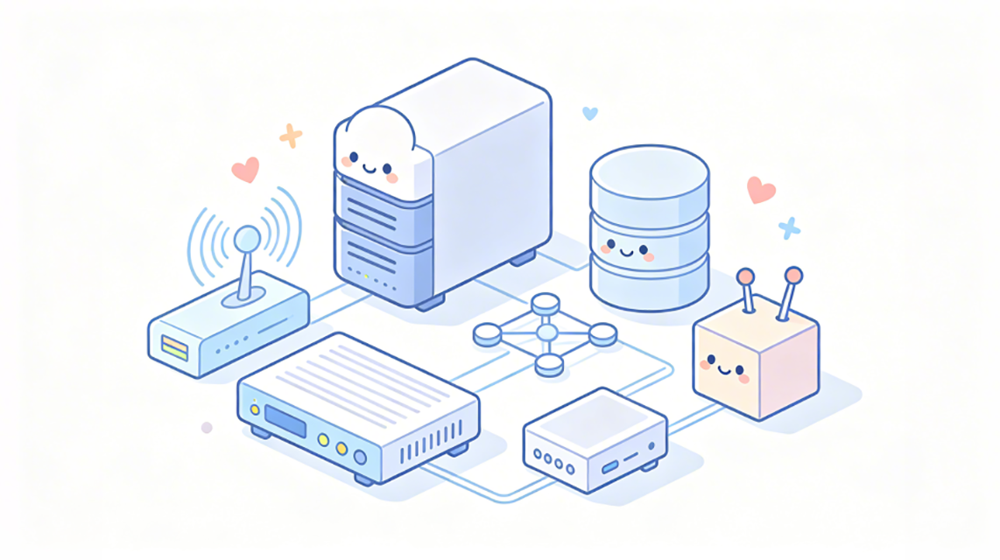
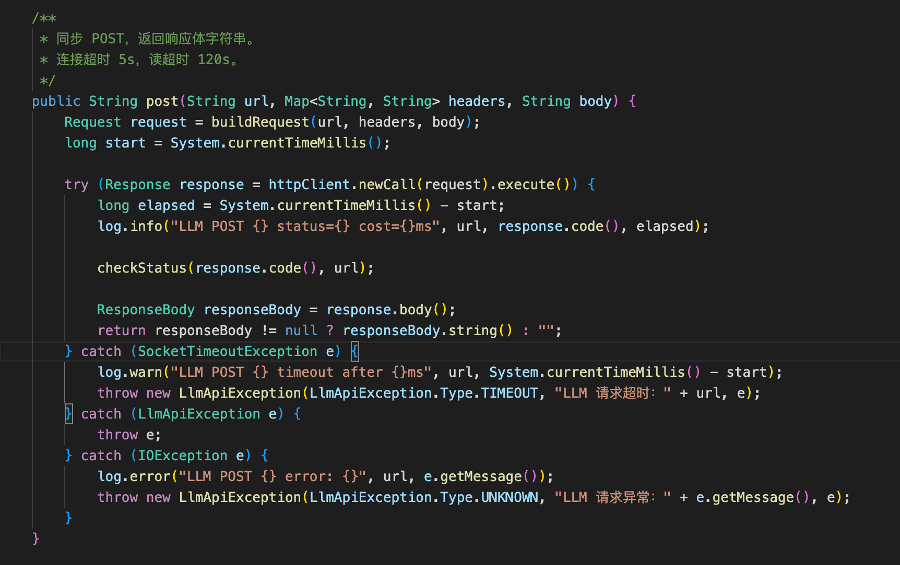

# 10｜基础组件（上）：后端业务基础设施

你好，我是 Robert。

工程初始化完成了，Hify 前后端都能跑，make start 一键启动。但现在还不能直接写业务，“空项目” 还缺一层东西：基础组件。

08 讲搭 hify-common 的时候，我们做了配置层面的基础，MyBatis-Plus 的分页插件和自动填充、Redis 的 RedisTemplate 和序列化配置。但业务封装层还没做，比如：

- BaseEntity 基类怎么定
- 分页查询怎么从前端参数转成 PageResult
- 接口入参怎么校验
- 调外部 LLM API 的 HTTP 客户端怎么封装
- 线程池怎么隔离
- 熔断怎么配

这些是所有业务模块都会用到的底层能力，不先搭好，后面每个模块都要重复处理一遍。但问题来了：具体需要准备哪些基础组件？你可能有经验能列出一部分，但难免有遗漏。这一讲引入一个新的协作模式来解决这个问题。

## 新的协作模式：先问再做

回顾前面几讲，我们和 Claude Code 的协作基本都是一个模式：你想清楚了，让它做。“按照规范实现这个接口”，“帮我生成 Maven 骨架”…… 你知道要做什么，它负责执行。

但现在的情况不一样，“业务开发前需要准备哪些基础组件” 这个问题，你有大致想法，但不确定有没有遗漏、先后顺序对不对。

这时候换一种模式：先让 Claude Code 帮你想，再让它做。不是让它替你做决策，而是把它当成一个资深架构师来咨询，你问 “这一步应该考虑什么”，它帮你梳理全景，你判断哪些要做、哪些不做，然后再进入执行。

我把这两种模式叫执行模式和咨询模式：

- 执行模式：你想清楚了 → 给指令 → Claude Code 做 → 你验收。适合你对任务很清楚的时候。
- 咨询模式：你知道大方向但不确定细节 → 先问 Claude Code → 它帮你梳理 → 你判断取舍 → 再给指令执行。适合不确定性高的时候。

这个方法论后面会反复用到。每次进入新阶段（新模块、测试、部署），都可以先用咨询模式问一句 “这个阶段我应该考虑什么”，确保不遗漏。

## 让 Claude Code 梳理基础组件清单

直接用。我问 Claude Code：

它给了一份很详细的清单。我就不放细节了，就放一个总结：

有些是我预期到的（线程池、熔断），但有几个是我自己列清单时会漏掉的。我按优先级做了分档，不是所有东西都要现在做，有些不做业务就跑不起来，有些可以写业务时同步补。

第一档：必须先做，否则业务代码跑不起来

- 数据库初始化脚本（schema.sql）。这是我差点忽略的，现在还没有建表 DDL。Spring Boot 启动时需要库和表已存在，否则 Mapper 跑不起来。需要创建所有业务表的 DDL 文件。
- @MapperScan 扫描路径。目前启动类的扫描路径只覆盖了 com.hify.app，但业务 Mapper 在各子模块里（com.hify.provider.mapper 等），Bean 注册不上。不改这个，所有 Mapper 注入都会报错。
- llmExecutor / asyncExecutor 线程池。CLAUDE.md 要求 LLM 调用必须用 @Qualifier("llmExecutor")，Chat 模块注入时这个 Bean 必须存在。

第二档：做业务时同步补，第一个列表接口之前搞定

- BaseEntity（公共字段封装）。每个实体都有 id、created_at、updated_at、deleted，不封装就每个实体重复写。
- 统一分页参数封装。几乎每个列表接口都要分页，把前端参数转成 MyBatis-Plus 的 Page 对象，封装一次全部复用。
- 入参校验（@Valid）。每个创建 / 更新接口都需要参数校验，和 08 讲的全局异常处理器串起来。
- 统一时间序列化。不配的话 Jackson 序列化 LocalDateTime 默认输出数组格式 [2025,3,16,10,30,0]，前端解析不了。
- Spring Cache 集成。CLAUDE.md 规定 Provider / Agent 配置走 Redis Cache-Aside，TTL 30min。现在只有裸 RedisUtil，没有启用 @EnableCaching + RedisCacheManager，@Cacheable 注解用不了。

第三档：可以后补，不影响功能开发

- HTTP 客户端封装。调 LLM API 的基础，但 Chat 模块开发时再做也来得及。
- Resilience4j 熔断配置。04 讲定了每个提供商独立熔断器，但 Chat 模块完成后补也不迟。
- 结构化日志配置。logback-spring.xml 区分开发 / 生产环境，请求日志过滤器记录 method、path、耗时。联调阶段前补上。

Claude Code 帮我发现了两个我自己会漏掉的：schema.sql 和 @MapperScan。不是什么高深的东西，但你在列基础组件清单时很容易忽略。脑子里想的都是 BaseEntity、线程池这些有设计感的东西，反而忘了最基础的东西，比如表还没建、扫描路径不对。等到启动报错才发现，浪费的是排查时间。

这就是咨询模式的核心价值，用它做遗漏检查。Claude Code 见过的项目比你多，它的建议不能直接照搬，但用来查漏补缺非常好。

我的决定是：这一讲把三档全做了。 虽然第三档可以后补，但提前搭好，后面就不用回头。按依赖关系排序：先做第一档（跑起来），再做第二档（业务能写），最后补第三档（健壮性），DemoItem 验收放在第二档做完之后。

## 第一档：让业务代码能跑起来

1. 数据库初始化脚本

Claude Code 提示词是：

效果是：

这个就不展开说明了，大家可以自己琢磨一下细节。

2. @MapperScan 扫描路径

这个改动就一行代码，但不改所有 Mapper 都注入不了：

效果是：

3. 线程池配置

场景：用户在对话（调 LLM，卡了 30 秒），同时另一个用户打开管理页面看 Agent 配置。如果共用线程池，对话请求占满了所有线程，管理页面一直转圈。

参数依据：目标 20-50 人同时在线，一半的人同时对话就是 10-25 个并发 LLM 调用，核心线程 10 够用，最大 50 留余量。一期先这样，后面根据监控调整。

线程名前缀很重要，后面看日志时，llm-3 立刻知道是 LLM 调用线程，async-1 是异步任务线程。不设前缀全是 pool-1-thread-3，排查时分不清。

到这里，mvn spring-boot:run 应该能正常启动、Mapper 能注入、线程池 Bean 就绪。跑一下确认没有启动报错，再进入第二档。

## 第二档：业务开发的基础能力

接下来，我就不展示每个指令的执行效果了，比较复杂的我会展开说明。

1. BaseEntity

每个数据库实体都有公共字段。不封装的话，每个 Entity 都要重复写 id、created_at、updated_at、deleted 和对应的注解。

2. 统一分页封装

08 讲定义了分页的请求参数（page、pageSize）和响应格式（PageResult），也配好了分页插件，但还没有把它们串起来。

3. 入参校验

每个创建和更新接口都需要校验入参。Spring Boot 的 @Valid + JSR 303 注解就够用，关键是和 08 讲的 GlobalExceptionHandler 配合好。它已经捕获了 MethodArgumentNotValidException，会转成 Result.fail(ErrorCode.PARAM_ERROR, 具体校验信息)。

4. 统一时间序列化

一个配置类，十几行代码，但省掉后面无数前端时间解析的坑。

5. Spring Cache 集成

08 讲配好了 RedisTemplate 和 RedisUtil，但只是裸的 get / set 操作。业务层需要 @Cacheable、@CacheEvict 这些声明式缓存。Provider 配置读多写少，加个注解就自动缓存，不需要手动写 if-else。

这样后面业务 Service 直接加 @Cacheable(cacheNames = "provider-cache") 就行，缓存的读写、过期、序列化全自动处理。写入时加 @CacheEvict 失效缓存，标准的 Cache-Aside 模式。

6. CRUD 标准流程验证

第二档的所有组件搭好了，用一个 DemoItem 跑通完整 CRUD，验证它们协同工作。

验收：

每一个请求验证一个基础组件：

- 空 name → 入参校验 + 全局异常处理器
- 创建成功 → BaseEntity 自动填充
- 列表 → PageHelper + 分页插件
- 时间格式 → Jackson 配置
- 逻辑删除 → MyBatis-Plus 配置

全部通过，说明第二档组件就绪。DemoItem 留着不删，后面做 Provider 模块时，它是最好的参考模板。

## 第三档：健壮性补齐

这些不做也能写业务，但从架构和实现的角度，最好提前搭好，后面不用回头。这也是培养咱们设计和实现系统的好习惯。

1. HTTP 客户端封装

Hify 需要调用各种外部 LLM API。先用咨询模式确认方案：

Claude Code 确认方案合理，提醒了连接池要分开配、超时参数要区分。进入执行模式：

输出是：

上面是生成的局部代码。是不是很完整，比我写的都好。

这里有个点，为什么超时设这么长？LLM API 不是普通 HTTP 调用，GPT-4 一次响应可能 10-20 秒，流式可能持续一两分钟。60 秒和 120 秒是实际经验的平衡。这也是我们作为程序员的价值所在，我们会去理解需求，从宏观去思考超时时间是多久。因为 AI 不知道 GPT-4 一次响应可能 10-20 秒，这是物理世界的表现。

2. Resilience4j 熔断与重试

线程池解决了 “一个 LLM 卡了不影响其他功能” 的问题。熔断解决另一个问题：某个提供商整个挂了，系统还在不停发请求，每次等 60 秒超时 —— 挂了就是挂了，等也白等。

输出是：

下图是熔断器状态流转图，你可以看看，理解一下代码的底层设计。

为什么每个 Provider 独立熔断器？OpenAI 挂了不代表 Claude 也挂了。共用的话一家失败会把其他正常的也拦住。

重试按异常类型区分，认证失败重试一百次也不会成功，只有 “暂时性” 的失败才值得重试。

3. 结构化日志与请求追踪

输出是：

traceId 的价值：一个对话请求从 Controller 进来，经过 Service、调 LLM、写数据库，可能产生十几条日志。一个 ID 串起整条链路，排查时不用大海捞针。

## 最终验收

三档全部搭完，回过头做一个整体检查：

- 启动项目，确认日志格式正确（有 traceId、有线程名）。
- 跑一遍 DemoItem 的 CRUD，确认请求日志过滤器在记录每个请求的 method、path、耗时。
- 检查日志里线程名是否有 llm- 和 async- 前缀的线程池就绪。

全部通过，Hify 后端基础组件全部就绪。

## 总结

这节课我们把 Hify 后端的全部基础组件搭完了。

- 第一档（跑起来）：建表 DDL、MapperScan 扫描路径、LLM / 异步线程池。
- 第二档（能写业务）：BaseEntity、分页封装、入参校验、时间序列化、Spring Cache、CRUD 标准流程。
- 第三档（健壮性）： HTTP 客户端（普通 + SSE）、熔断器（每个 Provider 独立）+ 重试、结构化日志 + 请求追踪。

最重要的方法论是咨询模式。在你还没完全想清楚的时候，先让 Claude Code 帮你梳理全景，你做判断和取舍，再进入执行。多了一个前置思考环节，但能帮你发现遗漏。后面每次进入新阶段都可以用。

这一讲内容很多，我想多说一句，为什么要花这么大篇幅讲基础组件。

这门课教的不只是 Claude Code 的使用。我还想让你知道，一个标准项目的基础组件应该长什么样，包括线程池隔离、熔断重试、Cache-Aside、traceId 串联、入参校验链路、统一时间序列化，这些东西不是课本上的概念，是每个生产级项目都要有的底层能力。很多工程师工作三五年，做的项目里这些东西是别人搭好的，自己从来没从零搭过，知道名字但说不清为什么要这么做。

这节课看完，你不只是用 Claude Code 搭好了 Hify 的基础组件，你还积累了一份可复用的基础组件清单，掌握了每个组件的设计理由。以后你开新项目，不管用不用 Claude Code，这套东西基本照搬就行。三档优先级、每个组件解决什么问题、参数为什么这么设，你都心里有数。这才是真正的积累，不是只会问 AI 问题，而是自己也有经验、有判断。

下一讲进入前端。程序员一般没有设计师的审美，没关系，让 Claude Code 来。我们会让它帮我们做 UI 设计、定色调、优化布局，把灰蒙蒙的空壳变成有品牌感的界面，同时把前端的基础组件封装好。

## 思考题

试一下咨询模式。打开 Claude Code，描述你正在做的一个项目，然后问它：“在开始写业务代码之前，我应该准备哪些基础组件？” 看看它的建议里有没有你没想到的，并把它的建议和你的判断（哪些采纳、哪些不需要、为什么）分享在留言区。

期待你与我交流。如果今天的课程让你有所收获，也欢迎转发给有需要的朋友，邀请他来一起学习，我们下节课再见！

