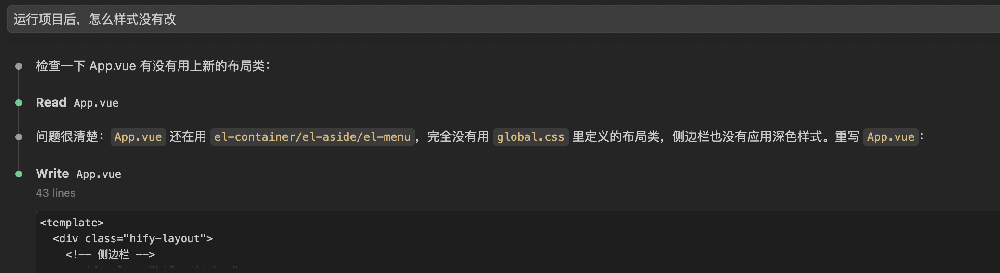
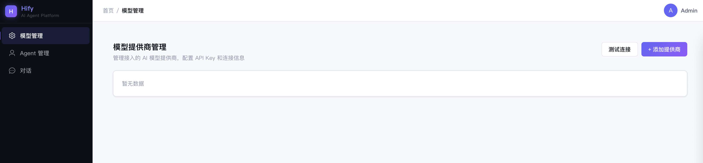
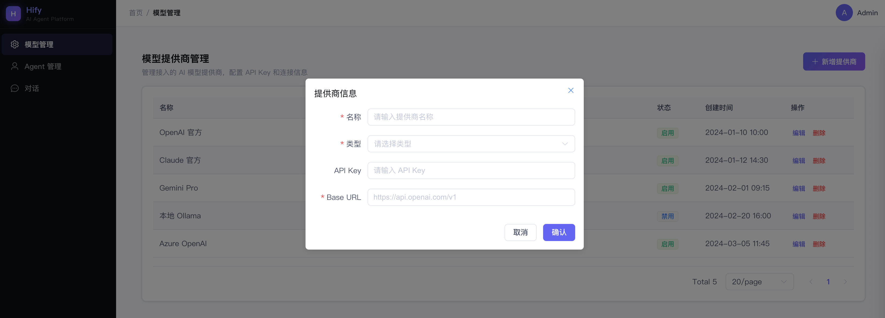

# 11｜基础组件（下）：前端 UI 设计与前端基础组件

你好，我是 Robert。

上一讲把后端基础组件全部搭完了，三档就绪。这一讲搭前端。

09 讲搭了前端空壳，包括 Vue 骨架、axios 封装、三个菜单页面的占位文字。能跑，但说实话，看起来就是 Element Plus 的默认灰蓝，像一个课程作业，不像一个产品。

这一讲做两件事：

- 让 Claude Code 当设计师，把界面从 “能用” 变成 “好看”；
- 把前端业务开发需要的公共组件一次性封装好。

做完之后，前端也和后端一样，基础设施就绪，下个章节开始直接往里填业务功能。

## 让 AI 当设计师

大多数后端工程师没有设计师的审美，不知道配色怎么选、间距怎么给、什么风格适合什么产品。以前这事只能找设计师或者产品经理，现在 Claude Code 能帮你做到 80 分以上。

但前提和写代码一样：你的输入越具体，它的输出越好。不是说 “帮我设计一个好看的界面”，而是要告诉它产品是什么、用户是谁、你想要什么风格。01 讲说的 “思考质量决定输出质量”，在 UI 设计这个场景同样适用。

### 第一步：定风格方向

先用咨询模式给 Claude Code 足够的上下文：

注意这条指令的结构：先说产品是什么（上下文），再说用户是谁（约束），再说我要什么风格（方向），再说具体的色调偏好（细节），最后给参考（锚点）。层层递进，Claude Code 不需要猜。

命令执行后遇到一个问题：

这说明了 Claude Code 不是能一下子完成任务的，而是需要不断调整的。经过调整后，效果如下：

拿到这套变量后，快速 review 一下：颜色搭配刺不刺眼、对比度够不够（文字要能看清）、整体调性对不对。不需要逐个色值较真，大方向对就行，细节后面调。

### 第二步：改造侧边栏

侧边栏是用户打开页面第一眼看到的东西，改造效果最立竿见影。

- 背景用深色（接近纯黑但不是纯黑，用 --color-bg-dark），和浅色内容区形成对比
- 顶部 Logo 区域：显示 "Hify" 品牌名，用主色渐变文字，下面一行小字 “AI Agent Platform”
- 菜单项：默认白色文字 + 透明背景，hover 时背景微亮（rgba 白色 10% 透明度），选中态左边一条 3px 的主色竖线 + 背景微亮
- 菜单图标：每个菜单项前加 Element Plus 图标（模型管理用 Setting，Agent 管理用 User，对话用 ChatDotRound）
- 底部：折叠 / 展开按钮，版本号
- 整体要炫酷，有科技感，但不能花哨到影响使用

效果如下：

### 第三步：页面整体布局

- 顶栏：左侧面包屑导航（显示当前页面路径），右侧用户信息区域（头像 + 用户名 placeholder）
- 内容区：背景用 --color-bg-secondary（浅灰），内容卡片用白色背景 + 轻阴影 + 圆角，和背景有层次感
- 页面标题区域：每个页面顶部有标题 + 描述文字 + 操作按钮区（右侧）
- 间距统一：页面边距 24px，卡片内边距 20px，元素间距 16px
- 按钮样式：主要操作用主色渐变按钮（蓝紫渐变），次要操作用白色边框按钮，危险操作用红色

效果如下：

### 效果对比

到这里，UI 改造基本完成。

同一个页面结构，只是换了设计系统 ——CSS 变量 + 侧边栏 + 布局优化，没有改任何功能代码，但视觉感受完全不同。

这就是让 AI 当设计师的价值：你不需要懂设计理论，只需要能描述你想要什么。“浅底科技感、侧边栏深色、蓝紫主色、参考 Linear”，这些描述任何一个后端工程师都能给出来，Claude Code 会把它翻译成具体的 CSS。

## 前端基础组件：一条指令搞定

后端工程师做前端，最怕的不是写不出来，是写得慢。每个页面重复处理表格分页、弹窗打开关闭、loading 状态、删除确认，把这些封装成公共组件，后面做业务页面就是填配置。

我们是后端工程师，不需要在前端组件的实现细节上花太多时间。用一条完整的指令让 Claude Code 一次性生成所有组件：

每个组件要有 TypeScript 类型定义，用泛型支持不同数据类型。组件风格和第一步定的设计系统一致。

- HifyTable.vue：通用列表页表格组件。Props 接收 columns 配置（label/prop/width/slot）、api 方法（返回 PageResult 格式）、是否显示分页。内部自动管理 loading 状态、分页参数、数据请求。暴露 refresh () 方法供外部调用刷新。空状态显 Element Plus 的 el-empty。
- HifyFormDialog.vue：通用表单弹窗组件。Props 接收 title、width、表单 rules。v-model 控制显示隐藏。内部管理提交 loading、关闭时自动重置表单。暴露 open (data?) 方法，传 data 为编辑模式，不传为新增模式。提交时触发 submi 事件，由父组件处理 API 调用。
- src/composables/useConfirm.ts：删除确认 composable。接收确认文案和 API 方法，弹出 ElMessageBox 确认框，确认后调用 API，成功后显示 ElMessage 成功提示，返回 Promise。一行代码完成 “确认删除→调接口→提示成功” 全流程。
- src/composables/useRequest.ts：请求状态管理 composable。接收 API 方法，返回 { data, loading, error, execute }。自动管理三态，避免每个页面写 try-catch-finally 样板代码。
- src/utils/notify.ts：统一通知封装。导出 notifySuccess/notifyError/notifyWarning 三个方法，底层调用 ElMessage，统一配置 duration 和样式。

一条指令，五个组件。Claude Code 生成后，快速过一遍：TypeScript 类型对不对、组件接口设计合不合理、和 Element Plus 的集成有没有问题。前端组件的实现细节不需要逐行 review，能用就行，有问题后面调。

这就是 01 讲说的三层分工里的第二层 ——AI 做，你验收。前端组件封装不是你的核心能力区，让 AI 高效产出，你把精力放在验证它好不好用上。这块就不展开了。如果有兴趣你可以去深究一下细节。

## 细节打磨：和 Claude Code 来回调

UI 设计和组件都有了，但实际用起来一定会有不满意的地方，比如间距不对、对齐有问题、颜色偏了、表格太挤、弹窗太宽。这是最花时间的环节，也是最能体现人机协作价值的环节。

我用 ProviderList 页面来演示这个过程。先让 Claude Code 生成一个完整的页面：

Claude Code 生成后，启动前端看效果。大概率第一版有这些问题，这是正常的，不是 Claude Code 能力不够，是 UI 细节需要人来判断。

1. 调布局

这种微调很适合让 Claude Code 做。你告诉它哪里不对、怎么改，它改得又快又准，不需要你自己去翻 CSS。

2. 调色调

这是一个典型的审美判断：Claude Code 第一版可能把 “禁用” 设成红色（因为它觉得禁用是负面状态），但你知道在管理后台里，禁用是一个正常的状态，用灰色更合适。AI 做初稿，你做审美判断，然后让它改。

3. 调表单弹窗

4. 调响应式细节

5. 整体微调

- 表格头部背景色太深了，换成 --color-bg-secondary（浅灰）
- 分页器居右对齐，上方加一条细分割线
- “新增提供商” 按钮加一个 Plus 图标
- 鼠标悬停表格行时背景微微变色（hover 效果）
- 操作列的 “编辑” 按钮用 text 类型蓝色，“删除” 用 text 类型红色，不要默认的 primary 按钮样式

你看，这一轮来回调了五六次，每次都是具体的、可执行的指令。这就是 UI 打磨的真实过程，不是一条指令出完美设计，而是先出初稿，然后你用自己的眼睛和判断来指导 Claude Code 迭代。

关键认知：你不需要会写 CSS，但你需要能说清楚 “哪里不对” 和 “应该怎样”。间距太大改成 16px、禁用不应该用红色用灰色、弹窗太宽改成 520px，这些描述不需要前端技能，只需要你看着屏幕，说出你的判断，Claude Code 负责把你的判断翻译成代码。

这个细节打磨的能力，后面做每一个前端页面都会用到。Provider 页面练好了手，后面 Agent 页面、对话页面照着来就行。

## 验收

启动前端，打开浏览器：

- 侧边栏：深色背景，Hify logo 带渐变，菜单项有图标和 hover 效果
- 点 “模型管理”：看到 Provider 列表页，表格展示 5 条 mock 数据，分页器在底部
- 点 “新增提供商”：弹出表单弹窗，字段完整，校验生效（name 为空提交会报错）
- 点某条数据的 “删除”：弹出确认框，确认后提示成功，列表刷新
- 整体色调：浅底 + 深色侧边栏 + 蓝紫主色按钮，干净有科技感

虽然数据是 mock 的，但 UI 交互已经完整。第 13 讲做 Provider 模块时，只需要把 mock 数据换成真实 API 调用 —— 界面不用动，只改数据源。

## 总结

这一讲做了三件事：让 Claude Code 当设计师搞定 UI、一条指令封装前端基础组件、来回打磨 UI 细节。

让 AI 当设计师的关键：输入要具体。不是 “帮我设计好看的界面”，而是 “浅底科技感、侧边栏深色、蓝紫主色、参考 Linear”。产品是什么、用户是谁、你想要什么风格、有什么参考，把这些告诉它，和给它写代码指令一样，层层递进，不让它猜。

前端组件封装：一条指令搞定。后端工程师不需要在前端细节上花太多时间。描述清楚每个组件的接口和行为，让 Claude Code 一次性生成，你验收好不好用就行。

UI 细节打磨才是真功夫。第一版永远不完美。真正的价值在于你能看着屏幕说出 “哪里不对”，比如间距太大、颜色不对、弹窗太宽、hover 效果缺了。你不需要会写 CSS，但你需要有判断力。每一轮 “看→说→改” 都在训练这个判断力，做几个页面下来，你对 UI 的感觉会好很多。

到这里，Hify 的全部基础设施就绪了: 后端的三档组件、前端的设计系统和公共组件、一个看起来像产品的 Provider 列表页。

从下个章节开始，我们正式进入核心功能开发。第一讲是模型提供商管理，把 mock 数据换成真实的 CRUD，对接后端 API，这是你用 Claude Code 交付的第一个完整业务模块。

## 思考题

找一个你觉得丑的管理后台（可以是你自己项目的，也可以是开源项目的），截个图，然后用这一讲的方法 —— 先描述产品定位和目标风格，再让 Claude Code 给出设计系统，最后一步步改造。看看你能不能用纯文字描述把它改好看。把改造前后的对比截图分享在留言区。

期待你的分享。如果今天的课程让你有所收获，也欢迎转发给有需要的朋友，邀请他来一起学习，我们下节课再见！

