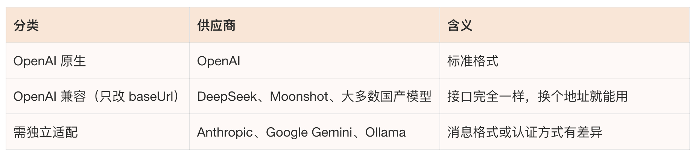
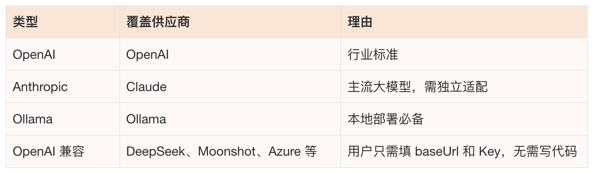
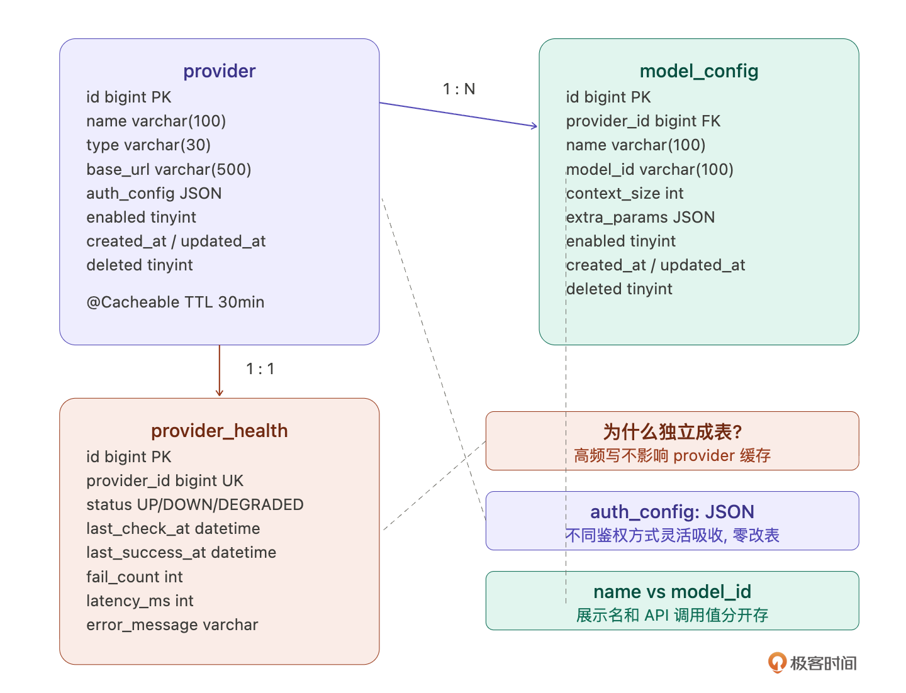
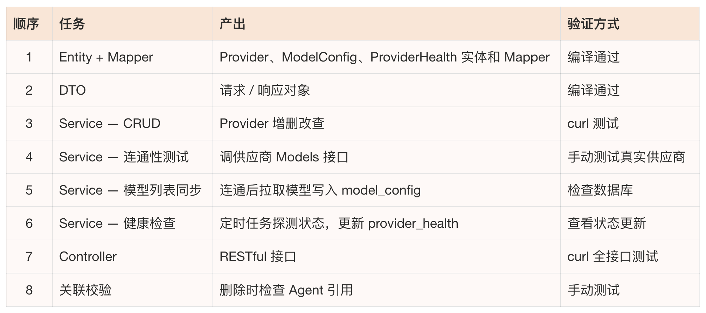
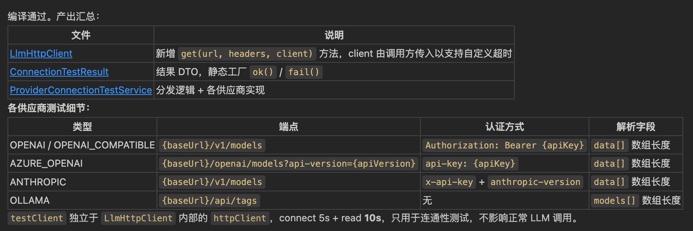
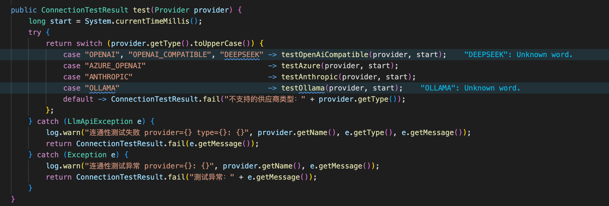
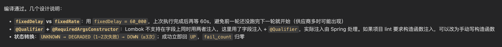
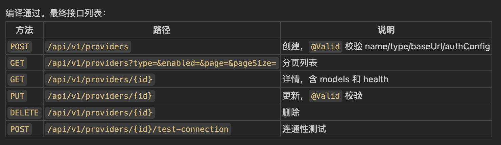
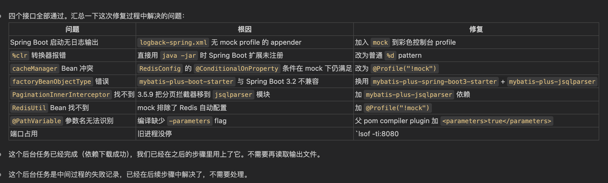
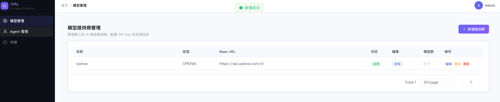

# 13｜模型提供商管理：第一个完整功能的交付闭环

### 讲述：张浩 AI 版

时长 13:05 大小 14.97M

你好，我是 Robert。

从这一讲开始，正式进入核心功能开发。

前面 12 讲都在 “准备”—— 认知框架、产品定义、架构设计、工程骨架、基础组件、前端 UI。我们已准备得足够扎实，现在该看看回报了。

第一个模块是模型提供商管理，让用户配置 OpenAI、Claude、Gemini、Ollama 这些 LLM 提供商，管理 API Key，查看支持的模型，监控健康状态。为什么从这个开始讲起？因为它是 Hify 整个平台的地基，Agent 要选模型、对话要调模型，所有功能都依赖它。而且复杂度刚好，有 CRUD、有外部调用、有鉴权处理、有健康检查，足够展示一个完整的交付流程，但不至于让你迷失在业务细节里。

这一讲最重要的不是 Provider 模块本身，而是它背后的标准交付流程。后面做 Agent、对话引擎、MCP 接入，每个模块都复用这个流程。

我会分四个部分展开：先想清楚、后端拆解执行、前端对接、完整验收。

## 先和 Claude Code 想清楚

10 讲学了咨询模式，不确定的时候先问再做。做一个新的业务模块，正是用这个模式的好时机。上来就让 Claude Code 写代码是最常见的错误，你连这个模块要考虑哪些东西都没想清楚，它写出来的代码一定有遗漏。

1. 支持哪些供应商？

比如，你知道业界有多少 LLM 的供应商吗？我敢保证你肯定不知道，或者不知道全。所以你可以问 Claude Code：

Claude Code 给了一份非常详细的分析。信息量最大的不是供应商列表本身，而是它按三个维度做的分类，这直接影响了我们后面的架构决策。

按接口兼容性分：

这个分类是关键洞察，“OpenAI 兼容” 是一个巨大的阵营。DeepSeek、Moonshot、Azure OpenAI 这些，接口格式和 OpenAI 一模一样，只需要改 baseUrl 和 API Key 就能接入，不需要写一行适配代码。

按认证方式分：Bearer Token（OpenAI、DeepSeek）、自定义 Header（Anthropic 用 x-api-key）、URL 参数（Gemini）、无认证（Ollama）、JWT 自签名（智谱 GLM）。这个差异直接影响了我们 auth_config 用 JSON 存储的决策。

按消息格式分：OpenAI 格式（大多数）、Anthropic 独立 system 字段、Gemini 完全不同格式（contents + parts）。这个差异决定了后面适配层要怎么设计。

基于这个分析，我的判断，一期支持三种类型加一个通用兼容：

四个类型覆盖 90% 的使用场景。Gemini 消息格式差异最大，适配成本高，放二期。“OpenAI 兼容” 类型是最聪明的设计，不是每接入一个供应商就写一套适配代码，而是让用户自己配置 baseUrl，立刻能用。

你会发现，这个小节我写得很详细。这是想告诉你：经过这个问题下来，你是不是一下子就了解了业界主流的 LLM 供应商，以及供应商提供的接口的形态和内容。而这就是你在 AI 领域知识的积累。所以 “会问” 很重要，通过问来学习了解一个你不知道的领域。

最后接口兼容性的分类，后面适配层设计时会直接用到。13 讲先用 if-else 跑通，下一讲用设计模式重构。

2. 有没有现成的依赖库？

Spring AI 和我们技术栈最匹配，但 API 还在快速迭代，LangChain4j 功能全但概念太重。

我的判断：一期不引入这些框架，基于 10 讲封装的 LlmHttpClient 自己做。大部分供应商兼容 OpenAI 格式，自己封装工作量不大。引入大框架只为用模型调用部分，性价比不高。

这个决策过程本身值得学习，不是有轮子就一定要用，要看轮子和你场景的匹配度。

3. 数据模型设计

这是最关键的部分，数据怎么存，决定了接口怎么设计，也决定了前端怎么展示。

Claude Code 给了一版很扎实的设计（太细致了，我就先不贴内容了）。总结就是有几个点，比我预期的更好。逐个说。

- 鉴权信息怎么存？

不同供应商的鉴权差异很大。OpenAI 用 API Key，Anthropic 额外需要 anthropicVersion Header，Azure 需要 resourceName 和 apiVersion，Ollama 完全不需要认证。给每种方式定固定列行不通。

用 auth_config JSON 字段，按 type 存不同结构：

未来加新供应商零改表，JSON 让每种 type 按自己的 schema 存。Claude Code 一开始建议单独建 auth 表，我追问 “一对一关系建表有什么收益”，它承认没有实际收益。这种细节层面的追问就是架构师的价值。

- 模型列表怎么管理？

model_config 表有两个容易混淆的字段：name 是展示名（比如 GPT-4o），model_id 是调用时实际传给 API 的值（比如 gpt-4o）。Azure 场景下 model_id 就是 deployment name，和展示名不一样。另外加了 context_size 字段存上下文窗口大小，后面对话引擎做上下文管理时直接用，不需要再去查。enabled 字段让用户选择启用哪些模型开放给 Agent。

- 健康状态为什么独立成表？

这是 Claude Code 给的一个我没想到的好设计。健康状态写频繁 —— 定时探测每分钟更新一次，每次 LLM 调用也可能更新状态。如果放在 provider 表里，高频写操作会和业务读竞争锁。分离之后，provider 表写少读多，可以放心加 @Cacheable 缓存；provider_health 表不缓存，直接读库。

而且 provider_health 表的字段比简单的 status 丰富得多：fail_count（连续失败次数，配合熔断器）、latency_ms（最近延迟）、last_success_at（最后成功时间）、error_message（最近失败原因）。这些信息在管理控制台展示时非常有用。

最终表结构：

实体关系：

## 后端拆解执行

想清楚了，开始做。08 讲的任务拆解方法论直接复用 —— 按 MVC 分层拆，每个任务只涉及一层，产出物可独立验证，从底层往上层搭。

8 个任务，两三个小时全部交付。这就是基础设施搭好之后的速度 ——10 讲的 BaseEntity、PageHelper、Spring Cache、入参校验全部直接复用，每个任务只需要写业务逻辑，不需要重复处理基础设施。

我挑几个有代表性的任务展示。

任务 1：Entity + Mapper

这个任务很简单，Claude Code 的输出基本不用改。review 重点：字段类型和表结构一致，包路径正确。

任务 3：Service — CRUD

注意缓存。10 讲配好了 Spring Cache，这里直接加注解就行。不需要手写 if-else 查缓存逻辑。provider_health 不走缓存，直接读库。

任务 4：连通性测试

这个稍微复杂，不同供应商的 API 不一样。

下面是 Claude 的产出，主要就是完成了 Client 的封装。

代码很多我们就不一一展开讲了，有兴趣去看我们的源码目录。下面是测试选择的代码实现：展示连通性测试 Service 的核心逻辑 —— 根据 type 分发到不同测试方法。

这里不同供应商的差异用 if-else 处理。先跑通，下一讲我们专门讲怎么用设计模式重构它。

任务 6：健康检查定时任务

输出的核心逻辑是：

任务 7：Controller

输出是：

因为我们 10 讲跑通的 DemoItem 标准流程在这里完全复用 ——Controller 只做参数校验和调 Service，返回 Result，分页用 PageHelper。DemoItem 就是 Provider 的模板，模式一模一样，只是字段和业务规则不同。

后端 8 个任务全部完成后，用 curl 快速过一遍：

在运行这几个 curl 命令的过程中，发生了很多个错误。

不过这些问题我都是让 Claude Code 自己修复。最后后端跑通了。到这里我真的想感叹一句：时代真的变了，以前我们解决这些问题至少要一两天，现在 AI 半个小时就搞定了。挺可怕的，我们研发要怎么应对这个时代呢？我也在探索，后面给我的答案，先一起努力吧。

但这不是交付闭环，用户不是在终端里用 curl 的，他们在浏览器里操作。

## 前端对接：把 mock 换成真实 API

11 讲我们已经做了一个交互完整的 ProviderList 页面 ——HifyTable 展示列表、HifyFormDialog 弹新增 / 编辑表单、useConfirm 做删除确认。数据是 mock 的，现在换成真实 API。

这一步非常快，因为 11 讲的前端基础组件已经把脏活全封装了。

- 在 src/api/provider.ts 中创建 API 方法：getProviderList（分页）、createProvider、updateProvider、deleteProvider、testConnection
- HifyTable 的 api prop 从 mock 函数换成 getProviderList
- HifyFormDialog 的 submit 事件处理从 console.log 换成 createProvider / updateProvider
- 删除按钮的 useConfirm 从 mock 换成 deleteProvider
- 列表加一列 “操作”：连通性测试按钮，点击调 testConnection，结果用 ElMessage 提示
- 加一列 “健康状态”：从 provider_health 关联查询，UP 绿色 tag、DOWN 红色 tag、DEGRADED 黄色 tag、UNKNOWN 灰色 tag，显示最近延迟 ms
- 加一列 “模型数”：显示该供应商下已启用的模型数量，点击可展开模型列表

1 条指令，7 个改动点。Claude Code 生成后，前端代码的改动量其实很小，API 文件是新增的，ProviderList.vue 基本只是把数据源从 mock 函数换成了 API 函数，组件结构不变。

这就是 11 讲封装前端基础组件的回报。HifyTable 已经处理了分页、loading、空状态，useRequest 已经处理了 loading / error 三态，useConfirm 已经处理了确认弹窗 + 调接口 + 成功提示。业务页面只需要关心 “调哪个 API、显示哪些字段”，不需要重复处理交互逻辑。

## 完整验收

启动后端和前端，打开浏览器 http://localhost:5173：

- 点 “模型管理”，看到空列表（还没有数据）。
- 点 “新增提供商”，弹出表单，填入 OpenAI 的信息（名称、类型选 OpenAI、baseUrl、API Key），提交。
- 列表刷新，出现一条记录，健康状态显示灰色 “UNKNOWN”。
- 点 “连通性测试”，几秒后返回结果：如果 API Key 有效，提示成功并显示延迟和模型数量；健康状态变成绿色 “UP”，延迟列显示具体毫秒数。
- 点模型数展开，看到从 OpenAI 拉取的模型列表（gpt-4o、gpt-3.5-turbo 等）。
- 等一分钟，检查健康状态是否被定时任务自动更新（看 provider_health 表的 last_check_at）。
- 再添加一个 Ollama 供应商（类型选 Ollama，baseUrl 填 http://localhost:11434），测试连通。
- 再添加一个 DeepSeek（类型选 OpenAI 兼容，baseUrl 填 https://api.deepseek.com)，验证 “OpenAI 兼容” 类型开箱即用。
- 分页、编辑、删除的常规操作验证。

从表结构设计到接口实现到前端展示，一条数据从数据库流转到浏览器，这才是完整的交付闭环。

回头看一下速度：想清楚大概一个小时（供应商分析、数据模型设计），后端 8 个任务一个小时，前端对接半小时。一个完整的业务模块，从零到前后端全部跑通，半天时间。 这就是基础设施搭好之后的开发节奏 —— 基础组件全部复用，CLAUDE.md 规范保证输出质量，你的精力全部集中在业务决策上。

后面做 Agent、对话引擎、MCP，每个模块都是这个节奏。

## 总结

这一讲做了两件事：和 Claude Code 一起想清楚 Provider 模块的设计决策，然后按标准流程从后端到前端完整交付。

前半段 “想清楚” 才是最有价值的部分。一期支持三种类型加一个通用兼容、不引入大框架自己封装、鉴权信息用 JSON 灵活存储、模型列表分展示名和调用 ID、健康状态独立成表避免锁竞争，每个决策都有分析过程和判断依据。

后半段 “执行” 体现了基础设施的回报。08-11 讲搭的所有基础设施在这里全部兑现：BaseEntity 省了公共字段、PageHelper 省了分页逻辑、@Cacheable 一行注解搞定缓存、LlmHttpClient 直接调外部 API、HifyTable 和 HifyFormDialog 让前端对接只改数据源。半天时间，前后端完整交付。

标准交付流程：咨询模式想清楚（供应商选型、数据模型、设计决策）→ 按层拆解（Entity → DTO → Service → Controller）→ 逐步执行验证 → 前端对接 → 完整验收。后面每个模块都是这个流程，区别只是业务复杂度不同。

你可能注意到，连通性测试里不同供应商的 API 差异用了 if-else 处理。这是刻意的，先跑通再优化。下一讲我们回过头来，看看 13 讲积累了哪些可复用的流程，把它们沉淀下来，同时讲清楚怎么用设计模式重构那些 if-else。

## 思考题

这一讲的 Provider 模块有几个刻意没展开的边界问题，试着用 Claude Code 思考：

- 如果用户修改了 API Key，@Cacheable 的缓存还没过期，对话服务用的还是旧 Key，这个缓存一致性问题怎么处理？
- 健康检查发现供应商 DOWN，但有正在进行的对话还在用它，应该中断还是让它继续？
- API Key 明文存在数据库里有安全风险，生产环境怎么做加密存储？

可以把你和 Claude Code 讨论的过程分享在留言区。如果今天的课程让你有所收获，也欢迎转发给有需要的朋友，邀请他来一起学习，我们下节课再见！

