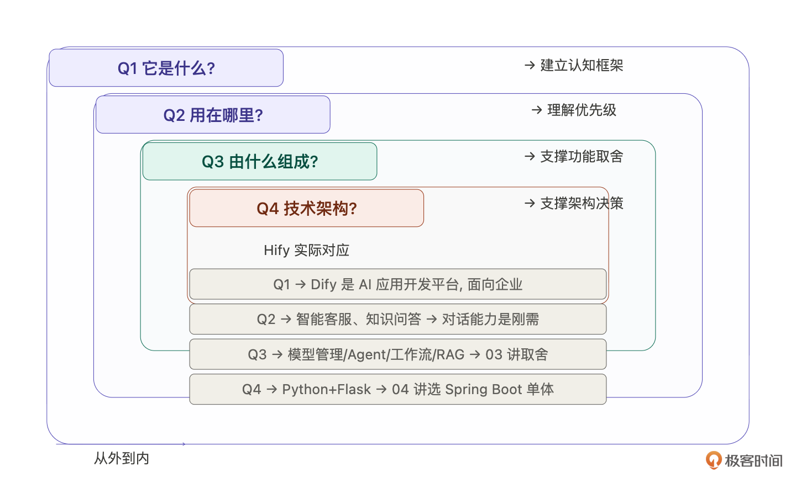
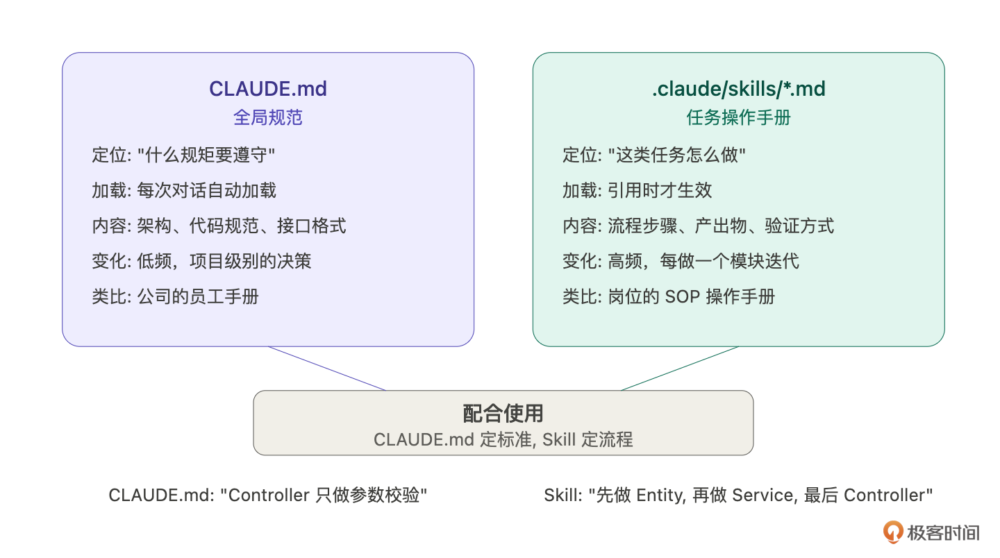
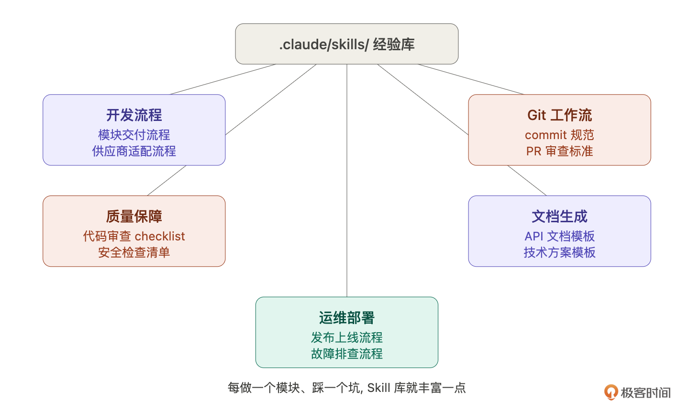
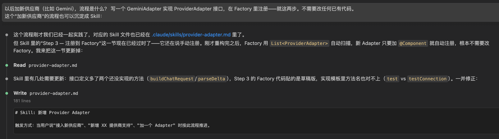
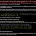

# 14｜把经验变成 Skill：让 Claude Code 自动按流程走

### 讲述：张浩 AI 版

时长 14:17 大小 16.34M

你好，我是 Robert。

13 讲我们做完了 Provider 模块，从供应商分析、数据模型设计、后端 8 个任务到前端对接，半天交付。在继续做下一个模块之前，我们先停下来做两件事。

第一件事：回头看看 13 讲里真正决定模块质量的是什么。不是代码，是代码之前的那些判断 —— 支持哪些供应商、鉴权信息怎么存、健康状态要不要独立成表。这些判断靠的是领域知识。

第二件事：13 讲的交付流程是固定的 —— 咨询→设计→拆解→执行→前端对接→验收。后面做 Agent、对话引擎、MCP，每个模块都是这套流程。既然固定，为什么不把它告诉 Claude Code，让它以后自动按流程走？

这一讲我们就解决这两个问题。

## 领域理解：被低估的瓶颈

回头看 13 讲，Claude Code 写代码很快，8 个任务两三个小时全部交付。但真正决定这个模块做成什么样的，不是代码，而是代码之前的那些判断 —— 一期支持哪些供应商、要不要引入 LangChain4j、鉴权信息怎么存、健康检查怎么做。这些判断没有一个是 Claude Code 替我做的。它给选项，我做取舍。

如果这些判断做反了会怎样？引入 LangChain4j，你多了一层重依赖和学习成本。鉴权信息用固定列存，后面加新供应商就得改表。健康状态放在 Provider 表里，高频探测和业务读竞争锁。每个选择单独看都有道理，合在一起就是一个越来越难维护的系统。

取舍的依据是什么？是你对这个领域的理解。Claude Code 让执行成本趋近于零之后，领域理解的权重不是降低了，而是大幅提升了。

好消息是，领域知识不是只能靠经验慢慢积累。Claude Code 本身就是一个极好的领域学习工具，关键是你要问对问题。

### 领域快速理解四问

我在动手做 Hify 之前，用 Claude Code 跑了一轮系统性的领域梳理。不是漫无目的地问 “Dify 是什么”，而是按一个固定结构问。

第一问：它是什么，解决什么问题？建立认知框架。Dify 是 AI 应用开发平台，让不会写代码的人也能搭建 AI 应用。这决定了产品定位，它是平台型产品，不是开发者工具。

第二问：用在哪里，什么场景？理解优先级。企业用 Dify 主要做智能客服、内部知识问答、文档处理。这决定了对话能力和工具接入是刚需，工作流编排是进阶需求。13 讲从 Provider 开始做，就是因为理解了场景后知道：没有模型管理，后面所有功能都没有基础。

第三问：由什么组成，哪些是必要的？支撑功能取舍。Claude Code 列出模型管理、Agent、工作流、RAG、对话、工具接入等模块。追问 “哪些是必须有的”，它帮你区分核心和外围，03 讲的功能取舍直接基于这一步。

第四问：技术架构是怎样的？支撑架构决策。了解到 Dify 后端是 Python + Flask，用 Celery 做异步任务 —— 不是照抄，而是理解它为什么这么选，然后根据自己的约束做不同选择。04 讲选 Spring Boot 模块化单体，就是在理解了 Dify 架构复杂度之后的判断。

四个问题从外到内，一两个小时建立 70% 的领域认知，剩下 30% 靠亲手用一下产品、翻一下文档来补。

这套方法不只适用于 Dify。你要做订单系统、监控平台、数据管道，都是同样的路径，先用四问建立全局认知，再进入产品定义和架构设计。拿到任何一个陌生项目，先跑一轮四问，你就知道该做什么、不做什么、先做什么。

## Skill：让 Claude Code 教你

回到 13 讲的交付过程。你有没有发现，整个流程是固定的？咨询→设计→拆解→执行→前端对接→验收。后面做 Agent、对话引擎、MCP，每个模块都是这五步。既然流程固定，每次都手动给 Claude Code 描述一遍就是浪费。

Claude Code 有一个 Skill 机制，专门解决这个问题。但与其我来讲概念，不如让 Claude Code 自己教你。

### 第一步：让 Claude Code 教你 Skill 是什么

提示词是：

Claude Code 会告诉你：

Skill 是 .claude/skills/ 目录下的 Markdown 文件，定义特定任务的标准操作流程。你可以理解为给 Claude Code 的 “操作手册”。

和 CLAUDE.md 的区别：

CLAUDE.md 是全局规范，即 “什么规矩要遵守”，每次对话自动加载。Skill 是具体任务的操作手册，即 “这类任务怎么做”，在你引用时才生效。CLAUDE.md 定义了 “Controller 只做参数校验” 这种通用规矩，Skill 定义了 “做一个新模块应该先梳理需求再拆解再执行” 这种具体流程。

怎么用：给 Claude Code 指令时提到 Skill 的名字，它就会按 Skill 定义的流程执行。比如 “按模块交付 Skill 的流程，帮我做 Agent 模块”。

看，你不需要去翻文档学 Skill 的用法，问 Claude Code 它就教你了。这和 10 讲的咨询模式一模一样，不懂就问，它见过的项目比你多。所以，把 AI 当做工具，把 AI 当作老师。

### 第二步：让 Claude Code 告诉你别人怎么用 Skill 提示词是：

Claude Code 给的回答会打开你的视野，原来 Skill 不只能写开发流程。

- 开发流程类：新模块交付流程、API 接口开发流程、数据库变更流程。就是我们 13 讲干的事。
- 质量保障类：代码审查 checklist、单元测试编写规范、安全检查清单。比如每次写 Service 方法都要检查：入参校验了吗？异常处理了吗？缓存失效了吗？日志打了吗？
- 运维部署类：发布上线流程、环境搭建流程、故障排查流程。把运维经验固化，新人也能按流程操作。
- 文档生成类：API 文档生成、变更日志生成、技术方案模板。每次写文档不用从零开始，Skill 定义了结构和必填项。
- Git 工作流类：commit message 规范、分支管理流程、PR 审查标准。

这些你不需要现在全做，但知道别人怎么用，你对 Skill 的理解会从 “一个功能” 变成 “一种工作方式”。Skill 的本质是把经验编码化 —— 你踩过的坑、总结的流程、做过的判断，全部固化成文字，让 Claude Code 以后自动按你的经验走。

### 第三步：让 Claude Code 帮你写 Skill 知道了 Skill 是什么、别人怎么用，现在让 Claude Code 帮你写。

- 先用咨询模式梳理了供应商选型、数据模型设计、边界问题
- 数据模型确定后更新了 schema.sql
- 后端按 MVC 分层拆解：Entity + Mapper → DTO → Service（CRUD+ 连通性测试 + 模型同步 + 健康检查）→ Controller
- 每步编译或 curl 验证通过再进下一步
- 前端对接：创建 API 文件，把 mock 数据源换成真实 API
- 完整验收：后端 curl + 浏览器全流程

Claude Code 生成第一版，你 review。我的 review 重点：

- 产出物是否明确？不是 “做需求分析” 就完了，而是 “产出需求分析文档，包含功能范围、数据模型 DDL、设计决策及理由”。Claude Code 需要知道做到什么程度算完。
- 决策点是否标注？数据模型设计完、后端做完准备做前端之前 —— 这些是你要拍板的地方，Skill 里要写 “等待用户确认后再进入下一步”。
- 踩过的坑有没有写进去？比如，Entity 的 JSON 字段必须用 TypeHandler、schema.sql 要同步更新、前端对接时要更新路由配置。这些是 13 讲实际踩过的，写进 Skill 下次就不会重复踩。

review 完让 Claude Code 改，改完就是你的第一个正式 Skill。生成的 Skill 如下，就不展开说明了，你可以拿着这个 Skill 内容去问 AI 是什么意思：

然后用同样的方式让它写第二个 Skill，供应商适配：

provider-adapter.md 完整内容如下：

在我们写了两个 Skill 后，你就会发现：

- 原来 Skill 就是写 MarkDown 文档。
- Skill 就是按格式定规范，在 MarkDown 里面写好规范，让 Claude Code 去识别执行。

接下来我们实际跑一遍 Skill，看一下它的用途。

### 实际跑一遍：用 Skill 启动 Agent 模块 Skill 写好了，当场验证。给 Claude Code：

Claude Code 读到 Skill 后，自动按流程走。它会问你 Agent 模块的核心功能是什么、涉及哪些关联（绑定模型、绑定工具）、数据模型怎么设计，然后给出需求分析文档，标注 “等待用户确认”。

对比没有 Skill 时：你要手写一大段指令描述整个流程，先帮我分析需求，然后设计数据模型，然后按 Entity、DTO、Service、Controller 的顺序拆解…… 现在一句话就够了。

而且 Skill 保证了流程一致性，不管是你自己做还是团队里其他人做，引用同一个 Skill，产出的代码结构和质量标准是一样的。

我不会在这一讲展开 Agent 模块的具体实现（那是下一讲的内容），但你已经看到了 Skill 驱动开发的效果：你的经验在 Skill 里积累，Claude Code 按你的经验走，你只需要在关键决策点拍板。

### Skill 也需要迭代

最后提一点：第一版 Skill 不会完美。

你用模块交付 Skill 做了 Agent 模块，可能发现 Skill 里没提 “跨模块依赖怎么处理”——Agent 依赖 Provider 和 MCP，这在 13 讲做 Provider 时没遇到。把这个补进 Skill。

做了对话引擎，可能发现 Skill 里的后端拆解不适用于流式响应场景，需要加一条 “如果涉及 SSE 流式响应，Service 层用 SseEmitter + llmExecutor”。补进去。

Skill 和 CLAUDE.md 一样是活文档。02 讲说的 SDD 闭环 —— 定规范→AI 执行→发现问题→迭代规范 —— 在 Skill 上同样适用。每做一个模块，Skill 就更完善一点。做到第四五个模块的时候，你的 Skill 已经覆盖了绝大多数场景，Claude Code 几乎不需要额外指导就能按你的标准交付。

## 用 Skill 思维重构 if-else

13 讲连通性测试里，不同供应商的 API 差异用了 if-else 处理。当时说 “先跑通，下一讲重构”。现在来做。

重构本身不复杂，用策略模式替代 if-else：

- 定义 ProviderAdapter 接口：testConnection (provider)、listModels (provider)
- 实现四个适配器：OpenAiAdapter、AnthropicAdapter、OllamaAdapter、OpenAiCompatibleAdapter（和 OpenAiAdapter 共用逻辑）
- 创建 ProviderAdapterFactory：根据 provider.type 返回对应的 Adapter 实例
- ProviderService 里的 if-else 替换为 factory.getAdapter(provider.getType()).testConnection(provider)
- OpenAiCompatibleAdapter 直接继承 OpenAiAdapter，不需要额外代码

这个指令我就不分析输出了，因为重要的是这个问题和指令本身。

重构完之后，思考一个问题：以后加新供应商（比如 Gemini），流程是什么？ 写一个 GeminiAdapter 实现 ProviderAdapter 接口，在 Factory 里注册 —— 就这两步。不需要改任何已有代码。

这个 “加新供应商” 的流程也可以沉淀成 Skill：

如上图所示，我们不用去写一行代码，这个 Skil 也沉淀下来了。所以你看，Skill 不只是大流程，小流程也可以沉淀。大的 “模块交付 Skill” 覆盖通用的模块开发流程，小的 “供应商适配 Skill” 覆盖特定场景的操作步骤。积累下来，你的 .claude/skills/ 目录就是一个越来越丰富的经验库。

## 总结

这一讲做了三件事：讲清楚领域理解的重要性、让 Claude Code 教你 Skill 并帮你写 Skill、用策略模式重构 if-else 并沉淀适配 Skill。

也就是从方法论上总结，我们应该怎么思考问题，应该让我们的思考到执行模板化。这里展开说一下，AI 给我们带来的最大的效率提升，是它能帮我们做很多模板化的事情。有一个经验是：脏活累活，我们嫌烦没有技术含量的，都是适合 AI 做的。

两个方法论输出：

- 领域快速理解四问。进入一个陌生领域时用 —— 是什么、用在哪里、由什么组成、技术架构怎样。一两个小时建立 70% 的认知，支撑产品定义和架构决策。
- Skill 沉淀。不需要你自己研究 Skill 怎么写 —— 让 Claude Code 教你概念、告诉你别人怎么用、帮你把经验写成 Skill 文件。你只需要做两件事：把你的实际流程描述给它，以及 review 它生成的 Skill 是否准确。Skill 也是活文档，每做一个模块就迭代一次，越来越完善。

从下一讲开始，每个模块都用 Skill 驱动开发。你会明显感觉到节奏变快了，不是因为 Claude Code 变聪明了，而是你的经验在 Skill 里持续积累，它按你的经验走，你只在关键决策点拍板。

## 思考题

回顾你过去做项目的经验，有没有哪些 “每次都要做、每次都差不多” 的流程？比如接入一个新的第三方 SDK、搭建一个新的微服务、做一轮性能测试。选一个，试着把它写成一个 Skill。Skill 应该覆盖：第一步做什么、第二步做什么、每步的输出是什么、怎么验证。写完之后让 Claude Code 按这个 Skill 执行一次，看看效果如何。

期待你的分享！如果今天的课程让你有所收获，也欢迎转发给有需要的朋友，邀请他来一起学习，我们下节课再见！

