# 15｜Agent 创建与配置：复杂业务逻辑的拆解策略

### 讲述：张浩 AI 版

时长 15:43 大小 17.98M

你好，我是 Robert。

这一讲做 Agent 模块。

我先假设一件事情：在做 Hify 之前，假设我对 Agent 这个概念的理解非常模糊。知道这个词很火，知道大概是 “能用工具的 AI”，但要我说清楚 Agent 在一个 AI 平台里到底是什么、数据怎么存、和模型是什么关系，说不上来。这可能就是你的直观感觉。

这恰好是一个很好的教学场景。你在工作中接到的大部分需求，一开始也是不懂的。以前不懂就去搜、去问同事、去翻文档，花很多时间。现在你有 Claude Code，加上这门课教的方法论 —— 从领域理解到数据建模到拆解执行 —— 不懂的东西可以快速搞懂并落地实现。

这一讲的核心不是 Agent 模块本身，而是这个 “现学现卖” 的过程。

## 我不知道 Agent 是什么，Claude Code 教我

14 讲刚学了领域快速理解四问。直接用。

Claude Code 的输出是：

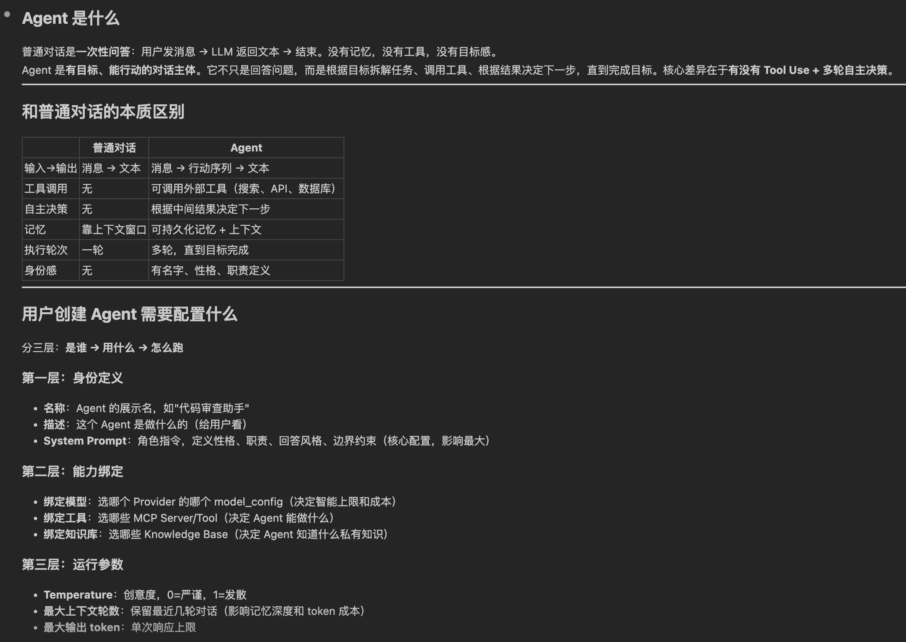

你看其实非常清晰了。这个回答帮我建立了清晰的认知：

普通对话是一次性问答 —— 用户发消息、LLM 返回文本、结束。没有记忆，没有工具，没有目标感。

Agent 是有目标、能行动的对话主体。它不只是回答问题，而是根据目标调用工具、根据结果决定下一步。核心差异在于有没有 Tool Use + 多轮自主决策。

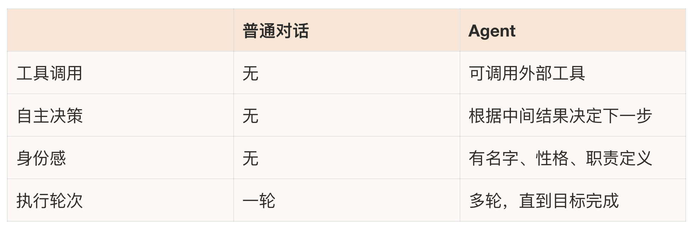

创建 Agent 要配三层东西：

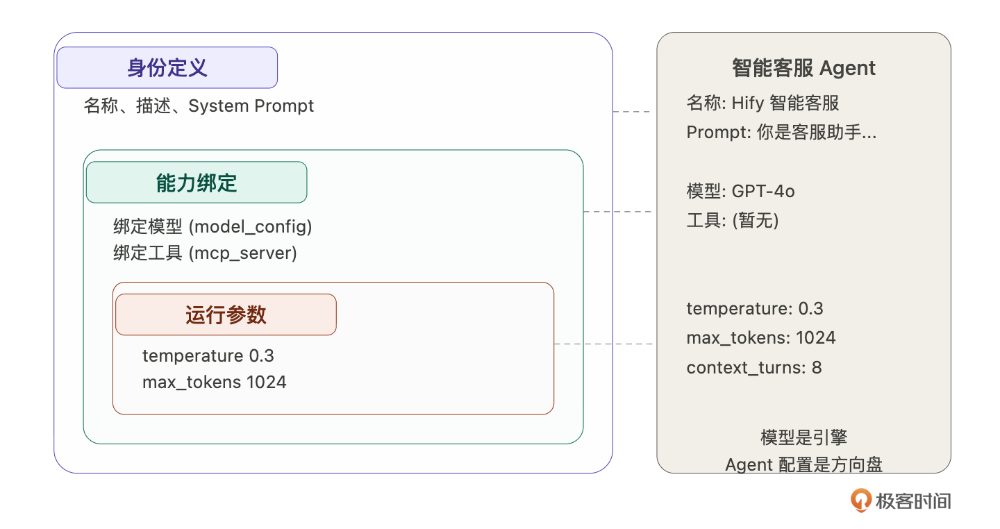

- 第一层：身份定义。名称、描述、System Prompt（角色指令，定义性格、职责、回答风格、边界约束 —— 这是 Agent 的 “灵魂”）。
- 第二层：能力绑定。绑定模型（选哪个 Provider 的哪个 model_config）、绑定工具（选哪些 MCP Server）、绑定知识库（选哪些 Knowledge Base，后面做 RAG 时再讲）。
- 第三层：运行参数。temperature（创意度，0= 严谨，1= 发散）、最大输出 token、最大上下文轮数（保留最近几轮对话，影响记忆深度和 token 成本）。

Claude Code 还给了一个关键判断 ——Hify 的 Agent 边界：

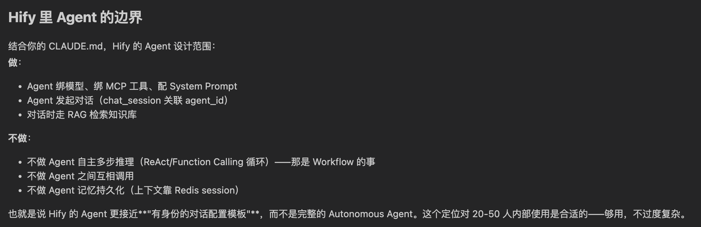

- 做：Agent 绑模型、绑 MCP 工具、配 System Prompt，Agent 发起对话。
- 不做：不做 Agent 自主多步推理（ReAct / Function Calling 循环，那是 Workflow 的事）、不做 Agent 之间互相调用、不做 Agent 记忆持久化（上下文靠 Redis session）。

也就是说 Hify 的 Agent 更接近有身份的对话配置模板，而不是完整的 Autonomous Agent。这个定位对 20-50 人内部使用是合适的，够用，不过度复杂。

到这里你会发现，Claude Code 不止是一个写代码的程序员，还是一个专家，一个导师。

## 从概念映射到数据结构

理解了 Agent 是什么，下一步自然是：这些信息怎么存？而我们刚刚了解了 Agent 是什么。在以往的流程中，我们需要再深度花时间去理解，才有可能把 Agent 映射为程序的语义，比如 Agent 在存储中怎么表示的。

一般情况下，当一个概念，被我们映射为存储的结构表示，那就说明，我们已经理解它了。接下来我们让 Claude Code 帮我们加速这个事情。

这次的提示词是：

内容太多，就不贴出来了。总结下，Claude Code 给了数据模型设计，还主动对比了参数存储的三种方案。注意，AI 很擅长对比，这里就考验我们选型决策的能力了，这点你只能慢慢养成。

3 张表就够：agent 主表、agent_tool 关联表。chat_session 已有 agent_id 外键不需要新表。知识库关联先不做，等 RAG 模块开发时再加 agent_knowledge 关联表。

模型参数怎么存？ Claude Code 对比了三种方案：

- 方案 A（字段打散存）：temperature、max_tokens、max_context_turns 各一列。查询直接、类型约束清晰，加参数要 ALTER TABLE。
- 方案 B（JSON 列存）：灵活，加参数不改表，但无法 SQL 直接过滤，多一层解析。
- 方案 C（混合）：固定参数打散，扩展参数放 JSON。

我的判断：选方案 A。Hify 当前参数就三个，不过度设计。和 13 讲 auth_config 用 JSON 的决策不同 ——auth_config 的字段按供应商类型完全不同，JSON 是必须的；Agent 参数对所有 Agent 都一样，打散存更简单。同样的技术手段不是到处套用，要看具体场景。

agent_tool 绑 Server 还是绑 Tool？Claude Code 提了一个我没想到的问题：关联的是整个 MCP Server，还是 Server 下的某个具体工具？绑 Server 意味着 Agent 自动获得该服务的所有工具（新工具自动生效），绑 Tool 是精细管控（更繁琐）。

我的判断：绑 Server。20-50 人内部使用，不需要精细管控到单个工具。简单优先。

最终表结构：

几个细节：temperature 用 DECIMAL (3,2) 不用 FLOAT，避免精度问题。max_context_turns 直接存在 agent 表上，对话引擎读取时不需要额外查询。agent_tool 加了联合唯一索引防止重复绑定。

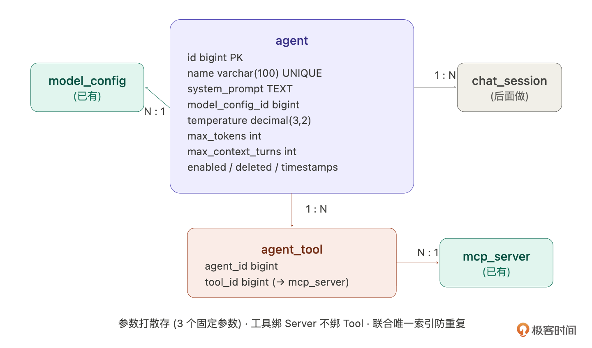

## 从 Agent 到 LLM 应用：智能客服

概念和数据结构都有了。现在来看看它在真实业务中是什么样的。

Hify 是一个 AI Agent 平台，它的价值是：你可以在上面创建各种 LLM 应用。智能客服、代码审查助手、数据分析顾问、会议纪要生成器，这些本质上都是不同配置的 Agent。一个平台，无限种可能。

我们用智能客服来展开。这是最典型的企业 AI 落地场景，也是我们后面整个课程的主线 —— 对话引擎做完后用它测试对话，RAG 做完后给它加产品知识库，MCP 做完后给它绑查订单工具。从这一讲开始，智能客服会贯穿到课程结束。

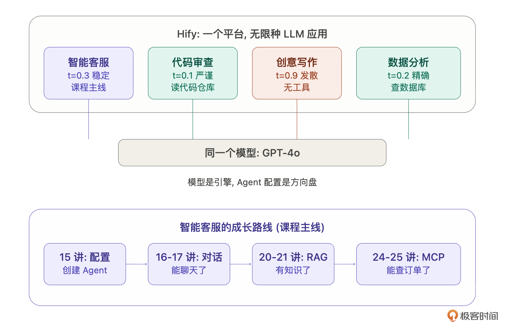

如果你是产品经理，你会怎么定义这个智能客服？智能客服顾名思义，就是根据可以根据不同的问题给出答案的虚拟人。那么它怎么对应到上面的数据结构呢？ 我们来一一对比下。

- 选模型：GPT-4o。为什么不选更便宜的 GPT-3.5-turbo？客服场景需要准确理解用户的问题，尤其是涉及产品功能的专业描述。3.5 容易理解偏差，4o 更稳。成本上，内部 20-50 人的使用量，4o 的费用完全可控。
- 写 System Prompt：这是 Agent 的灵魂。不是随便写一句 “你是客服” 就行了，每一条指令都有用意：

拆解一下：

- 语气专业友好：不要太机械也不要太随意。
- 回答简洁明了：客服场景用户要的是答案不是长篇大论。
- 超出知识范围诚实告知：这是最关键的一条，防止模型 “幻觉” 编造不存在的功能。
- 引导联系人工客服：给用户一个兜底方案。

- 调参数：temperature 设 0.3。为什么不是默认的 0.7？客服回答要稳定可靠，同一个问题问两次，答案应该基本一致。temperature 越高越有创意，但也越不可控，客服场景要的是可靠不是创意。如果是创意写作助手，可能会设 0.8 甚至 0.9。
- max_context_turns 设 8。为什么不是 20？每多保留一轮对话上下文，就多消耗一轮的 token 费用。客服场景大部分问题 3-5 轮就解决了，8 轮留够余量。设太大会浪费 token，而且太长的上下文反而会让模型 “走神”。
- 工具暂时不绑。MCP 工具接入在后面的课程里讲。到时候可以给客服绑一个 “查订单状态” 的工具、一个 “搜索产品知识库” 的工具，客服就不只是靠模型的通用知识回答了，而是能查真实数据。

你看，我们已经把智能客服和 Agent 的数据存储结构对应上了。你会发现配置不是随便填的，每个值背后都有产品思考。同样的模型，换一套配置就是完全不同的应用。

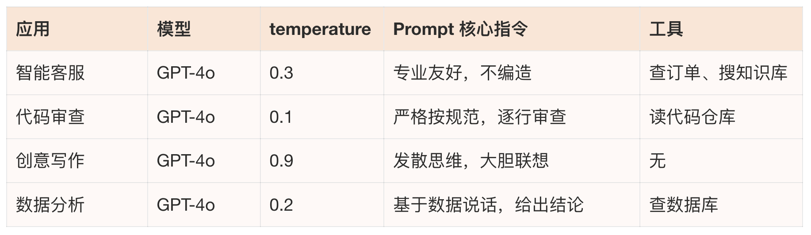

模型是引擎，Agent 配置是方向盘。Hify 的价值就是让你可以自由组装这些方向盘。到了这里，你应该对 Agent 有一个具体的概念了。

## 拆解 Agent 的 CRUD

那么智能客服的配置想清楚了，接下来回到技术实现，Agent 模块的 CRUD 怎么做。

Claude Code 的拆解让我意识到 Agent CRUD 远不是简单的单表操作：

- 创建：前端发 POST 请求 → Controller 参数校验（name 非空、modelConfigId 非空、temperature 0~1）→ Service 检查 name 唯一性 → 跨模块校验 modelConfigId 存在且 enabled（调 ProviderService 接口，不直接查 mapper）→ INSERT agent 主表 → 如果 toolIds 非空，批量 INSERT agent_tool → 清除缓存 → 返回详情。
- 列表查询：先分页查 agent，再批量查各 agent 的工具数量（SELECT agent_id, COUNT(*) FROM agent_tool WHERE agent_id IN (...) GROUP BY agent_id）。不 JOIN，不 N + 1—— 批量 IN 查询是最优平衡。
- 详情查询：查 agent + 查关联的 mcp_server 列表，组装完整响应。加 @Cacheable。
- 更新工具列表：Claude Code 对比了两种方案。方案 A 全量替换（DELETE 再 INSERT），方案 B 增量 diff。它推荐方案 A，agent_tool 数据量小，全删重插没性能问题，逻辑简单。我同意。不是所有场景都需要最优雅的方案，够用且简单就是最好的。

但 Claude Code 提了一个我没想到的设计问题：toolIds 不传的时候是 “清空工具” 还是 “不修改工具”？ 两种语义都合理，但实现不同。它建议拆成独立接口，Agent 基本信息和工具绑定分开更新：

语义更清晰，不存在歧义。我拍板：就这样。

- 删除：不做对话会话拦截 ——agent 删了，进行中的对话自然找不到 agent 配置返回错误，接受这个行为。级联删 agent_tool（物理删除，关联表没有逻辑删除的意义），agent 本身逻辑删除（deleted = 1）。chat_session 里的 agent_id 不处理，历史会话保留。

总结的流程如下：

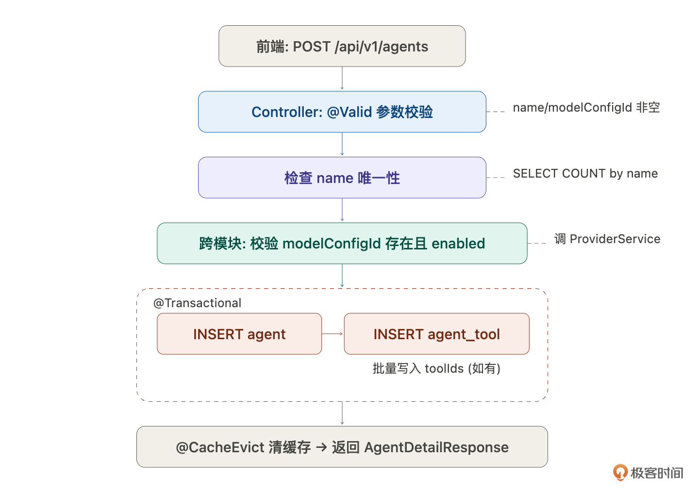

## 逐步执行

需求拆解清楚了，按 13 讲建立的标准流程 —— 按层拆，每步可验证。

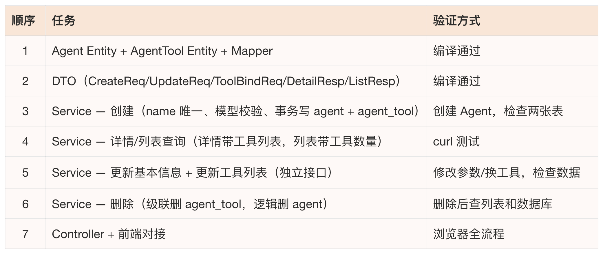

因为篇幅原因，这里只重点说任务 3。

关键是把每一步的前置条件和异常情况都写清楚。如果只说 “创建 Agent”，Claude Code 大概率漏掉 name 唯一校验或者忘了跨模块调 Service 而直接查 mapper。需求描述的细致程度决定了代码的正确程度。

此时你会发现，好像没指令诶，怎么搞？给你看一下我的输入指令：

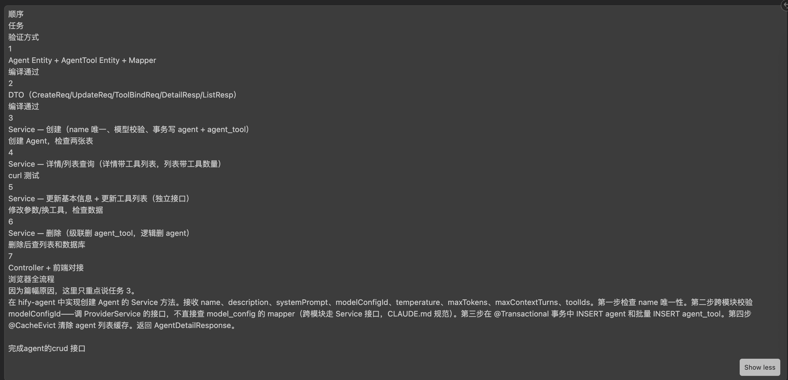

你会发现是上面的内容的复制，格式混乱，不是一个标准的指令。但是 Claude Code 也能理解，也能完成主体的工作。在 Agent 看来，这种格式的指令和我们人类看起来规范的指令是一样的。这点是很有意思的。

它的输出是这样子的：

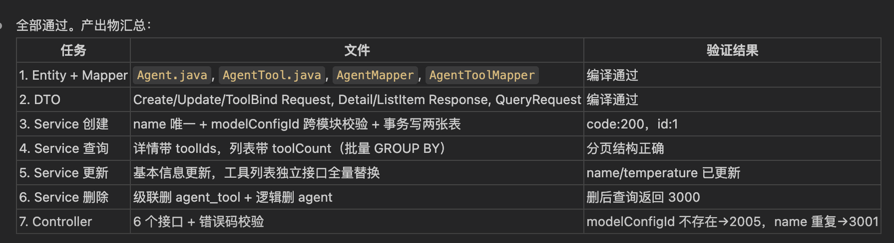

此时，我也不知道能不能跑。然后我给了下面这个指令：

然后输出是：

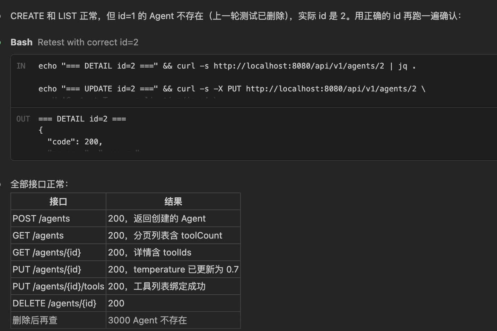

惊喜发现，第一遍就没错，不用修改。是不是挺厉害的。

当然，你会看到有那种全自动的，一跑跑几天，中间不用你的任何介入，把应用做出来的。这块我们可以留言区讨论，你可以先思考下。

## 前端对接

接下来我们来完成前端页面，Agent 的管理页面比 Provider 复杂一些，我给的指令是下面这样子的：

模型选择的下拉要联动 Provider—— 用 Element Plus 的 el-select + option-group，按供应商分组展示已启用的模型。

## 验收：创建你的第一个 LLM 应用

Agent 模块做完了，后端接口跑通了，前端管理页面也对接了。现在打开浏览器，创建你的第一个 LLM 应用。

在 Agent 管理页面点 “新增 Agent”，填入我们在第三部分设计好的智能客服配置：

- 名称：Hify 智能客服
- 描述：处理售前咨询和产品使用问题
- 模型：选 GPT-4o
- System Prompt：贴入那段客服指令
- temperature：拖到 0.3
- max_tokens：1024
- max_context_turns：8

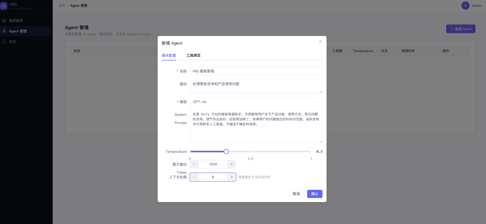

点保存。列表里出现了 “Hify 智能客服”，模型显示 GPT-4o，状态正常。

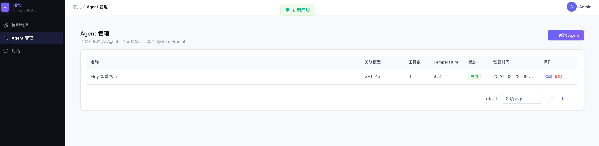

你也可以试试自己再创建一个 “代码审查助手”。同样选 GPT-4o，但 temperature 改 0.1，Prompt 完全不同。两个 Agent 并排显示在列表里，同一个模型，完全不同的用途。

你的第一个 LLM 应用诞生了。

当然，现在它还不能对话 ——Agent 只是一份配置，还需要对话引擎来驱动它。下一讲做对话引擎，做完之后你就能真正和智能客服聊天了。到讲 RAG 时，给它加上产品知识库，它就能回答具体的产品问题。到讲 MCP 时间，给它绑上查订单工具，它就能帮用户查真实数据。

从配置到对话到知识到工具，智能客服会一步步变得越来越强。这就是后面课程的主线。

## 回过头看：如果用 Skill 呢？

这一讲我全程用指令手动做：从理解 Agent 概念、到设计数据模型、到拆解任务、到逐步执行。整个过程和 13 讲做 Provider 几乎一模一样。

如果用 14 讲写的模块交付 Skill：

一句话启动，Claude Code 自动按 Skill 的流程走 —— 梳理需求、设计数据模型、等你确认、按层拆解执行。

两种方式的选择标准：第一次接触某个业务概念时用手动指令，过程中你在学习和理解。熟悉了之后用 Skill 驱动，流程自动化，你只在关键决策点拍板。这一讲用手动是因为我们第一次理解 Agent，过程本身就是学习。后面做对话引擎，如果模式和 Skill 匹配，直接用 Skill。

## 总结

这一讲的核心重点是：假设我不知道 Agent 是什么，但可以用这门课教的方法论，实现从零理解到落地实现。

回顾整个过程：让 Claude Code 教我 Agent 的概念（领域四问）→ 把概念映射成数据结构（3 张表、参数存法的方案对比、绑 Server 还是绑 Tool 的决策）→ 用智能客服场景让抽象落地 → 拆解复杂的 CRUD 逻辑（跨模块校验、事务、独立工具绑定接口）→ 逐步执行交付 → 发现流程可以用 Skill 一行搞定。

这个 “现学现卖” 的能力才是你真正要带走的。以后遇到任何不懂的业务需求，如审批引擎、支付系统、数据管道等等，都可以这样做：让 Claude Code 教你概念，把概念翻译成数据结构，用具体场景验证理解，然后拆解执行。不是每个领域都要有三五年经验才能动手，有方法论就能快速进入。

几个值得补进 CLAUDE.md 的经验：

- 跨模块调用走 Service 接口不走 Mapper（这条已有，这次验证了它的价值）
- 关联表的更新优先考虑全量替换（数据量小时比 diff 简单得多）
- 语义有歧义的接口要拆开（基本信息和工具绑定分开更新）

## 思考题

试一下：找一个你工作中完全不懂的业务概念，用领域四问让 Claude Code 教你，然后试着设计数据模型。整个过程花了多久？

如果允许一个 Agent 同时绑定多个模型（主模型 + 备用模型，主模型不可用时自动切换），数据模型需要怎么调整？

Agent 的 System Prompt 如果需要支持变量替换（比如 {{user_name}}、{{current_date}}），实现方案是什么？

期待你的分享！如果今天的课程让你有所收获，也欢迎转发给有需要的朋友，邀请他来一起学习，我们下节课再见！

