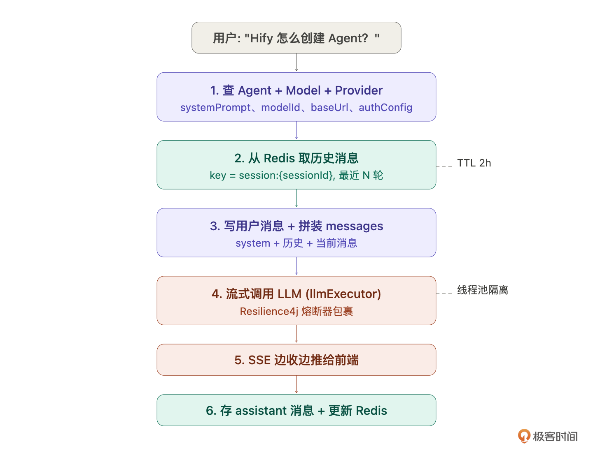
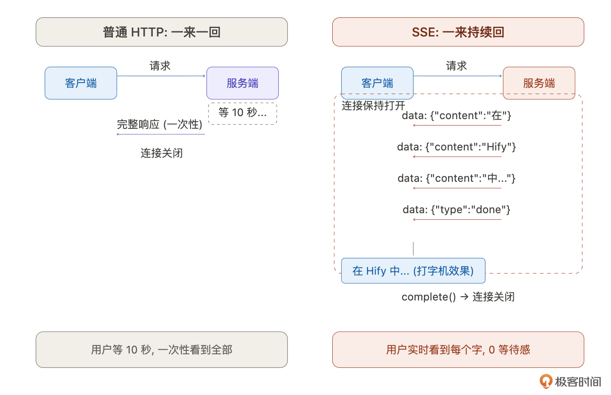
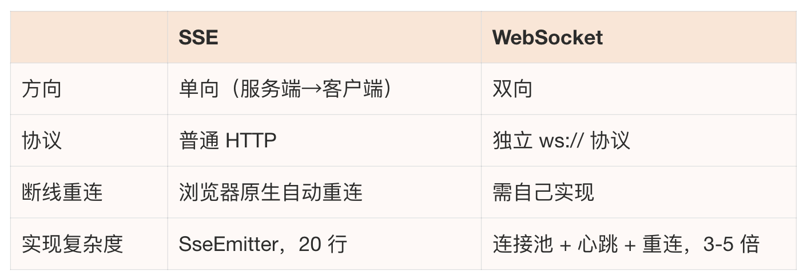
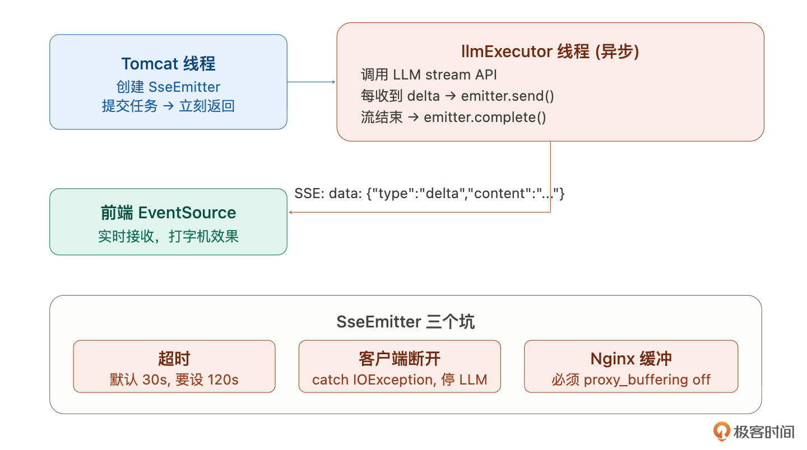
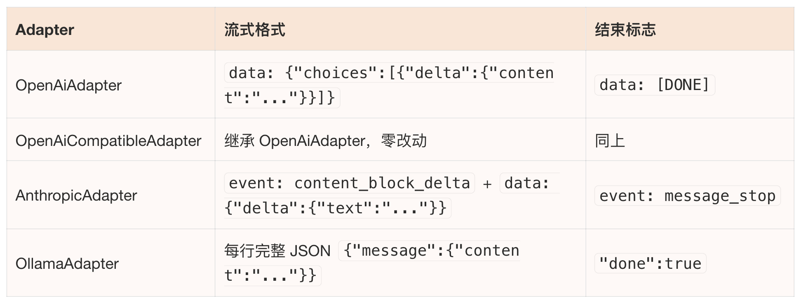

# 16｜对话引擎（上）：理解对话链路与流式技术选型

### 讲述：张浩 AI 版

时长 12:05 大小 13.82M

你好，我是 Robert。

上一讲我们创建了智能客服 Agent，名字、Prompt、模型、参数都配好了，但它现在还不能说话。Agent 只是一份配置，需要对话引擎来驱动它。

对话引擎是 Hify 最核心的模块。没有它，前面做的模型管理、适配层、Agent 配置都只是准备工作。这一讲和下一讲会把对话引擎做完。

和 15 讲学 Agent 一样，我们先搞清楚对话引擎到底是什么，再动手。

## 对话引擎是什么

Claude Code 的回答帮我建立了认知：对话引擎不是一个简单的 “转发器”，不是把用户的话原封不动发给 LLM，再把回复原封不动传回来。它是连接用户和 LLM 的一条处理管道，中间要做很多事。

- 会话管理。用户和智能客服聊了十轮，这十轮属于同一次对话。对话引擎要维护 “会话” 的概念，哪些消息属于同一次对话、会话什么时候创建、什么时候结束。
- 上下文拼装。LLM 本身没有记忆。你问完 “Hify 怎么创建 Agent”，再问 “那怎么配置模型”，LLM 不知道 “那” 指的是什么。对话引擎要把 System Prompt + 历史消息 + 当前消息拼成一个完整的 messages 数组，每次调用都带上上下文，让 LLM “看起来” 有记忆。
- 流式响应。LLM 生成一个完整回复可能要十几秒。如果等全部生成完再返回，用户要盯着空白页面干等。对话引擎要做流式推送，LLM 生成一个字就推一个字给前端，用户看到的是像人打字一样一个字一个字冒出来。这就是 ChatGPT 的打字机效果。
- 消息存储。对话结束后，用户消息和 AI 回复要持久化到数据库。用户下次打开能看到历史记录，管理员能做数据分析。

和普通 HTTP 接口的核心区别：普通接口是请求 - 响应模式，一来一回就结束。对话引擎是长连接 + 流式，请求发出后，响应不是一次性返回的，而是一个字一个字持续推送，可能持续几十秒甚至一两分钟。这带来了完全不同的技术挑战：线程不能一直占着、连接不能提前断、前端要实时渲染。

我追问了一个具体问题：

Claude Code 的回答点出了关键：直接让前端调 LLM API 有三个问题。

- API Key 暴露在前端不安全。
- 每个 LLM 供应商的 API 格式不同，前端要适配多套格式。
- 没有上下文管理，前端每次要自己拼历史消息传给 LLM，还要自己管会话。

总结就是：对话引擎就是把这些脏活集中到后端处理，前端只需要发一条消息、接收一串流式回复。

## 对话引擎的完整链路

概念清楚了，让 Claude Code 帮我画出完整的技术链路：

Claude Code 给了一张非常完整的链路图：

六步：查配置 → 取历史 → 写用户消息 → 拼装请求 → 流式调用 → 存回复。

其中第 5 步（从 Redis 取历史）和第 6 步（更新 Redis）是上下文管理的核心，下一讲展开。这一讲聚焦第 4 步，流式调用和推送的技术方案。

## 数据结构设计

在深入流式技术之前，先把数据模型定下来。

现有的 schema.sql 里已经有了 chat_session 和 chat_message 的基础结构。Claude Code 分析后建议补几个字段：

- chat_session 补 status。流式响应中途出错时需要记录会话状态。ACTIVE / ARCHIVED 两个状态够用。
- chat_message 补 finish_reason 和 latency_ms。finish_reason 记录 LLM 为什么停止 ——stop（正常结束）、length（超 max_tokens 截断）、error（调用失败），调试和后续计费都用到。latency_ms 记录响应耗时，性能分析用。
- content 从 TEXT 改 LONGTEXT。 一条 assistant 消息可能几千字，代码生成场景可能更长，LONGTEXT 彻底避免截断。

SQL Schema 如下：

几个设计决策：role 只有 user / assistant / system，和 OpenAI 的 messages 格式直接对齐。system 消息一般不存库，由 Agent.systemPrompt 每次动态注入。token 数在流式响应结束后由 LLM 返回的 usage 写入。会话 title 取第一条 user 消息前 20 字，不额外消耗 token。

chat_message 是增长最快的表，这一点在 05 讲数据库规范里已经预判了。

## 流式响应：SSE 完整解析

这是对话引擎技术含量最高的部分。大部分后端工程师写过无数的请求 - 响应接口，但没写过流式推送。先搞清楚原理。

### SSE 是什么

Claude Code 的解释：

普通 HTTP 请求是 “一来一回”—— 客户端发请求，服务端返回完整响应，连接关闭。SSE 是 “一来持续回”—— 客户端发请求，服务端保持连接不关闭，持续往客户端推数据，直到主动关闭。

数据格式很简单，每条消息以 data: 开头，用两个换行分隔：

前端用 EventSource API 接收，浏览器原生支持，不需要额外依赖：

### 为什么不用 WebSocket

AI 对话就是 “客户端发一条消息，服务端流式回复”，典型的单向推送。用户发消息走普通 POST 请求就行，不需要双向通信。WebSocket 的双向能力在这里完全用不上。

业界验证：OpenAI、Anthropic、Dify，所有主流 AI 对话产品都选 SSE。

### SseEmitter 的工作原理

SseEmitter 本质是一个长连接容器。Controller 方法返回 SseEmitter 对象后，Spring 不会关闭 HTTP 连接，而是持有它。后续代码通过 emitter.send() 往这个连接里推数据，最后 emitter.complete() 关闭连接。

关键在于线程切换。Tomcat 的请求线程创建 SseEmitter 后立刻返回，不能让 Tomcat 线程等 LLM 响应，那要等几十秒，线程池会被占满。实际的 LLM 调用在 llmExecutor 线程池里异步执行：

这就是为什么 10 讲要配独立的 llmExecutor 线程池。LLM 调用在自己的池子里跑，不占 Tomcat 线程，管理页面不受影响。

### SseEmitter 的三个坑

Claude Code 特别提醒了三个必须处理的问题：

- 超时。SseEmitter 默认超时 30 秒。LLM 生成一个长回复可能要一两分钟，30 秒一到连接直接断了用户看到半截回复。必须设长，new SseEmitter(120_000L)，120 秒。
- 客户端断开。用户对话到一半关了浏览器标签页，HTTP 连接断了。但 llmExecutor 线程不知道，它还在调 LLM，每收到一个 delta 就 emitter.send()，直到 IOException。如果不 catch 这个异常并停止 LLM 调用，线程会白跑到 LLM 输出完，浪费 llmExecutor 的线程资源。必须在 send 的 catch 里停止 LLM 调用并释放线程。
- Nginx 缓冲。这是最容易被忽略的。Nginx 默认会缓冲上游响应，收集一批数据后才一次性发给客户端。结果用户看到的是 “等了十几秒突然全部内容一起出现”，流式效果完全失效。必须在 Nginx 配置里关掉缓冲：

还有一个很细的细节：事务不要跨 SseEmitter。@Transactional 方法里不要直接返回 SseEmitter，事务提交时机和流结束时机不同，会导致事务提前提交或连接超时。要把写消息的操作拆成独立方法调用。

## 扩展适配层：加 Chat 能力

14 讲做的 ProviderAdapter 接口只有 testConnection 和 listModels。对话引擎需要 chat（同步）和 streamChat（流式）。

- ChatRequest：modelId、messages（List，每条含 role 和 content）、temperature、maxTokens。
- ChatResponse：content（完整回复文本）、finishReason（stop/length/error）、completionTokens。

streamChat 的核心设计：接收一个 Consumer<String> onChunk 回调。适配层每收到 LLM 的一段 delta 文本就调一次 onChunk，ChatService 在 onChunk 里调 emitter.send() 推给前端。流结束后返回完整的 ChatResponse。

各 Adapter 的流式格式差异很大，这是最需要仔细 review 的部分：

先实现 OpenAiAdapter 的 streamChat，review 通过后其他三个批量生成。和 14 讲同样的模式。

生成后怎么验证？流式代码涉及多线程和回调，不好直接读。用一个高效方法：让写代码的 AI 解释它自己的代码。

它解释一遍，你听逻辑。如果解释里有自相矛盾的地方（比如 “异常时调 completeWithError” 但代码里没有 catch），说明代码有 bug。这比自己逐行读不熟悉的异步代码高效得多。

## 对话接口设计

最后定接口格式。先看业界怎么做。

OpenAI：无状态。每次传完整 messages 数组，不管会话。好处是简单，坏处是历史管理全甩给调用方。

Dify：有状态。用 conversation_id 关联，服务端维护历史，前端只传当前消息。好处是前端简单，坏处是后端要管会话。

Hify 选有状态，接口 RESTful 风格：

发消息请求体极简：

比 Dify 更简单，不需要 user 字段（没有多租户），不需要 inputs（没有变量注入），session 已经关联了 agentId 不需要再传。

流式响应格式：

最后一条 done 事件带 finishReason 和 latencyMs，前端据此停止 loading 并显示完整消息。

消息存储选流结束后同步存 MySQL。20-50 人同步写没压力，不引入消息队列。

## 总结

这一讲做了四件事：

- 理解对话引擎。不是转发器，是处理管道 —— 会话管理、上下文拼装、流式推送、消息存储。
- 设计数据模型。在已有表基础上补了 status、finish_reason、latency_ms、LONGTEXT。
- 搞懂流式响应。SSE 的原理、和 WebSocket 的区别、SseEmitter 的线程模型和三个坑（超时、客户端断开、Nginx 缓冲）、事务不跨 SseEmitter。
- 扩展适配层和定接口。ProviderAdapter 加 Chat / streamChat，四个 Adapter 的流式格式差异。RESTful 有状态接口设计。

概念清楚了、表设计好了、流式方案定了、适配层扩展完了、接口格式定了。下一讲直接执行，CRUD 实现、上下文管理、跑通完整链路，让智能客服真正开口说话。

方法论上的新收获：验证不熟悉的代码，让 AI 解释它自己写的代码，你听逻辑找矛盾。流式响应、回调、多线程这些不常写的代码，用这个方法比自己硬读高效得多。

## 思考题

- SseEmitter 超时设了 120 秒，但有些复杂问题 LLM 可能需要更长时间。超时应该固定还是动态？
- 如果要支持 “停止生成”（用户中断 AI 回复），技术上怎么实现？需要改适配层吗？
- 四个 Adapter 的流式格式都不同，如果以后有新供应商用了第五种格式，现在的架构能不能低成本扩展？

期待你的分享！如果今天的课程让你有所收获，也欢迎转发给有需要的朋友，邀请他来一起学习，我们下节课再见！

