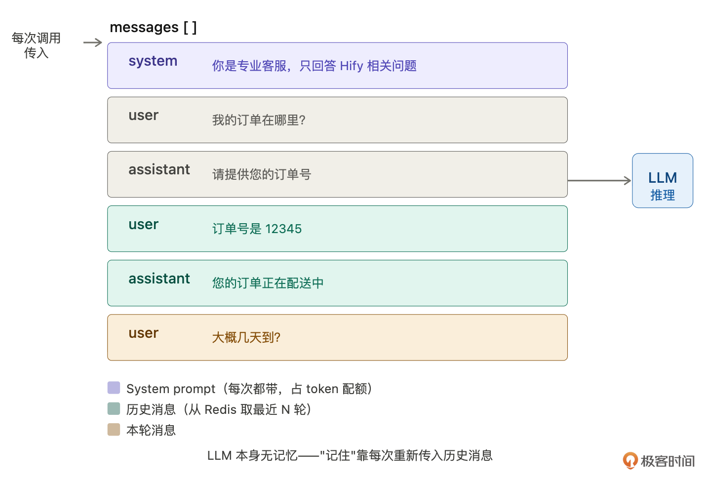
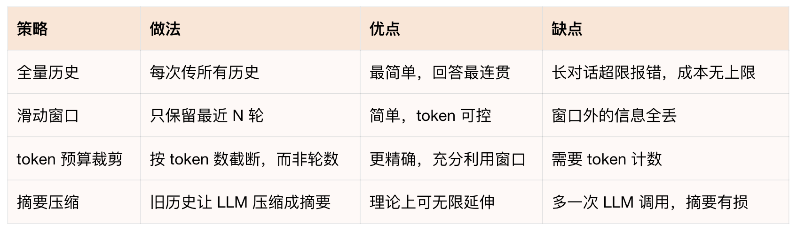
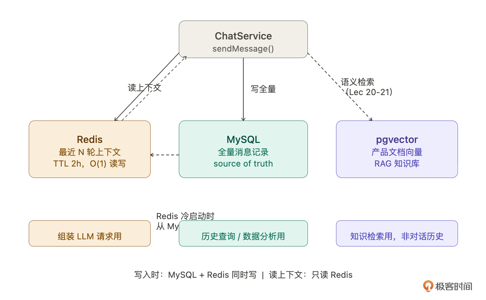
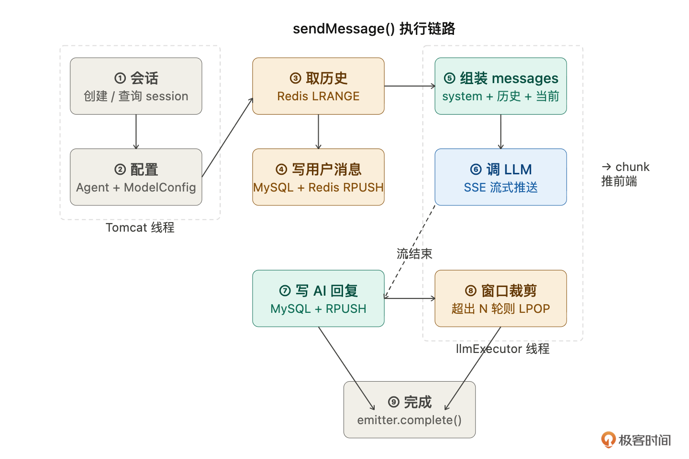
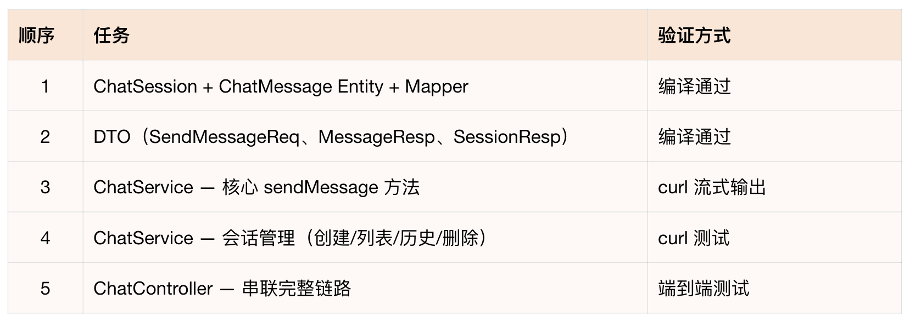

# 17｜对话引擎（下）：让智能客服真正开口说话

### 讲述：张浩 AI 版

时长 08:36 大小 9.84M

你好，我是 Robert。

16 讲把对话引擎的所有设计决策都定好了 —— 六步链路、数据模型、SSE 流式方案、适配层扩展、接口格式。这一讲把它们全部落地，让智能客服真正开口说话。

但在写 CRUD 之前，有一个核心问题要先解决：上下文。

## 上下文是什么

你可能觉得 “上下文” 是个显而易见的概念，就是对话历史嘛。但它在技术实现上没那么简单。

Claude Code 的回答纠正了一个常见误解：

LLM 本身没有记忆。 每次调用都是无状态的，你上一轮告诉它 “我的订单号是 12345”，下一轮它完全不知道。它不像数据库会持久化状态，每次调用都是一张白纸。

那 ChatGPT 怎么做到记住你说过什么？答案是每次调用都把历史消息重新塞进请求里，让模型在同一次推理中 “看到” 历史，造成记得的假象。

上下文就是你传给模型的 messages 数组的全部内容：

模型看到这整个数组，才能理解 “几天到” 指的是哪个订单。去掉任何一条，语义就断了。

这就带来了一个核心问题：上下文窗口有限。模型能处理的 messages 总长度有上限，叫 context window，单位是 token。GPT-4o 是 128K token（约 10 万汉字），Claude 3.5 Sonnet 是 200K，本地 Llama 3 可能只有 8K。超出窗口直接报错或截断。而且 token 是要花钱的，历史越长，每次调用越贵。

所以上下文管理的核心任务是：在有限的 token 预算内，保留尽可能多的有用历史。

接下来我问：

最终 Hify 选滑动窗口。这个决策过程主要是 Claude Code 建议（这里其实可以展开，你可以和 Claude Code 深度交流每种方案的异同、原理，深入理解这个决策的过程）。

理由是：20-50 人内部使用，对话不会特别长。maxContextTurns 已经在 Agent 表上配置了，每个 Agent 可以独立调整。Redis List 天然支持 RPUSH 新消息，超出时 LPOP 旧的，实现十行以内。Token 预算裁剪留作后续优化路径，等真的出现 “消息长度差异大导致体验差” 的问题再做。

还有两个实际问题 Claude Code 提醒了我：

- System Prompt 占 token。每次请求都要带 system prompt，如果 prompt 很长（几千字），会持续占用 token 配额，变相压缩可用的对话历史。这是为什么 15 讲说要控制 prompt 长度。
- Token 怎么算？粗略估算：1 个汉字 ≈ 1.5 token，1 个英文单词 ≈ 1 token。精确计算要用各家模型的 tokenizer，Hify 不自己算，直接用 LLM 返回的 usage.completion_tokens 记录存入 chat_message.tokens 字段。

## 对话存储选型

上下文策略定了，下一个问题：对话历史存在哪？这时给 Claude Code 的提示词是：

Claude Code 的分析帮我理清了三者的分工：

- MySQL，持久化存储，数据的 source of truth。存全量对话记录，用户查看历史聊天、管理员做数据分析、Redis 缓存失效后的数据来源，都从 MySQL 查。不用于组装 LLM 请求，每次都 SQL 查询 + 排序太慢。
- Redis，工作内存，专门用于组装 LLM 请求。存最近 maxContextTurns 轮消息，ChatService 每次收到消息，直接从 Redis 取最近 N 轮拼入 messages 数组发给 LLM。读写 O (1) 毫秒级，TTL 2 小时到期自动清理。

两者的关系：MySQL 是真相来源（全量），Redis 是热缓存（最近 N 轮）。写入时两边同时写，消息存 MySQL 的同时 RPUSH 到 Redis，读取上下文只读 Redis，Redis 过期后从 MySQL 重新加载（Cache-Aside）：

那向量数据库（pgvector）呢？这里要特别说清楚，pgvector 不是用来存对话历史的。很多初学者容易混淆 “对话记忆” 和 “知识检索”。对话历史是结构化的（一条条消息，有时间顺序），用 MySQL + Redis 就够了。

pgvector 在 Hify 里的角色是 RAG 知识库，把产品文档切成小段，每段生成一个向量表示（1536 维 float 数组）存进 pgvector，用户提问时做语义检索找到最相关的文档段落，拼进上下文给 LLM 参考。这是 20-21 讲的内容。到时候智能客服就能回答具体的产品问题了，不是靠模型的通用知识瞎猜，而是基于你的产品文档给出准确回答。

三者协作的完整流程：

## CRUD 实现

上下文和存储方案都定了，开始写代码。16 讲的设计决策全部落地。

按标准流程拆解，13 讲和 15 讲已经教过方法论，这里直接执行：

重点是任务 3——ChatService.sendMessage，它串联了 16 讲的整条六步链路：

这是整个课程最复杂的一个 Service 方法。九个步骤，涉及多表查询、Redis 读写、Token 计算、线程切换、流式回调、异常处理。给 Claude Code 的指令必须写到这个细致程度，任何一步漏了都会出问题。

Claude Code 生成后，用 16 讲学的方法验证：

让它解释，你听逻辑。如果它说 “LLM 失败会回滚用户消息”，但代码里没有回滚逻辑，就说明有问题。实际上用户消息不需要回滚，用户确实发了这条消息，只是 AI 没有成功回复，下次重试时用户消息已经在历史里了。

## 验收：和智能客服对话

所有代码写完了。这是最有仪式感的时刻，从 15 讲创建 Agent 到现在，智能客服终于能说话了。

第一轮通了。现在测上下文，这是关键验证点：

如果智能客服回答 “您需要先进入模型管理页面…”，说明它记住了上下文，知道你在问 Hify 的操作。如果它回答 “请问您想配置什么模型？能否提供更多背景？”，说明上下文拼装有问题，历史没有带进去。

检查后端日志，应该能看到上下文拼装的信息：历史消息 6 条，token 预算 3000，保留最近 3 轮。

检查数据：

全部通过。智能客服能流式回复，能记住上下文，历史太长会自动裁剪。

不过现在和它对话还得用 curl，下一讲做前端对话页面，消息气泡、打字机效果、自动滚动，让对话体验从命令行升级到浏览器。

## 总结

这一讲做了三件事：搞清楚上下文的本质和管理策略，理清对话存储的三层分工，实现完整的对话 CRUD 并跑通多轮对话。

上下文的本质：LLM 没有记忆，每次调用都是白纸。“记忆” 是对话引擎通过拼装历史消息实现的。核心挑战是在有限 token 预算内保留尽可能多的有用历史。

存储三层分工：Redis 存最近 N 轮（上下文组装用，高频读写），MySQL 存全量历史（记录查询用），pgvector 不存对话历史（那是 RAG 知识库的事，后面讲）。

增量开发：sendMessage 是整个课程最复杂的方法 —— 九步、多表、多缓存、多线程。给 Claude Code 的指令要写到每一步的细节，然后让它解释自己的代码验证逻辑。

## 思考题

当前的裁剪策略是 “从最近往前保留”，但如果用户第一轮提供了关键背景信息（比如 “我是 Hify 的管理员”），被裁掉后后面的回答就不准了。怎么实现 “关键消息置顶”？

两个用户同时和同一个 Agent 对话，上下文会不会串？当前的 session 隔离是否足够？

如果要实现 “摘要压缩”，历史超过阈值时先让 LLM 总结再拼装，怎么改 sendMessage？改动范围有多大？

期待你的分享！如果今天的课程让你有所收获，也欢迎转发给有需要的朋友，邀请他来一起学习，我们下节课再见！

