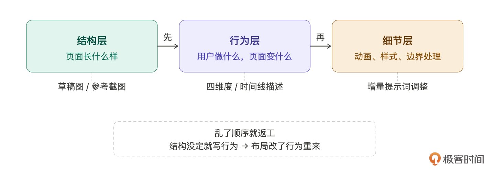
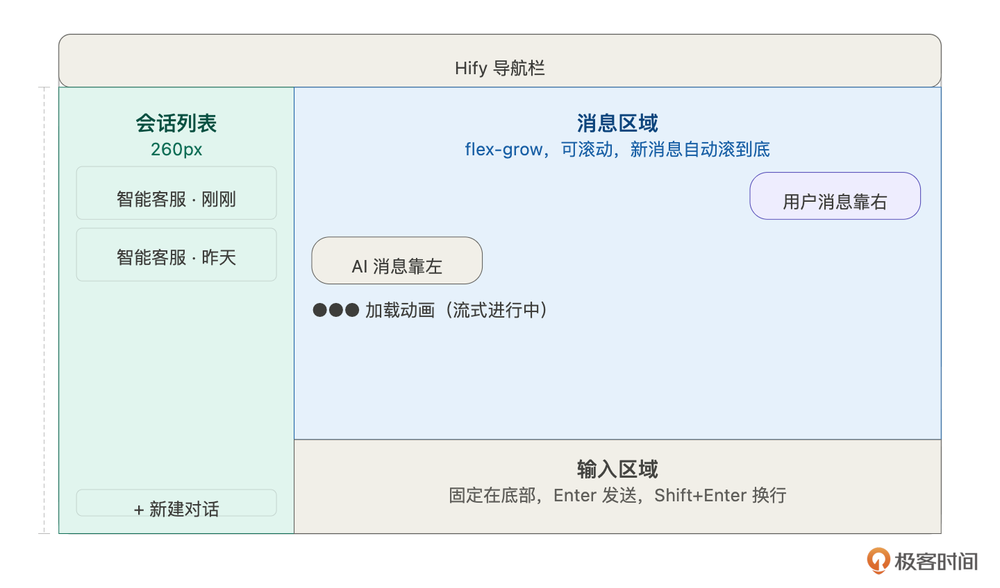
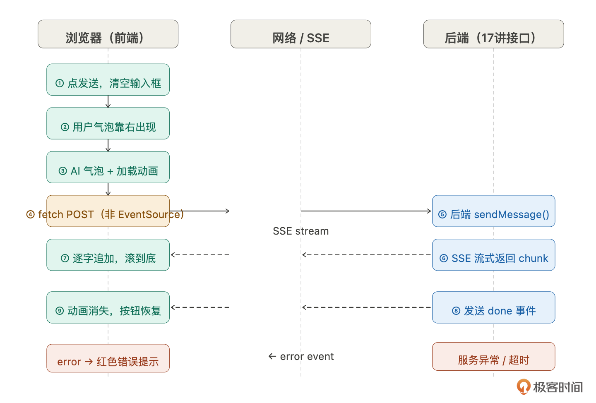
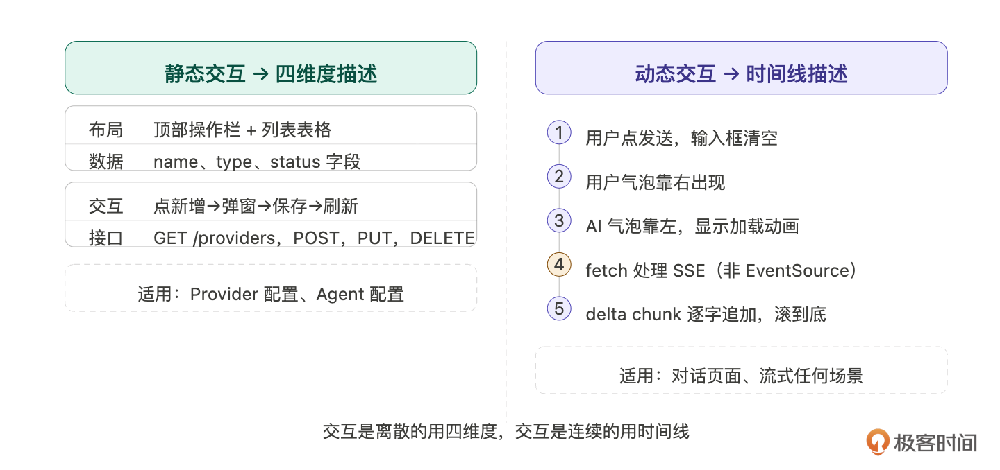
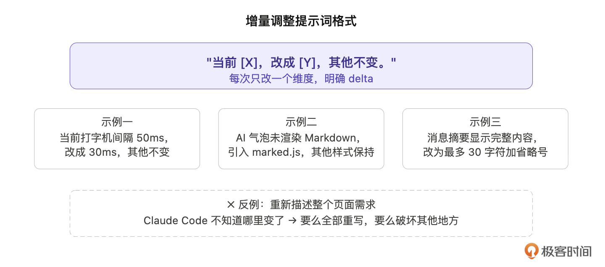
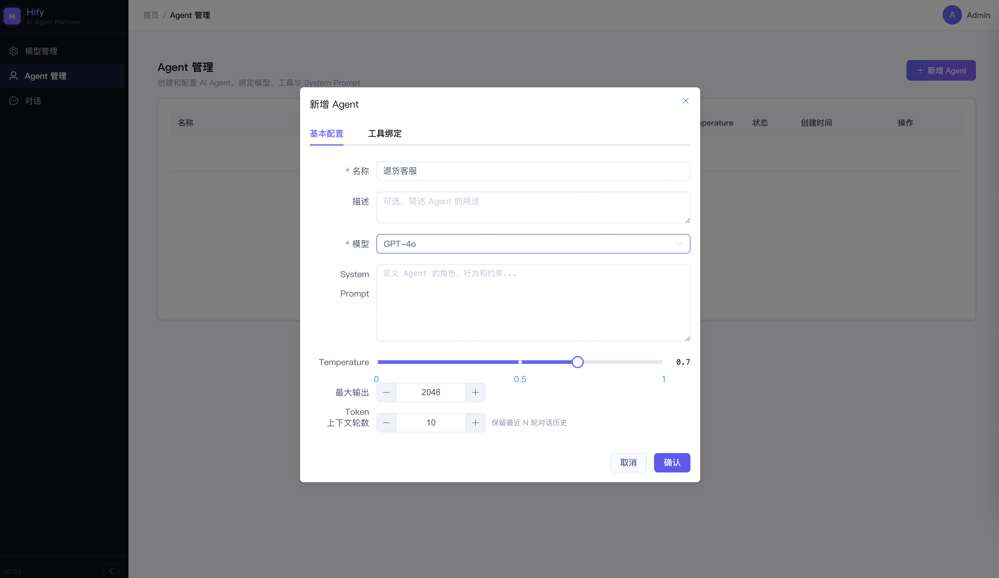
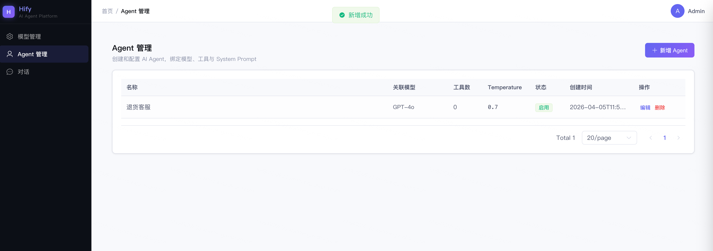
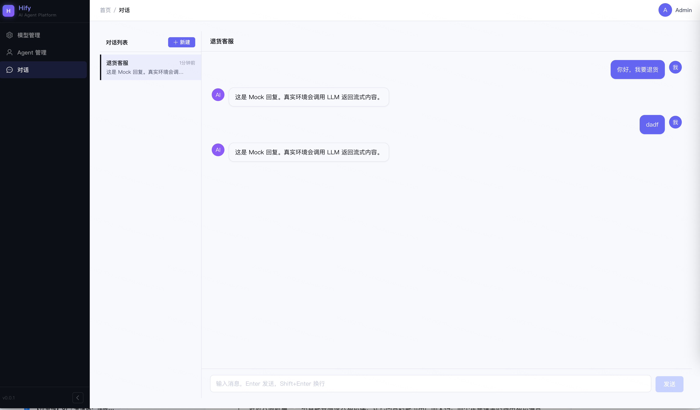

# 18｜复杂前端交互：让 Claude Code 帮你搞定流式聊天界面

### 讲述：张浩 AI 版

时长 09:32 大小 10.90M

你好，我是 Robert。

17 讲做完了对话引擎的后端 —— 六步链路跑通，curl 能看到 SSE 流式输出，上下文管理验证完毕。但用户和智能客服对话还得靠命令行。这一讲我们把它搬到浏览器里，做完 Hify 的整个前端：Provider 和 Agent 的管理页面，以及真正的聊天对话界面。

但在动手之前，有一件事要先想清楚：复杂页面和简单页面，给 Claude Code 的描述方式是不一样的。

## 复杂度分层：为什么不能一次性描述

把整个对话页面的需求一次性丢给 Claude Code，会发生什么？

先看一个典型的错误提示词：

这条提示词列出了大量功能点，看起来很完整。实际生成的结果：布局大致对，但消息气泡样式随机，打字机效果是 setTimeout 模拟的假效果（内容一次性拿到再逐字显示），SSE 用了标准 EventSource 发 POST 请求，而标准 EventSource 只支持 GET，接口根本跑不通。调试两小时，问题出在描述方式上，不在代码上。

对比一个按层拆解之后、第二步才会写的提示词片段：

同样的功能，第二个提示词把行为拆成了有顺序的步骤，并且显式说明了技术约束（fetch 而非 EventSource）。Claude Code 按这个生成的代码，第一次跑就通了。

差别不在于字数多少，在于描述的层次。

复杂页面需要拆解，拆解的顺序有三层，有顺序依赖：

- 结构层：页面长什么样，组件怎么排列
- 行为层：用户做了什么，页面发生什么
- 细节层：动画速度、样式微调、边界处理

乱了顺序就会返工 —— 结构没对齐就去写行为，行为写完了布局改了，整个组件重来。所以正确的顺序是：先对齐结构，再描述行为，最后打磨细节。这也是本讲的主线。

## 第一步：草稿图对齐结构

不是让你学 UI 设计，是用最低成本和 Claude Code 对齐 “页面长什么样”。文字描述布局，信息密度低，容易有歧义。一张草稿图抵得上几百字。

两种做法，按成本选择：

做法一：截参考图。打开 ChatGPT 或 Claude 的对话页面，截一张图，上传给 Claude Code：

这是最低成本的做法。主流 AI 对话产品的布局已经是行业共识，Claude Code 看一眼就能理解。

做法二：手绘草稿。如果你想要的布局和现有产品不一样，画一张低保真草稿，矩形框标注区域名称就够了，不需要精确尺寸。

无论哪种做法，关键是先让 Claude Code 描述它的理解，再让它写代码：

Claude Code 的描述就是布局共识的验证。如果它说 “左侧是 260px 的会话列表，右侧分上下两部分 —— 消息区域自适应高度，输入区域固定在底部”，和你想的一致，直接说 “正确，开始实现”。如果有偏差，在这里纠正，比写完代码再改成本低得多。

## 第二步：文字描述填充行为

结构对齐之后，开始描述 “页面怎么动”。这里有两类需求，描述方式不同。

### 静态交互：四维度描述

Provider 管理页、Agent 配置页，这类页面的交互是离散的：点按钮→弹窗→填表单→保存→列表刷新。用四个维度描述就够了：

Agent 配置页同理，参考 15 讲的字段定义。

### 动态交互：时间线描述

对话页面不一样，它的交互是连续的，不是 “点了什么发生什么”，而是 “发送之后接下来这一秒的事情”。用四维度描述，行为细节大量缺失。

如下图所示，正确的方式是按时间线一步一步讲：

所以提示词可以是：

- 用户在输入框输入内容，点发送（或按 Enter）
- 输入框立刻清空，发送按钮变为不可点击
- 消息区域底部出现用户消息气泡（靠右，深色背景）
- 紧接着出现 AI 消息气泡（靠左，浅色背景），内容区域为空，显示加载动画
- 前端用 fetch 手动处理 SSE 流（不要用 EventSource，接口是 POST）
- 每收到一个 delta chunk，把 content 追加到 AI 气泡，同时滚动到底部
- 收到 done 事件，加载动画消失，发送按钮恢复可用
- 如果请求失败或收到 error 事件，AI 气泡显示红色错误提示，发送按钮恢复

第 5 步就是开头那个错误提示词踩的坑 ——SSE over POST 是做 AI 对话产品几乎必踩的坑，在时间线描述里显式说明，一句话避开。

同类需要显式说明的技术约束还有：Markdown 渲染（AI 回复包含格式化内容，需要引入渲染库）、滚动策略（新消息追加时滚到底，用户手动向上滚时不打断）。这些属于 “不说 Claude Code 不知道，说了它就能处理好” 的细节，时间线描述是把它们自然带出来的好时机。

## 第三步：增量调整

Claude Code 生成之后跑起来，效果八九成对，但一定有需要调的地方，比如打字机效果太快、气泡间距不对、Markdown 代码块样式不搭。

调整时一个原则：每次只改一个维度，描述说清楚 delta。

很多人习惯重新描述整个需求，Claude Code 搞不清楚哪里变了，要么全部重写，要么改了这里破坏了那里。更有效的格式：

- 调整 1

- 调整 2

- 调整 3

每个提示词描述一件事，明确原来是什么、现在改成什么。几轮下来，细节就到位了。

在之前的课程中，有同学问过，用其他模型可不可以完成本次课程的内容。答案是可以的。我的回答是，由于不同的模型能力有差异，产出的结果是不一样的。此时对我们来说，最大的区别就是在这一步增量调整这里，好的模型，这一步不需要经过太多调整，其他模型这一步可能需要反复调整。这就是区别。

但是，我反倒觉得这是一个学习的过程。模型差一点更好。这一步可以反复让我们去锻炼自己 prompt 的能力，也就是学会和 AI 说话，这也是我们这门课程的重点之一。

## 验收：同一个接口，从 curl 到浏览器

17 讲的验收是用 curl 直接调后端接口：

后端通了。这一讲的验收是同一个接口，在浏览器里调用，走完整的用户操作流程：

会话管理：

全部通过。Hify 基础篇到这里完整了，管理员能在页面上配置 Provider 和 Agent，用户能在浏览器里和智能客服多轮对话，流式回复、上下文连贯、异常有提示。

下一讲进入高阶篇，给智能客服接入知识库，让它回答时能引用产品文档，而不是靠模型的通用知识猜答案。

## 总结

这一讲的核心不是实现对话页面本身，而是掌握复杂前端需求的拆解方法。

结构→行为→细节的顺序不能乱。先用草稿图或参考截图对齐布局，再用文字描述交互行为，最后增量调整细节。乱了顺序就会返工。

静态交互用四维度，动态交互用时间线。管理页面的交互是离散的，四个维度描述完整。对话页面的交互是连续的，时间线描述才能覆盖所有细节。

技术约束要在描述里显式说明。SSE over POST、Markdown 渲染、滚动策略，不说 Claude Code 就会用默认方式处理，大概率出错。

增量调整说清楚 delta。每次只改一个维度，描述原来是什么、改成什么，比重新描述整个需求效率高得多。

## 思考题

- 本讲用 “先让 Claude Code 描述它的理解，再让它写代码” 来对齐布局。这个模式不只适用于前端，你觉得在哪些其他场景里，也可以用同样的 “先确认理解再执行” 来降低返工风险？
- 时间线描述法覆盖了正常流程，但异常分支（网络中断、服务超时、用户在流式过程中切换会话）没有在提示词里描述，Claude Code 会怎么处理？下次遇到类似需求，你会怎么加入异常分支的描述？
- 如果要加 “重新生成” 功能 —— 用户对 AI 的回答不满意，点一下重新生成，AI 重新回答。按时间线描述法，这个功能的提示词你会怎么写？

期待你的分享！如果今天的课程让你有所收获，也欢迎转发给有需要的朋友，邀请他来一起学习，我们下节课再见！

