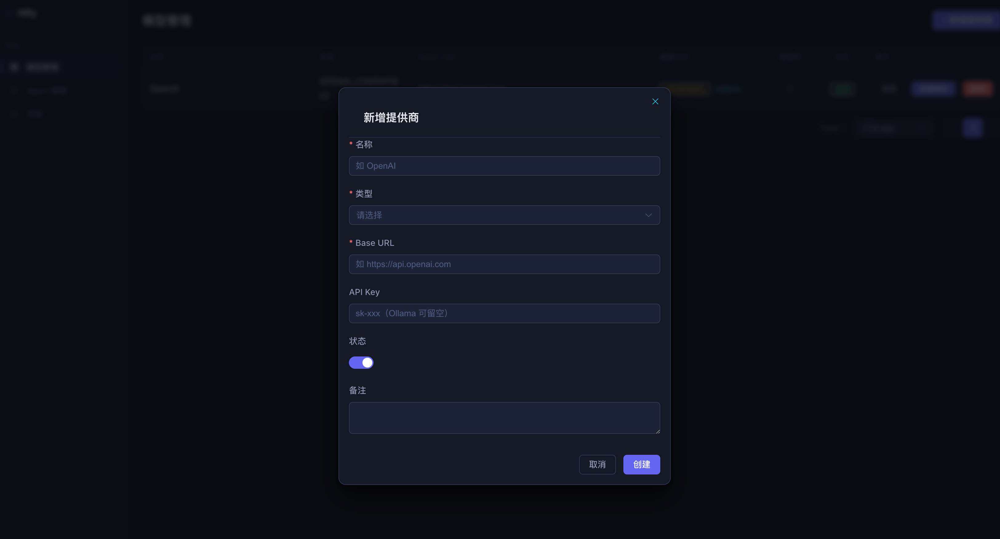
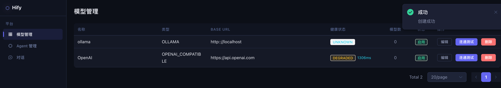
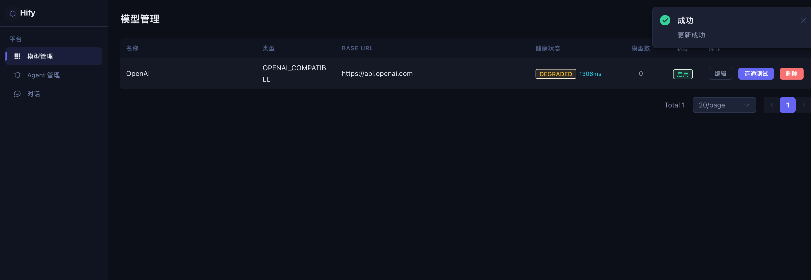
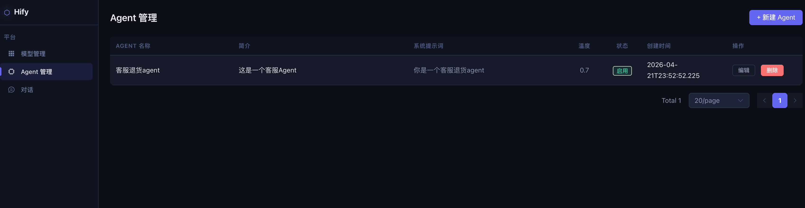
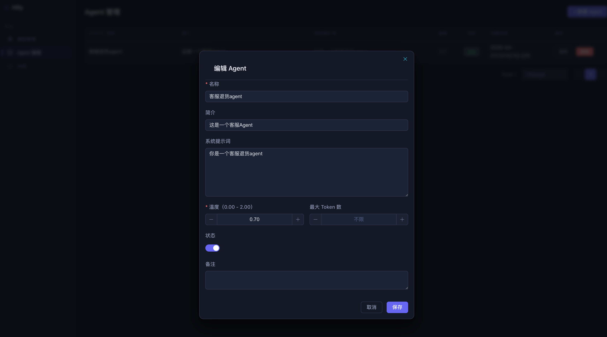
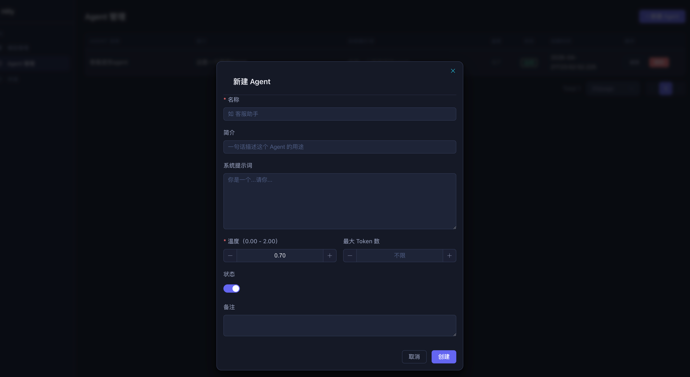

# 19｜实操课：核心功能基础篇全流程演示

你好，我是 Robert。

这是核心功能基础篇的实操课。13 到 18 讲，我们完成了 Hify 从 “能跑” 到 “能用” 的全部功能 ——Provider 管理、适配层、Agent 配置、对话引擎、前端界面。这节实操课，我会把这整个过程完整演示一遍，让你看到真实的操作节奏：我给了什么指令、Claude Code 怎么回、我怎么判断和追问、哪里顺、哪里卡住了、怎么解决的。

本节实操课将以文字 + 视频的方式进行，主要包含两部分：

- 第一部分：我在核心功能开发过程中真实的体验和看法，以及几个大家比较关心的问题。
- 第二部分：屏录演示，分三个场景，覆盖 Provider 模块交付和 Skill 沉淀两条主线。

## 我的真实体验和看法

工程搭建篇结束之后，我对核心功能开发这件事其实有点忐忑。骨架搭好、组件封装好、UI 出来了，但真正的业务逻辑才是重头戏 —— 外部 API 调用、流式推送、上下文管理，这些以前在项目里摸过，但每次都要花相当多时间。

实际跑下来，比预期快很多。Provider 模块前后端全部交付，大概半天。Agent 模块因为有了模块交付 Skill，比 Provider 还快。对话引擎复杂一些，两个完整的工作日，但其中大半时间花在了想清楚上，真正让 Claude Code 写代码的时间很短。

了解快在哪里、慢在哪里，比一个总时间更有参考价值。

快在哪里：

有了 08-12 讲的基础设施，每个业务模块的 “脚手架” 几乎不占时间。Entity 继承 BaseEntity、Mapper 继承 BaseMapper、Controller 套 Result + PageHelper，这些模板性的东西，一条指令生成，review 一遍，基本不用改。

Skill 带来的节奏变化更明显。13 讲手动做 Provider，14 讲沉淀了模块交付 Skill，15 讲做 Agent 时一句 “按模块交付 Skill 的流程，帮我做 Agent 模块” 就启动了。Claude Code 自动按流程走，在数据模型确认环节停下来等我拍板，不多做也不漏做。做第三个模块、第四个模块，这个节奏感越来越稳。

前端对接也比以前快很多。11 讲封装的 HifyTable 和 HifyFormDialog，每个管理页面的改动量非常小。API 文件是新增的，页面代码基本只是把数据源从 mock 函数换成 API 函数，分页、loading、空状态、确认弹窗全都不用重写。基础组件的回报，在用的时候才真正感受到。

慢在哪里：

两类情况。

第一类是 “想清楚” 的时间。每个模块开始前，供应商分析、数据模型讨论、边界决策，这些和 Claude Code 来回讨论的时间不短。Provider 模块将近一个小时，对话引擎的设计讨论甚至超过了写代码的时间。但这个时间花得值，这些决策如果漏掉，后面返工的代价是几倍。我已经把这部分时间当成必要投入，不算慢，算前置。

第二类是跨层问题的排查。流式响应在 curl 里验证是对的，上了浏览器发现打字机效果失效，是 Nginx 缓冲的问题，curl 绕过了 Nginx 所以发现不了。这类 “换了一层环境就暴露” 的问题，Claude Code 不会主动提醒，靠的是你自己的经验。排查下来时间不长，但需要你知道往哪个方向找。

最让我惊喜的：

两件事。

一是 13 讲里让 Claude Code 分析供应商分类的那一步。它按接口兼容性做了分类，指出 DeepSeek、Moonshot 这些国产模型接口和 OpenAI 完全兼容，只需要换 baseUrl。这个洞察直接影响了架构决策 —— 不是每接一个供应商就写一套适配代码，而是设计一个 “OpenAI 兼容” 类型让用户自己配 baseUrl。以前这类调研要自己搜文档、找对比文章，花一两个小时还不一定全面，现在一条指令五分钟，而且直接给出设计建议。

二是 15 讲里让 Claude Code 分析 Agent 概念的那一步。我给了 “我对 Agent 的理解很模糊” 的前提，它回了一张普通对话 vs Agent 的对比表，还主动区分了三层配置：身份定义、能力绑定、运行参数。不是我问出来的，是它主动给的结构。这让我真正体会到 14 讲说的 “让 Claude Code 教你” 是什么感觉 —— 你不需要先懂再做，可以边问边做，一两个小时建立七成认知，然后把理解翻译成数据结构落地。

下面展开三个问题，是课程里大家比较关心的。

1. “想清楚” 这一步可以跳过吗？

很多人急着动手，觉得先问概念是浪费时间，直接让 Claude Code 写代码更快。

13 讲数据模型讨论将近一个小时，但产出很具体：auth_config 用 JSON 存，后来加 Anthropic 和 Azure 时一行表结构都没改；健康状态独立成表，定时探测高频写不影响 provider 表的缓存；model_config 分展示名和调用 ID，Azure 的 deployment name 和展示名不同，这个字段设计直接解决了问题。

跳过讨论直接让 Claude Code 建表，这三个设计八九成会漏掉。到后面对话引擎依赖这些字段时，要回来改表、改接口、改前端，代价是这一小时的三倍以上。

想清楚不是在拖慢进度，是在前面花一点时间，避免后面花五倍时间返工。

2. Skill 写完了之后，真的会用吗？

14 讲写了模块交付 Skill，15 讲第一次用，但我注意到一个现象：Skill 的存在感比 CLAUDE.md 低，发指令时不一定会想起来。

我后来的做法是：每开始一个新模块，先停一秒问自己 “有没有对应的 Skill？” 习惯养成之前，可以在 CLAUDE.md 顶部加一行提示：“开始新模块前，先看 .claude/skills/ 目录”。

Skill 写了不用，等于把经验存档了但从不读档。这门课从 14 讲开始一直在说 “经验可以编码化”，但编码化之后还要真的被调用，才有价值。

3. 对话引擎验收，curl 够了吗？

不够。17 讲用 curl 验证了流式输出是对的，但 18 讲上了前端之后，打字机效果在浏览器里失效了。这是 Nginx 缓冲的问题，curl 绕过了 Nginx 所以发现不了。

后端接口测通是必要条件，不是充分条件。完整验收必须走完 “浏览器操作 → Nginx 转发 → 后端处理 → SSE 推流 → 前端渲染” 这条完整链路。每一层都可能有自己的坑，curl 只覆盖了其中一段。

## 屏录演示

下面进入屏录部分，分三个场景。

### 场景一：后端跑通 —— 从 Entity 到 Controller

目标：展示 Provider 模块后端的交付节奏，重点演示几个有代表性的任务，最后用 curl 验证全部接口。

第一步：确认数据模型，更新 schema.sql

指令：

要点：

- 展示三张表的核心设计决策：auth_config 用 JSON（不同供应商鉴权结构不同）、provider_health 独立成表（高频写不竞争锁）
- 更新完 schema.sql，用 mock profile 启动验证建表成功

第二步：Entity + Mapper

指令：

要点：

- 这个任务很干净，Claude Code 基本不出错
- review 重点：@TableName(autoResultMap = true) 有没有加、JSON 字段的 TypeHandler 有没有对上

第三步：Service—— 连通性测试（重点演示）

指令：

要点：

- 这里不同供应商的差异用 if-else 处理，先跑通，14 讲专门重构
- 展示 Claude Code 自动处理了三种鉴权方式的差异：Bearer Token、x-api-key Header、无认证
- 重点说明超时参数：10 秒，不设超时会卡死线程

第四步：Controller + curl 验收

指令：

curl 验收：

要点：

- 展示 test-connection 响应：latencyMs 有值、modelCount 是真实拉取的数量
- 展示详情接口：modelConfigs 列表里有真实模型、providerHealth.status 变成 UP
- 展示分页列表：PageResult 结构正确，total 和 list 都在

### 场景二：前端对接 ——mock 换成真实 API

目标：把 11 讲做的 ProviderList mock 页面接上真实后端，走完浏览器完整验收。

第一步：创建前端 API 文件

指令：

要点：

- 展示生成的 provider.ts，说明返回类型直接写业务数据类型，不需要包 Result<T>——request.ts 拦截器已经自动解包了
- 列表接口返回 PageResult<Provider>，对应后端解包后的 data 字段

第二步：页面对接 ——mock 换成 API

指令：

要点：

- 展示改动量：API 文件是新增的，ProviderList.vue 改动很小，组件结构没有动
- 重点说明 HifyTable 的 api prop 换了一行，分页、loading、空状态全部自动处理 —— 这是 11 讲封装前端组件的回报
- 展示健康状态 tag 的颜色配置：UNKNOWN 灰色是还没测过，不要用红色表示禁用，禁用是正常状态

第三步：浏览器完整验收

操作顺序：

- 打开 http://localhost:5173，进入 “模型管理”，看到空列表
- 点 “新增提供商”，填入 OpenAI 信息（名称、类型 OPENAI、baseUrl、API Key），提交
- 列表刷新，出现一条记录，健康状态显示灰色 UNKNOWN
- 点 “连通性测试”，ElMessage 提示成功，健康状态变成绿色 UP，延迟列显示毫秒数
- 点模型数查看详情，看到从 OpenAI 拉取的真实模型列表
- 再添加一个 Ollama Provider（类型 OLLAMA，baseUrl http://localhost:11434），测试连通
- 再添加一个 DeepSeek（类型 OPENAI_COMPATIBLE，baseUrl https://api.deepseek.com），验证兼容类型开箱即用
- 编辑、删除的常规操作验收
- 等一分钟，查 MySQL 的 provider_health 表 last_check_at，确认定时任务在自动探测

要点：

- 重点说明第 6、7 步：Ollama 和 DeepSeek 接入路径完全不同，但在同一套管理界面里，体现 “一套管理，多种供应商” 的设计价值
- curl 在场景一里已经验证了接口通，浏览器验收是确认整条链路通，包括 Nginx 代理、前端渲染、状态更新

### 场景三：把经验变成 Skill

目标：演示 14 讲的 Skill 沉淀过程。Provider 模块做完了，把这次的流程教给 Claude Code，让它以后自动按这个流程走。

第一步：让 Claude Code 教你 Skill 是什么

指令：

要点：

- 展示它的回答：Skill 是 .claude/skills/ 目录下的 Markdown 文件，定义特定任务的操作流程
- CLAUDE.md 是全局规范（每次对话自动加载），Skill 是任务手册（引用时才生效）
- 强调：不需要去翻文档，问它自己就教你 —— 这是咨询模式的又一个应用场景

第二步：把 Provider 模块的交付流程沉淀成 Skill

指令：

要点：

- 打开生成的 module-delivery.md，展示它的结构
- review 三件事：产出物是否明确（不是 “做需求分析”，而是 “产出包含 DDL 的需求文档”）、决策点是否标注 “等待用户确认”、坑是否写进去了
- 展示 review 后手动补进去的一条注意事项：JSON 字段必须用 @TableName(autoResultMap = true) + JacksonTypeHandler，否则反序列化为 null—— 这是这次真实踩过的

第三步：用 Skill 启动下一个模块，验证效果

指令：

要点：

- 对比演示：没有 Skill 时，要手写一大段流程描述，“先帮我分析需求，然后设计数据模型，然后按 Entity、DTO、Service、Controller 的顺序拆解……” 有了 Skill，一句话启动
- 展示 Claude Code 自动按 Skill 的流程走，在数据模型设计完后停下来，标注 “等待用户确认”
- 说明 Skill 也需要迭代：做完 Agent 模块，发现 Skill 里没有写 “跨模块依赖怎么处理”，把这条补进去。每做一个模块，Skill 就更完善一点

## 总结

三个场景走完，展示了核心功能基础篇的两条核心交付路径：模块从后端到前端的完整闭环、经验从执行到沉淀的 Skill 循环。

几个值得记住的动作：

- 数据模型讨论不能跳。auth_config 用 JSON、健康状态独立成表，这些决策在后面每个模块都有依赖，前面省下的时间，后面要还三倍。
- 报错给完整日志。只给最后一行，Claude Code 在猜；给完整栈和相关配置，它能定位根本原因，通常一轮解决。
- curl 通了不算完。浏览器走完整链路，才是真正的交付闭环，每一层都可能有自己的坑。
- Skill 写了要真的用。开始新模块前先看一眼 .claude/skills/，习惯养成之前可以在 CLAUDE.md 顶部加一行提示。

从下一讲开始进入高阶篇，给智能客服接入产品文档，让它回答时能引用真实内容。

期待你与我分享自己的体验。如果今天的课程让你有所收获，也欢迎转发给有需要的朋友，邀请他来一起学习，我们下节课再见！

