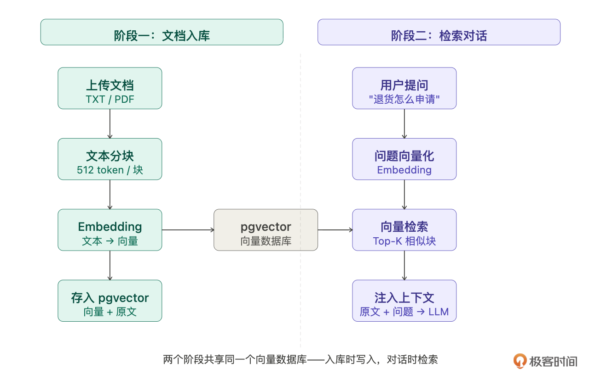
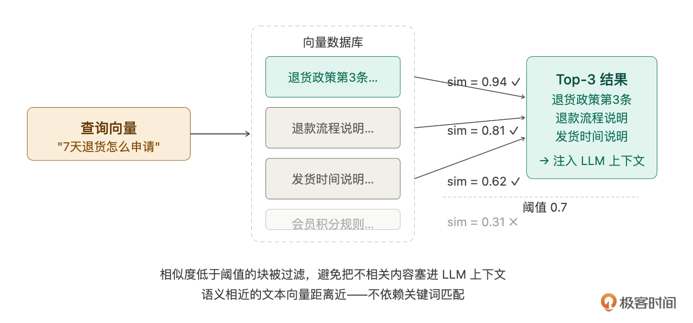
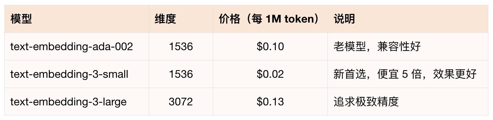

# 20｜RAG 知识库（上）：用 Claude Code 快速搞懂 RAG 和向量数据库

### 讲述：张浩 AI 版

时长 15:02 大小 17.18M

你好，我是 Robert。

从这一讲开始进入高级篇。

基础篇做完了 Hify 的核心链路，模型管理、Agent 配置、流式对话、前端界面。但你和智能客服聊几轮就会发现一个天花板：它的回答全靠模型自身的知识。你问 “你们的退换货政策是什么”，它只能给一段泛泛的通用回答，引用不了公司真实的退换货条款。

这不是 Agent 配置的问题，也不是 Prompt 写得不够好，是因为模型根本不知道你的私有数据。

解决这个问题需要 RAG。在开始做之前，假设我们对 RAG 的了解仅限于 “听说过这个词”。不过这一讲的核心不是 RAG 本身，而是：当你要给一个跑通的系统加入一个你完全不了解的技术能力，怎么做？

答案不是去读文档、去找教程，而是用你现在已有的工具 Claude Code，一步一步把陌生的东西变熟悉。这个方法论，以后遇到任何陌生技术都能复用。

## 先搞清楚要解决什么问题

碰到陌生技术，很多人的第一反应是去查 “XXX 是什么”。这个问题太宽泛，答案往往是一大段定义，读完还是不知道和自己的场景有什么关系。

更好的方式是从业务痛点出发，用自己的场景问：

为什么要这样问？因为这样的问题有具体场景，Claude Code 给的答案会直接对应你要做的事，而不是通用教科书式的解释。你越能描述清楚自己的痛点，它的回答就越有针对性。

Claude Code 的回答帮我们建立起第一个关键认知：RAG 解决的根本问题，是 LLM 的知识是 “冻结” 的。

LLM 的知识来自训练数据，训练完成后就固化了。你的产品手册、退换货政策、内部 FAQ，这些文档不在训练集里，模型物理上不知道这些内容。

解决这个问题有两条路：

- Fine-tuning（微调）：把文档塞进训练过程，改变模型权重。问题是贵、慢，而且文档一旦更新就得重新训练，完全不实际。
- RAG：不动模型，在每次对话时实时把相关文档片段塞进 Prompt。模型本身没变，变的是它看到的输入。

RAG 选的是第二条路，思路是检索 → 增强 → 生成。

用户提问 → 去文档库找最相关的几段内容 → 把这几段原文拼进 Prompt → LLM 基于这些内容回答。

用智能客服的场景来说：管理员上传退换货政策，系统把它切成小块并向量化存好。用户问 “支持七天无理由退货吗”，系统先找到 “自签收之日起七天内，未拆封商品支持无理由退货” 这段原文，塞给 LLM，客服就能引用真实条款回答，而不是靠猜。

这一步的目标不是搞懂所有细节，而是建立一个清晰的心智模型：RAG 是把去文档里找答案这件事，从 LLM 内部迁移到外部系统来完成。

## 拆解技术组件，缩小陌生范围

知道 RAG 是什么、解决什么问题之后，下一步是搞清楚它涉及哪些技术组件。

为什么要专门问这个问题？因为 RAG 这个词作为整体看起来很复杂，但拆开来之后，你会发现大部分组件你已经会了，真正陌生的可能只有一两个点。把陌生范围缩小，是打破恐惧的第一步。

Claude Code 按数据流向拆出了两个阶段、六个组件。

阶段一：文档入库管道

- 文档解析器，把各种格式的文件转成纯文本。TXT 直接读，PDF 有文字版和扫描版两种，Word 用 Apache POI 解析。Hify 一期只支持 TXT 和 PDF 文字版，够用。
- 文本分块器，把长文档切成适合检索的小块。这是 RAG 里最影响效果的环节。块太大，Embedding 语义被稀释，检索不准，塞进 Prompt 还占 token 多；块太小，上下文丢失，答案不完整。常见策略有固定大小切分、按段落切分、递归分割（先按段落，太长再按句子）。Hify 用递归分割，chunk_size 512 token，overlap 64 token。
- Embedding 模型，把文本转成向量。一串浮点数，语义相近的文本向量在空间里也相近。调用方式是 POST 一个接口，拿回向量数组，和 Chat Completion 本质上是同一类 API 调用。
- 向量数据库，存向量，支持相似度检索，找和查询向量距离最近的几条。

阶段二：检索对话链路

- 检索器，用户提问时把问题也转成向量，在向量数据库里找 Top-K 最相关的块。
- Prompt 组装器，把检索到的原文块拼进上下文，告诉 LLM 基于以下资料回答。

拆完之后，我有一个很清晰的判断：六个组件里，真正陌生的只有向量数据库。文档解析是调库，文本分块是纯代码逻辑，Embedding 调 API 和 14 讲调 Chat Completion 一样，检索器和 Prompt 组装器是改 ChatService 逻辑。

把陌生范围从整个 RAG 缩小到向量数据库，心理压力少了很多，也知道接下来该把精力放在哪里。

另外 Claude Code 还给了一个我之前没想到的判断：为什么是向量搜索，而不是关键词搜索？

关键词搜索（SQL 的 LIKE 查询）只能匹配字面。用户问 “东西坏了怎么办”，文档里写的是 “产品质量问题处理流程”，关键词一个都不重叠，但语义是同一件事。

向量搜索的关键是：语义相近的文本，向量距离就近。不管用词怎么不同，只要意思相近就能找到。这就是 RAG 检索质量高于关键词搜索的根本原因。

## 向量数据库选型

组件拆清楚了，向量数据库是唯一陌生的点，也是这一讲最重要的技术决策。从来没用过，怎么选？

和 12 讲选不引入 LangChain4j 一样的方法，给约束让 Claude Code 分析，你来判断。

为什么问题里要列出约束？因为没有约束的选型问题，答案只能是各有优缺点。把你的实际约束给出来，Claude Code 才能给出有判断立场的分析，而不是中立的百科全书。

Claude Code 给了一份对比：

- pgvector 是 PostgreSQL 的扩展，装一个插件就行，不引入新组件。SQL 操作，Java 生态直接用 JDBC，零学习成本。性能在百万级以下够用。缺点是超大规模数据不如专业向量数据库。
- Milvus 是专业向量数据库，性能最强，支持十亿级向量。但部署极重，依赖 etcd 和 MinIO，需要单独一套集群，运维成本高，Java SDK 文档也不如 Python 完善。
- Qdrant 轻量，Rust 写的，单二进制部署，REST API 友好。比 Milvus 轻得多，但仍然是一个额外的服务，需要单独部署、端口要开、故障要排查。如果没有 PostgreSQL 且数据量在百万级，Qdrant 是好选择；但已经有 PG 了，它的优势就消失了。
- Elasticsearch 8.x 开始支持向量检索，全文加向量混合检索很强。但极重，JVM 堆内存至少 4GB 起，运维复杂度高。专门为 RAG 引入一套 ES 集群，性价比极低。

我的判断：选 pgvector。

理由和 12 讲不引入 LangChain4j 是同一个逻辑：能不加新依赖就不加。Hify 已经在用 PostgreSQL，pgvector 只是一个扩展，不引入新组件，不增加运维负担，SQL 操作和现有的 document 表、knowledge_base 表直接 JOIN，业务逻辑简单。一期数据量小，性能完全够用。

后续如果数据量真的大到 pgvector 扛不住，检索逻辑抽象好了换存储层成本不高，到时候再说。先跑通，按需升级。

这是贯穿整个课程的技术决策原则：用能解决当前问题的最简单方案，不为假想的未来过度设计。

## 最小 Demo 跑通：从理论到手感

选型定了，但光知道选哪个不够。在把 pgvector 集成进 Hify 之前，我需要先有手感 —— 能插入向量、能查到相似结果，知道它到底怎么工作。

为什么要先跑最小 Demo，而不是直接集成进 Hify？因为新技术有很多细节只有亲手跑过才知道。比如向量怎么存、距离算符怎么用、Java 里 MyBatis 能不能直接操作 vector 类型。这些问题如果第一次遇到是在 Hify 的代码里，排查成本会很高。先单独跑通，建立手感，再集成就不会茫然。

Claude Code 给了建表和查询的核心 SQL：

<=> 是 pgvector 的余弦距离运算符。用 1 - 距离 转成相似度分数，越接近 1 越相似。这个运算符是 pgvector 扩展引入的，标准 SQL 里没有。

到这里，如果你对 pgvector 不熟，也不知道 <=> 是什么。那没关系。你可以按照我们这节课的思路去学 pgvector。这块就不展开了。

在本地 PostgreSQL 上跑了一遍，建表、插入几条测试数据、查询相似度，结果符合预期：语义相近的条目排在前面，不相关的排在后面。

然后问 Java 集成：

Claude Code 的回答点出了一个我没想到的坑：MyBatis-Plus 不原生支持 vector 类型，直接用会报类型转换错误。解法是自定义 TypeHandler，告诉 MyBatis 怎么把 Java 的 float[] 和 pgvector 的 vector 类型互转 —— 插入时 float[] 转向量字符串，查询时向量字符串转 float[]。

这类坑：“这个类型需要特殊处理” 是新技术里最容易在集成阶段踩到的。先跑最小 Demo 的价值之一就是把这些坑提前暴露出来，在一个干净的环境里解决，而不是混在业务代码里排查。

从完全没用过 pgvector，到 Java 代码能插入和查询向量，这就是探路陌生技术的节奏，不是把文档从头读完再动手，而是直接问怎么用，拿最小可运行示例，跑通就有手感了。

## Embedding 模型选型与接入

向量数据库搞定了。接下来是 Embedding 模型，它是把文本变成向量的工具。

问这个问题是因为：Embedding 接口虽然也是调 OpenAI，但它和 Chat Completion 是完全不同的接口，返回结构也不一样，Chat Completion 返回文本，Embedding 返回向量数组。把差异搞清楚，才不会用错。

Claude Code 给了清晰的对比：Chat Completion 是 “文本→文本”，Embedding 是 “文本→向量”。

接口是 POST /v1/embeddings，入参 {model, input}，返回 data[0].embedding，一个长度 1536 的 float 数组。和 Chat Completion 最大的区别是没有流式响应，同步返回，等向量算完一次性给你。

模型选哪个？Claude Code 给了三个选项的对比：

我的判断：选 text-embedding-3-small。同样 1536 维，pgvector 建表不需要改，价格是 ada-002 的五分之一，效果还更好。选型就是这样，不是最贵的最好，是最符合约束的最好。

另外 Claude Code 提醒了两个重要特性：

- input 支持数组，可以批量处理。文档入库时一次传多个文本块，比循环单条调用省时间也省钱。
- 同一段文本，向量永远相同。Embedding 是确定性的，不像 Chat Completion 有随机性。同一模型同一文本每次返回完全一样的向量，可以缓存，不需要重复调用。

实现接入很简单，复用 14 讲封装的 LlmHttpClient，加一个 embed 方法。传入文本字符串，拿回 float[]。实现逻辑和 Chat Completion 类似，只是接口路径和返回字段不同。

还有一个常见误区值得说清楚：Embedding 模型和 Chat 模型不需要配套。Embedding 只管把文本转向量，和后面用什么 LLM 生成回答完全无关。Hify 里 Embedding Provider 和 Chat Provider 可以独立配置，可以用 OpenAI 做 Embedding，用 Anthropic Claude 生成回答，也可以用本地 BGE 模型做 Embedding。

## 验收

两个核心能力都跑通：

- pgvector：SQL 能建表、存向量、做相似度查询。Java TypeHandler 能正常互转 float[] 和 vector 类型。
- Embedding：能调用 OpenAI 接口把任意文本转成 1536 维向量，批量接口验证通过。

这两个能力是下一讲的基础，21 讲把它们串起来，实现知识库的完整数据管线，然后接入对话引擎，让智能客服能引用公司文档准确回答问题。

## 总结

这一讲做了一件事：用四步探路法，把一个完全陌生的技术变成可以动手实现的能力。

四步路径：

- 从业务痛点出发问清楚它解决什么问题（建立心智模型，而不是背定义）。
- 拆解涉及哪些技术组件，缩小陌生范围（六个组件里只有一个真正陌生）。
- 给约束让 Claude Code 做选型对比，你来判断（约束驱动决策，不为假想的未来过度设计）。
- 最小 Demo 优先，跑通再说（手感比理解更重要，坑提前在干净环境里暴露）。

两三个小时，从 “完全不懂 RAG” 到 “pgvector 装好了、Embedding 能调了、Java 代码跑通了”。

你换成任何陌生技术，比如存储引擎、图数据库、搜索引擎，都是同样的路径。技术在变，探路的方法不变。

## 思考题

- 这一讲选 pgvector 的核心理由是 “不引入新依赖”。如果你的场景变成：数据量千万级、需要毫秒级检索、团队有专职运维，用同样的约束驱动选型方法，你的判断会变吗？和 Claude Code 讨论一遍。
- Embedding 模型选了 OpenAI 的 text-embedding-3-small。如果出于数据隐私考虑，不想把公司文档内容发给 OpenAI，有哪些本地部署的开源替代方案？用这一讲的四步探路法调研一遍，给出你的选型结论。
- pgvector 的相似度查询在数据量大时会变慢。让 Claude Code 帮你了解 pgvector 的两种索引机制 ——IVFFlat 和 HNSW—— 各自的原理、适用场景和建索引时机，清楚什么时候需要建、怎么建？

期待你的分享！如果今天的课程让你有所收获，也欢迎转发给有需要的朋友，邀请他来一起学习，我们下节课再见！

