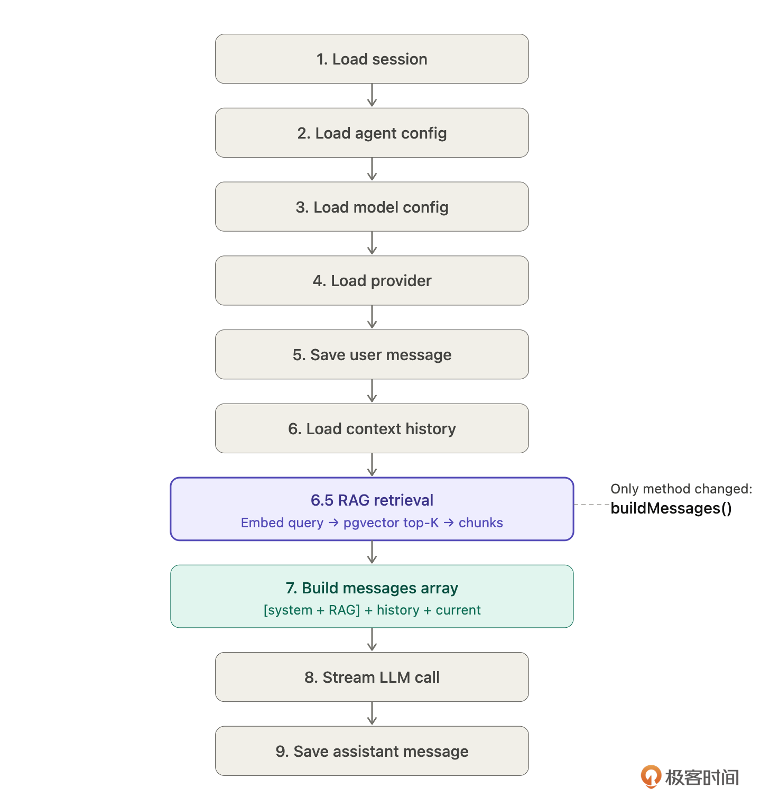
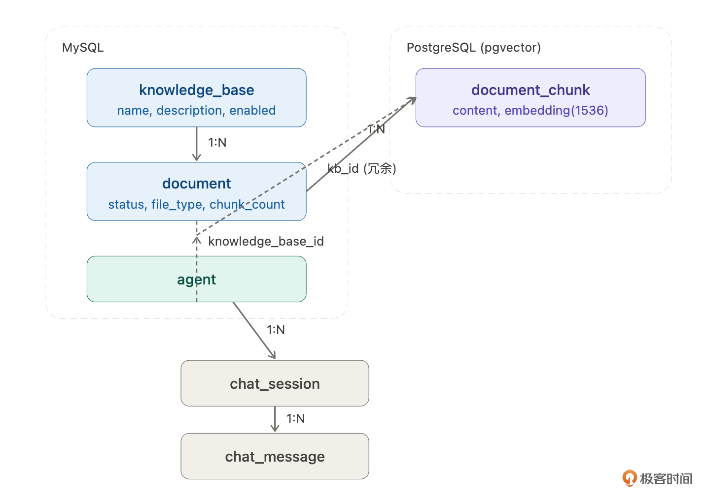
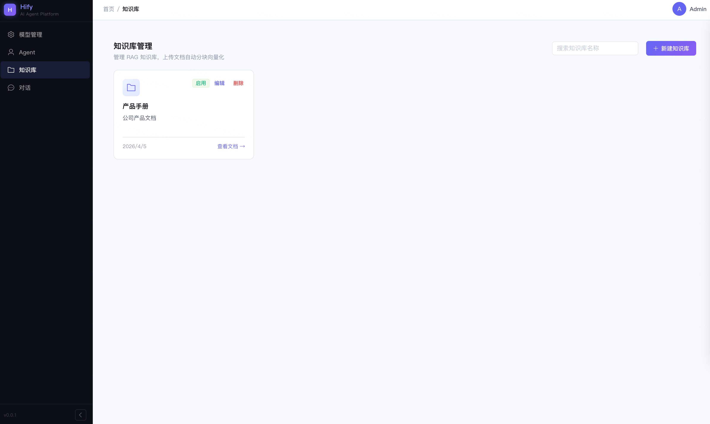
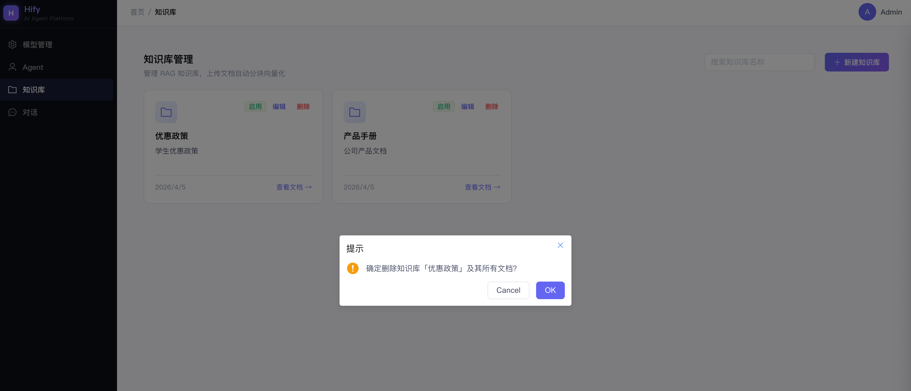
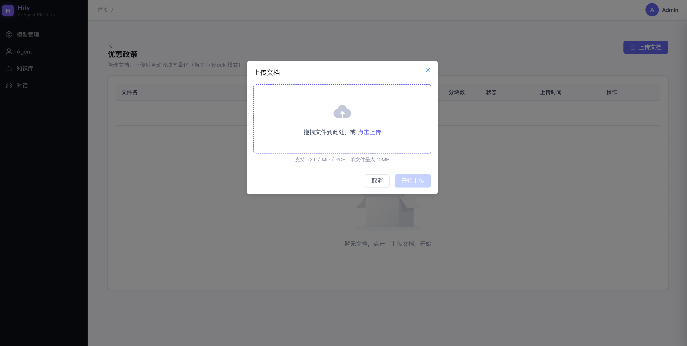
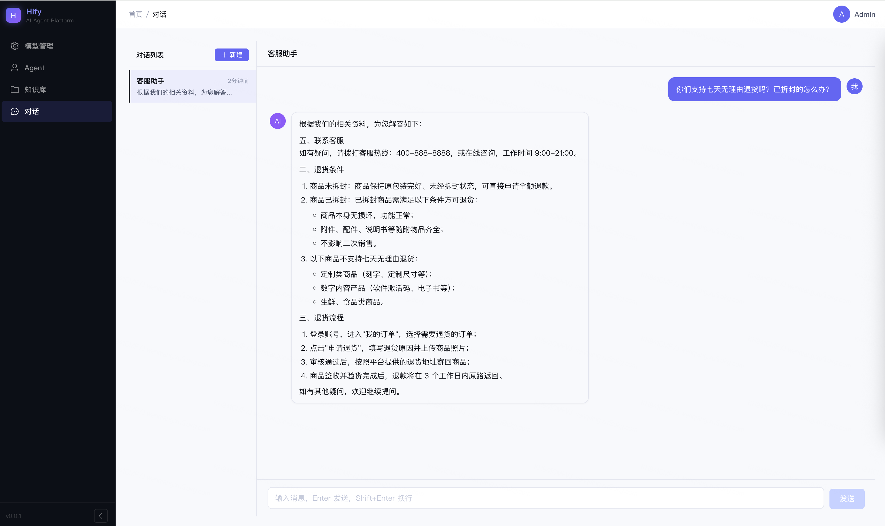

# 21｜RAG 知识库（下）：给客服一本手册，对话功能集成 RAG

### 讲述：张浩 AI 版

时长 17:25 大小 19.92M

你好，我是 Robert。

20 讲完成了探路，pgvector 装好了，Embedding API 能调了，两个能力分别验证通过。这一讲把它们变成 Hify 的真实功能。但在动手之前，我想先说清楚这一讲的挑战在哪里。

我们这节课是要实现 RAG 的全流程，我把它叫做数据管线。什么是数据管线呢？它就是组织、生成知识库的全流程的名称。数据管线是新模块，需要从零开始建，不碰已有代码，相对独立。

真正的挑战是第二件事，把 RAG 检索接入已经跑通的对话引擎。17 讲的 sendMessage 链路已经可以运行，用户在用，我要在这条链路里插入一个新环节，同时保证原有功能一分都不能少。

这不只是 RAG 的问题，以后你给任何一个跑通的系统加新能力，都会遇到同样的挑战：怎么加新的，不破坏旧的。

## 先想清楚要改哪里

动手之前，先把改动范围圈清楚。

为什么要先问这个问题？不是所有 “在已有系统里加功能” 都需要大改，关键是找到最小侵入点。在动手写任何一行代码之前，先搞清楚要改的是哪个方法、在哪一行之前插入，改动范围先圈死。

之前的课程中，很多同学在问，怎样在老项目中使用 AI 的能力，也就是使用 AI 对老项目进行改造和开发。这句话就是我的核心观点。从小到大，从快到慢。AI 理解和拆解项目也是需要过程的。

Claude Code 梳理了完整的九步链路（17 讲实现时是六步，后来细化成了九步）：

RAG 检索插在第 6 步之后、第 7 步之前，标记为第 6.5 步：

为什么是这个位置？逻辑很清晰：第 5 步之后用户消息才确定，才能拿它去检索；第 7 步是拼装 messages，检索结果要注入 system prompt，必须在第 7 步之前拿到。不能更早，因为第 1-4 步还在加载配置，根本不知道用户问了什么。

插入之后，messages 结构从：

变成：

只有 system 变了，其余不动。检索结果注入 system prompt，对历史消息和当前消息完全无侵入。这是最小侵入的接入方式 —— 改动面小，风险低，旧功能最不容易被破坏。

圈定改动范围：只改 ChatService 的 buildMessages 方法，其他八步不动。流式调用、SseEmitter 转发、消息存储、Redis 上下文管理，全部不碰。把这个约束写进给 Claude Code 的指令，是防止改动扩散的第一道防线。

## 数据模型

在实现数据管线之前，先把数据模型定好。

Claude Code 给了三张表的设计，有一个细节我没想到，这是两个数据库，不是一个。

### 三张表，两个数据库

为什么分两个数据库？knowledge_base 和 document 是业务数据，有完整的增删改查，走 MyBatis-Plus，放 MySQL。document_chunk 是向量数据，只有批量写入和相似度查询两种操作，需要 pgvector 的向量检索能力，放 PostgreSQL。用 JdbcTemplate 直接写 SQL 比配 MyBatis Mapper 更简单。

Spring 里要配双数据源：

两个数据库的分工：MySQL 管 “文档是什么、处理状态怎样”，pgvector 管 “向量存在哪、怎么检索”。

### DDL

MySQL：knowledge_base

知识库容器，轻量，就是一个分组 —— 名称、描述、状态。真正的内容在 document 和 chunk 里。

MySQL：document

关联 knowledge_base_id，记录文件元信息和处理状态。

重点是 status 字段 ——PENDING → PROCESSING → DONE / FAILED 四个状态。文档处理是异步的，前端轮询这个字段显示进度。error_message 记录失败原因，chunk_count 记录分块数量。

PostgreSQL：document_chunk

向量数据，存分块文本和 embedding。

knowledge_base_id 是冗余字段，检索时直接按知识库过滤，不用 JOIN document 表。embedding 是 1536 维向量，对应 OpenAI text-embedding-3-small 模型的输出维度。

agent 表加一列：

NULL 表示不启用 RAG，有值表示启用。对话链路里判断这个字段决定要不要走检索，加一列，对已有功能零侵入。

### 关系图

### mock profile 处理

H2 不支持 vector 类型。schema-h2.sql 里把 document_chunk 的 embedding 列改成 TEXT，相似度查询在 mock profile 下返回空列表，不影响其他功能的验证。

## 数据管线

数据管线是独立的新能力，先单独做完并验收，不混在对话引擎的改动里。这样如果出了问题，能精确定位是哪一层。

### 数据管线拆解

动手之前，先让 Claude Code 帮我把数据管线拆清楚。

- 这条数据管线由哪几个环节组成？每个环节做什么？
- 管线之外，还需要哪些配套功能才能让这个特性完整可用？
- 哪些部分需要前端页面？

Claude Code 给了一个很清晰的拆解。整理之后，数据管线这个特性分三块：

第一块：知识库与文档的 CRUD（1）

管线不是凭空跑的，得先有知识库容器，得有文档上传入口。这是骨架：创建知识库、上传文档、查看状态、查看分块、删除。没有这些接口，管线没有输入，前端没有操作入口。

第二块：管线处理逻辑（2）

文档上传后，异步触发五步处理：状态更新 → 解析文本 → 分块 → 向量化 → 存入 pgvector。这是核心能力。

第三块：前端页面（3）

管理员需要界面来操作，创建知识库、上传文档、看处理进度、查看分块结果。不做前端的话，只能 curl 调接口，不是一个完整的功能。

开发顺序：1 → 2 → 3 → 4 验收。先搭后端骨架，再填管线处理逻辑，再做前端，最后前后端一起验收。每一步都可以独立测试，出了问题能精确定位是哪一层。

这里我就不一点点展开讲了，我直接给出我的提示词。你可以根据提示词，结合这个章节的内容去推敲为什么这么问？为什么这么组织？这个过程，也可以让 Claude Code 协助你，比如，你可以把这篇文章给 Claude Code，让它给你总结。

### 1. 知识库与文档 CRUD—— 后端

先把增删改查的骨架搭好，管线处理逻辑后面再加。

知识库 CRUD 指令：

文档管理 CRUD 指令：

### 2. 管线处理逻辑 —— 后端

上传接口提交异步任务后，管线开始工作。五个环节串联处理。

先让 Claude Code 把每个环节的输入输出格式梳理清楚：

为什么要专门问这个？多步骤串联任务最容易出的错，就是环节之间数据格式对不上。上一步输出了 A，下一步期望收到 B，接口一对就出问题。把每个环节的输入输出先对齐，再写代码，省去很多调试时间。

管线实现指令：

管线代码组织的原则：每个环节独立，管线只负责串联。不只是为了代码整洁，更重要的是，某个环节出了问题时，能精确定位是哪一步，单独测试单独修复，而不是在一个几百行的大方法里翻来翻去。这个原则适用于任何多步骤数据处理管线。

### 3. 前端页面

后端接口跑通后，做前端。分两个页面：知识库管理和文档管理。

知识库管理页指令：

文档管理页指令：

### 4. 验收

前后端都完成后，走一遍完整流程验收。

后端验收：

查 pgvector 的 document_chunk 表，确认每条记录都有 1536 维的 embedding 向量。

前端验收：

知识库管理

上传文档，拆解为向量存储

## 接入对话引擎

数据管线跑通了，现在把检索接入 sendMessage。这是本节课风险最高的一步。

原因很简单：数据管线是新建的，坏了只影响新功能。而 sendMessage 是已有用户在用的链路，改坏了是线上故障。

这种情况下，有一个通用的增量开发节奏：圈定改动范围 → 验证旧功能没坏 → 验证新功能生效。三步的顺序不能乱，每一步都是对前一步的护栏。其中最难的是第一步，也就是大家日常最容易碰到的。怎么圈定呢？

这个答案，其实我们这节课一直在强调，从小到大，你来指导。如果你想当甩手掌柜，那肯定是不可能的。至少目前不行。

### 写精确的指令，把改动范围圈死

先想清楚要改什么。sendMessage 九步链路里，RAG 插在第 6.5 步 —— 用户消息向量化、检索相关 chunk、注入 system prompt。对应到代码，就是 ChatService 里的 buildMessages 方法。

改动范围确定了，指令就要把这个约束写进去：

这条指令有几个细节值得说：

- 改动范围要显式写出来。Claude Code 默认会举一反三，它可能判断 “既然改了 buildMessages，顺便把 Controller 的参数也调整一下更合理”。在新项目里这是优点，在有线上用户的系统里是风险。写 “不要改 Controller 层”，是把扩散边界提前锁死。
- Agent 原始 Prompt 要保留，参考资料附在后面。不是替换，是拼接。两者之间有空行，语义层次分明，LLM 读起来清楚哪部分是角色设定、哪部分是检索资料。
- “没有相关信息就直接说” 这句非常关键。没有这个约束，LLM 在检索结果不充分时会用训练知识补充，还不告诉你它在补。加了这句，LLM 知道自己的边界，RAG 不只让 LLM 能引用文档，也让它知道自己不知道什么。
- 没有绑知识库的 Agent，行为和之前完全一致。knowledgeBaseId 为空时，buildMessages 直接走原来的路径，零影响。开关在 Agent 维度，不影响全局。

### 改完先跑旧用例

代码改完，第一件事不是测新功能，是确认旧的还没坏：

用一个没绑知识库的 session，正常问一个问题。流式返回正常、内容正确，旧功能完好，再继续。

如果这里出了问题，先回滚再排查，不要在旧功能已经坏掉的状态下继续往下走。两件事同时出错，定位会乱。

### 跑新用例，看检索是否命中

旧功能确认没坏，再给 Agent 绑上知识库，测新功能：

看后端日志，应该能看到 RAG 检索命中 2 条，相似度 0.94、0.81。回答里出现具体条款引用，说明检索链路通了。

三步走的本质是：每一步只验证一件事。第一步缩小改动面，第二步确认没有破坏，第三步确认新能力生效，顺序不能反。如果先测新功能再测旧功能，旧功能出了问题你不知道是这次改动导致的，还是原本就有的。

这套节奏不只适用于 RAG 接入，适用于在任何跑通的系统里加任何新能力。

## 完整验收

数据管线和对话引擎都改完了，现在做整体验收。

验收不只是 “跑一遍看看有没有报错”。RAG 的验收要覆盖三个维度：检索链路是否通、回答质量是否变了、边界场景是否守住了。三个维度都过，这个功能才算真正完成。

### 准备测试文档

先准备一份内容确定的测试文档，上传到知识库。用真实业务内容，不要用 “测试测试” 这种占位文字，内容越接近真实场景，验收结论越可信。

文档上传后，等状态变为 DONE，确认 chunk_count 有值，再进行后续验收。管线没跑完就测对话，检索会命中空结果，容易误判。

### 验收一：对比绑知识库前后的回答

这是最核心的验收点。同一个问题，绑知识库前后的回答应该有明显差异。

用同一个 Agent，先不绑知识库，问：

预期回答类似：

靠猜的，用的是训练知识，说的是一般情况。

再给这个 Agent 绑上知识库，问同样的问题：

预期回答变成：

从 “靠猜的通用回答” 变成 “引用具体条款的准确回答”，这个差异说明检索链路通了，内容注入生效了。

同时看后端日志，应该能看到：

日志没有这一行，说明检索没有触发，要往 buildMessages 里查。

### 验收二：边界场景 —— 文档里没有的问题

问一个测试文档里完全没有覆盖的问题：

预期回答：

没有编造，诚实告知边界。这是 Prompt 里那句 “如果资料中没有相关信息，直接说我没有找到相关资料” 发挥的作用。

如果这里 LLM 回答了一个听起来合理的学生优惠方案，说明约束没有生效，要回去检查 system prompt 的拼接逻辑。

### 验收三：没有绑知识库的 Agent 不受影响

换一个没有绑知识库的 Agent，正常对话，确认行为和之前完全一致。

流式返回正常，日志里没有任何 RAG 相关的输出。这一步确认的是：RAG 的开关在 Agent 维度，没有绑知识库的 Agent 完全不受影响，最小侵入的承诺兑现了。

三个验收维度都过，这个功能才算完整交付：链路通、质量变好、边界守住、旧功能没坏。

## 总结

你可能会发现，这两讲和前面的课有点不一样，内容变多了，细节变少了，很多地方直接给提示词，没有一步步拆解。

原因很简单：RAG 本身是一个可以单独开一门课的话题。我们把它压进两讲，取舍是必然的。我的选择是：把思考过程和提示词完整给你，细节让你自己去琢磨。

如果你真的深度读完这两讲，按照主体框架自己展开，让 Claude Code 配合你把每个环节做透，你完全可以做出一个生产可用的知识库系统，学到的东西会远超两讲的篇幅。

这门课一直想教的不是某个技术点，是思考方式。这两讲值得多花时间。

两讲做了一件完整的事：在一个跑通的系统里，加入一个你从未接触过的技术能力，从探路到集成到验收。

第 20 讲的方法论是探路，从业务痛点出发建立认知，拆解技术组件缩小陌生范围，约束驱动选型，最小 Demo 建立手感。

第 21 讲的方法论是集成，找到最小侵入点，独立验收新能力，增量开发三步走。数据管线单独做完再接入，接入后先跑旧用例再跑新用例。这套流程不只适用于 RAG，适用于在任何跑通的系统里加任何新能力。

还有一个值得带走的代码组织原则：每个环节独立方法，管线只负责串联。数据管线是这样，任何多步骤串联任务都适用。某个环节出了问题，能精确定位，单独修复，不用在一个几百行的大方法里翻来翻去。

## 思考题

1. 分块策略：固定切割 vs 按结构切割

当前用的是固定 512 token + 64 overlap 的递归分割。但如果文档本身有明确的章节结构，比如 “退换货政策”“产品保修”“会员权益” 这样的标题，按固定大小切可能会把一个完整章节切断，检索时拿到的是半截内容。那么按标题分块会不会更好？两种策略各有什么适用场景？让 Claude Code 帮你实现一个基于标题识别的分块策略，和当前的递归分割对比检索效果。

2. 动态参数：topK 和相似度阈值怎么调？

现在 topK = 3、阈值 0.75 是写死的。问题来了：用户的问题涉及多个主题时，3 条不够；问题很简单时，3 条又太多，白占 token。

固定参数是一种妥协，不是最优解。让 Claude Code 帮你设计一个根据场景动态调整这两个参数的方案 —— 想清楚 “场景” 怎么判断，参数怎么映射。

3. 表格内容的检索难题

当前 RAG 只处理纯文本。如果文档里有表格，比如会员等级对比表、银卡金卡的权益并排放，切块之后表格结构就碎了，检索效果会很差，LLM 拿到的是一堆乱序的单元格内容。

这是 RAG 的一个经典难题，没有银弹。让 Claude Code 分析有哪些处理方案，各自的代价和适用边界在哪里。

期待你的分享！如果今天的课程让你有所收获，也欢迎转发给有需要的朋友，邀请他来一起学习，我们下节课再见！

