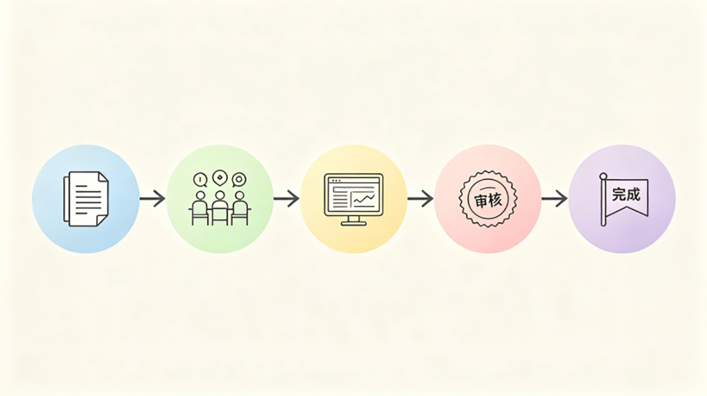
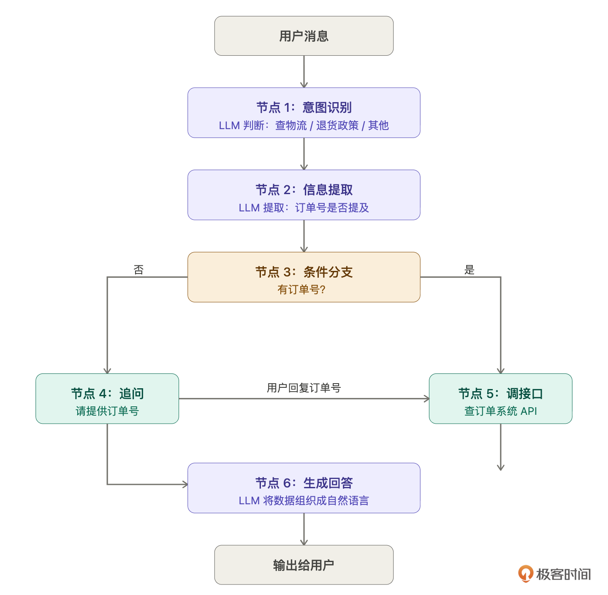
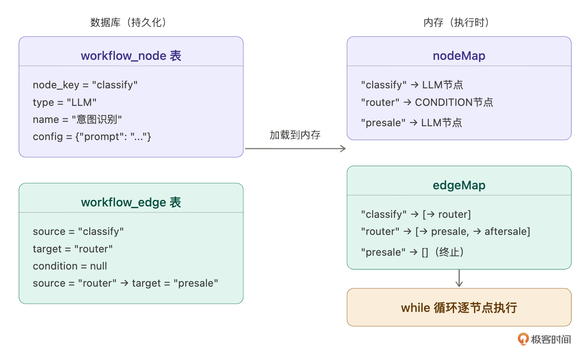
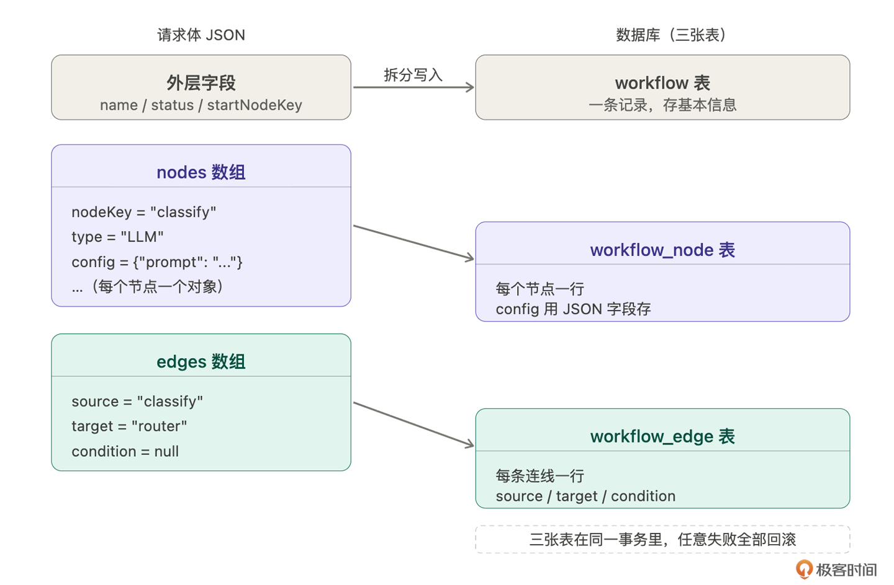

# 22｜工作流编排（上）：搞懂工作流，把它存起来

### 讲述：张浩 AI 版

时长 08:21 大小 9.54M

你好，我是 Robert。

智能客服现在能对话、能记住上下文、能引用知识库，但所有问题都走同一个 Prompt，用户问退换货政策和问产品功能，客服用同样的方式回答。

更好的做法是：先判断用户问的是什么类型，然后走不同的处理路径。售前走产品知识 Prompt，售后走政策条款 Prompt，技术支持走故障排查 Prompt。每条路径更聚焦，回答更精准。

这就是工作流要解决的问题。

在动手之前，先把这两讲的分工说清楚。工作流由两部分组成：元数据和执行引擎。

- 元数据是工作流的配置，它有哪些节点、节点之间怎么连接、每个节点做什么。
- 执行引擎是让这份配置真正跑起来的逻辑，从起始节点开始，一步步往下走，直到结束。

这一讲做元数据：搞懂工作流是什么，设计存储结构，实现 CRUD。下一讲做执行引擎：让存进去的工作流真正跑起来。

## 工作流是什么

假设我们之前没有做过工作流。遇到不熟悉的概念要怎么办？先让 Claude Code 解释清楚再动手。

Claude Code 从一个具体场景切入。用户发来一条消息：“我昨天下的订单还没到，帮我查一下。”

- 单 Prompt Agent 的处理方式：把这句话扔给 LLM，LLM 凭训练知识编一个回答：“您好，物流一般 3-5 天……”。问题是它根本没有查你的订单，不知道订单号、收货地址、快递状态。答案听起来合理，但是编的。
- 工作流的处理方式：把这件事拆成有序的步骤，每步做一件具体的事。

Claude Code 的一句话总结很准：问 “退货政策是什么”，单 Prompt 够用；问 “我的订单到哪了”，必须走工作流，因为答案在数据库里，不在 LLM 的脑子里。

同一个智能客服，用户问 “退货政策是什么” 走另一条路：意图识别 → 知识库检索 → 生成回答。根据意图走完全不同的路径，调用不同的工具和数据源。

概念清楚了，下一步看它在代码里长什么样。

## 工作流在代码里长什么样

概念懂了，但作为程序员，我需要知道它在代码里是什么形式。

为什么要加 “不要说 DAG、不要说图论”？因为这些概念先行会把人绕进去。我需要的是能直接对应到代码的解释，不是学术定义。

到这里，你可能会问，我不知道要问这个问题怎么办？这没啥好办法，只能靠实际经验的积累。这门课本身就是你的项目经验，不是吗？

Claude Code 的回答：两张表，两个概念 —— 节点 + 连线。

节点是做什么，每个节点就是一条数据库记录：

连线是做完去哪，记录节点之间的跳转关系：

存库是平铺的两张表，执行时加载进内存变成 Map + while 循环。

Claude Code 的总结：节点存 “做什么”，连线存 “做完去哪”，执行引擎按连线一步一步走完。

理解了这些，工作流就不神秘了。下一步把它映射成完整的存储设计。

## 工作流怎么设计，由哪些部分组成

结构清楚了，让 Claude Code 帮我把代码设计做完整。

- 如何存储工作流基本信息
- 如何存储节点，不同类型节点配置格式不同怎么处理
- 如何存储节点之间的连接关系
- Java 代码里如何做类型安全的解析

Claude Code 先读了现有项目的代码风格，BaseEntity、Agent.java、已有的 schema，然后给出设计。

一份 JSON 拆成三张表，创建时拆分写入，查询时组装还原。

- workflow 存工作流基本信息：名称、描述、状态（DRAFT / PUBLISHED / DISABLED）。
- workflow_node 存节点：node_key 是节点在工作流内的唯一标识（如 classify、router），type 是节点类型，config 是 JSON 字段存各类型节点的配置。
- workflow_edge 存连线：source_node_key → target_node_key，condition 是条件表达式，NULL 表示无条件直接走。

这里有一个设计细节值得说：连线引用 node_key 字符串，不引用数据库主键 id。原因是 node_key 由业务逻辑决定（比如 classify、router），前端拖拽时生成的临时标识可以直接存，不依赖数据库自增顺序。用主键 id 的话，节点还没存库就不知道 id 是多少，前后端协调会很麻烦。

节点配置用 JSON 字段存，不拆多张表。不同节点类型的配置格式完全不同：

字段结构差异这么大，强行拆列会让表结构很难看，而且每加一种节点类型就要改表结构。字段结构不确定、不同记录格式差异大的时候用 JSON 存；字段结构固定、需要按字段查询的时候才拆列。这个原则和 12 讲 auth_config 的处理方式一样。

Java 层的类型安全解析：Claude Code 给的方案是 sealed interface + record。定义 NodeConfig 作为父类型，每种节点类型一个 record，用 NodeConfigParser 按 type 字段分发解析。

执行引擎里用 switch 模式匹配处理不同类型，编译器帮你检查穷举，漏写任何一个 case 就报错。

新增节点类型只需要加一个 record，在 NodeConfigParser 加一行 case，不改其他代码。

## 实现 CRUD

设计确认了，开始实现，我们的提示词如下：

一个关键约束：更新时直接替换，不做 diff。工作流改动往往涉及多个节点和边，diff 逻辑复杂且容易出错。先删再插，三张表始终保持一致，多几条 SQL 完全值得。

你可能会发现，我们的提示词越来越细致了。为什么呢？

因为我们这门课已经讲到一半了，我认为你已经有了经验了，大概已经慢慢融入课程了。所以我希望你能够深度学习和感受如何和 Claude Code 协作。给它提示词的过程，就是掌握如何做复杂需求的过程。

## 串起来验证

CRUD 实现完，用一份真实的工作流配置验证数据模型能正确存储和还原。

验收标准只有一个：创建进去的配置，查询出来能完整还原。不多不少，节点对齐，边对齐，config JSON 字段不丢失。

这一讲就到这里，数据模型能完整存储和还原工作流配置。至于工作流跑不跑得起来，是下一讲执行引擎的事。

## 总结

这一讲做了一件事：搞懂工作流是什么，然后把它存起来。

四步递进：工作流的产品概念（步骤化处理，不同意图走不同路径）→ 代码形式（节点表 + 连线表，执行时 Map + while 循环）→ 存储设计（三张表 + JSON 字段 + sealed interface 类型安全解析）→ 实现和验证。

有两个原则值得带走。

不懂就先问清楚再动手。工作流是我们还没做过的子系统，上来就写代码大概率方向会错。先让 Claude Code 帮你建立概念，再看代码形式，再设计，顺序不能乱。这个方法适用于任何你第一次接触的技术方向。

字段结构不确定时用 JSON 存。不同节点类型配置格式差异大，强行拆列会让表结构难以维护。JSON 字段 + sealed interface 解析，扩展新节点类型只加一个 record，不改表结构，不改其他代码。

下一讲让这份配置跑起来。

## 思考题

- 当前的条件分支用关键词匹配。如果分类结果是一段话而不是单词，比如 “这个问题属于售后范畴”，关键词匹配会失效，怎么改进？让 Claude Code 帮你设计一个更健壮的匹配方案。
- 如果要加一种新的节点类型 —— 知识库检索节点，在工作流里先检索知识库再把结果传给 LLM 节点，数据模型需要怎么调整？节点配置的 JSON 长什么样？试着自己设计，再让 Claude Code 帮你实现。
- 当前工作流用接口手动配置。如果要做一个简单的可视化编排界面，试着用 18 讲的方法写一段需求描述，然后让 Claude Code 帮你生成前端页面。

期待你的分享！如果今天的课程让你有所收获，也欢迎转发给有需要的朋友，邀请他来一起学习，我们下节课再见！

