# 23｜工作流编排（下）：实现执行引擎，让工作流跑起来

### 讲述：张浩 AI 版

时长 12:10 大小 13.91M

你好，我是 Robert。

22 讲我们把工作流的元数据存进去了，三张表能完整保存节点和连线。但它只是一份静态配置，存进去读出来，就是不会动，这一讲让它动起来。怎么让它动起来呢？就是我们这节课要讲的执行引擎。

## 执行引擎是什么

老规矩，不懂先问。

Claude Code 没有凭空解释，它先把现有代码读了一遍：ChatServiceImpl.java、WorkflowServiceImpl.java，然后基于真实代码说清楚关系。

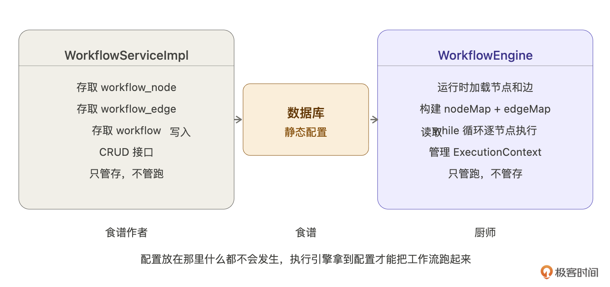

它的回答是：WorkflowServiceImpl 是我们上节课实现的工作流的元数据的存储。它是管配置的，执行引擎是另一个东西。WorkflowServiceImpl 只有 CRUD，也就是工作流配置的 CRUD。然后执行引擎是下一步要建的。

它用了个比喻，来说明元数据和引擎的关系。食谱放在那里什么都不会发生，厨师拿到食谱才能把菜做出来。而工作流配置就是食谱，我们这一节要实现的执行引擎就是厨师。来看下图：

执行引擎是从数据库加载 22 讲存的那份配置，构建 nodeMap + edgeMap，然后从起始节点开始一个节点一个节点地执行，最终结果通过 SseEmitter 推给用户。用户侧感知不到区别，收到的还是一样的 SSE 事件流。

Claude Code 还顺手列出了现在项目库中代码的实现状态：

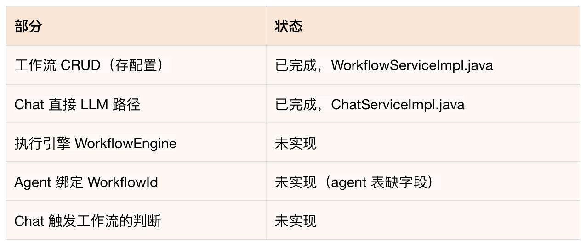

## 业界怎么做

知道是什么了，但怎么实现？先别急着写代码，让 Claude Code 做一轮技术调研。

这一步是在教你一个方法：遇到不熟悉的系统设计，先让 Claude Code 做技术调研，再基于调研结果做决策。不要凭感觉拍方案，也不要自己去翻文档，Claude Code 能在几秒内给你一份有质量的行业对比。

Claude Code 调研了 Dify、n8n、Coze、Temporal 四个平台的执行引擎的实现，整理如下：

线程模型：

- Dify：线程池 + 就绪队列，节点依赖满足后才入队
- n8n：多 Worker 进程 + Redis 消息队列，Worker 之间通过 Redis 协调
- Coze：Go goroutine，天生轻量并发
- Temporal：事件溯源状态机，崩了从检查点恢复

上下文传递：Dify 的 VariablePool 模式最值得参考，节点之间不直接传对象，通过命名变量引用。每个节点把输出写进变量池，下一个节点从池里按引用读。变量池只增不覆盖，历史输出不会被改掉。

执行记录：Dify 持久化两层，workflow_run（整次执行）和 workflow_node_execution（每个节点的执行记录），每次执行的每个节点都有完整记录，可以回放、调试、统计耗时。

Claude Code 的建议：Hify 选轻量同步引擎，参考 Dify 的 VariablePool 模式，不引入消息队列。

理由很清楚：

- n8n 的 Redis Queue 是为了多 Worker 水平扩展设计的，Hify 面向小规模团队，CLAUDE.md 里 Redis 只做缓存，引入消息队列是过度工程化。
- Temporal 解决的是 “工作流中途崩溃后从断点恢复” 的问题，适合运行时间以小时 / 天计的工作流，Hify 的工作流是一次对话响应的一部分，最长几十秒，崩了直接报错重试。
- Dify 的代码沙箱（seccomp）是为了隔离用户自定义代码节点，Hify 的节点类型是 LLM / CONDITION / API_CALL / KNOWLEDGE，没有任意代码执行，不需要沙箱。

总结下四个方案的对比：

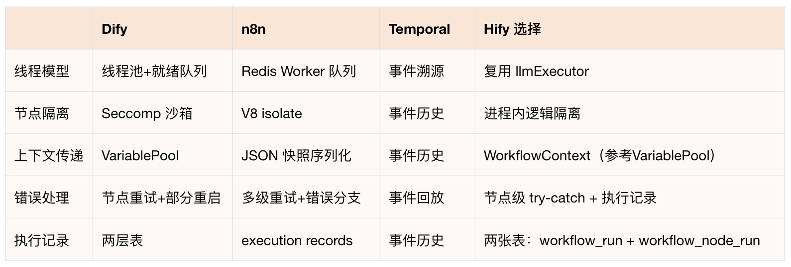

到这里我们对执行引擎的理解应该很完整了，这就是让 Claude Code 做业界调研的好处，它够快，信息够多。

## 执行引擎在代码里长什么样

调研完了，让 Claude Code 把设计具体化。

Claude Code 先把现有代码读完，ThreadPoolConfig.java、NodeConfigDef.java、NodeConfigParser.java、WorkflowNode.java、LlmHttpClient.java 等，然后基于真实代码给出设计。

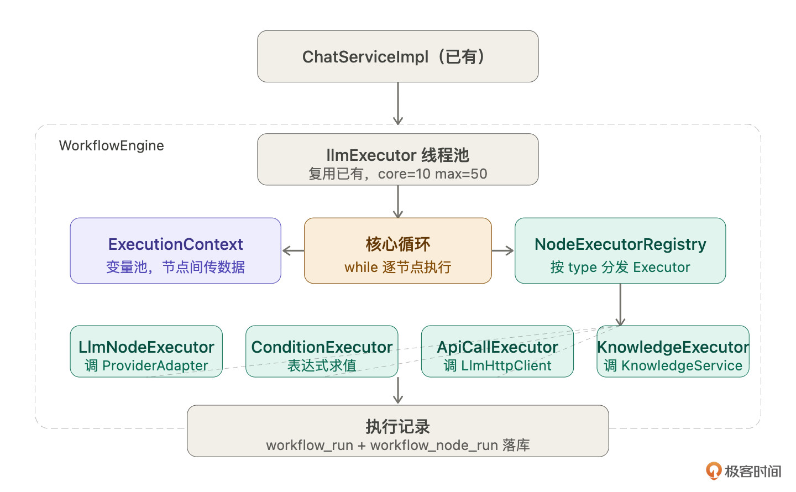

线程池：复用 llmExecutor，不新建。还记得不，我们在最开始的时候设计的线程池在这里复用了。

Claude Code 读了 ThreadPoolConfig.java——llmExecutor 是 core = 10, max = 50 的线程池，CallerRunsPolicy 保证不丢任务。工作流执行本质是 IO 密集型（调 LLM、调外部 API），和现有 streamChat 同属一类。不需要新建线程池，ChatServiceImpl 提交任务时就已经在 llmExecutor 线程里了，WorkflowEngine 感知不到线程池，只做同步执行。

ExecutionContext：贯穿整个工作流的变量池。对标 Dify 的 VariablePool。一次执行创建一个，从 START 节点活到 END 节点。key 格式是 nodeKey.varName，比如 classify.intent。节点只能写自己 nodeKey 下的变量，读可以读任意历史节点的输出。写入只增不改。

Context 随节点执行逐步累积变量：

NodeExecutor 体系：统一接口，每种节点一个实现。和 14 讲 Provider 适配层是同一个模式。四种 Executor，Spring 自动注册到 Registry，按 type 分发。

- LlmNodeExecutor：解析 config 里的 promptTemplate，用 ctx.resolve() 替换模板变量，复用已有的 ProviderAdapter 调 LLM，把返回内容写入 ctx。
- ConditionNodeExecutor：解析 expression，ctx.resolve() 替换变量后做字符串匹配，把 true / false 写入 ctx。
- ApiCallNodeExecutor：解析 url，替换变量后用 LlmHttpClient 调外部接口，把响应写入 ctx。
- KnowledgeNodeExecutor：调 KnowledgeService.searchChunks()，把检索结果拼成字符串写入 ctx，后续 LLM 节点用 {{kb.docs}} 引用。

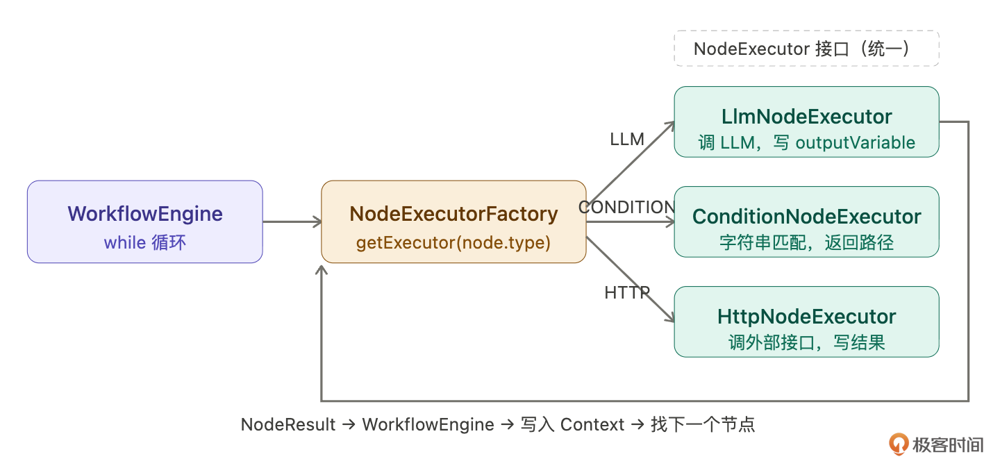

新增节点类型只需要：在 NodeConfigDef 加一个 record，加一个 @Component 实现类，不改其他任何代码。

核心循环：WorkflowEngine。把前三件事串起来，加上执行记录。骨架就是一个 while 循环：

这就是执行引擎的全部本质。复杂的是每个 Executor 怎么实现、Context 怎么传、错误怎么处理，但骨架就是这几行。

## 后端实现

架构清楚了，开始实现。四块按顺序来，每块单独验证再往下走。

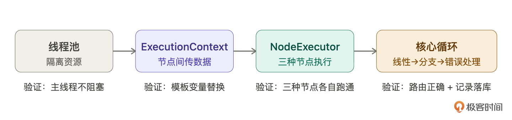

这部分因为太技术了，代码和提示词是最好的讲解，我就不展开讲了，有问题留言区讨论。你看的关键是，能够去理解提示词的内容，为什么这么写，这么写要达到什么目的。

### 线程池 + Agent 绑定

### ExecutionContext

验证：写单元测试，set ("classify", "intent", "售后")，然后 resolve ("你好，{{classify.intent}} 客服为您服务")，输出应该是 “你好，售后客服为您服务”。

### NodeExecutor 体系

### 核心循环 + 执行记录

先建执行记录表：

然后实现 WorkflowEngine：

### 接入对话引擎

这是对话引擎的第四次增量开发（16 讲基础链路、17 讲上下文、21 讲 RAG、23 讲工作流）。

增量开发三步走：

- 先跑不绑工作流的 Agent，确认原有逻辑没坏
- 再跑绑了工作流的 Agent，确认工作流正确触发
- 查 workflow_node_run 表，确认每个节点的输入输出都落库了

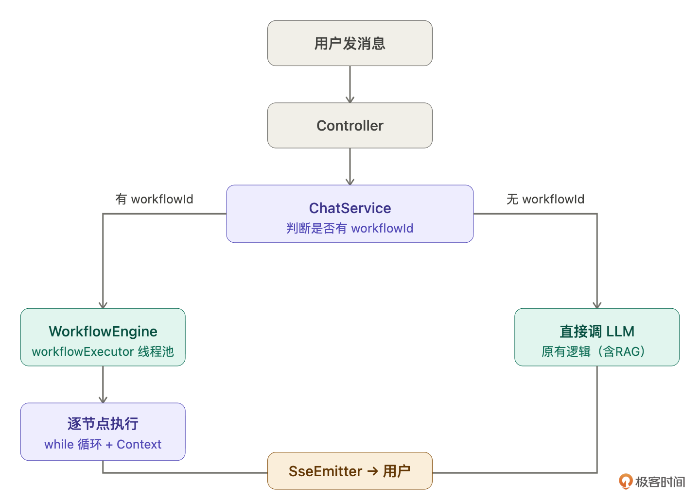

## 前端

### 完整形态是什么

先说说工作流前端真正应该是什么样子。

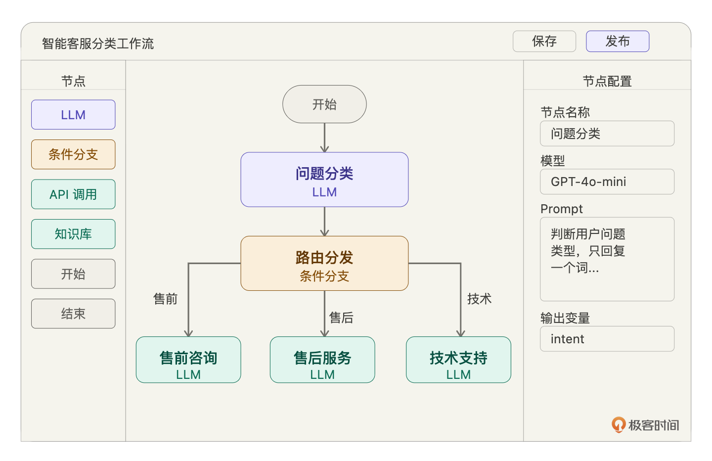

完整的工作流前端是可视化拖拽编排：节点从左侧面板拖进画布，节点之间连线，点击节点在右侧面板配置 Prompt 和参数。Dify、Coze、n8n 都是这个形态。

我们不做这个。原因很直接：可视化拖拽编排是独立的前端工程量，和执行引擎的设计没有关系。本讲的重点是执行引擎跑不跑得通，不是前端够不够好看。感兴趣的话，用 React Flow 或 Vue Flow 库让 Claude Code 帮你实现，思路和这两讲是一样的。

我们做最简版：列表页 + 创建页，JSON 直接手写提交。

### 最简版实现

## 验收

后端验收：

重点 review 异常分支：Claude Code 在正常路径上基本没问题，但这几个边界大概率会漏，要手动检查：

- 条件分支所有条件都不匹配，走 defaultTarget 还是直接结束？
- targetNodeKey 指向不存在的节点，会不会空指针？
- 工作流里有环（A→B→A），50 步限制有没有生效？
- LLM 节点调用失败，workflow_node_run 是 FAILED，workflow_run 也是 FAILED，SseEmitter 推了错误提示？

这四个问题逐一问 Claude Code，看处理逻辑是否正确。发现问题立刻修复再往下走。

前端验收：

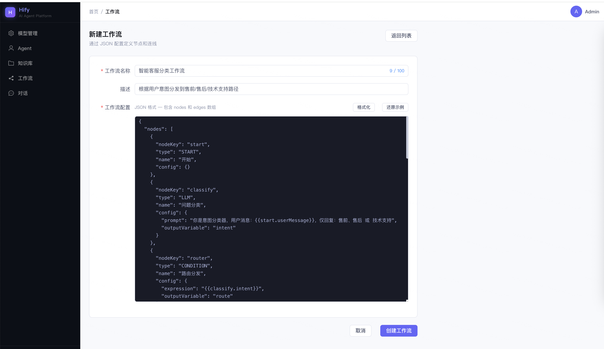

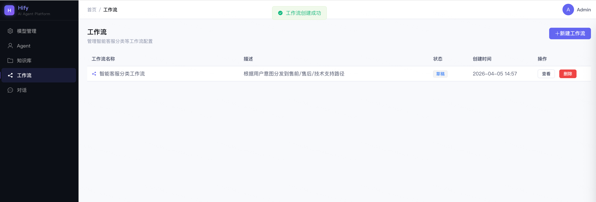

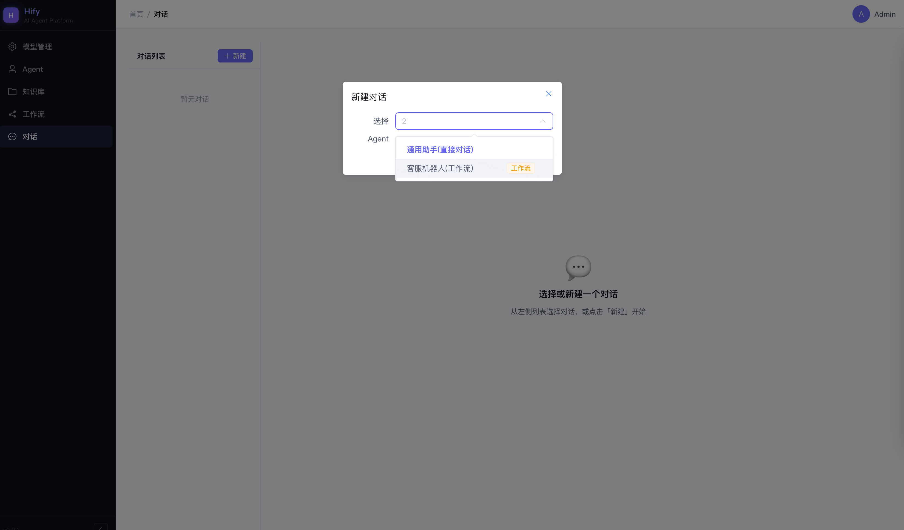

- 打开工作流列表页，能看到 22 讲创建的工作流
- 点击新建，看到预填的示例 JSON
- 修改其中一个节点的 Prompt，点格式化，确认 JSON 美化正常
- 提交，确认创建成功，跳回列表页
- 输入非法 JSON，确认前端拦截，不提交

## 总结

这两讲做了一件完整的事：从零设计并实现了一个工作流引擎。22 讲搞懂概念，把元数据存起来。23 讲让它跑起来。

这两节课的内容，主要都在提示词里面，没有太多文字展开讲，你需要重点去理解提示词。另外三个方法论你得记住。

- 不懂先做技术调研。遇到不熟悉的系统设计，先让 Claude Code 把业界方案梳理一遍，再基于调研结果做决策。Dify 的 VariablePool 模式、Temporal 的事件溯源、n8n 的 Worker 队列，不是所有方案都适合你的场景，调研的价值在于知道有哪些选项、各自的代价是什么，然后做出有理由的选择。
- 复杂系统分步实现。WorkflowEngine 没有一次性全写出来，先线性执行（验证 Context 数据传递）→ 加条件分支（验证路由）→ 加错误处理（生产级保护）→ 接入已有系统。每一步验证通过再往下走。盲目追求一次写完，出了问题不知道哪步错的。
- 有状态流转的代码，review 重点在异常分支。正常路径 Claude Code 基本能写对，但 “目标节点不存在”“条件都不匹配”“有环” 这类边界，Claude Code 大概率遗漏。你的 review 精力不要花在正常路径上，花在 “如果这一步的输入不是预期的会怎样”。

## 思考题

- 当前工作流中间 LLM 节点是同步执行的。如果分类节点模型响应很慢（5 秒 +），用户要等很久才看到任何反馈。怎么给用户一个 “正在分析问题类型…” 的中间状态提示？让 Claude Code 帮你设计方案。
- 如果要加 “重放” 功能 —— 管理员看到某次执行分类错了，手动改成 “售后” 后从条件分支节点重新跑，需要怎么改执行引擎？workflow_node_run 要存哪些额外信息才能支持重放？
- 当前一个工作流里所有 LLM 节点共用同一套 ModelConfig。如果想让分类节点用既便宜又快的模型（GPT-4o-mini），最终回答节点用好的模型（GPT-4o），当前设计支持吗？需要怎么改？试着配一个这样的工作流测试。

期待你的分享！如果今天的课程让你有所收获，也欢迎转发给有需要的朋友，邀请他来一起学习，我们下节课再见！

