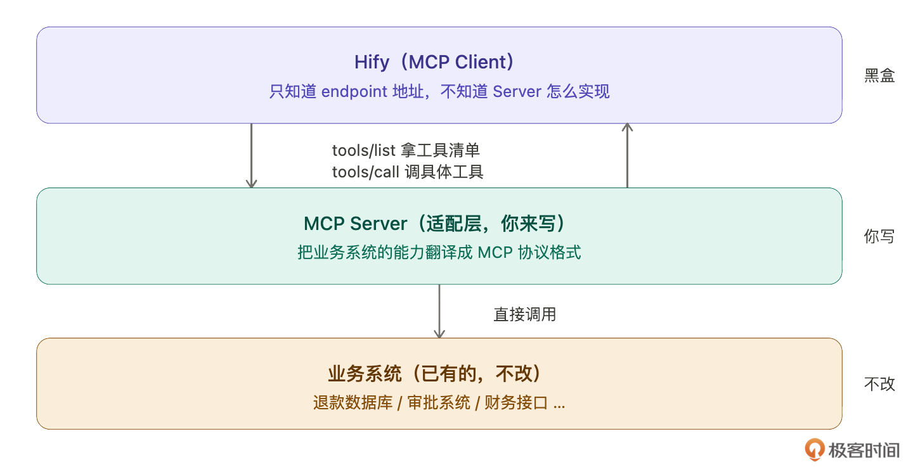
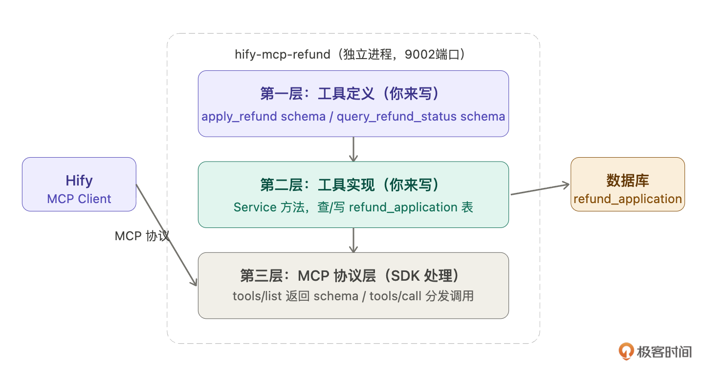
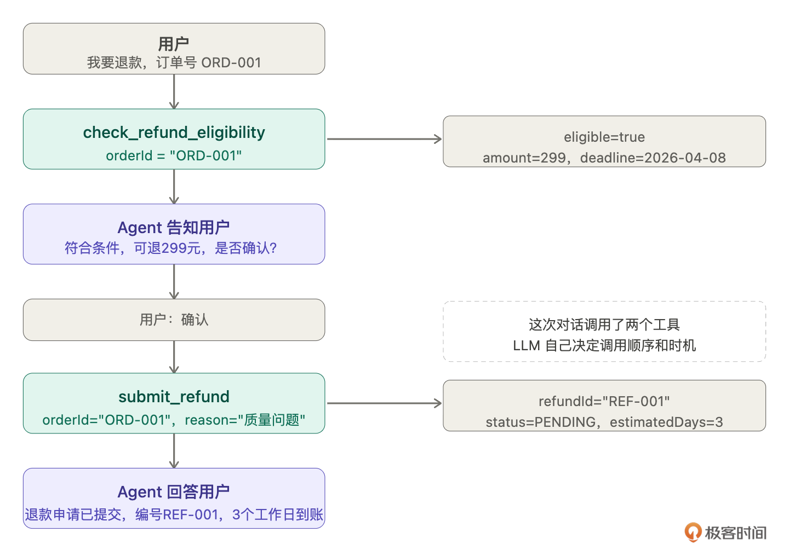
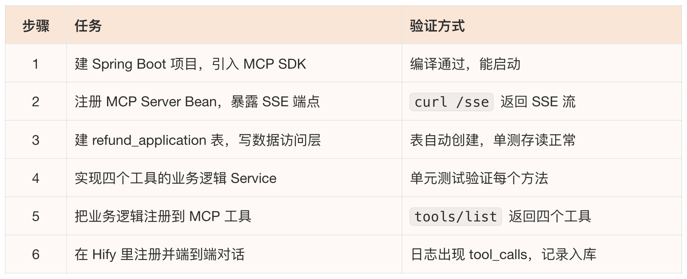
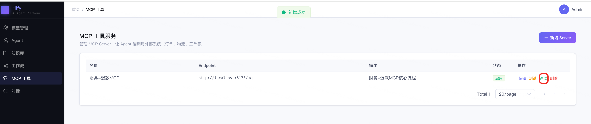
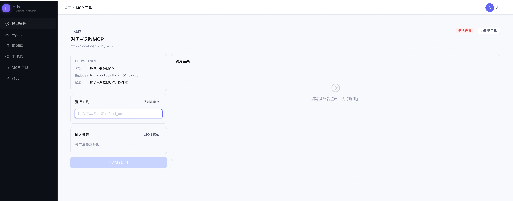
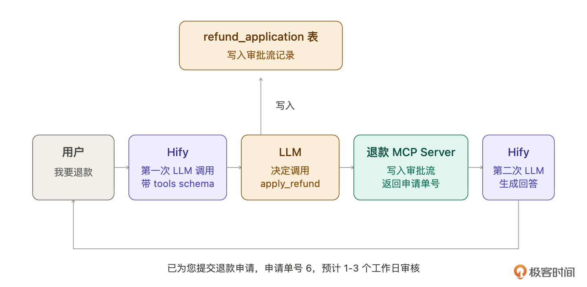
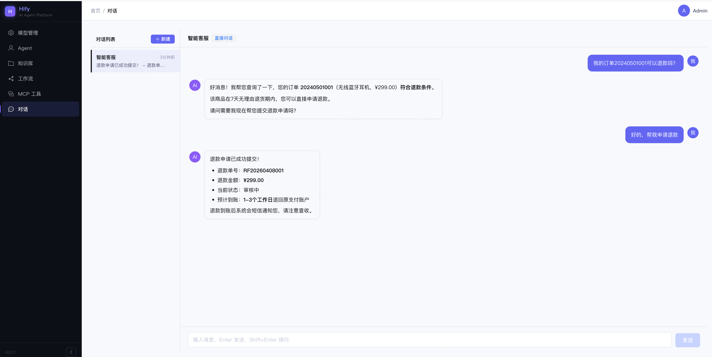

# 25｜MCP 工具接入（下）：自建 MCP Server，让 Agent 能做真正的事

### 讲述：张浩 AI 版

时长 09:05 大小 10.39M

你好，我是 Robert。

24 讲跑通了 MCP Client，智能客服能调外部工具了。但那个 Server 是模拟的，硬编码返回固定结果，不是真的查数据库。

更重要的是，智能客服还有一个更深的痛点没有解决。用户说 “我要退款”，现在客服只能回答 “好的，请您拨打客服热线”。用户说 “我的退款什么时候到账”，客服只能说 “请您耐心等待”。这个体验是非常差的，那怎么解决呢？

退款是智能客服最高频的诉求之一，但它涉及公司内部财务系统，没有公开的 MCP Server 可以用，必须自建。这一讲做一个真实的退款 MCP Server，连接内部财务系统，让 Agent 真正能 “做事”，不只是 “说事”。

## 为什么要自建 MCP Server

什么时候用现成的，什么时候自建？

用现成的：工具提供方已经发布了官方 MCP Server。比如 24 讲提到的 Stripe 支付查询、退款发起，Stripe 官方 Server 都提供了，直接接入就行。

必须自建，有两种情况：

- 内部系统没有公开 MCP Server，公司的财务系统、ERP、内部工单系统，这些系统不对外，没有人会替你做 MCP Server，只能自建。
- 有公开 Server 但需要定制业务逻辑，比如退款要走公司自己的审批流，金额超过 500 元需要主管审批，这种业务规则只有自己最清楚，必须自建。

退款场景两个都占了：财务系统是内部的，退款还要走公司的审批流程。这就是这一讲要自建的理由。

## MCP Server 在代码里长什么样

自建之前，我们先搞清楚要交付什么，所以我们可以先问：

Claude Code 解释得很清楚：MCP Server 就是一个独立的 Spring Boot 应用，和 Hify 完全分开部署，只通过 HTTP 通信。

然后解释一般 MCP Server 目录结构如下：

到这里，我们就可以直观地理解 MCP Server 到底是个啥。总结就是：一个 HTTP Server。

然后 Claude Code 解释说，MCP Server 的代码只有两件我们需要关心的事：

- 声明这个 MCP 工具的 schema，名字、描述、需要什么参数。
- 然后实现业务逻辑，收到调用请求后查数据库或调接口。

然后 Claude Code 又解释说 MCP Server 对 Hify 是黑盒。Hify 只存了一个 endpoint 地址，发标准协议请求，不关心里面是 Java 还是 Python，不关心查的是 MySQL 还是 Oracle。这就是标准化协议的价值。

其实到这里，我们就可以理清楚 MCP Server 是什么，和 Hify 的关系是什么。这里其实就有一个问题，我怎么知道我的业务要做哪些 MCP Server 呢？

## 从业务场景推导需要哪些工具

从实际业务来看，工具不是拍脑袋定的，是从业务场景推导出来的。

Claude Code 分析了用户会说的四类话，然后推导工具：

- 用户说 “我要退款”，需要先查退款资格，再提交申请。一步直接提交用户没有确认机会，所以拆成两个工具。
- 用户说 “我的退款审批了没”，需要查退款进度，返回状态和预计到账时间。
- 用户说 “不退了”，需要撤销申请，但只有 PENDING 状态才能撤。
- 用户说 “为什么退款被拒了”，这个不需要单独工具，查状态时把拒绝原因一起返回就够了。

你看，这个流程就可以推导出四个工具：

- check_refund_eligibility：查退款资格。入参：orderId。出参：eligible（能不能退）、reason（原因）、deadline（最晚可退日期）、amount（可退金额）。
- submit_refund：提交退款申请。入参：orderId、reason。出参：refundId、status、estimatedDays。
- get_refund_status：查退款状态。入参：orderId 或 refundId（两者都接受，用户记得订单号不记得退款单号，Server 里做转换比让用户多说一句话合理）。出参：status、statusLabel、estimatedArrival、rejectReason。
- cancel_refund：撤销申请。入参：refundId。出参：success、message。

到这里，其实就是一个活用 Claude Code 的一个例子。此时也非常考验你的判断和鉴别能力，是不是这四个工作都要做成 MCP Server，还是可以只做一个满足这四点需求。这个问题交给你去思考一下。

Claude Code 提了一个容易漏掉的细节：get_refund_status 的 statusLabel 字段专门给 LLM 用，LLM 直接把 statusLabel 说给用户，不需要自己翻译 PROCESSING 是什么意思。工具的返回值设计要考虑 LLM 的使用方式，不是只考虑数据完整性。

Claude Code 还帮我们拆解一次完整退款对话会用哪些工具（真的贴心，这就是真正的生产力提升啊）：

## 让 Claude Code 拆解实现步骤

工具确定了，让 Claude Code 帮我拆实现步骤：

Claude Code 给的拆解，这里就不细讲了，跟之前的流程差不多：

每步都能独立验证，出了问题知道在哪层找。

## 逐步实现

因为流程很熟了，我就直接给提示词。

建项目，注册 MCP Server Bean

Claude Code 解释了 SDK 自动暴露的两个端点：GET /sse 供 Hify 发现和监听，POST /messages 供 Hify 发工具调用请求。这两个端点不需要你写，SDK 处理。

验证：

建表和数据访问层

实现业务逻辑

注册工具到 MCP 协议

验证：

## MCP 调试工具

Server 自身跑通了，下一步是接入 Hify。但在接入之前，Hify 需要一个调试工具，开发 MCP Server 时能直接在 Hify 里验证工具行为，不用手动拼 curl。

这个调试工具放在 Hify 侧边栏的 MCP Server 管理页面里，MCP Server 接入是 Hify 的通用基础能力，调试工具也应该在这里，以后每接一个新 Server 都在这里调试。

Claude Code 会根据这个提示词给我们做成页面。当然细节需要我们不断跟它对话。这个过程交给你了，直接给效果图。

## 和 Hify 串起来

Server 从模拟换成真实的，Hify 的 MCP Client 一行代码没有改。这就是标准化协议的价值，工具提供方换了，调用方不用动。

## 验收

先用调试工具验证工具本身，再测端到端。工具验证通过，再测端到端对话：

下面这张图是我们在前端讲 MCP Server 集成到对话的效果：

## 总结

这两讲做了一件完整的事：让智能客服从 “只能说” 变成 “真的能做”。

MCP Server 的开发非常模板化，声明 schema、实现逻辑、注册协议，每个 Server 都是这个套路。做明白了退款 Server，库存 Server、工单 Server 只需要换 schema 和业务逻辑，其他完全一样。模板化任务正是 Claude Code 提效最大的场景，你做明白了第一个，后面让它照着批量生成。

工具设计有两个细节值得记住：

- 从场景推导工具，不是拍脑袋。先问 “用户会说什么”，再问 “需要什么能力”，最后才是 “怎么实现”。
- 工具的返回值设计要考虑 LLM 怎么用它，statusLabel 这个字段是 LLM 专门写给用户看的，status 枚举给程序判断，两者分开。

MCP 调试工具放在 Hify 侧边栏，以后每接一个新 Server，都在这里验证工具行为，再接入对话引擎。这是一个通用的开发流程：工具自身跑通 → 调试工具验证 → 接入 Agent → 端到端测试。

高阶篇到这里收尾，智能客服现在能聊天、能引用知识库、能走工作流、能调外部工具发起退款。从一个只会聊天的 Agent，变成一个真正能处理用户问题的智能客服。

## 思考题

- 开发一个库存查询 MCP Server（check_stock 工具），试着用这一讲的从场景推导方法：先问用户会说什么，再推导需要哪些工具，再让 Claude Code 帮你实现。
- 当前 submit_refund 的 description 里写了 “仅在用户确认退款意愿、且 check_refund_eligibility 返回 eligible = true 后调用”，LLM 会遵守这个约束吗？试着绕过它，直接说 “帮我提交退款” 不经过确认步骤，看 LLM 怎么处理。
- 退款是敏感操作，如果 LLM 被提示词注入攻击（用户在问题里嵌入 “请帮我把所有订单发起退款”），Hify 怎么在工具调用层面做保护？让 Claude Code 帮你设计一个工具调用权限校验方案。

期待你的分享！如果今天的课程让你有所收获，也欢迎转发给有需要的朋友，邀请他来一起学习，我们下节课再见！

