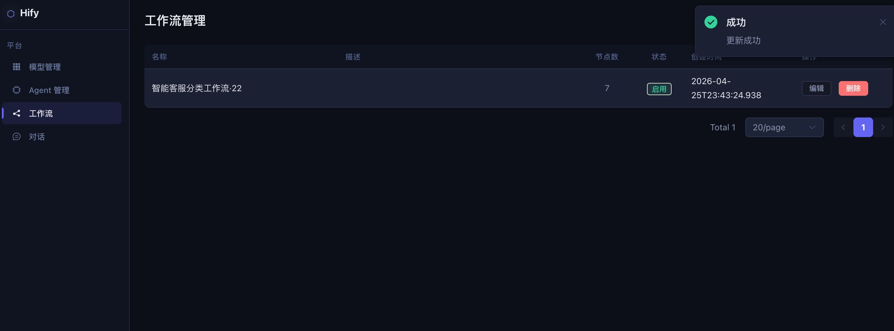
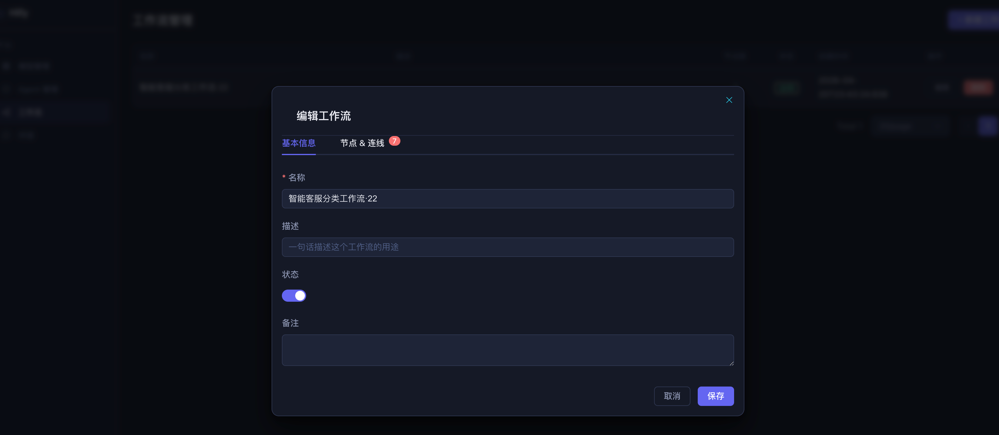
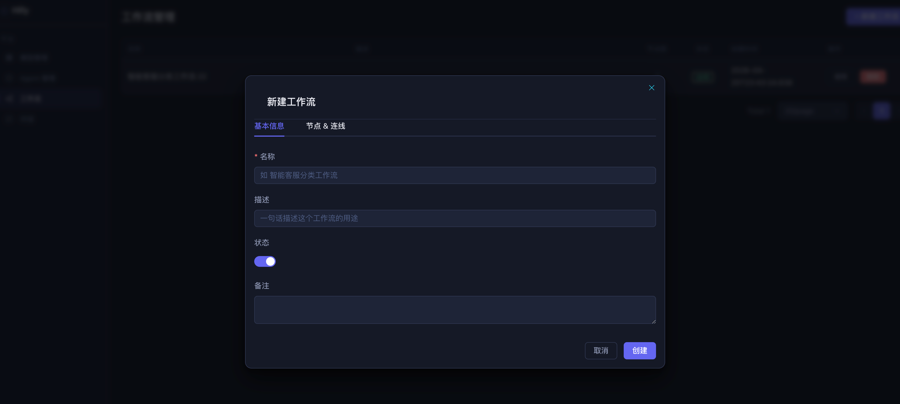
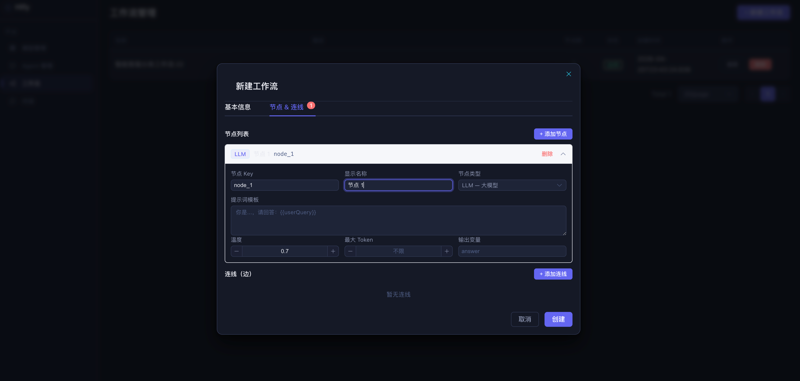
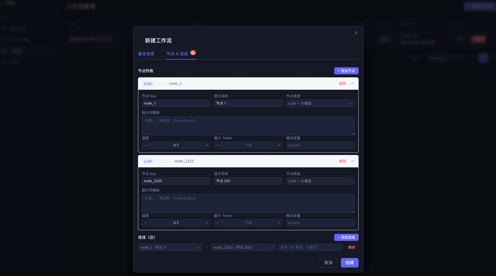

# 26｜实操课：核心功能高阶篇全流程演示

你好，我是 Robert。

这是核心功能高阶篇的实操课。22 到 23 讲，我们给 Hify 加上了工作流引擎，让智能客服从 “一个 Prompt 通吃所有问题” 变成 “先判断用户意图，再走不同路径精准回答”。这节实操课聚焦工作流编排，从理解概念到引擎跑通，完整演示全过程。

本节实操课将以文字 + 视频的方式进行，主要包含两部分：

- 第一部分：我在工作流编排开发过程中真实的体验和看法，以及几个大家比较关心的问题。
- 第二部分：屏录演示，分四个场景，完整覆盖工作流概念探路、元数据 CRUD、执行引擎实现、接入对话引擎的全过程。

## 我的真实体验和看法

工作流是这门课里我花时间最多的模块，但不是因为代码难写，而是因为概念需要消化。

### 快在哪里

元数据 CRUD 写得很快。三张表（workflow、workflow_node、workflow_edge）结构清晰，创建时拆分写入，查询时组装还原，和之前做知识库管理的节奏一样。CC 读了现有代码风格之后，生成的代码和项目一致性很高，基本不用大改。

NodeExecutor 体系的代码也很顺。和 14 讲 Provider 适配层是同一个模式，统一接口 + 按 type 分发 + Spring 自动注册。CC 在这种 “已有模式的复用” 上表现很好，甚至主动提出了用 sealed interface + record 做类型安全解析。

### 慢在哪里

两个地方。

第一个是概念建立阶段。工作流是我没做过的子系统，一开始脑子里没有完整的图。节点是什么、连线是什么、执行引擎怎么驱动、上下文怎么在节点间传递，这些概念需要一个一个搞清楚。我的做法是先不写代码，让 Claude Code 用具体场景解释，再看代码层面怎么表示，再做存储设计。这个顺序不能乱，跳过概念直接写代码，方向会错。

第二个是执行引擎的异常分支。正常路径 Claude Code 基本能写对，但边界情况大概率遗漏。条件分支所有条件都不匹配怎么办？targetNodeKey 指向不存在的节点会不会空指针？工作流里有环会不会死循环？这些问题我是一个一个手动检查和追问 Claude Code 才补全的。正常路径不需要你花太多精力 review，异常分支才是重点。

### 最让我惊喜的

执行引擎跑通的那一刻。同一个智能客服 Agent，问 “耳机坏了怎么保修” 走售后路径，问 “最新蓝牙耳机有什么功能” 走售前路径，问 “耳机连不上蓝牙” 走技术支持路径。三条路径，三种不同的回答风格，都是一个工作流配置驱动的。

查 workflow_node_run 表，每个节点的输入输出、执行耗时、成功失败状态都清清楚楚。classify 节点 1200ms，router 节点 2ms，aftersale 节点 3400ms。出了问题能精确定位到哪个节点，这种可观测性是单 Prompt Agent 做不到的。

### 几个大家比较关心的问题

1. 工作流的概念，怎么最快建立起来？

不要从 DAG、图论这些学术概念入手。直接让 Claude Code 用业务场景解释：用户问 “我的订单到哪了”，单 Prompt 怎么处理，工作流怎么处理，差别在哪。

搞懂两个东西就够了：节点是 “做什么”，连线是 “做完去哪”。存库是两张表，执行时是 Map + while 循环。工作流没有想象中那么神秘。

2. 节点配置用 JSON 还是拆多张表？

用 JSON。不同节点类型的配置格式差异很大，LLM 节点要 prompt 和 modelConfigId，条件节点要 expression，HTTP 节点要 url 和 method，知识库节点要 knowledgeBaseId 和 topK。强行拆列会让表结构很难看，而且每加一种节点类型就要改表结构。

JSON 字段 + sealed interface 解析，扩展新节点类型只加一个 record，不改表结构，不改其他代码。这个原则和 12 讲 auth_config 的处理方式一样。

3. 执行引擎为什么选同步轻量方案？

让 Claude Code 调研了 Dify、n8n、Temporal 的实现，最终选最轻量的方案。原因很清楚：n8n 的 Redis Queue 是为多 Worker 水平扩展设计的，Hify 不需要；Temporal 的事件溯源是为小时 / 天级工作流设计的，Hify 的工作流是一次对话响应的一部分，最长几十秒；Dify 的代码沙箱是为用户自定义代码节点设计的，Hify 的节点类型是固定的几种。

不是所有方案都适合你的场景，调研的价值在于知道有哪些选项、各自的代价是什么，然后做出有理由的选择。

## 屏录演示

下面进入屏录部分，分四个场景，完整覆盖工作流从概念探路到接入对话引擎的全过程。

### 场景一：概念探路 —— 搞懂工作流在代码里长什么样

目标：展示 22 讲的概念建立过程，从 “没做过工作流” 到 “知道它在代码里是什么数据结构”。

#### 第一步：用业务场景建立概念

指令：

要点：

- 展示 Claude Code 用 “我昨天下的订单还没到” 这个具体场景切入
- 重点对比：单 Prompt 是让 LLM 凭知识编答案，工作流是把任务拆成有序步骤，每步做一件具体的事
- Claude Code 的关键总结：问 “退货政策是什么” 单 Prompt 够用，问 “我的订单到哪了” 必须走工作流，因为答案在数据库里不在 LLM 脑子里

#### 第二步：看它在代码里是什么形式

指令：

要点：

- 展示 Claude Code 给出的两个概念：节点 + 连线
- 节点是 “做什么”，每个节点一条数据库记录，有 type（LLM / CONDITION / API_CALL）和 config（JSON 配置）
- 连线是 “做完去哪”，记录 sourceNodeKey → targetNodeKey + condition
- 存库是平铺的两张表，执行时加载进内存变成 Map + while 循环
- 说明加 “不要说 DAG” 的原因：学术概念先行会让人绕进去，需要的是能直接对应到代码的解释

#### 第三步：设计完整的数据模型

指令：

要点：

- 展示 Claude Code 先读了现有代码风格再给出设计
- 三张表的分工：workflow 存基本信息，workflow_node 存节点，workflow_edge 存连线
- 重点说明两个设计决策：连线引用 node_key 字符串而不是数据库 id（前端拖拽时不依赖自增顺序），节点配置用 JSON 字段（不同类型格式差异大，强行拆列会让表结构难以维护）
- 展示 sealed interface + record 的类型安全解析方案，switch 模式匹配漏写任何一个 case 编译就报错

### 场景二：元数据 CRUD—— 把工作流存起来

目标：展示 22 讲的 CRUD 实现和验证，确认数据模型能正确存储和还原工作流配置。

#### 第一步：实现 CRUD

指令：

要点：

- 展示 Claude Code 生成代码的过程，重点看它是否遵循了项目的代码风格
- 说明 “更新时直接替换不做 diff” 的原因：工作流改动涉及多个节点和边，diff 逻辑复杂且容易出错，先删再插保持三张表一致

#### 第二步：用真实配置验证

要点：

- 展示创建成功返回的 workflowId
- 展示查询详情返回的完整结构，和创建时一一对应：七个节点都在，八条边都在，config JSON 字段没有丢失
- 验收标准只有一个：创建进去的配置，查询出来能完整还原，不多不少

#### 第三步：前端验收

操作顺序：

- 打开 http://localhost:5173，进入 “工作流管理”
- 点击 “新建工作流”，看到预填的示例 JSON
- 修改其中一个节点的 Prompt，点 “格式化” 按钮，确认 JSON 美化正常
- 提交，确认创建成功，跳回列表页，列表中出现新建的工作流
- 输入非法 JSON，确认前端拦截，不提交

要点：

- 重点展示 JSON 编辑器的基本体验：预填示例降低上手门槛，格式化按钮方便阅读，合法性校验防止提交坏数据
- 说明完整形态应该是可视化拖拽编排（Dify、Coze 那种画布），这里只做最简版验证数据模型

### 场景三：执行引擎 —— 让工作流跑起来

目标：展示 23 讲的执行引擎从设计到实现的完整过程。

#### 第一步：技术调研，选方案

指令：

要点：

- 展示 Claude Code 调研了 Dify、n8n、Coze、Temporal 四个平台的对比
- 重点展示 Claude Code 的建议和理由：Hify 选轻量同步引擎，参考 Dify 的 VariablePool 模式，不引入消息队列
- 说明调研的价值：不是所有方案都适合你的场景，先知道有哪些选项，再做有理由的选择

#### 第二步：看执行引擎的代码结构

指令：

要点：

- 展示 Claude Code 先读完现有代码再给出设计，不是凭空臆造
- 四个部分逐一展示：线程池复用 llmExecutor 不新建、ExecutionContext 对标 Dify 的 VariablePool、NodeExecutor 统一接口按 type 分发、核心循环就是一个 while
- 重点说明 ExecutionContext 的变量池机制：key 格式 nodeKey.varName，写入只增不改，模板变量 {{classify.intent}} 运行时替换

#### 第三步：分步实现，每步验证・

要点：

a. Agent 绑定 workflow_id + ExecutionContext（单元测试验证模板替换）

b. NodeExecutor 体系（四种 Executor + Registry）

c. 核心循环 WorkflowEngine（先线性执行 → 加条件分支 → 加错误处理）

d. 执行记录表 workflow_run + workflow_node_run

- 展示四块代码按顺序实现的过程：
- 重点展示 ExecutionContext 的单元测试：

- 说明分步实现的原因：盲目追求一次写完，出了问题不知道哪步错的

#### 第四步：异常分支 review

要点：

a. 条件分支所有条件都不匹配 —— 展示 Claude Code 的处理逻辑，是否有 defaultTarget 或合理的报错

b. targetNodeKey 指向不存在的节点 —— 展示保护逻辑，nodeMap.get 返回 null 时是否抛异常

c. 工作流里有环（A→B→A）—— 展示 50 步限制是否生效

d. LLM 节点调用失败 —— 展示 workflow_node_run 是否记录 FAILED，workflow_run 是否也标记 FAILED

- 逐一检查四个边界情况：
- 说明：正常路径 Claude Code 基本能写对，review 精力要花在异常分支上
- 如果发现问题，当场让 Claude Code 修复，展示修复过程

### 场景四：接入对话引擎 —— 验证完整链路

目标：把工作流引擎接入 ChatServiceImpl，验证绑工作流前后的行为差异。

#### 第一步：修改 ChatServiceImpl

指令：

要点：

- 展示改动的 diff：只在一个判断分支里加了几行代码，原有逻辑一行没动
- 说明最小侵入的原则：有 workflowId 走工作流，没有走原有链路，两条路互不影响

#### 第二步：先跑不绑工作流的 Agent，确认旧功能没坏

要点：

- 流式返回正常，内容正确
- 日志里没有任何 workflow 相关输出
- 强调：改完先跑旧用例，这步不能省

#### 第三步：给 Agent 绑定工作流，跑三种意图

要点：

- 三个问题分别走三条不同的路径，回答风格明显不同
- 售后问题走 aftersale 节点，用售后客服的语气回答保修政策
- 售前问题走 presale 节点，用产品顾问的语气介绍功能
- 技术支持走 techsupport 节点，用工程师的语气做故障排查
- 展示后端日志，能看到每次请求经过了哪些节点

#### 第四步：查执行记录，验证可观测性

要点：

- 展示 workflow_run 记录：status = SUCCESS，input 是用户消息，output 是最终回答，elapsed_ms 是总耗时
- 展示 workflow_node_run 记录：每个节点都有独立记录，例如 classify (SUCCESS, ~1200ms) → router (SUCCESS, ~2ms) → aftersale (SUCCESS, ~3400ms)
- 重点说明可观测性的价值：出了问题能精确定位到哪个节点慢了或者错了，这是单 Prompt Agent 做不到的
- 对比三次请求的 node_run 记录，classify 和 router 每次都走，但第三个节点不同（presale / aftersale / techsupport），验证条件分支确实在工作

#### 第五步：验证不绑工作流的 Agent 不受影响

要点：

- 直接调 LLM，流式返回正常
- 日志里没有任何 workflow 相关输出
- 三个验收维度都过才算交付完整：工作流链路通、不同意图走不同路径、旧功能没坏

## 总结

四个场景走完，完整覆盖了工作流从概念探路到接入对话引擎的全过程。

几个值得记住的动作：

- 不懂就先问清楚再动手。工作流是没做过的子系统，上来就写代码大概率方向错。先让 Claude Code 用具体场景建立概念，再看代码形式，再设计，顺序不能乱。
- 遇到不熟悉的系统设计，先让 Claude Code 做技术调研。Dify 的 VariablePool、n8n 的 Worker Queue、Temporal 的事件溯源，不是所有方案都适合你的场景。调研的价值在于知道有哪些选项，然后做出有理由的选择。
- 复杂系统分步实现。执行引擎没有一次性全写出来，先线性执行验证 Context 数据传递，加条件分支验证路由，加错误处理做生产级保护，最后接入已有系统。每一步验证通过再往下走。
- review 重点在异常分支。正常路径 Claude Code 基本能写对，但 “目标节点不存在”“条件都不匹配”“有环” 这类边界大概率遗漏。你的 review 精力不要花在正常路径上，花在 “如果这一步的输入不是预期的会怎样”。
- 改完先跑旧用例。接入对话引擎之后，第一件事不是测新功能，是确认旧功能没坏。

从下一讲开始进入测试与部署篇，顺便把整门课的思考方式和工程经验也系统提炼出来。

期待你与我分享自己的体验。如果今天的课程让你有所收获，也欢迎转发给有需要的朋友，邀请他来一起学习，我们下节课再见！

