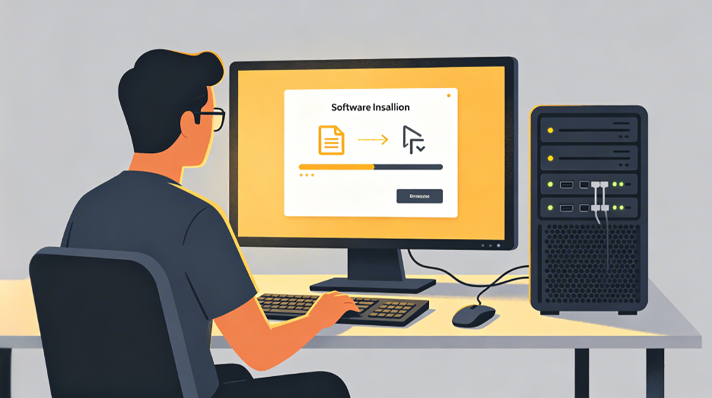
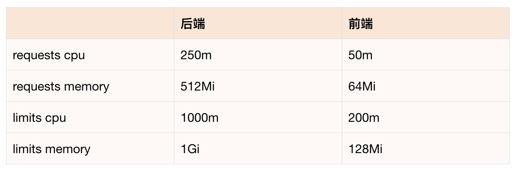

# 28｜容器化与部署：从本地到可交付

### 讲述：张浩 AI 版

时长 12:35 大小 14.39M

你好，我是 Robert。

Hify 的所有功能开发完了，测试也补了。但它现在只能在你的开发机上跑，换一台机器就要装 JDK、装 Node.js、配环境变量，折腾半天。

这一讲把它变成可交付的。和之前学 RAG 一样，你不需要懂 Dockerfile 和 K8s YAML 的语法细节，用自然语言告诉 Claude Code 你要什么，它帮你生成，你执行命令就行。

## 先和 Claude Code 讨论部署形态

不急着生成任何文件。先用咨询模式和 Claude Code 讨论清楚要支持哪些部署形态，有什么需要提前准备的。

Claude Code 的分析给出了三种部署形态，以及每种形态需要准备的内容。

形态一：tar.gz 本地部署

适合客户内网无 Docker、纯 Linux 环境，运维能力弱的场景。

需要准备：fat jar + 前端 dist、application.yml 配置模板、start.sh / stop.sh / status.sh、Nginx 配置模板（含 SSE 配置）、数据库初始化 schema.sql。目标机器需要自行安装 JRE 17+、MySQL、Redis、PostgreSQL + pgvector。

形态二：Docker 部署

适合有 Docker 环境的技术型中小团队。

需要准备：前后端各自的 Dockerfile（多阶段构建）、docker-compose.yml、.env 模板。pgvector 有官方镜像 pgvector/pgvector:pg16，比本地部署友好很多。

形态三：K8s 部署

适合有 K8s 集群、追求高可用的企业。

需要准备：Deployment、Service、ConfigMap、Secret、Ingress 等 YAML 文件。MySQL / Redis 通常复用客户已有实例，pgvector 需要单独处理。

Claude Code 还给出了三种形态的横向对比和建议优先级：先做 Docker（投入产出比最高）、再做 tar.gz（面向传统企业）、最后做 K8s（复用 Docker 镜像）。这里我们按照从简单到复杂的顺序来做。

Claude Code 主动提出的四个确认问题：

- MySQL、Redis、pgvector 是跟 Hify 一起部署，还是连接已有的外部服务？外部服务，通过配置连接
- 目标机器有没有 Java 环境？有，不需要打包 JDK
- Docker 部署是否把数据库也包进去？不包含，只部署 Hify 自身
- 当前 Hify 有没有 HTTP 健康检查接口？三种部署形态都需要它，本地部署用来确认服务起来了，Docker 用来做 healthcheck 指令，K8s 用来做存活和就绪探针。如果没有，需要先补。

前三个问题确定了部署边界，第四个是我没想到的遗漏，Claude Code 主动提醒了一个前置工作。这是咨询模式的价值：不是让 AI 直接执行，而是先讨论清楚，让它帮你发现遗漏，再动手。

## 先补健康检查接口

Claude Code 提醒了，先把前置工作做完，再做部署。

Claude Code 没有直接生成代码，而是先扫描了项目，发现 HealthController.java 已经存在了，接口也有。但它主动发现了一个格式不一致的问题：

现有接口返回的是 {"code":200,"message":"success","data":"ok"}，和要求的 {"code":0,"data":"ok"} 有差异，code 值不同，多了 message 字段。

Claude Code 给出了两个选项：

- 保持现状：健康检查场景里 curl/Docker/K8s 只看 HTTP 状态码，不解析 body，code 值无所谓。
- 改成 code:0：需要改动，但会影响所有接口的响应格式。

Claude Code 的建议是，选 1，不必为健康检查改全局响应格式。

确认选 1 之后，Claude Code 直接修改了 HealthController.java，在这个接口单独返回 Map.of("code", 0, "data", "ok")，不动全局 Result 类，改动最小。

顺带给出了三种部署形态下怎么使用健康检查接口的方式：

- tag.gz 形态

- Docker 形态

- K8s 形态：

这个交互有两个值得注意的点：第一，Claude Code 没有盲目执行，而是先查了项目里有没有，避免重复创建；第二，发现格式不一致后主动问了你，没有自作主张改全局格式。这是咨询模式和执行模式结合的正确节奏。

## 本地部署：打成 tar 包

本地部署的目标：一个 tar 包，解压、填配置、执行 start.sh，服务跑起来。目标机器只需要有 Java 环境。

Claude Code 没有直接生成脚本，而是先读了现有的 start.sh、stop.sh、Makefile 和 application.yml，发现：现有 start.sh 是开发模式，跑的是 mvn build + npm dev server，不适合生产部署，需要完全重写。

确认情况后，CC 生成了五个文件：

1. start.sh（完全重写）

生产模式直接运行 jar，不再跑 mvn / npm。关键逻辑：

- 启动前检查 Java 版本是否 17+，jar 文件是否存在
- 自动加载同目录的 .env 文件，再接受环境变量覆盖
- 外部 application.yml 优先级高于 jar 内置配置
- 启动后轮询 /api/v1/health 确认就绪，最多等 90s；进程异常退出会立即打印最后 30 行日志

2. stop.sh（精简）

去掉了前端进程管理，只管后端。发 SIGTERM，等最多 30s，超时强制 SIGKILL。

3. deploy/application.yml.template

打包时复制为 application.yml，所有连接信息用 ${ENV_VAR:default} 占位符，用户只需要填实际的地址和密码。

4. deploy/env.template

用户解压后 cp env.template .env，填好密码就可以启动。

5. Makefile 的 package 命令

make package 先触发 build（编译后端 + 打包前端），再把产物打成 tar 包：

目标机器的部署流程：

start.sh 启动后会自动轮询健康检查接口，就绪了打印 “Hify 启动成功”，失败了打印日志告诉你哪里出了问题。

## Docker 部署：Dockerfile + docker-compose

Docker 部署的目标：两个 Dockerfile 分别打包前后端镜像，一条命令启动。

### 后端 Dockerfile

Claude Code 生成的后端 Dockerfile 有几个值得关注的细节：

- 层缓存优化：先单独 Copy 所有 pom 文件执行 dependency:go-offline，再 Copy 源码编译。依赖没变时直接命中缓存，省去 3-5 分钟下载时间。运行阶段还用了 Spring Boot layertools 把 jar 拆成四层（dependencies → loader → snapshot-dependencies → application），每次只改业务代码时只有最后一层失效。
- 安全：构建用 JDK alpine，运行只用 JRE alpine，镜像体积差约 200MB。addgroup/adduser 创建无 home 目录、无 shell 的系统用户，进程以非 root 运行。加了 -Djava.security.egd=file:/dev/./urandom，避免容器内熵不足导致启动慢。
- 健康检查：用 wget（alpine 内置）而非 curl（需额外安装），减少镜像层。--start-period=60s 给 Spring Boot 足够的初始化时间，这段时间内失败不计入重试。
- 外部配置注入：挂载 /app/config/application.yml 覆盖内置配置，用 optional: 前缀保证没挂载时也能启动。

### 前端 Dockerfile

Claude Code 先读了 package.json 和 vite.config.ts 确认项目结构，然后生成了两个文件。

前端 Dockerfile 同样两阶段：Node 镜像打包出 dist，只把 dist 复制进 Nginx 镜像，最终运行镜像约 40MB，不含 Node.js。

Nginx 配置是关键，Claude Code 给出了几个针对 Hify 的特殊处理：

proxy_buffering off 是 SSE 的关键，如果不关，Nginx 会把事件攒批后一次性发出，用户看不到打字机效果，要等 LLM 全部输出完才能看到内容。proxy_read_timeout 120s 比后端超时稍长，避免 Nginx 先断连。

proxy_pass http://backend:8080 用的是 Docker 网络服务名，和后面 docker-compose 里的服务名直接对应。

### 生成 docker-compose.yml

Claude Code 先读了 env.template 确认变量名，再生成 docker-compose.yml，同步更新了 .env 模板加入 Docker 特有的端口映射变量。

几个值得注意的设计：

- depends_on: condition: service_healthy：前端容器等后端健康检查通过后才启动，避免 Nginx 上线时后端还没就绪就开始接流量，出现 502。
- 敏感配置隔离：docker-compose.yml 里只写变量名，所有密码和地址从 .env 读取，.env 不进 git。
- 外部服务不能用 localhost：MySQL/Redis/pgvector 完全不在 compose 里定义，只传连接地址。Claude Code 在注释里特别提醒：目标机器上的外部服务要用真实 IP，不能用 localhost，容器内的 localhost 是容器自身，不是宿主机。
- 端口映射可配置：宿主机 80 / 8080 被占时，只改 .env 里的 FRONTEND_EXPOSE_PORT / BACKEND_EXPOSE_PORT，不需要动 compose 文件。

启动方式：

## K8s 部署

K8s 部署的目标：前后端各自的 Deployment 和 Service，加上 Secret 和 ConfigMap 管理配置，共六个文件。

### 后端 Deployment 和 Service

### 前端 Deployment 和 Service

Claude Code 生成前端文件前先读了已有的后端 Service，确认命名风格和 namespace 保持一致。

前后端资源配置对比：

Nginx 只做静态文件托管 + 反向代理，不跑 JVM，资源需求低一个数量级。前端探针的 initialDelaySeconds 也比后端短很多，Nginx 秒级启动，不需要等 60s。

探针路径用 /api/v1/health 而不是 /：前端健康检查通过 Nginx 代理探后端接口，同时验证了静态托管和 API 代理两条路径都通，比只探 / 更有价值。

前端 Service 用 NodePort: 30080，访问方式是 http://<任意节点 IP>:30080。端口冲突时只改这一个字段。

### Secret 和 ConfigMap

Claude Code 先读了已有文件，发现 Secret 里缺少 OPENAI_API_KEY，直接在原文件上更新，同时修改了 backend-deployment.yml 把新增的 key 注入进去。

ConfigMap 填好地址后直接 apply：

Secret 通过 CI / CD 环境变量注入，不把密码写进文件：

--dry-run=client -o yaml | kubectl apply -f - 这个写法支持幂等更新，Secret 已存在时会覆盖而不报错，适合 CI / CD 每次部署时执行。

所有文件放在 deploy/k8s/ 下：

## 执行与验收

三种形态的执行命令。

本地部署：

Docker 部署：

K8s 部署：

验收流程（三种形态统一）：

- 服务起来后，走一遍完整链路
- 创建 Provider，测试 LLM 连通性
- 创建 Agent，发消息确认流式响应正常（打字机效果）
- 上传知识库文档，提问验证 RAG 检索注入
- 配置工作流，测试 CONDITION 分支路由
- 绑定 MCP 工具，查询订单

全部通过，Hify 从 “只能在你机器上跑” 变成了 “任何环境都能部署”。

## 总结

这一讲做完，deploy 目录下多了这些东西，里面的内容我就不展开讲了，你可以去看一下源码。

零基础手写配置文件，你做了三件事：用自然语言描述需求、检查 Claude Code 生成结果的关键点、按顺序执行命令。

有一个细节值得回味：健康检查接口不是我们一开始就想到的，是 Claude Code 在讨论部署形态时主动提出来的。而且在补接口时，Claude Code 没有直接生成新文件，而是先扫了项目发现接口已存在，发现格式不一致后问了你再改。生成 Dockerfile 时读了 package.json 和 vite.config.ts，生成 docker-compose 时读了 env.template 确认变量名。

这是我这一讲真正想说的：AI 不只是代码生成器，用对了是协作者。咨询模式让它帮你发现遗漏，执行前让它先读项目了解上下文，每一步它都在基于你的实际情况做决策，而不是套模板输出。

## 思考题

- 当前的部署流程是手动的，每次更新代码要手动 build、push、apply。让 Claude Code 帮你写一个 GitHub Actions workflow，推送到 main 分支后自动构建镜像并部署到 K8s。描述你的需求，看它生成的 YAML 是否可以直接用，有哪些地方需要你来判断和调整。
- K8s Secret 默认只是 base64 编码，不是加密。让 Claude Code 帮你了解更安全的方案，比如 sealed-secrets 或云厂商的密钥管理服务，对比一下各自的成本和适用场景，看哪种适合 Hify 的目标用户。

期待你的分享！如果今天的课程让你有所收获，也欢迎转发给有需要的朋友，邀请他来一起学习，我们下节课再见！

