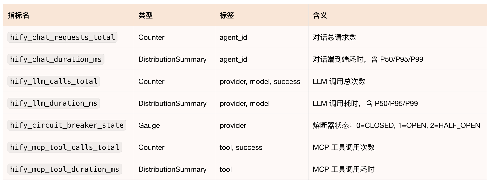
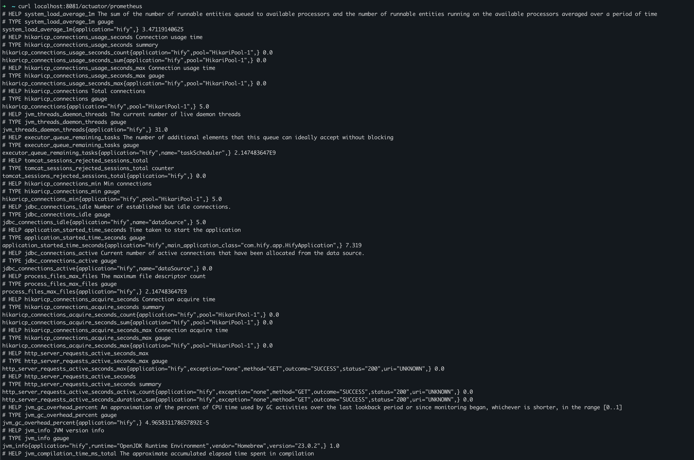
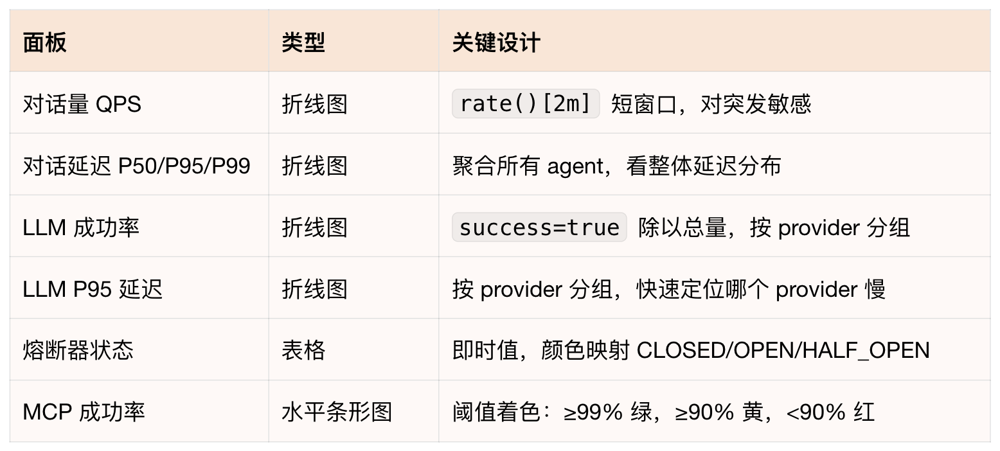
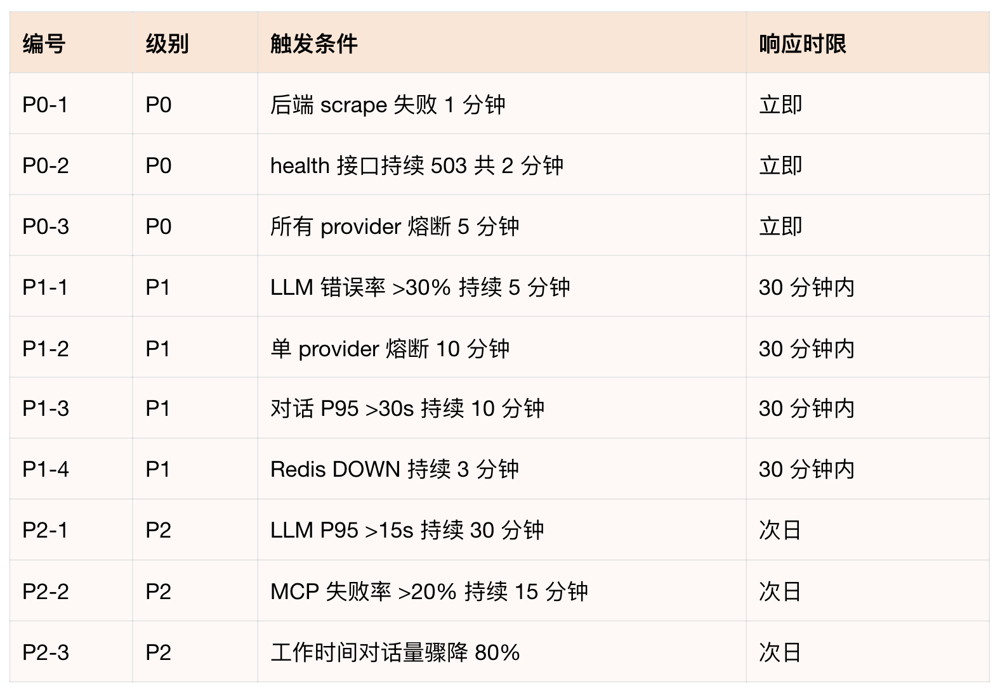
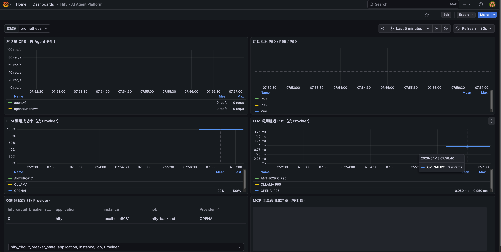

# 29｜可观测性与排错：生产级系统的最后拼图

### 讲述：张浩 AI 版

时长 17:57 大小 20.54M

你好，我是 Robert。

Hify 部署上去了，用户开始用了。然后你收到第一个反馈：“客服回复好慢”。

你打开服务器不知道慢在哪。是 LLM 调用慢？是数据库查询慢？是某个 Provider 触发了熔断？还是 Redis 连接耗尽了？你什么都看不到，因为系统是个黑盒。这也是我们在日常开发中经常遇到的问题。

这种问题在没有可观测性的系统里是最难受的，不是不能解决，是你连从哪里开始都不知道。只能靠猜，或者把每个可能的原因挨个排查，花上半天。

这一讲把它变透明。做完之后，同样的问题，你的处理方式是：看 Grafana 大盘 LLM P95 延迟最近一小时的趋势是什么样的。找到对应时间段的日志，用 traceId 过滤出这条请求的完整链路 llm_call_done durationMs=3768 providerId=2，LLM 调用花了 3.7 秒，问题在 Provider 2，不是 Hify 的问题。整个过程两分钟。

## 先和 Claude Code 讨论可观测性方案

不急着加代码。先用咨询模式搞清楚 Hify 需要做什么、不需要做什么。

Claude Code 给出了系统性的分析，几个关键判断值得单独说。

必须做的：结构化日志（每条日志带 sessionId、agentId、providerId，格式用 JSON）、Actuator 健康端点细化到各依赖、LLM 调用耗时和熔断指标（Resilience4j 有 Micrometer 集成，加一个依赖就能暴露熔断器状态）、慢请求 WARN 日志（超过阈值打 WARN，最低成本的性能感知）。

一期不需要做的：分布式链路追踪（Hify 是单体，一次请求不跨进程，Zipkin / Jaeger 用不上）、前端监控（内部工具，投入产出比不够）、日志平台 ELK（先落磁盘，用 kubectl logs 看，有聚合需求再接平台，不要一开始就引入 ELK 的运维复杂度）。

Claude Code 提出了三个需要提前考虑的架构决策，这是这次分析最有价值的部分。

决策一：Actuator 端口隔离。Spring Boot 支持把 Actuator 单独跑在另一个端口（如 8081），业务 API 走 8080 对外，Actuator 走 8081 只在集群内供 Prometheus 抓取。不提前规划，后续要改 K8s Service 和 Nginx 配置，代价较高。

决策二：traceId 现在就要放进 MDC。虽然一期不做分布式追踪，但要提前在 MDC 里放 traceId 和 sessionId。原因是将来接 OpenTelemetry 或 SkyWalking 时，traceId 的字段名和注入位置需要对齐，提前占位可以平滑迁移，否则要改所有日志打点代码。

决策三：日志字段规范要趁早定。日志字段一旦进了生产，改名代价极高，所有 grep 和告警规则都要跟着改。现在就定好字段名：sessionId、agentId、providerId、modelName、action、durationMs、success、errorCode，写进 CLAUDE.md，所有 LLM 调用处统一遵守。

这三个决策你不一定自己想得到，但它们决定了后续扩展的成本。这就是咨询模式的价值，讨论清楚再动手，比做完了再回头改省力得多。这部分的回答，基本就涵盖了一个应用主要的可观测模块的组成了。

## 结构化日志 + traceId

基于第一步的分析，日志这里要同时落地两件事：JSON 格式 + traceId 贯穿请求链路。

Claude Code 没有直接生成代码，而是先读了项目中的相关文件，读完后给出了三个发现：

- RequestLogInterceptor 已存在且有 traceId 逻辑，但新线程（llmExecutor）里 MDC 会丢失。
- logback-spring.xml 生产环境是手拼 JSON 字符串（有转义风险），输出到文件而非 stdout。
- ChatServiceImpl 日志稀疏，缺少 LLM 调用开始 / 结束的结构化节点。

三个问题都是提示词里没有说，Claude Code 自己读代码发现的。这决定了它要做什么：引入 logstash-logback-encoder、修复 MDC 跨线程丢失、重写 logback 配置、补结构化日志埋点、用 OpenTelemetry API 替换 UUID 生成 traceId。

改动涉及是三个文件：

- RequestLogInterceptor：用 Span.current() 获取 traceId，当前无 OTel Span 时 fallback 到 UUID 16 位 hex，保持格式一致。公开了 MDC key 常量（MDC_TRACE_ID、MDC_SESSION_ID），其他地方写 MDC 时用常量不用字符串字面量。
- MdcTaskWrapper（新建）：解决 llmExecutor 跨线程 MDC 丢失问题。父线程的 MDC 快照在提交任务时捕获，子线程执行前恢复，执行后清理。ChatServiceImpl 里所有提交到 llmExecutor 的任务都用它包一层。
- logback-spring.xml（重写）：生产环境改用 LogstashEncoder，MDC 字段（traceId、sessionId、agentId）自动提升为顶层 JSON 字段，不再手拼字符串。加异步 Appender，避免 I / O 阻塞业务线程。开发环境保持可读格式。

发完第一条提示词后，我又补了一条，把 CLAUDE.md 的字段规范加进约束。Claude Code 回复说第一条已经实现，逐条对照了要求，发现只有 providerId 和 success 字段没有对齐，直接补了这两个字段进去没有重新生成所有文件，只改了缺失的部分。

做完后，一条完整的对话请求，日志链长这样：

用 traceId=a3f1b2c4d5e6f708 过滤，整条链路一目了然。回到开篇的问题：用户说 “客服回复慢”，拿时间段搜日志，找到 traceId，一看 LLM 调用花了 3.7 秒，providerId=2，问题在这个 Provider 端，不是 Hify 的问题。

OpenTelemetry 的扩展路径：

一期 Span.current() 返回 noop span，自动 fallback 到 UUID。后续接入完整链路追踪时，只需在 pom 里加一行 opentelemetry-spring-boot-starter 依赖，traceId 自动变成真实的 OTel trace ID，所有日志和埋点代码零改动。这是第一步讨论时提到的架构决策在代码层面的落地。

## 指标埋点

日志告诉你 “某次请求发生了什么”；指标告诉你 “系统整体状况如何”，过去一小时平均响应时间多少、LLM 调用成功率多少、哪个 Provider 报错最多、熔断触发了几次。

Claude Code 先检查了 pom 和 application.yml，确认没有任何 Actuator / Micrometer 依赖，然后读了 CircuitBreakerService 发现一个问题：熔断器用的是 ConcurrentHashMap 自建实例，不走 Resilience4j 的 CircuitBreakerRegistry，所以 Micrometer 自动集成无法采集到熔断器状态，需要手动注册 Gauge。

这个细节你在提示词里没有提，Claude Code 读代码后自己发现并处理了。

改动涉及五个文件：

- pom 文件：根 pom 加版本管理，hify-app 引入 spring-boot-starter-actuator + micrometer-registry-prometheus，hify-common 引入 micrometer-core（埋点用）。
- application.yml：Actuator 独立跑在 8081 端口（和第一步讨论的架构决策一致），只暴露 health 和 prometheus 端点，不通过 Nginx 对外。
- HifyMetrics.java（新建）：统一管理所有指标定义，命名规范 hify_{模块}_{动作}_{单位}。熔断器状态用 Gauge + ConcurrentHashMap 组合解决手动注册问题：状态变更时更新 Map，Gauge 读取 Map 的值，避免重复注册。
- CircuitBreakerService：熔断器状态变更时调用 metrics.circuitBreakerState()，把 CLOSED/OPEN/HALF_OPEN 编码为 0/1/2 写入 Gauge。
- ChatServiceImplLLM：调用开始 / 结束、工具调用、对话完成各埋点，记录计数和耗时。

做完后验证：

最终暴露的指标：

注意访问端口是 8081，不是 8080。Prometheus 抓取配置也要指向 8081：

## 完善健康检查

28 讲的 /health 只返回 ok，现在完善成能反映各依赖的真实状态。

Claude Code 先读了现有的 HealthController、MockCacheConfig、KnowledgeServiceImpl 和 application.yml，发现三个需要处理的情况：

- mock profile 没有 Redis，直接检测会报错，需要跳过。
- pgvector 是外部 PostgreSQL，当前 application.yml 里没有单独的连接配置，需要新增。
- 知识库模块目前是 mock 实现，pgvector 配置为空时也要能正常启动。

基于这些发现，Claude Code 确定了设计方案：MySQL 用已有 DataSource 执行 SELECT 1，Redis 用 Optional<RedisTemplate> 注入（没有 Bean 时显示 skipped），pgvector 用独立 JDBC URL（配置为空时显示 skipped）。DOWN 时返回 HTTP 503，而不是 200，这是关键，K8s readinessProbe 看的是 HTTP 状态码，只有收到非 2xx 才会把 Pod 标记为 NotReady。

三种场景下的响应：

全部 UP（HTTP 200）：

Redis 故障（HTTP 503）：

mock 开发环境（HTTP 200，Redis 和 pgvector 未配置）：

skipped 不算 DOWN，开发环境下 K8s 探针不会误报。error 字段只给运维看，不会通过 Nginx 暴露到公网。

为什么 DOWN 要返回 503？28 讲把 /health 配成了 K8s 的 readinessProbe。readiness 决定 K8s 要不要把流量导进这个 Pod。如果 MySQL 挂了但接口还返回 HTTP 200，K8s 认为 Pod 健康，流量照常进来，所有查库的请求全报错。返回 503，K8s 发现 readiness 失败，把这个 Pod 从 Service Endpoints 里摘掉，流量自动切到其他正常 Pod，用户不受影响。

## 部署 Prometheus

部署 Prometheus：

Claude Code 先读了 application.yml 确认端口，发现 Actuator 在 8081 而不是 8080，提示词里写的端口是错的，Claude Code 按实际配置写，不是按提示词写。

生成了四个文件：ConfigMap（抓取配置）、PVC（10Gi 持久化存储）、Deployment、Service。

几个值得注意的设计：

- 抓取地址是 hify-backend:8081，不是 8080Actuator 独立端口，不绕 Nginx。
- strategy: Recreate：PVC 的 accessModes: ReadWriteOnce 只允许单节点挂载。RollingUpdate 会短暂存在两个 Pod 同时运行，新 Pod 挂载 PVC 会失败。Recreate 先删旧 Pod 再起新 Pod，单实例 Prometheus 的正确策略。
- initContainer 修正权限：Prometheus 官方镜像以 UID 65534（nobody）运行，PVC 新建时目录权限是 root，直接挂载会写入失败。initContainer 提前 chown，避免启动报错。这个坑很隐蔽，你不一定想的到，Claude Code 自动处理了。

部署顺序：

结果验收，执行 curl localhost:8081/actuator/prometheus 即可看到下面的输出：

## 生成 Grafana Dashboard

这是这一步的核心技巧。不需要自己手动在 Grafana 里拖拽配置面板，直接把指标列表给 Claude Code，让它生成 Dashboard JSON，导入就能用。

Claude Code 生成了 247 行 Dashboard JSON，但在输出之前先主动指出了一个问题：

然后在生成完成后又指出了第二个问题：

确认后，Claude Code 读了 HifyMetrics.java，在所有 DistributionSummary 上加了这一行配置。

这两个问题你在提示词里都没提到，Claude Code 一个是在执行前主动发现，一个是执行后自己检查发现。没有这两步，生成的 Dashboard 导入进去面板全是空白。

六个面板的设计：

导入方式：Grafana → Dashboards → Import → Upload JSON file → 选 deploy/grafana-dashboard.json。

## 让 Claude Code 梳理告警策略

有了指标，下一步是告警。告警中又一个关键点是：不是所有异常都需要叫醒人，分级处理才能避免告警疲劳。

Claude Code 给出的清单分四个部分 P0、P1、P2，以及不建议告警的指标。

- P0：立即响应（服务不可用）
- 后端 scrape 失败：up{job="hify-backend"} == 0 持续 1 分钟。后端进程挂了或网络断了，所有用户无法使用。
- health 接口返回 503：持续 2 分钟。MySQL 断开后所有对话写入失败，服务完全不可用。
- 所有 provider 熔断器全部 OPEN：min(hify_circuit_breaker_state) == 1 持续 5 分钟。所有 LLM provider 都熔断意味着完全无法对话。
- P1：30 分钟内响应（功能降级）
- LLM 调用错误率 > 30%，持续 5 分钟：每 3 次对话就有 1 次失败，用户体验已明显受损；低于这个值可能是偶发网络抖动。
- 单个 provider 熔断器持续 OPEN 超过 10 分钟：10 分钟是给 provider 自动恢复的宽限时间，超过说明需要人工介入。
- 对话 P95 延迟 > 30 秒，持续 10 分钟：LLM 正常响应 5-15s，30s 是明显异常，不是 LLM 本身慢而是系统级问题。
- Redis DOWN 持续 3 分钟：Redis 断开后上下文缓存失效，每次对话回落到 MySQL 加载历史，性能下降但不完全不可用；3 分钟给 Redis 自动重连的时间。
- P2：次日处理（潜在风险）
- LLM P95 延迟 > 15 秒，持续 30 分钟：15s 慢但在用户接受范围内，可能是 provider 侧负载高，次日评估是否要切换模型。
- MCP 工具调用失败率 > 20%，持续 15 分钟：工具失败不影响基础对话，但持续失败说明外部系统有问题。
- 工作时间对话量骤降 80%，持续 20 分钟：工作时间（9-18 点）对话量骤降往往是前端不可达或 Nginx 挂了，后端看起来正常，容易漏报。
- 不建议告警的指标：
- 单次 LLM 调用延迟（LLM 本身就慢，偶发 20s 属正常）。
- MCP 工具调用次数（业务量指标，不代表故障）。
- 非工作时间的任何 P1 / P2（内部工具，夜间无人使用无需 on-call）。
- 熔断器 HALF_OPEN 状态（是正常恢复流程，不需要打扰人）。

汇总表如下：

这份清单有两点值得注意。

第一，Claude Code 一开始就分析了 “业务背景对告警的影响” 内部工具、工作时间使用、几十人并发，这三个条件决定了阈值要比 C 端产品宽松，非工作时间的 P1 / P2 不需要 on-call。阈值是根据业务场景定的，不是套通用标准。

第二，“不建议告警” 这部分和正面清单同样重要，告警太多会产生疲劳，让人忽略真正重要的告警。HALF_OPEN 状态是一个典型例子，看起来像异常，实际上是熔断器正常恢复流程，加了告警只会让人误判。

策略确认后，让 Claude Code 生成对应的 Grafana Alert 规则 JSON，导入配置即可。

## 验收

产生真实数据：和 Hify 对话几轮，触发 RAG 检索，绑定 MCP 工具查询订单。

- 打开 Grafana 大盘（节点 IP:30030），确认
- 对话量 QPS 曲线有数据
- 对话延迟 P50/P95/P99 有分布
- LLM 调用成功率按 provider 分组显示
- 熔断器状态表格显示 CLOSED（绿色）

验证日志链：找一条刚才的对话，搜它的 traceId

模拟依赖故障，验证健康检查 + K8s 自动摘流量：

Redis 恢复后，健康检查重新返回 UP，Pod 变回 1 / 1 Ready，流量自动恢复。

## 总结

这一讲做完，“客服回复好慢” 这个问题有了完整的排查路径。

traceId 定位单次请求：拿时间段搜日志，找到 traceId，llm_call_done durationMs=3768 告诉你 LLM 调用花了 3.7 秒，providerId=2 告诉你是哪个 Provider 的问题。

Grafana 大盘看趋势：不是偶发就是系统性问题，LLM P95 延迟面板一眼看出。Dashboard JSON 是 Claude Code 生成的，不需要手动拖拽配置，而且 Claude Code 在生成前主动发现了指标名不对，生成后发现 DistributionSummary 缺 _bucket 会导致面板空白，这两步你不一定想的到。

健康检查自动摘流量：MySQL 或 Redis 故障时，readinessProbe 检测到 503，K8s 自动把 Pod 从负载均衡里摘掉，用户请求不会打到故障实例。

分级告警不吵人：10 条告警，3 条 P0 立即响应，其余按级别处理。不建议告警的清单和正面清单同样重要，Claude Code 是结合 Hify 的业务背景（内部工具、工作时间使用）给出的阈值，不是套通用标准。

整个过程几个反复出现的模式值得记住：Claude Code 先读代码再动手，提示词里没说的问题它自己发现；执行后主动做自检，发现 DistributionSummary 的问题是执行后检查到的；端口写错了按实际配置生成，不是按提示词盲目执行。这些加在一起，和 “告诉 AI 写什么就写什么” 是两种完全不同的工作方式。

## 思考题

- 当前日志输出到 stdout，由 K8s 采集，用 kubectl logs 看。如果要加按 traceId 全文搜索的能力，需要引入日志平台。让 Claude Code 对比 Loki 和 EFK 两个方案，结合 Hify 的规模给出建议重点，问它运维复杂度和资源消耗的差异。
- 告警策略清单确认了，下一步是把它变成 Grafana Alert 规则。P0-3 “所有 provider 熔断器全部 OPEN” 对应的 PromQL 是 min(hify_circuit_breaker_state) == 1，让 Claude Code 帮你生成这条告警的 Grafana Alert JSON，测试能否正确触发。
- OpenTelemetry 现在只用了 traceId 串联日志，Span.current() 返回 noop。如果要开启完整链路追踪每个 LLM 调用，每次数据库查询都记录成 Span，发到 Jaeger 可视化需要做哪些改动？让 Claude Code 评估改动范围，重点看是否需要修改业务代码。

期待你的分享！如果今天的课程让你有所收获，也欢迎转发给有需要的朋友，邀请他来一起学习，我们下节课再见！

