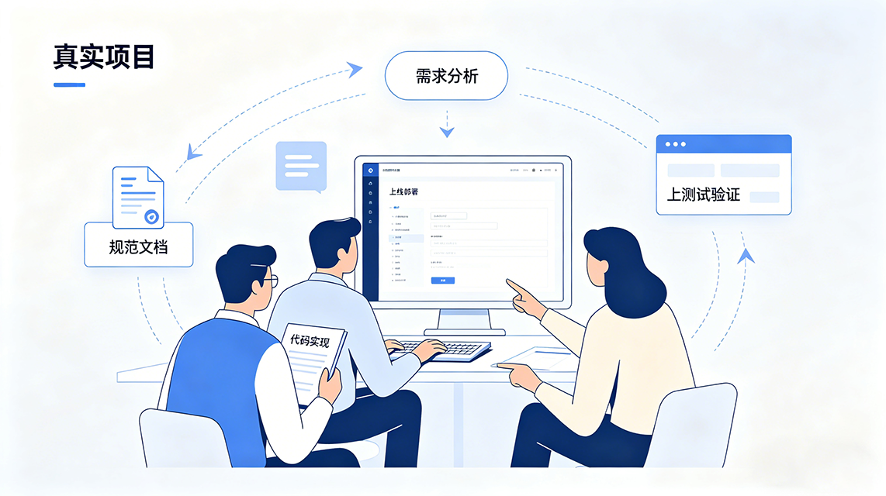
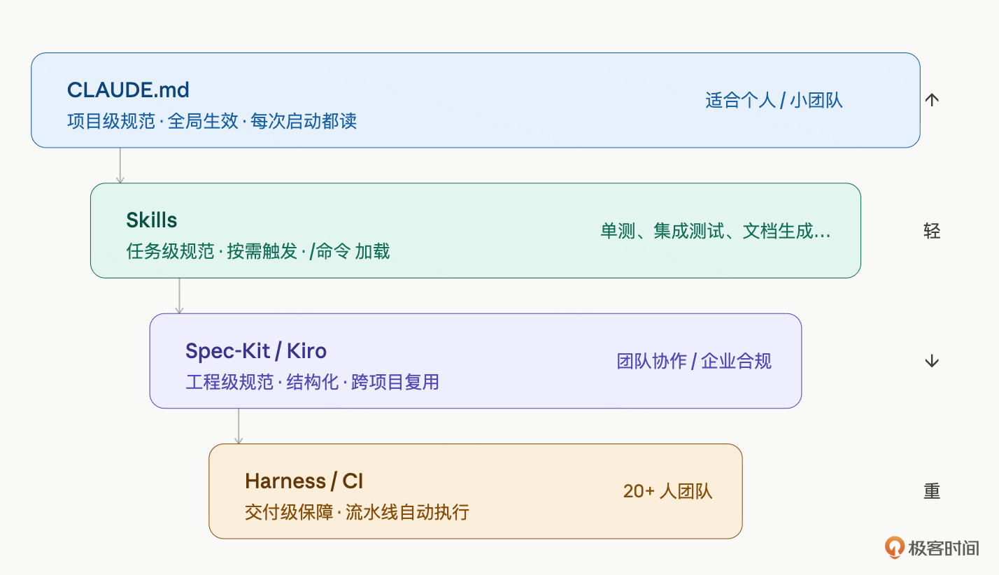
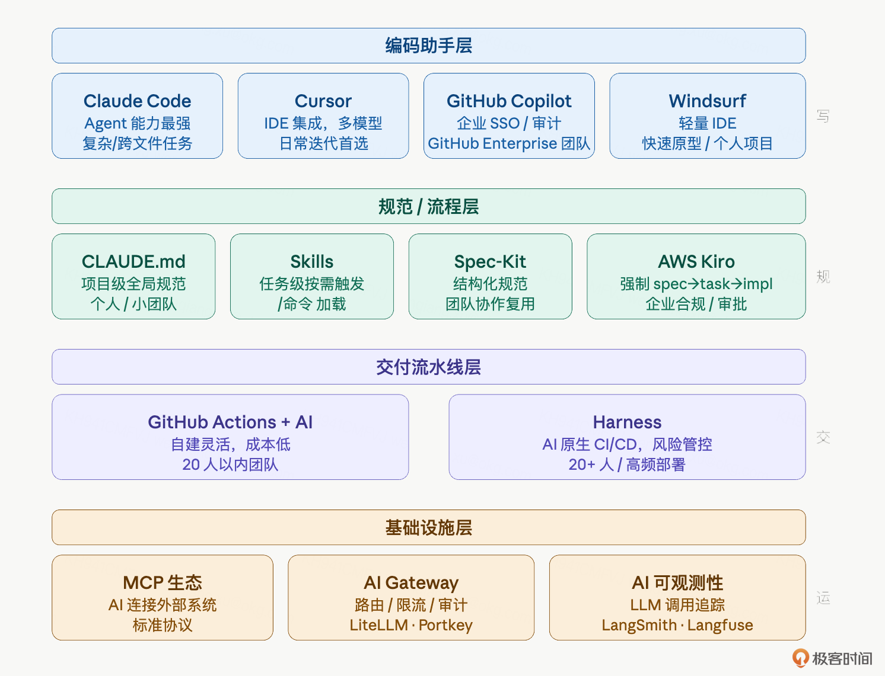

# 31｜进阶：SDD、Spec-Kit、Spec Coding 与老项目改造

### 讲述：张浩 AI 版

时长 20:33 大小 23.51M

你好，我是 Robert。

课程发布以来，收到了很多问题。有些问题反复出现，集中在四个方向：CLAUDE.md 越写越长怎么办？企业里 SDD 到底能不能落地？Spec-Kit 和 Spec Coding 怎么用？老项目怎么用 Claude Code 改造？

这些问题本质上是同一件事：规范驱动开发在真实项目里怎么落地。

坦白说，这个话题在一讲里讲不完，尤其是老项目改造，完整展开需要很长的内容，5 月初会有一门新课系统地分享这部分内容。本讲的定位是：先把思路和原则讲清楚，给几个关键提示词，让你能开始行动，不会太细，但够用。

大家的经验基本类似，都经历过两种项目：从零搭建的绿地项目，和接手别人留下来的存量系统。后者更难，但也更常见。这一讲结合真实经验，把规范驱动开发怎么落地说清楚。

## 规范工具的四个层次

很多人用了一段时间 Claude Code 之后会发现一个问题：CLAUDE.md 越写越长，Claude Code 开始忽略某些规范，或者不同模块的约定互相冲突。根本原因是把不同性质的内容混在了一起。

规范工具分四个层次，每层解决的问题不同：

CLAUDE.md 的职责边界：这个项目的全局规则。技术栈约束、代码风格、命名规范、禁止事项、模块职责划分。读者是 Claude Code，每次启动都读，所以要精简、稳定、不频繁变更。

Skills 的职责边界：某类任务怎么做。单测流程、集成测试流程、API 文档生成、代码审查、数据库迁移，这些是任务级的操作流程，不是全局规范。用 /单测、/集成测试 命令触发，按需加载。

CLAUDE.md 塞太多的症状：文件超过 200 行、里面有大量 “步骤 1/2/3” 的操作流程、不同模块的规范混在一起、Claude Code 开始忽略靠后的内容。

正确的分拆方式：先问这句话是全局规范还是任务流程。“使用 AssertJ 做断言” 是全局规范，放 CLAUDE.md。单测的完整流程是：先读代码、输出路径分析、给测试计划、我确认后再写代码，这是任务流程，放 Skills。分清楚这两类，CLAUDE.md 自然瘦下来。

实际的目录结构：

CLAUDE.md 保持精简，Skills 按任务类型分文件，各司其职。

## SDD 工具层次：从轻到重

企业实际开发里，我用过三类工具，适合不同规模和场景。

### CLAUDE.md + Skills：适合个人和小团队

这是整门课用的方案。优点是极轻量，零配置，直接开始。缺点是规范只存在于本地，没有版本管理，团队协作时容易各自维护一份不同版本的 CLAUDE.md。这也是我一直用 CLAUDE.md，然后配合上 Skills 的原因，因为简单不用动脑子，顺手即用。

适合场景：个人项目、3 人以内小团队、规范变化慢的项目。

### Spec-Kit：适合团队协作

Spec-Kit 是开源工具，把规范文档结构化，支持版本管理，和 Claude Code 的 SKILL 体系对接。核心思路是把 “规范” 从 Markdown 自由文本升级为有结构的规范文件，Claude Code 能更精确地解读和执行。

安装和初始化：

初始化后生成 spec/ 目录：

一个实际的规范文件（spec/modules/chat.spec.md）：

和 Claude Code 结合使用：

Claude Code 会先复述它理解的规范，你确认后再写代码。和直接写代码相比，规范先行的输出质量更高，需要修改的次数更少。

Spec-Kit 和 CLAUDE.md 的关系：不是替代，是互补。CLAUDE.md 管 “怎么做”（代码风格、工具选择），Spec-Kit 管 “做什么”（模块职责、接口规范、约束条件）。两者一起，Claude Code 有了完整的上下文。

### AWS Kiro：适合企业级强制流程

Kiro 是 AWS 推出的 AI IDE，核心是把 “写代码” 这件事强制拆成四步：

每一步都有 AI 辅助，但不能跳步骤。spec 没写完不能进 design，design 没确认不能生成 tasks。

这种强制流程的价值在企业场景里很明显：需求变更有记录、技术方案有审批、实现和需求可追溯。代价是流程重，小项目用起来感觉在走过场。

适合场景：20 人以上团队、有合规要求的项目、需求 - 开发 - 测试全链路追溯的场景。

选工具的原则：够用就好。个人项目用 CLAUDE.md + Skills，团队项目加 Spec-Kit，企业级合规场景才需要 Kiro。

## Spec Coding 完整流程

Spec Coding 不是一个工具，是一种工作方式：先写规范，再让 AI 执行。规范是输入，代码是输出，规范写得好，代码少改。

下面用一个完整例子演示：给 Hify 加 “对话导出为 PDF” 功能。对比两种方式。

方式一：直接执行

Claude Code 会生成代码，但你不知道它做了哪些假设：导出哪些字段？PDF 的样式是什么？导出是同步还是异步？接口在哪个 Controller？这些假设可能都不符合你的预期，改起来费时间。

方式二：Spec Coding

第一步，写规范：

Claude Code 生成的规范：

第二步，你 review 规范，确认或修改。比如你可能觉得文件大小限制 10MB 太小，或者想把超时时间从 10s 改成 30s。这一步花 5 分钟，比改代码省多了。

注意真实输出和手写示例的差异：Claude Code 给出的是同步接口，并且给出了明确的理由（目标规模 20-50 人，并发不大，异步增加前端复杂度不值得）；错误码直接对应到具体的 HTTP 状态码；还主动说了 PDF 生成要用 asyncExecutor 线程池、推荐用 flying-saucer-pdf-openpdf 而不是 iText（有商业授权问题）。这些细节你在提示词里都没提，是 Claude Code 读了 Hify 的项目结构和现有代码后自己判断的。

第三步，确认后执行：

这时候 Claude Code 的输出和你的预期高度吻合，因为所有假设都已经在规范里明确了。

Spec Coding 的适用场景：复杂功能（超过 3 个文件改动）、有不确定性的需求（第一次做这类功能）、涉及外部系统集成。简单的 CRUD 不需要，直接执行效率更高。

## 老项目改造：思路、原则与关键提示词

老项目改造是个很大的话题，完整讲完需要很大的篇幅。这里不做完整实操演示，而是说清楚我的思路和原则，给几个关键提示词，让你能开始行动。

### 我的看法

企业里大多数项目都是有多年历史的存量代码。没有单测、命名混乱、模块边界模糊，这才是真实的战场。很多人的第一反应是推倒重来，但这几乎从来不是对的答案。

改造的本质是降低风险，不是追求完美。你不需要把整个代码库改造成教科书级别的规范，你需要的是：每次改动时，这个文件比改之前稍微好一点。

改造的敌人是 “大重构” 思维。专门开一个大重构项目，暂停新功能三个月，把所有代码都重写一遍，这种方式在企业里几乎不可能成功。要么中途被叫停，要么引入大量新 bug，要么团队士气崩溃。渐进改造才是可持续的。

### 三个核心原则

原则一：摸底先于动手。

不要凭经验猜现状，让 Claude Code 读完代码给出客观报告。你的感觉是 “这个系统很乱”，Claude Code 给你的是 “OrderServiceImpl.java:234 直接拼接 SQL，UserController 包含大量业务逻辑”，具体到文件和行号。

拿到报告，对照自己对系统的理解确认，把确认过的问题写进 CLAUDE.md，作为改造的起点。这份报告还有第二个用途：每个月重跑一遍，对比上个月的报告，衡量改造进展。

原则二：先补安全网，再做改造。顺序不能反。

这是最重要的原则，也是最容易犯错的地方。

为什么顺序不能反？因为你不知道现有代码的 “正确行为” 是什么。老项目经常有这种情况：代码看起来有 bug，但实际上下游依赖了这个 bug 的行为。你把它 “修好” 了，反而把下游搞崩了。

错误顺序：重构代码 → 补测试 → 发现测试失败 → 不知道是重构引入的新 bug 还是测试写错了 → 大量时间排查。

正确顺序：写集成测试锁住现有行为（测试通过 = 现状已记录）→ 重构 → 运行测试，全绿表示外部行为没有变化，如果有红立即能定位到这次重构的哪个改动。

优先级：先覆盖核心业务链路，再覆盖高风险代码，最后覆盖辅助功能。一个月做完前两类，就有足够的安全网了。

原则三：童子军规则，渐进改造。

每次动到哪个文件，顺手让 Claude Code 把这个文件的规范对齐。不需要专门的大重构项目。

每次发现一类新问题，修完后更新 CLAUDE.md 的 “遗留问题处理规范” 节。这样 Claude Code 下次遇到同类问题会自动处理，不需要你再说。

### 改造节奏的预期

不要期望快。一个有 5 年历史的中型项目，渐进改造到 “规范覆盖率 80%” 大概需要 3-6 个月，期间团队正常交付新功能。

每周固定一个改造 session，专门做规范对齐，不做新功能。剩余时间正常迭代，顺手做童子军修复。两条线并行，互不干扰。这是可持续的节奏。

## AI 编码工具全景

学完这门课，你需要知道 Claude Code 在整个工具生态里的位置。工具很多，但分清楚每一层解决的是什么问题，选择就不难了。

### 编码助手层：日常怎么用

Claude Code：Terminal 原生，最强的 Agent 能力，能读写整个代码库，适合需要跨多个文件的复杂任务，搭骨架、重构、生成测试、分析依赖关系。代价是没有 IDE 集成，Tab 补全体验比 Cursor 差。

Cursor：IDE 集成，多模型支持（CC + GPT + Kimi + Claude），Tab 补全体验好，适合日常编码，改 bug、加字段、调接口。内置的多模型切换让双模型 review 变得很自然（Claude Code 写完，切到 GPT 做 review）。

GitHub Copilot：和 GitHub 生态深度集成，企业 SSO、审计日志、策略管理都很成熟。如果你的团队已经在用 GitHub Enterprise，Copilot 的管理成本最低。

Windsurf：轻量 IDE，不需要配置复杂环境，适合快速原型或者不想折腾工具链的个人项目。

我的实际使用方式：Claude Code 和 Cursor 两个其实买一个就行。Claude Code 的能力更全，但是 Cursor 编码够用了，主要是内置的多模型切换让双模型 review 变得很自然。这个是我强推的。

### 规范 / 流程层：选轻还是选重

本讲第一部分已经详细说了四个层次。这里补充一个判断标准：

团队人数是最关键的变量。1 人开发或 3 人以内用 CLAUDE.md + Skills 完全够。3-15 人加 Spec-Kit 解决规范同步问题。15 人以上才需要考虑 Kiro 这种强制流程工具。人少的时候用重工具，大量时间消耗在走流程上，得不偿失。

### 交付流水线层：GitHub Actions vs Harness

很多人在这里纠结，说清楚区别：

GitHub Actions + AI（比如用 Claude Code 生成测试、用 AI 做 PR review）：自己搭，灵活，成本低，适合 20 人以内的团队。缺点是需要自己维护 workflow，AI 能力需要手动集成。

Harness：开箱即用的 AI 原生 CI / CD 平台，把测试、部署、安全扫描、AI 辅助代码审查整合在一起。不只是帮你写代码，而是把 AI 嵌入整个交付流水线，自动识别高风险变更、自动触发额外测试、生产问题自动关联到代码变更。代价是有一定的学习成本和平台费用。

什么时候从 GitHub Actions 切换到 Harness？团队超过 20 人、每天部署频率超过 5 次、开始需要精细的变更风险管控。在这个规模以下，GitHub Actions 就够了，不要为了用工具而用工具。

### 基础设施层：AI 应用的底座

MCP 生态：AI 连接外部系统的标准协议，24 讲有完整介绍。这不是编码工具，是连接层，它的价值在于让 AI 能访问你的数据库、调用你的 API、操作你的文件系统，而不需要每次都写自定义的集成代码。

AI Gateway（LiteLLM、Portkey）：解决企业多团队用 LLM 的管控问题。如果只有你一个人用，不需要。如果你的公司有 10 个团队都在调 OpenAI、Claude、各种模型，问题就来了：API Key 怎么统一管理？谁在用？用了多少钱？某个团队突然用量暴增怎么限流？AI Gateway 统一做这些，模型路由、限流、审计、成本分摊。这是企业 AI 基础设施从 “各自为战” 走向 “统一管理” 的标志。

AI 应用可观测性（LangSmith、Langfuse）：你的 AI 应用上线之后，某个 Prompt 效果变差了，某个工具调用失败率升高了，怎么发现、怎么定位？LangSmith 和 Langfuse 是专门为 AI 应用设计的可观测性工具，记录每次 LLM 调用的输入输出、延迟、Token 消耗、工具调用链路。和 Grafana 的区别是：Grafana 看的是系统指标，LangSmith 看的是 AI 行为。

## 怎么选合适的工具

工具是手段，不是目的。给一个判断框架，从你的实际痛点出发。

你现在最痛的问题是什么？

- 代码生成质量不够好：先别换工具，先检查规范。90% 的情况是 CLAUDE.md 写得不够清晰，或者该放到 Skills 里的流程塞在了 CLAUDE.md 里。工具没问题，规范有问题。
- Claude Code vs Cursor 不知道选哪个：两个都用。Claude Code 订阅用于复杂任务（跨文件、重构、测试），Cursor 订阅用于日常迭代（单文件修改、小功能）。如果只能选一个，先从 Cursor 开始，IDE 集成让上手更平滑；当你开始做更复杂的任务时再加 Claude Code。
- 团队规范不一致，各写各的：Spec-Kit。把规范文档结构化，和 Claude Code 的 SKILL 体系对接，支持版本管理。不需要 Kiro 这么重，Spec-Kit 能解决大多数团队协作的规范问题。
- 企业有合规要求，需求 - 开发 - 测试全链路可追溯：Kiro。接受流程带来的额外时间成本，换来的是每个代码变更都有完整的需求 spec 和技术方案追溯。
- CI / CD 质量保障：先用 GitHub Actions，自己写 workflow，Claude Code 帮你生成测试脚本。团队超过 20 人、部署频率高之后再评估 Harness。
- 公司多个团队都在用 LLM，成本和安全开始失控：AI Gateway。LiteLLM 开源可自部署，Portkey 有托管版本。这是从 “个人用 AI” 走向 “企业用 AI” 的必经一步。
- AI 应用上线后出了问题不知道怎么排查：LangSmith 或 Langfuse。接入之后每次 LLM 调用都有完整记录，比在日志里找 JSON 字符串高效很多。

一个通用判断原则：当你觉得需要一个新工具的时候，先问自己，这个问题是现有工具解决不了，还是现有工具用得不够好？大多数时候，问题不是缺工具，是现有工具没用到位。新工具引入有学习成本、维护成本、团队推广成本，在确认现有工具真的解决不了之前，不要轻易引入。

工具这件事，我有几个实际感受，不一定对，供参考。

- 不要追工具，要追问题。每隔一两个月就有新工具出来，有人来问 “老师你用过 xxx 吗，值得切换吗？” 我的回答通常是：先问你现在最痛的问题是什么，再看这个工具解不解决这个问题。工具生态变化很快，但你的问题是稳定的，代码生成质量、规范同步、交付保障，这三类问题不会因为出了新工具而消失。
- Claude Code + Cursor 的组合是目前投入产出比最高的。Claude Code 做复杂任务，Cursor 做日常迭代，两者订阅加起来一个月大概 40 美元，相当于一个实习生一天的成本，但产出远不止这些。如果只能选一个，先从 Cursor 开始，IDE 集成让上手更平滑；等你开始做更复杂的任务，重构、搭骨架、生成测试，再加 Claude Code。
- 规范工具的选择，团队人数是最重要的变量。3 人以内 CLAUDE.md + Skills 完全够，不要过度引入工具。3-15 人可以考虑 Spec-Kit。超过 15 人才需要 Kiro 这种强制流程工具。很多团队 5 个人就开始搭复杂的规范体系，结果大量时间消耗在走流程上，得不偿失。
- AI Gateway 是企业 AI 基础设施成熟度的一个标志。如果你的公司只有你一个人在用 LLM，不需要。如果有 10 个团队都在调各种模型，而且还没有统一管理，这件事迟早会出问题，API Key 泄露、某个团队用量暴增、成本失控。这时候上 AI Gateway 不是锦上添花，是亡羊补牢。
- 可观测性这块很多人忽视。AI 应用上线之后，某个 Prompt 效果变差了，某个工具调用成功率下降了，你怎么发现？怎么定位？如果你现在的回答是看日志，那说明可观测性还没建起来。LangSmith 和 Langfuse 接入成本不高，建议在 AI 应用上线的同时就接上，不要等出了问题再找。

最后一句：工具是手段，解决问题才是目的。用最简单的工具解决问题，不要为了用工具而用工具。这门课里用的 CLAUDE.md + Skills，在大多数场景下已经够了。

## 总结

这一讲没有太多提示词，作为收尾内容和你分享了一下我对工具选型、高级用法的看法。核心观点其实就一句话：你一个人开发，最简单的工具是最好用的，不要去追求工具，而是要追求解决问题。

总结一下本讲的观点，主要有 6 点：

- 规范工具有四个层次，从 CLAUDE.md 到 Skills 到 Spec-Kit 到 Kiro，越往上越重、越适合大团队。团队人数是最关键的判断变量。
- CLAUDE.md 塞太多的根本原因，是把任务流程（应该放 Skills）和全局规范混在了一起。分清楚这两类，CLAUDE.md 自然瘦下来。
- Spec Coding 的价值不是工具，是先写规范再执行的工作习惯。规范写得好，代码少改，比直接让 Claude Code 猜你的意图效率更高。
- 老项目改造：不要推倒重来，不要专门开大重构项目。三个核心原则，摸底先于动手、先补安全网再做改造、童子军规则渐进改造。这是可持续的方式。
- 工具全景：Claude Code 解决编码效率，Harness 解决交付质量，AI Gateway 解决企业 LLM 管控，LangSmith / Langfuse 解决 AI 应用可观测性。四层各有职责，不是竞争关系，是组合使用的。
- 选工具：从你的实际痛点出发，先确认现有工具是不是没用到位，再考虑引入新工具。大多数时候，问题不是缺工具，是规范没建好。

## 思考题

- 你现在工作的项目属于哪种情况，绿地项目还是老项目？如果是老项目，用本讲的三步流程做一次快速评估：值不值得改造、改造目标是什么、从哪个模块开始？
- 你的 CLAUDE.md 现在有多少行？扫一遍，哪些内容应该拆到 Skills 里？拆完之后，CLAUDE.md 是不是更清晰了？
- 如果你已经在用 Cursor，试着把双模型 review 的工作流建起来：Claude Code 写完核心模块，切到 ChatGPT / Kimi 做 review，对比两个模型发现的问题有什么差异。

期待你的分享！如果今天的课程让你有所收获，也欢迎转发给有需要的朋友，邀请他来一起学习，我们下节课再见！

