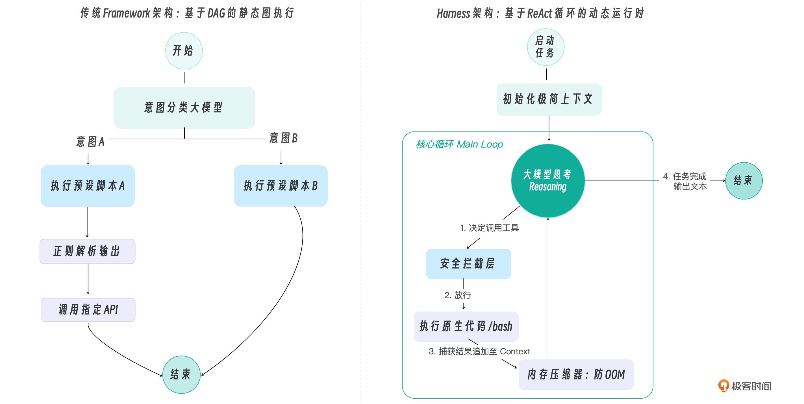

# 01｜架构演进：从 Framework 到 Harness，Agent 到底需要怎样的底层支撑？

### 讲述：TonyBai-AI 版

时长 09:01 大小 10.31M

你好，我是 Tony Bai。欢迎来到《从 0 开始构建 Agent Harness》的第一讲。

在开篇词中，我们用 “操作系统（OS）” 作了一个高维度的类比，指出了当前 AI Agent 开发面临的严重摩擦力，并抛出了一个核心洞见：框架层正在坍塌，驾驭工程（Harness Engineering）正在崛起。

开篇词从宏观上回答了 “为什么” 我们要重塑认知。而从今天这一讲开始，我们将脱下概念的外衣，穿上架构师的工装，深入到软件工程的骨骼和经络中去，回答 “怎么做” 的问题。如果不用 LangChain 或者 AutoGen 等框架，一个原生的、能够稳定运行于工业环境的 Agent 到底长什么样？OpenClaw 这样的顶级开源引擎，其底层架构究竟精妙在哪里？

今天，我们将从软件架构演进的视角，彻底剖析 Framework 与 Harness 的底层差异，并为你即将亲手编写的 go-tiny-claw 引擎绘制出第一张全景工程蓝图，敲下最核心的第一行数据结构代码。

## 剖析黑盒：传统 Framework 的架构陷阱

要理解 Harness，我们必须先从代码层面弄清楚，为什么传统的 Agent 框架在面对复杂生产任务时会显得如此脆弱。

早期如 GPT-3 时代，由于模型原生缺乏强大的逻辑规划和工具调用（Function Calling）能力，开发者们发明了各种基于 “链（Chain）” 和 “有向无环图（DAG）” 的框架。

在这些框架中，逻辑是硬编码的。比如，为了完成一个 “分析报错并搜索解决方案” 的任务，框架会要求你这样编写代码：

- 定义一个 ErrorAnalyzerNode。
- 定义一个 WebSearchNode。
- 通过代码配置一条边（Edge），规定当分析器输出特定关键词时，数据流向搜索节点。

我们用一张图来直观感受传统框架的执行流：

这种架构的致命缺陷在于 “静态” 与 “过度干预”。

真实世界的排障过程是千变万化的。如果在 NodeA 执行工具时，网络超时了，或者返回了一个预期之外的 JSON 格式，传统的 DAG 图往往缺乏弹性的回退机制，直接抛出异常导致进程崩溃。

更严重的是，框架为了实现这种节点间的跳转，在底层维护了极其复杂的、人类难以阅读的隐式状态机（State Machine）。一旦发生死循环，在图的中间开发者根本无法插手干预。

## Harness（驾驭工程）：极简的动态运行时

随着 Claude 3.5 Sonnet、GPT-4o 等前沿模型的问世，大模型本身已经进化成了一个拥有极强自主规划能力的 CPU。它不需要你用代码去规定 “先执行 A，再执行 B”。它只需要你给它一个包含当前状态的上下文（Context），并告诉它 “这里有几个工具”，它就能自主推导出下一步该干什么。

基于这个前提，Harness（驾驭工程）应运而生。它不再是一个定义业务逻辑的图结构，而是一个极简的、动态的运行时环境（Runtime Environment）。

在 OpenClaw 等现代底层引擎中，架构被极大地拉平了。它抛弃了 DAG，转而回归了计算机科学中最古老也最可靠的结构：一个无限循环（Main Loop）+ 一组事件驱动的拦截器（Interceptors / Middlewares）。

对比两张图，你可以清晰地看到 Harness 的三大革命性转变：

- 控制反转（IoC）：业务流程的控制权从 “Go / Python 代码” 完全转移到了 “大模型的实时推理和规划” 中。代码只提供物理定律（如文件读写和编辑、沙箱执行等），不干涉任务走向。
- 防线前移：既然大模型是自由的，它就可能犯错或搞破坏。因此 Harness 的核心代码全部集中在了 Middleware（防止搞破坏）和 Compactor（防止内存被撑爆）上。
- 状态透明：循环只依赖一个单一的数据结构 —— 也就是不断累加的 Context 消息列表。没有任何隐式的树节点或图节点变量。

## 绘制 go-tiny-claw 的工程蓝图

理解了 Harness 的本质，我们现在就可以开始为 go-tiny-claw 设计 Go 语言的工程架构了。

结合 Harness 驾驭工程的理念，我将 go-tiny-claw 的架构划分为四个核心层：入口交互层（Entry & UI Layer）、核心引擎层（Core Engine Layer）、上下文工程层（Context Engineering Layer）和工具与执行层（Tool Execution Layer）。

请仔细看下面这张图，它将作为我们整个专栏的 “航海图” 贯穿始终：

### 架构分层解析

a. Prompt 动态组装器：动态拼装模块化的系统规则（如读取 AGENTS.md）。

b. Token 监控与阶梯压缩器：像 OS 的内存回收器一样，时刻盯着 Token 水位线触发压缩。

c. 运行时事件提醒注入：是防走神的利器，在模型做决定的前一刻注入干预指令。

- 入口交互层：引擎对外的触角。我们将支持终端命令行（CLI）输入，并将其接入飞书。更重要的是，这一层包含了人工审批（Human-in-the-loop）的异步回调机制。
- 核心引擎层（心脏）：系统的控制中枢。Main Loop 负责维持 ReAct 循环。旁边的大模型适配器是 “大脑接口”，抹平不同大模型（如 Claude 和 OpenAI 兼容）底层 API 的差异。新增的 Thinking 模块则负责在行动前强制模型进行慢思考。
- 上下文工程层（内存管理器）：决定 Agent 能够跑多远的关键。
- 基于文件系统的状态与记忆则是极简哲学的核心 —— 抛弃内部变量，直接把进度写在本地 TODO.md 里。
- 工具与执行层（四肢与手脚）：挂载了让模型改变物理世界的组件。动态的 ToolRegistry 配合极简工具集（read/write/edit/bash），让模型组合出无限可能。强大的 Middleware 机制则死死把守大门，拦截危险命令并对接审批。

## 建立项目：go-tiny-claw 的代码骨架

作为一门追求工业级标准的专栏，我们需要遵循 Go 语言的经典项目布局（Standard Go Project Layout），将上述架构图映射到代码目录中，以确保各个模块（引擎、工具、上下文、适配器）之间高内聚、低耦合。

千里之行，始于足下。今天，我们将敲下 go-tiny-claw 的第一段极其朴素但意义深远的骨架代码。

### 步骤 1：初始化项目

请打开你的终端，执行以下命令初始化项目模块：

### 步骤 2：创建目录骨架

根据我们刚刚设计的架构蓝图，在项目根目录下创建如下的基础目录结构：

创建完毕后，你的项目目录布局应该如下所示：

### 步骤 3：编写入口骨架与占位符

在 cmd/claw/main.go 中，我们写下这个引擎的第一段极其朴素的骨架代码。这段代码虽然是被注释掉的 TODO，但它精确地描绘了 Harness 驾驭引擎的启动流程：

### 运行与验证

在终端中执行以下命令，验证我们的基础项目结构和骨架代码是否能正常编译与输出：

预期输出：

这几行被注释掉的 TODO 代码，就是我们接下来整个专栏的全部航程。在下一讲中，我们就将深入 internal/engine 目录，撕开 Agent 最神秘的面纱，用纯 Go 代码手写出一个健壮的 ReAct 循环（Main Loop）。

## 本讲小结

今天这一讲，我们完成了一次重要的认知重构。这是支撑你能否写出一个真正好用的工业级 Agent 的分水岭。

- 突破 “调包” 局限：当我们在生产环境中遇到上下文溢出、死循环、行为失控等问题时，单纯修改 Prompt 或依赖厚重的应用框架（Framework）往往无济于事，静态的 DAG 图无法应对千变万化的真实世界。
- Harness 驾驭工程的本质：Agent 的尽头是操作系统（OS）。我们将大模型视为 CPU，将 Context 视为内存。我们要做的 Harness 工程，就是为大模型编写一个微型 OS，核心职责包括：调度 Main Loop、精细化回收 Context 内存、安全管控极简的原生工具，以及处理中断与异常。
- 确立架构蓝图：我们推导出了 go-tiny-claw 的多层架构（入口交互层、核心引擎层、上下文工程层、工具与执行层），并用 Go 语言搭建了清晰的高内聚工程骨架，写下了串联各大模块的启动伪代码，为后续实战做好了准备。

## 思考题

在经典的计算机操作系统中，当内存（RAM）不足时，系统会触发 OOM（Out Of Memory）Killer 强杀进程，或者将不常用的内存页置换到磁盘上（Swap）。

结合今天所学的 Harness 理念，如果大模型的上下文窗口（Context Window）逼近了极限限制（比如 128k Tokens），你认为在我们的 go-tiny-claw 引擎中，应该采取哪些类似 OS 的策略，来避免整个 Agent 因为 API 报错而彻底崩溃失忆？

欢迎在留言区分享你的思考与灵感。我们下一讲，正式开始手写核心引擎！

