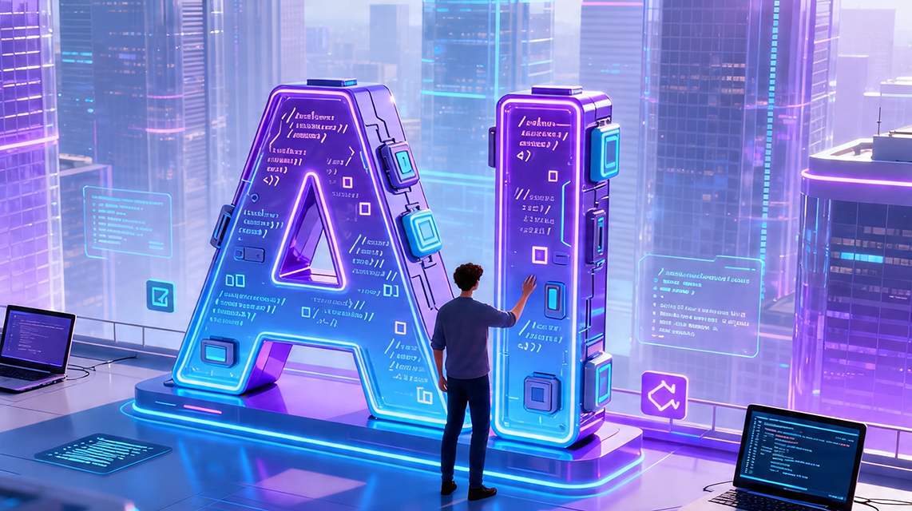
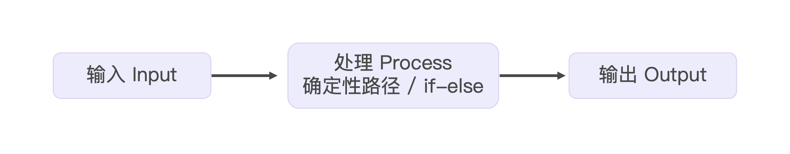
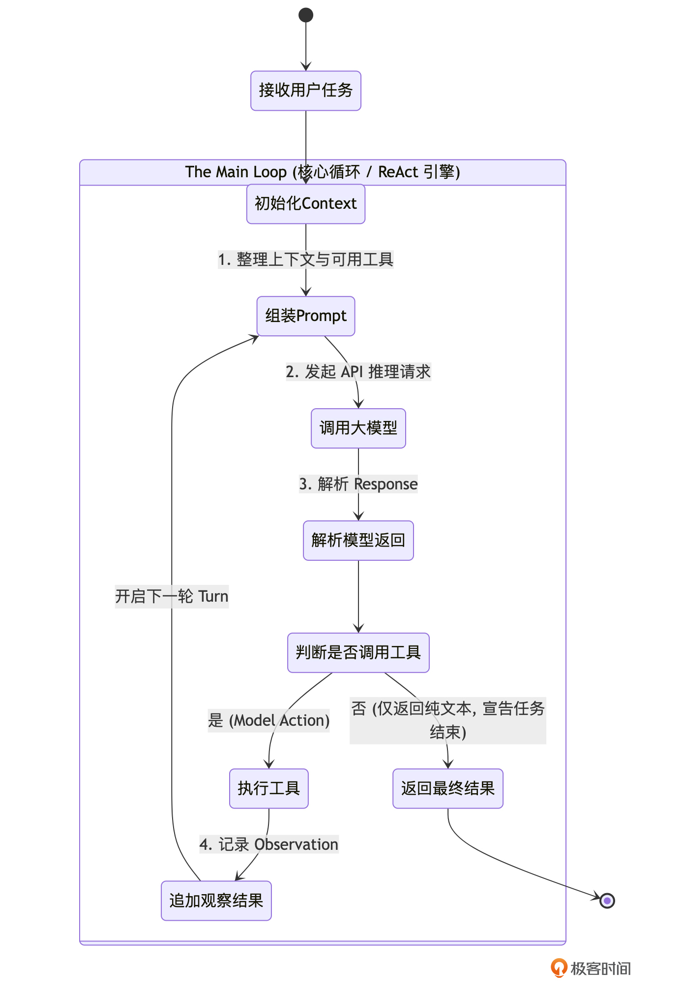

# 02｜核心心脏：手写 Agent 的 Main Loop

### 讲述：TonyBai-AI 版

时长 12:26 大小 14.22M

你好，我是 Tony Bai。欢迎来到《从 0 开始构建 Agent Harness》专栏的第二讲。

在上一讲中，我们完成了一次底层的认知重塑：我们不再把开发 Agent 当作是调用大模型 API 的填空题，而是把它当作是为大模型（CPU）编写一个微型操作系统（Harness / 驾驭工程）。我们确立了 go-tiny-claw 的四层架构，并搭建了基础的目录骨架和启动占位符。

今天，我们要深入到核心引擎层（Core Engine Layer），去亲手实现这台操作系统的心脏起搏器 ——Main Loop。

所有顶级的 Agent 引擎（无论是早期的 AutoGPT，还是如今最先进的 Claude Code、OpenClaw），它们表面上看起来像魔法一样能在你的本地项目里来回穿梭、修改代码、执行测试。但在代码的最底层，它们都在跑着一个极其朴素、但极其强健的无限循环。

这个循环，在学术界通常被称为 ReAct (Reason + Act) 范式，而在工程界，我们通常称之为 Agent Loop 或 Main Loop。

准备好了吗？我们将先从学术理论追根溯源，然后一步步把这个跳动的心脏拼装起来。

## 解密 Main Loop 与 ReAct 范式

在传统的软件开发中，程序的执行流是确定且线性的（如下图所示）。你写下 if-else，程序就严格按照路径执行。

但大模型（LLM）面对的是一个开放的、动态的、需要不断探索的环境。当它拿到一个宏大的任务（比如：“找出项目中计算错误的原因并修复”）时，它不可能像传统的纯问答（QA）机器人助手那样，在一次 API 调用中就吐出最终的完美代码。因为它缺少实时信息 —— 它不知道当前目录下有什么文件，也不知道运行 go test 会报什么错。

为了解决大模型 “睁眼瞎” 的问题，研究人员经历了几次重要的范式演进。

### 1. 纯推理（Reasoning Only）与纯行动（Acting Only）的局限性

在早期的尝试中，主要有两种流派：

- 纯推理模式（如 Chain of Thought, CoT）：通过在 Prompt 中加入 “Let’s think step by step”，强迫模型把思考过程写出来。这极大地提升了模型的逻辑推导能力，但致命缺陷是它无法与外部世界交互。如果代码库更新了，或者报错信息变了，模型依然在用过时的、基于训练数据的 “幻觉” 在推理。
- 纯行动模式（Acting Only）：直接给模型一堆工具（Tools），让它直接预测下一个要执行的动作。这种模式下，模型缺乏深度的状态跟踪和自我反思，往往就像一个横冲直撞的莽夫，很容易因为上一步的报错而陷入迷茫。

### 2. ReAct：智能体的觉醒时刻

直到 2022 年 10 月，普林斯顿大学博士生 Shunyu Yao（在 Google 实习期间）与 Google 研究人员联合发表了预印本论文《ReAct: Synergizing Reasoning and Acting in Language Models》，并于 2023 年正式发表在 ICLR 2023 上。

这篇论文提出了一个极其优雅但影响深远的范式：将 “思考（Reasoning）” 与 “行动（Acting）” 在一个循环中交织起来。ReAct 范式认为，一个真正的智能体，必须像人类解决问题一样，在每次行动前先思考，在每次行动后观察结果：

- 思考（Reason / Thought）：分析当前拿到的线索，规划下一步的意图。例如：“我看到了 calc.go 这个文件，里面可能有 Bug，下一步我要读取它。”
- 行动（Act / Action）：向外部环境发出指令。例如：调用 read_file 工具。
- 观察（Observe / Observation）：外部环境（比如我们的 Harness 引擎）将工具执行的结果返回给模型。例如返回了 calc.go 的具体代码。
- 然后再回到第 1 步，结合新获得的 Observation 再次思考，形成闭环。

在驾驭工程（Harness Engineering）中，我们将这套理论抽象为一个底层的 for 循环。我们可以用下面这张状态机图来精确描述它在 go-tiny-claw 中的流转过程：

### 3. Harness 视角的 Main Loop 特征

正如你所见，只要大模型返回的结果中包含 “工具调用请求（Tool Call Request）”，这个 Loop 就会一直循环下去。每一次从 “组装 Prompt” 到 “追加观察结果”，我们称之为一个 Turn（轮次）。

在顶级引擎（如 Claude Code、OpenClaw）中，这个 Main Loop 的设计有几个极其鲜明的特征：

- 极度纯粹，没有预设分支：循环中没有业务逻辑，全凭模型决定走向。
- 不设硬性的最大步骤限制：传统的玩具框架喜欢设置 max_turns=10，但真实的工业任务可能需要 50 步。顶级引擎不在此处做生硬的截断，而是依赖后续我们将会讲到的 Context Compaction（内存压缩） 和 System Reminders（系统级防死循环干预）来维持稳定。
- 上下文（Context）是唯一的记忆载体：在这个循环中，数据会像滚雪球一样不断累加，记录下每一次的思考、动作和观察结果。

理论铺垫完毕。接下来，我们就将这些理论转化为纯粹的代码。

## 构建 go-tiny-claw 的核心心脏

为了让引擎的代码易于测试且职责单一，我们需要在不同的目录下定义好几个核心的数据结构和接口。

### 目录结构回顾与更新

回顾我们在上一讲创建的目录。今天我们将丰富 schema（定义统一的血液）、provider（大脑接口）、tools（手脚接口）以及 engine（核心心脏）。

### 第 1 步：定义系统的统一血液 (Schema)

在 Harness 驾驭引擎中，各个组件（大模型、工具、主循环）之间传递的数据就是上下文（Context）。由于市面上不同大模型（Claude、OpenAI 模型等）的 API 格式千差万别，我们必须定义一套属于 go-tiny-claw 自己的标准数据结构，来承载 ReAct 范式中的 “思考” 与 “行动”。

新建 internal/schema/message.go：

这段代码确立了我们微型 OS 的通信协议。注意 ToolCall 中的 Arguments 使用了 json.RawMessage，这意味着 Main Loop 根本不关心具体的工具需要什么参数，实现了极致的解耦。

### 第 2 步：抽象 Provider 和 Tool 接口

在写 for 循环之前，Engine 需要知道去哪里调用大模型，去哪里执行工具。我们通过接口（Interface）来隔离底层实现。

新建 internal/provider/interface.go：

接着，在 internal/tools/registry.go 中定义工具注册表的接口：

### 第 3 步：实现心脏起搏器 —— Main Loop

现在，所有的拼图都准备好了。让我们进入 internal/engine/loop.go，写下这台微型 OS 最核心的心跳逻辑。

看这段代码，你会惊叹于驾驭工程的极简之美。

- loop.go 根本不关心 bash 工具是怎么运行的，也不关心 Claude 模型的 HTTP 请求怎么发。
- 它只负责维护这根脆弱但重要的 “上下文时间线”（contextHistory）。它像一个忠实的书记员，严格执行了 ReAct 范式：把模型的意图（ToolCall）交给执行层，再把物理世界的反馈（Observation）原封不动地追加回内存中。

## 运行与验证：连接 Mock 桩代码

为了让你能在本地把这个空心引擎跑起来，验证我们的 Main Loop 是否健壮，我们在 main.go 中快速写两个 “假肢（Mock）” 实现。

打开 cmd/claw/main.go：

### 运行步骤与预期输出

在终端中执行启动命令：

你将清晰地看到 Main Loop 在终端中完美地驱动了两个 Turn 的循环：

至此，虽然我们接入的还是 “假肢”，但这个基于 ReAct 范式的微型操作系统 “心脏”，已经确确实实、稳定地跳动起来了！

## 本讲小结

今天，我们完成了 go-tiny-claw 核心引擎层（Core Engine Layer）的构建。

- 解构 ReAct 模型：我们追溯了 AI Agent 的学术演进，将复杂的任务流转抽象为了一个极简的 “思考（Reason）- 行动（Act）- 观察（Observe）” 无限循环。只要大模型吐出工具请求，我们就执行并追加结果；只要它输出纯文本，我们就视为任务结束。
- 统一定义架构 “血液”：我们在 schema 模块定义了 Message、ToolCall 和 ToolResult。这些纯粹的数据结构，彻底隔绝了外部大模型 SDK 和底层工具代码之间的依赖，是 Harness 驾驭工程中解耦的基石。
- 确立物理边界（WorkDir）：在 AgentEngine 中，我们显式地绑定了 WorkDir。这是极其重要的安全与设计理念 ——Agent 不是全局幽灵，它必须像一个普通开发者一样，受限于某个具体的项目工作区。

现在，引擎的心跳已经稳健。但在真实的复杂项目中，大模型在拿到可用工具后，往往会产生一种 “冲动”：遇到问题还没想清楚，就立刻凭直觉生成一个 ToolCall 去盲目尝试。这种缺乏全局规划的试错，不仅浪费 Token，更会导致项目结构被改得一团糟。

在下一讲，我们将深度借鉴顶级 Agent 的最新架构，在我们的 ReAct 循环中剥离出一个独立的 “慢思考与自省（Thinking）” 阶段，让 Agent 在每次动手前，被迫进行深度的全局规划！

## 思考题

仔细观察目前的 loop.go 代码，当大模型在一个 Turn 里返回了多个 ToolCall 时，我们是通过一个 for 循环串行（Sequential）地去调用 e.registry.Execute 的：

假设大模型非常聪明，它为了加快速度，同时请求了读取 3 个完全独立的文件。以我们目前的串行写法，必须等第一个文件读完并返回，才会去读第二个文件。

作为一名专业的 Go 开发工程师，你能想到如何利用 Go 语言的原生特性（比如 Goroutine 和 WaitGroup），将这里的工具执行改造为并行执行（Parallel Execution）吗？如果在并行执行中某个工具报错了，又该如何将所有并行的结果（Observation）按照正确的顺序组装回 Context 中？

欢迎在留言区分享你的代码思路。我们将在本专栏的第 08 讲中为你揭晓工业级的并行标准答案。下一讲见！

