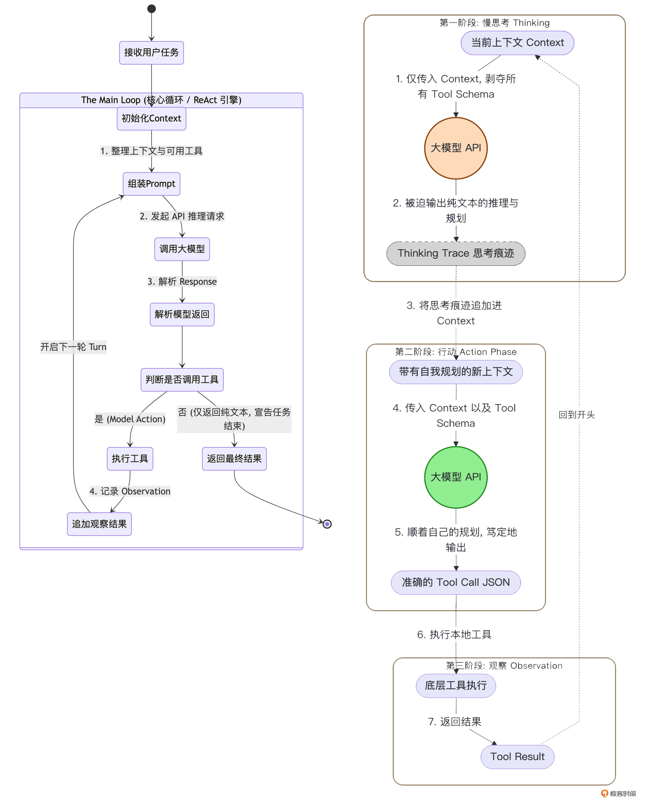

# 03｜慢思考与自省：在 ReAct 循环中剥离独立的 Thinking 阶段

### 讲述：TonyBai-AI 版

时长 10:05 大小 11.54M

你好，我是 Tony Bai。欢迎来到《从 0 开始构建 Agent Harness》专栏的第三讲。

在上一讲中，我们从学术界的 ReAct 论文出发，用 Go 语言手写了 go-tiny-claw 的心脏 ——Main Loop。我们成功地让一个 “假肢” 模型在 “思考 - 行动 - 观察” 的无尽循环中跑了起来。

看似我们已经掌握了智能体运行的终极密码。但是，如果现在就把真实的前沿大模型（如 Claude 4.x 或 GPT-5.x）接入这个基础循环，并且给它挂载上能够修改本地代码的 edit 和 bash 工具，你会遭遇一个极其普遍但又令人抓狂的现象：大模型变得极其 “冲动”。

当你给它一个复杂的任务：“帮我分析整个订单模块的并发逻辑，并重构它” 时。它可能连其他文件都没看，瞬间就发出了一个 edit 工具的调用请求，去盲目修改它看到的第一个文件。

为什么会这样？在这一讲中，我们将深入探讨大模型在面对工具时的 “认知陷阱”，并学习顶级驾驭工程（Harness Engineering）是如何通过在底层架构上强制剥离出一个独立的 Thinking（慢思考）阶段，来让 Agent 从 “莽夫” 蜕变为 “架构师” 的。

## 大模型的 “快思考” 与 “慢思考”

诺贝尔经济学奖得主丹尼尔・卡尼曼在《思考，快与慢》中提出，人类的大脑包含两套系统：

- 系统 1（快思考）：直觉的、本能的、自动的。比如你看到 2+2 立刻就能想到 4。
- 系统 2（慢思考）：逻辑的、深思熟虑的、需要消耗精力的。比如让你计算 17 × 24，你必须拿出一张草稿纸，一步步推导。

大语言模型的本质是预测下一个 Token。从架构上看，它天生就是一个完美的 “系统 1”。

当你向大模型发起一次普通的 API 请求时，它只能顺着当前的上下文，凭借概率直觉 “一口气” 把答案生成出来。如果问题极其复杂，它无法在生成第一个字之前，在脑海里预演几十步的完整计划。

### 提示词工程的破产与驾驭工程的解法

为了激发大模型的 “系统 2（慢思考）”，学术界发明了 Chain of Thought（思维链，CoT） 技术。我们会在提示词里加上一句咒语：“Let’s think step by step（让我们一步步思考）”。这就相当于给了大模型一张 “草稿纸”，让它在输出最终答案前，先把中间推理过程写出来。

但在 Agent 的工具调用（Function Calling）场景下，这种单纯的提示词工程彻底破产了。因为 AI 工程师在构建长程 Coding Agent 时，发现了一个致命的规律：

如果你在系统提示词里写：“请你先仔细规划，然后再调用工具”。大模型往往会无视这句话。只要它在上下文的 Schema 里看到了诱人的 bash 或 edit 工具，它的预测概率就会瞬间坍塌，转而生成一段 JSON 参数去调用工具。

如何解决呢？既然提示词管不住它的 “手”，那我们就用架构锁住它的 “手”！驾驭工程（Harness Engineering）给出的解法是：机制决定行为。

在每一次大模型采取行动前，Harness 引擎会向它发起一次没有附带任何工具 Schema 的纯文本 API 请求。在这个绝对没有工具诱惑的 “小黑屋” 里，模型别无选择，只能乖乖地输出一段纯文本的深度推理与规划。

等它想清楚了，Harness 会把这段推理记录追加到上下文中，然后再发起第二次附带工具的请求，让它去执行。

这就是工业级 Agent 循环中的 Two-Stage ReAct（两阶段 ReAct 循环）。

### 架构演进：Two-Stage ReAct 循环

我们可以用一张示意图，对比一下我们在上一讲实现的基础循环，与今天我们要重构的 “两阶段循环” 的差异：

通过这种物理层面的隔离，我们将 Agent 的 “谋” 与 “动” 彻底分开了。

## 代码实战：在 Main Loop 中剥离 Thinking 阶段

理解了理论，落实到 Go 语言的代码层面其实非常简单。

得益于我们在上一讲中设计的 LLMProvider 接口极其纯粹（Generate(ctx, msgs, tools)），我们只需要在传参时动一点手脚：如果不传 tools 数组，大模型自然就只能输出文本了。

### 目录结构回顾与更新

我们今天的核心修改全部集中在 internal/engine/loop.go 和测试入口 cmd/claw/main.go 中。

### 第 1 步：改造 AgentEngine，增加思维开关

打开 internal/engine/loop.go，我们为引擎增加一个 EnableThinking 的配置项。在处理简单任务（比如只问个天气）时，我们可以关闭它以节省 Token；但在处理复杂代码任务时，我们将其打开。

### 第 2 步：重构 Main Loop，实现两阶段流转

接下来，我们修改 Run 方法。在原来的向大模型发起请求的地方，将其拆分为明显的两步：Phase 1（Thinking）和 Phase 2（Action）。

请注意看 Phase 1 中的 e.provider.Generate(ctx, contextHistory, nil)。这个 nil 就是驾驭工程中四两拨千斤的魔法。

由于大模型是自回归（Auto-regressive）的，当它在 Phase 1 自己输出了 “我应该先用 bash 看看系统日志” 这句话并被存入 contextHistory 后，在 Phase 2 时，它自己看到自己说的话，就会顺理成章、毫无幻觉地生成一个调用 bash 的 JSON。这极大降低了模型瞎调工具的概率。

## 运行与验证：升级 Mock Provider

为了验证这个两阶段架构，我们需要升级一下 cmd/claw/main.go 中的 mockProvider。

我们要让这个 “假肢” 变得智能一点：当它发现 availableTools == nil 时，它必须假装在进行慢思考；当它发现传入了工具时，它才返回 ToolCall。

打开 cmd/claw/main.go：

### 运行步骤与预期输出

在终端中执行启动命令：

你将看到如下极具层次感的执行日志：

注：在 Turn 2 中的 Thinking 输出与 Turn 1 一致，是因为我们的 mock 逻辑比较简单。在真实的 LLM 接入后，它会在 Turn 2 思考：“我已经看到了结果，下一步应该总结输出了”。

看到这里，你是否体会到了 Harness 驾驭工程的魅力？我们没有在 Prompt 里写一句 “求求你先思考再行动”，仅仅是通过在架构层面做了一次精妙的剥离拦截，大模型的行为范式就发生了根本性的翻覆。

### 反思：静态慢思考的局限性

细心的同学可能已经发现，我们目前在 AgentEngine 中引入的 EnableThinking 是一个静态的全局开关。

只要在启动时传了 true，大模型在未来的几十轮（Turn）交互中，每一轮都必须先被关进 “小黑屋” 强制做一次纯文本的推理与规划（Phase 1），然后再去执行动作（Phase 2）。

对于诸如 “帮我写一个 Web 服务器” 这样复杂的开局任务，强制慢思考确实能极大地提升成功率。但是，当任务进行到中后期，大模型仅仅只是需要逐个完成一些简单微小的任务时，强制它做一次慢思考，不仅显得极其啰嗦，还会白白浪费大量的 API Token 成本和响应时间。

那么，如何才能让大模型在宏观上拥有长程的规划能力，而在微观执行上又能在简单任务时做到 “免思考、极速响应” 呢？

这个解法，将在本专栏的 第 13 讲（记忆沉淀：引入 Plan Mode） 中为你揭晓！我们将探讨 “慢思考” 与 “Plan 模式” 的本质区别。现在，让我们带着这个疑问，继续打磨我们的基础引擎。

## 本讲小结

今天，我们在上一讲基础 Main Loop 的框架内，完成了一次非常高级的架构重构。

- 洞察模型的 “冲动” 陷阱：我们从理论上揭示了当工具 Schema 存在于请求上下文中时，大模型（作为系统 1）天生倾向于立刻采取行动，而忽视全局规划。提示词层面的约束对此收效甚微。
- 两阶段 ReAct（Two-Stage ReAct）：借鉴业界顶级框架的实践，我们在代码层面上强制将 Thinking 和 Action 物理拆分。
- 驾驭工程的四两拨千斤：在具体实现时，我们通过在第一次调用 Provider 时传入 availableTools = nil，极其优雅地 “逼迫” 大模型输出纯文本的思考轨迹（Thinking Trace），并将其固化为接下来的上下文，利用其自回归特性引导精准的行动。

现在，这台引擎不仅有强健的心跳，更拥有了深邃的思考能力。但是，一直依赖 Mock 的假肢是没有成就感的。

在下一讲中，我们将正式拔掉这个 mockProvider，通过抽象的适配层，全面接入官方的 Claude 大模型和 OpenAI 兼容的国内大模型。届时，我们将用真实的 AI 大脑，来检验这套两阶段引擎在面对真实环境时的澎湃算力！

## 思考题

在当前的实现中，我们在 Phase 1（Thinking）得到的 thinkResp 被作为一条普通的 schema.RoleAssistant 消息追加到了上下文中。

但在真实的工业级大模型调用中，这不仅会消耗不菲的 Token，还会暴露模型内部极其冗长的 “自言自语” 给终端用户（在某些产品设计中，我们希望对用户隐藏这些内部 Trace）。

不仅如此，如果模型在 Phase 1 想出的计划本身就是荒谬或错误的，我们在 Phase 2 直接让它去执行，依然会导致失败。结合这些痛点，你认为在驾驭工程中，我们能不能在 Phase 1 之后、Phase 2 之前，再插入一个 “自我审查” 的微循环？如果有，它的逻辑该怎么写？

欢迎在留言区分享你的架构洞察。我们下一讲见！

