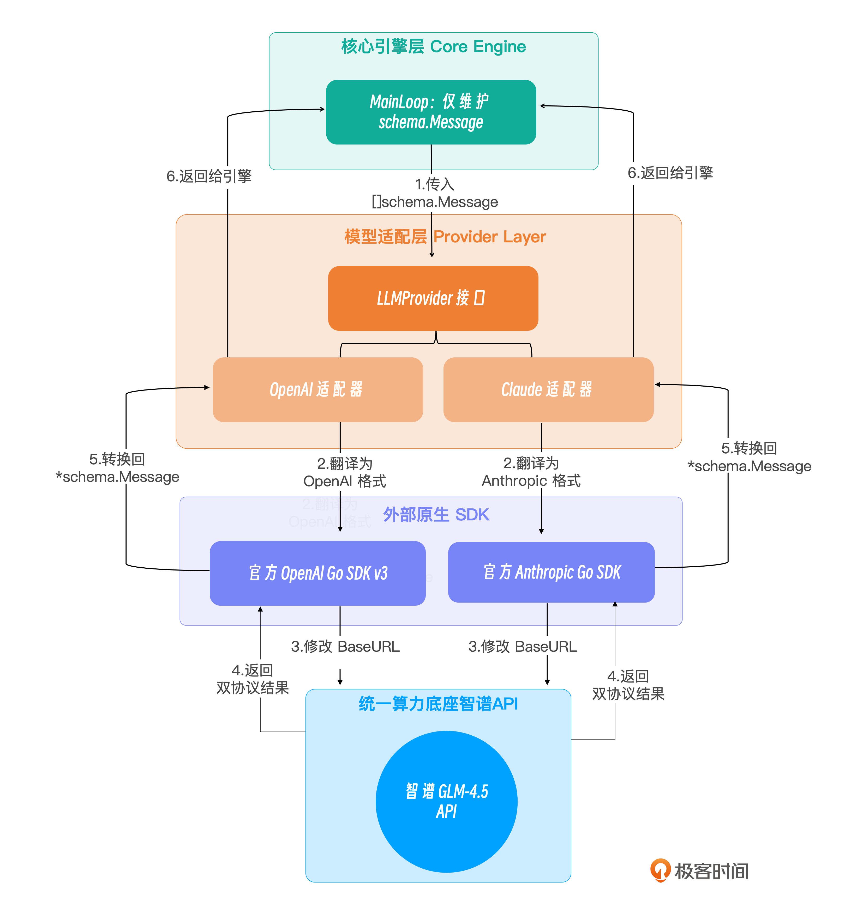

# 04｜大脑接入：抽象 Provider 接口，适配 Claude 与 OpenAI 兼容大模型

### 讲述：TonyBai-AI 版

时长 08:43 大小 9.97M

你好，我是 Tony Bai。欢迎来到《从 0 开始构建 Agent Harness》专栏的第四讲。

在前面的课程中，我们犹如打造精密钟表一般，用 Go 语言构建了 go-tiny-claw 的核心部件。特别是上一讲，我们在 ReAct 循环中巧妙地剥离出了独立的慢思考（Thinking）阶段，从架构机制上压制了大模型的行动冲动。

然而，这台设计精妙的微型操作系统（Harness），目前依然连接着一个 mockProvider（假肢大脑）。今天，我们将正式拔掉这双 “假肢”，为引擎接入真实的前沿大模型。

在真实的企业级 AI 应用开发中，我们面临着一个绕不开的碎片化痛点：不同大模型厂商的 API 数据结构存在巨大差异。特别是涉及 Function Calling（工具调用）和上下文组装时，OpenAI 生态和 Anthropic（Claude）生态是两套截然不同的标准。

如果在我们的核心 Main Loop 中直接写入这些特定厂商的 SDK 代码，整个驾驭工程（Harness Engineering）的解耦原则就会被彻底破坏。

本讲，我们将通过设计优雅的 Provider 抽象层，完美隔离这种差异。为了兼顾国内网络环境的便利性，我们将使用国内的智谱大模型（GLM）来作为统一的算力底座。由于智谱 API 实现了对 OpenAI 和 Claude 两大生态双协议的兼容，我们将在同一套代码中，演示如何通过官方的 OpenAI Go SDK 和 Anthropic Go SDK，双管齐下地接入 glm-4.5-air 模型。

## Provider 作为 “同声传译”

先来看看如果我们不加抽象，直接在 Main Loop 里调用 SDK 会发生什么。

Claude 的 API 使用的是 messages 数组，工具调用返回的是特定的 tool_use 块；而 OpenAI 兼容 API 使用的是一套不同的 tools 和 tool_calls 结构。

如果 Main Loop 需要关心这些底层细节，它的逻辑就会变成这样：

这违背了我们驾驭工程的极简和解耦哲学。Main Loop 的唯一职责是维护上下文时间线（Context History）。它不应该知道外部世界是用什么协议通信的。

在驾驭工程中，Main Loop 应当只认识一种语言 —— 也就是我们在第 01 讲中定义的 schema.Message、schema.ToolCall 和 schema.ToolResult。

Provider 层的核心职责，就是充当一个同声传译员（Translator）。

当 Main Loop 发起推理请求时，Provider 需要将内部干净的 schema.Message 历史记录，翻译成各大厂商 SDK 所要求的那种晦涩、嵌套极深的请求体；而当大模型 API 返回结果后，Provider 又必须将厂商特有的 ToolUseBlock 或 FunctionCall 结构，精确地反向翻译回内部的 schema.Message。

我们可以用一张示意图来展示这种解耦架构：

通过这层抽象，我们的微型 OS 具备了 “即插即用” 换大脑的能力。

## 代码实战：实现双协议 Provider 适配器

在开始编写代码前，我们需要拉取两大官方的 Go SDK。

注：我们将使用最新的 OpenAI Go SDK V3 官方包，它在类型安全上做了大量重构。

### 目录结构回顾与更新

我们将所有的翻译逻辑都集中在 internal/provider 目录下。为了进行测试，我们仍会在 main.go 中保留一个 Mock 的 Tool Registry（真正的 Tools Registry 将在下一讲实现）。

### 第 1 步：复习接口契约

为了保持代码的连贯性，我们快速回顾一下在之前章节定义的 LLMProvider 接口：

### 第 2 步：实现 OpenAI 格式适配器（兼容智谱）

我们首先编写 openai.go。智谱 API 原生兼容 OpenAI 协议，所以我们只需在使用官方最新的 openai-go/v3 SDK 时，将其 BaseURL 替换为智谱的 API 地址即可。

新建 internal/provider/openai.go：

### 第 3 步：实现 Claude 格式适配器（兼容智谱）

得益于智谱强大的生态兼容能力，它的 API 同样支持接收 Anthropic（Claude）标准的请求体。我们现在编写 claude.go。

注意对比这里与 OpenAI 在 InputSchema 解析上的细微差异：Anthropic 官方 SDK 将工具的 Properties 和 Required 字段做了严格的结构体抽离。

## 运行与深度分析：算力分配与 “自适应推理”

我们的 Provider 适配器已经全部就绪。但在运行测试之前，我们必须探讨一个真实工业场景中的关键问题：什么时候该让 Agent 慢思考，什么时候该让它直接行动？

在上一讲中，我们在架构上剥离出了独立的 Thinking（推理）阶段，以防止模型在面对复杂代码时变成盲目执行的 “莽夫”。

然而，如果任务仅仅是：“帮我查查北京的天气”，开启长篇大论的慢思考是否值得？让我们通过 cmd/claw/main.go，传入一个 mockRegistry（伪造查询天气工具，真实的 ToolRegistry 将在下一讲实现），分别在开启和关闭慢思考模式下，观察这台微型操作系统的真实反应。

### 测试 1：开启慢思考 (EnableThinking = true)

执行 go run cmd/claw/main.go，观察日志：

你看，因为我们在 Phase 1 剥夺了它的工具，大模型由于强烈的 “想要执行任务” 的冲动，甚至在纯文本的思考轨迹中，自己 “脑补” 出了一个 XML 格式的伪工具调用（<invoke name="getWeather">）！随后在 Phase 2，它才真正输出了合法的 JSON ToolCall。

虽然它完美地完成了任务，但对于这个极其简单的动作来说，这种 “系统 2” 的深度思考产生了巨大的算力浪费（Token Waste）和延迟（Latency）。

### 测试 2：关闭慢思考（EnableThinking = false）

现在，我们在 main.go 中将开关调为 false：

再次运行程序，日志变得极其清爽干练：

结论：自适应推理（Adaptive Reasoning）

这两个截然不同的日志，完美印证了为什么我们的 AgentEngine 需要设计 EnableThinking 这个硬开关。

在工业级 Harness 引擎中，我们不应该用 “杀鸡用牛刀” 的方式去执行所有任务。

- 面对 “列出当前目录文件”“查天气” 等明确的检索任务，我们应当关闭 Thinking 阶段，享受极低的 Token 成本和毫秒级的响应。
- 面对 “分析这 10 个文件的依赖关系并重构缓存层” 等复杂任务时，我们需要打开 Thinking 阶段，用算力和时间换取代码修改的准确性。

这种动态分配算力的思想，正是目前 Agent 开发领域前沿的 Adaptive Reasoning（自适应推理）策略的缩影。

## 本讲小结

今天，我们完成了 go-tiny-claw 引擎架构中极其重要的一层抽象，并且通过真实的运行日志，揭示了驾驭大模型算力的底层逻辑。

- 同声传译的艺术：我们通过定义 LLMProvider，彻底隔离了底层 SDK 格式碎片化带来的灾难。无论是 OpenAI 还是 Claude 格式，最终都在引擎内部被收敛为极其干净的 schema.Message 序列。
- 兼容国内算力底座：得益于抽象层，我们在不修改任何核心逻辑的前提下，利用官方原生 SDK 无缝对接了国内的智谱大模型（GLM-4.5），在解决了网络与成本痛点的同时，保证了工业级调用的稳定性。
- 洞见 “自适应推理” 的必要性：通过对比开启和关闭慢思考（Thinking Phase）两份真实的执行日志，我们深刻体会到了 “算力浪费” 与 “精准行动” 之间的博弈。我们验证了在 Harness 架构中预留 EnableThinking 开关的前瞻性，并引出了业界前沿的 Adaptive Reasoning（自适应推理）概念。

现在，引擎的心跳强健，大脑清醒。但是，它的手脚依然是个 Mock 的 “假肢”。

从下一讲开始，我们将迈入激动人心的第二章：极简工具与物理交互 (Action & Tools)。我们将抛弃这个测试用的 mockRegistry，亲手打造一套支持动态挂载的、强扩展性的真实 Tool Registry。更重要的是，我们将触碰 OpenClaw 的极简灵魂 —— 实现能真正改变操作系统的 bash 原语。

## 思考题

在当前的 Provider 适配器中，我们使用的是阻塞式调用（例如：client.Chat.Completions.New(ctx, params)）。这意味着如果大模型在进行 Phase 1 的长篇大论 “思考” 时，整个程序会阻塞卡死十多秒钟，直到模型把所有的推理和工具调用 JSON 全都生成完毕后，引擎才能一次性拿到结果。这在 CLI 工具体验中是非常差的。

实际生产中，各大模型的 API 均支持 Streaming（流式响应，Server-Sent Events）。大模型会一个字符一个字符地将文本推送过来，甚至 ToolCall 的 JSON 也是一块块吐出的。

结合你对 Go 语言 channel（通道）和 goroutine（协程）的理解，如果要把我们的 LLMProvider 改造为支持流式返回的接口，它的函数签名应该怎么设计？引擎的 Main Loop 又该如何优雅地边接收流式字符边打印，同时还能正确拼接出最终完整的 schema.Message 呢？

欢迎在留言区写下你的接口设计草案。我们下一讲，开启工具与交互层！

