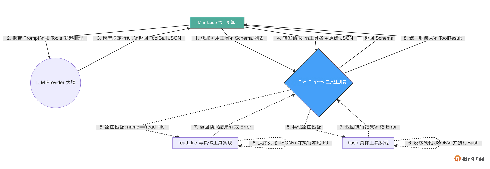

# 05｜动作延伸：构建强扩展性的 Tool Registry 与分发机制

### 讲述：TonyBai-AI 版

时长 09:41 大小 11.07M

你好，我是 Tony Bai。欢迎来到《从 0 开始构建 Agent Harness》专栏的第五讲。

在上一讲中，我们通过设计优雅的 Provider 适配层，成功为 go-tiny-claw 接入了真实的 “大脑”（兼容 OpenAI / Claude 协议的智谱 GLM 模型）。并且，我们前瞻性地探讨了自适应推理（Adaptive Reasoning），通过一个开关控制大模型是否进行 “慢思考”。

然而，那个聪明的 “大脑”，目前只能通过一个伪造的 mockRegistry 查询一段固定的 “假天气” 数据。

一个真正的工业级 Agent，它的使命是改变现实世界，比如：它需要读取本地代码、修改配置、执行终端命令，甚至调用集群的微服务。如果面对成百上千种潜在的工具需求，我们在核心引擎（Main Loop）里用一堆 if-else 或 switch-case 去硬编码每个工具的解析和执行逻辑，代码很快就会变成一座无法维护的垃圾山。

这就是为什么顶级开源 Agent（如 OpenClaw）在底层架构中，都必不可少地引入了一个核心中间件：Tool Registry（工具注册表）。

今天，我们将正式踏入专栏的第二章：极简工具与物理交互（Action & Tools）。我们将拔掉假肢，亲手用 Go 语言构建一个强扩展、高内聚的 Tool Registry，并实现我们的第一个物理级工具：read_file（读取本地文件）。

## 架构设计：为什么需要 Tool Registry？

在 Harness（驾驭工程）的理念中，Main Loop 永远是 “瞎子” 和 “聋子”。它不应该知道 bash 命令怎么调用，也不应该知道 read_file 需要什么参数格式。它只负责维护上下文，并将模型吐出来的 JSON 字符串丢给执行层。

因此，Tool Registry 扮演了一个极其关键的 “集线器（Hub）” 和 “路由器（Router）” 的角色。它的核心职责有三：

- 动态挂载（Register）：允许开发者在引擎启动时，随时随地向系统插拔新的工具实现（在 Go 中，其本质上是实现了特定 Go 接口的结构体）。
- 描述暴露（Expose Schema）：在每次向大模型发起推理前，Registry 负责把当前所有已挂载工具的名称、描述以及 JSON Schema 打包成列表，交给 Provider 翻译给大模型听。
- 路由分发与执行（Dispatch & Execute）：当大模型决定调用某个工具，并吐出一串 JSON 参数（ToolCall）时，Registry 负责找到对应的 Go 函数，把 JSON 丢给它执行，最后将结果封装成统一的 ToolResult 返回给 Main Loop。

我们可以用一张示意图来清晰地展示这个解耦过程：

有了这个 Registry，我们未来给 Agent 添加任何新能力，都只需要写一个独立的源码文件实现特定接口，然后 Register 进去即可，核心引擎（Main Loop）一行代码都不用改！

## 代码实战：构建动态 Registry 与 Tool 接口

接下来，我们将把理论转化为纯粹的 Go 代码。

### 目录结构回顾与更新

今天我们将清空之前测试用的 mockRegistry，并在 internal/tools 目录下实现真正的核心逻辑和 read_file 工具。

### 第 1 步：定义 BaseTool 接口

在 internal/tools/registry.go 中，我们首先规范什么样的数据结构可以被称为一个 “工具”。

对于 go-tiny-claw 来说，一个工具必须能说出自己的名字、描述，能给出严谨的参数要求（JSON Schema），并且能接收一段原始的 JSON 字节数组去执行具体逻辑。

### 第 2 步：实现 Registry 的路由与分发

紧接着在同一个文件里，我们实现注册表的挂载和执行逻辑。

代码非常清爽。Registry 就像一个忠实的前台总机，只负责接线（接收 ToolCall），查黄页（找 tools map），然后转接给具体的业务部门（具体工具的 Execute 方法）。

### 第 3 步：编写第一个物理工具 read_file

对于一个 Coding Agent 来说，阅读源代码是它感知物理环境的最基础能力。我们将实现 read_file 工具。

在实现这个工具时，我们将注入驾驭工程（Harness Engineering）中极其重要的防御底线思维：容错与截断。

新建 internal/tools/read_file.go：

请仔细体会这 4 步中的第 4 步（长度截断保护）。

在大模型的 API 调用中，Token 就是金钱，Context 就是生命线。如果你放任大模型读取超大文件，不仅会引发高昂的账单，还会导致上下文爆炸，甚至导致 API 拒绝服务。驾驭工程的真谛就是：绝不把系统的安全性寄希望于大模型的理智，而是在底层的工具实现中强制兜底。

## 运行与验证：连接真实大脑与真实手脚

一切就绪。让我们回到程序的入口，把 “真实的大脑” 连接到 “真实的手脚” 上。为了测试效果，请在你的项目根目录下创建一个测试文件 hello.txt：

现在，修改 cmd/claw/main.go，移除之前的 mockRegistry，接入正规军：

### 奇迹时刻：Agent 的第一次物理交互

在终端中执行启动命令：

你将看到如下振奋人心的日志流转：

看！整个流程行云流水：

- 大模型阅读了 Registry 暴露的 read_file 的 JSON Schema，精准推断出需要调用它。
- 模型输出符合要求的 JSON 参数 {"path":"hello.txt"}。
- Registry 成功将 JSON 路由给 ReadFileTool 的 Execute 方法。
- Go 语言底层利用 os.Open 执行物理 I / O，读取了文本。
- 文本被安全地包装进 ToolResult，反馈给大模型所在的 Main Loop。
- 模型在 Turn 2 中阅读了文件内容，给出了完美的总结！

至此，我们的 go-tiny-claw 真正地睁开了眼睛，看到了现实世界。

## 反思：关于文件读取截断的思考

在本讲的 read_file 实现中，我们采用了极其 “粗暴” 的 8000 字符硬截断（Hard Truncation）。作为单工具的兜底防御，这确实能防止单次读取把大模型撑爆。但在真实的实践中，比如代码库探索场景中，如果大模型需要分析一个 20000 行的核心业务类，这种粗暴截断会让模型永远看不到文件的后半部分，导致任务必然失败。

更成熟的解决方案是什么？

工具输出卸载（Tool Call Offloading）：工业级 Harness 的主流做法是在工具执行层实现输出卸载策略 —— 当文件或命令输出超过阈值（通常为数千至数万字符）时，Harness 自动将完整内容写入磁盘临时目录，并向模型返回一段 “头部预览 + 尾部预览 + 文件路径引用” 的摘要消息，例如：“文件过长（共 5000 行，已卸载至 <path>）。以下为首尾预览，如需完整内容请调用 read_file('<path>')。” 通过这种方式，既保留了模型的决策依据，又倒逼其按需局部读取。

结合全局 Context Compaction：即使我们在单工具内通过卸载策略放宽了读取限制，在引擎的全局层面，工业级 Harness 依然在 Main Loop 中设有上下文窗口监控机制。当 Token 使用量接近模型上下文窗口的预设阈值（通常为 75%~98%）时，Harness 会触发 Compaction—— 对历史会话进行压缩（策略有多种，比如智能摘要等)，保留架构决策、未解决的 Bug 等高价值信息，裁剪冗余工具输出，使 Agent 得以在不丢失关键上下文的前提下继续长时运行。关于这道全局级别的终极防 OOM（内存溢出）防线，我们将在专栏的 第 12 讲 为你揭秘。

## 本讲小结

今天，我们完成了 Harness 工程中极度核心的一环：将抽象的意图落地为具体的物理执行。

- Tool Registry 架构之美：它充当了模型意图（JSON）与系统级代码（Go Function）之间的绝缘层。有了它，为 Agent 扩充新技能变得像堆乐高积木一样简单，且不会污染核心控制流。
- 严格的契约精神：通过实现 BaseTool 接口，我们强制每个工具必须清晰地描述自己的能力和 InputSchema。这是大模型能够准确调用工具的基础前提。
- 底线防御思维：在实现 read_file 时，我们主动加入了基于长度的物理截断。记住：大模型是冲动且无知的，一切可能导致系统 OOM（内存溢出）或超支的风险，必须在执行层被死死按住。

有了注册表，我们是不是应该趁热打铁，给 Agent 挂载几十个、上百个工具，甚至引入极其复杂的 MCP（Model Context Protocol）协议，把它打造成一个 “万能兵器” 呢？

恰恰相反！在下一讲中，我们将探索 OpenClaw 中最受争议但也最伟大的设计哲学 —— 极简工具集法则与 YOLO（You Only Live Once）模式。我们将剖析为什么顶级 Coding Agent 只需要 Read、Write、Bash 这寥寥几个基础工具，就能实现近乎无所不能的复杂功能。

## 思考题

在目前的 Registry.Execute 方法中，如果工具执行返回了 error，我们将错误信息格式化为了纯文本，并通过 schema.ToolResult{ IsError: true } 的形式反馈给了大模型。

大模型收到错误日志后（比如：“文件不存在：路径解析错误”），通常会在下一个 Turn 尝试自己修改路径参数并重新发起请求。这被称为大模型的自纠错能力（Self-Correction）。

结合驾驭工程的理念，你认为这种 “完全依靠大模型去盲目试错重试” 的机制，在真实的工业场景下会存在什么致命隐患？如果在 Registry 层面或者外围框架层面，你会设计什么样的防线来控制这种潜在的失控重试？

欢迎在留言区分享你的工程设计思路，我们将在后续的第 14 和 15 讲中为你揭晓解法。我们下一讲见！

